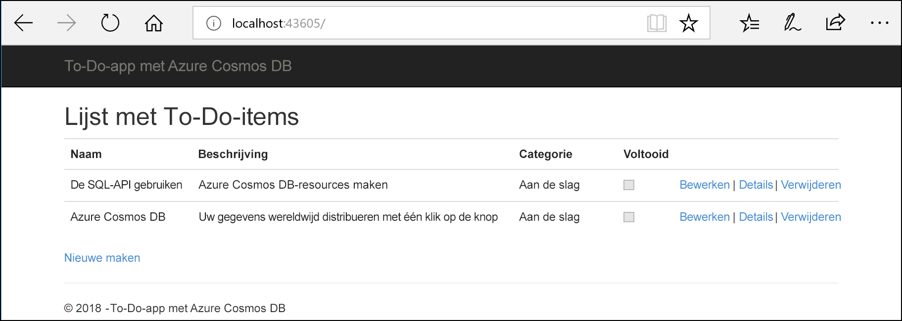
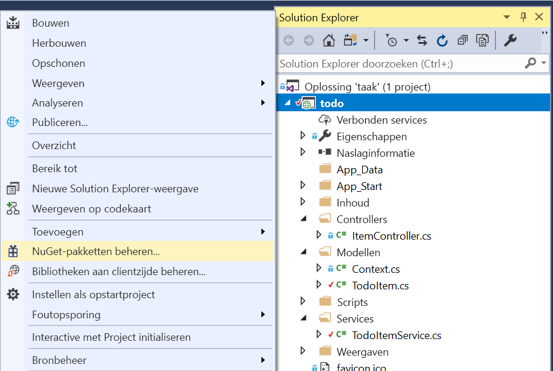
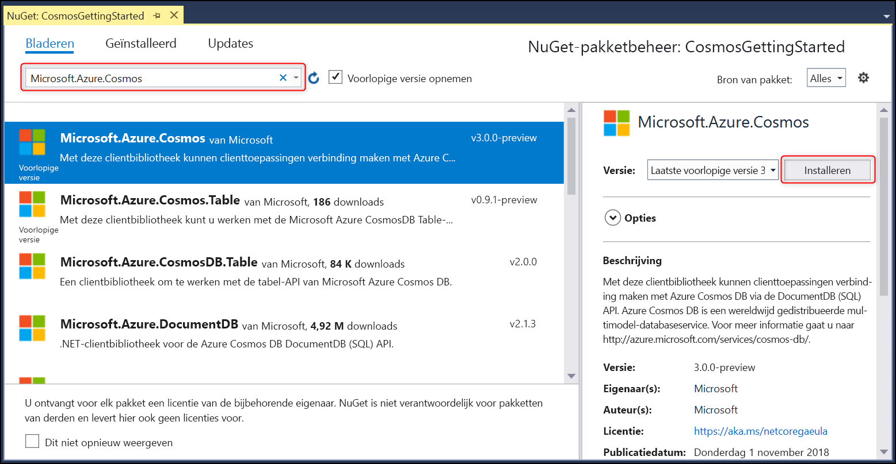

# <a name="quickstart-build-an-aspnet-web-app-using-azure-cosmos-db-sql-api-account"></a>Quickstart: een ASP.NET-web-app maken met behulp van een Azure Cosmos DB SQL API-account

> [!div class="op_single_selector"]
> * [.NET (preview)](create-sql-api-dotnet-preview.md)
> * [.NET](create-sql-api-dotnet.md)
> * [Java](create-sql-api-java.md)
> * [Node.js](create-sql-api-nodejs.md)
> * [Python](create-sql-api-python.md)
> * [Xamarin](create-sql-api-xamarin-dotnet.md)
>  
> 

Azure Cosmos DB is de globaal gedistribueerde, maximaal beschikbare, multimodeldatabaseservice van Microsoft. U kunt snel databases maken van documenten, sleutel/waarde-paren en grafieken en hier query’s op uitvoeren. Deze databases genieten allemaal het voordeel van de globale distributie en horizontale schaalmogelijkheden die ten grondslag liggen aan Azure Cosmos DB. 

Deze quickstart laat zien hoe u een [SQL API](sql-api-introduction.md)-account van Azure Cosmos DB, een database en een container kunt maken met behulp van de Azure-portal. U moet vervolgens een takenlijst-web-app in ASP.NET maken en implementeren op de [SQL .NET API](sql-api-sdk-dotnet.md), zoals wordt weergegeven in de volgende schermopname. 

In deze quickstart wordt gebruikgemaakt van versie 3.0+ van de Azure Cosmos DB .NET SDK. 



## <a name="prerequisites"></a>Vereisten

Als u Visual Studio 2017 nog niet hebt geïnstalleerd, kunt u het downloaden en de **gratis** [Community Edition van Visual Studio 2017](https://www.visualstudio.com/downloads/) gebruiken. Zorg dat u de workload **Azure-ontwikkeling** inschakelt tijdens de installatie van Visual Studio.

[!INCLUDE [quickstarts-free-trial-note](../../includes/quickstarts-free-trial-note.md)] 
[!INCLUDE [cosmos-db-emulator-docdb-api](../../includes/cosmos-db-emulator-docdb-api.md)]  

<a id="create-account"></a>
## <a name="create-a-database-account"></a>Een databaseaccount maken

[!INCLUDE [cosmos-db-create-dbaccount-preview](../../includes/cosmos-db-create-dbaccount-preview.md)]

<a id="create-collection"></a>
## <a name="add-a-collection"></a>Een verzameling toevoegen

[!INCLUDE [cosmos-db-create-collection-preview](../../includes/cosmos-db-create-collection-preview.md)]

<a id="add-sample-data"></a>
## <a name="add-sample-data"></a>Voorbeeldgegevens toevoegen

[!INCLUDE [cosmos-db-create-sql-api-add-sample-data](../../includes/cosmos-db-create-sql-api-add-sample-data.md)]

## <a name="query-your-data"></a>Uw gegevens opvragen

[!INCLUDE [cosmos-db-create-sql-api-query-data](../../includes/cosmos-db-create-sql-api-query-data.md)]

## <a name="clone-the-sample-application"></a>De voorbeeldtoepassing klonen

Nu gaan we werken met code. We gaan nu een [SQL API-app klonen vanaf GitHub](https://github.com/Azure-Samples/cosmos-dotnet-todo-app), de verbindingsreeks instellen en de app uitvoeren. 

1. Open een opdrachtprompt, maak een nieuwe map met de naam git-samples en sluit vervolgens de opdrachtprompt.

    ```bash
    md "C:\git-samples"
    ```

2. Open een git-terminalvenster, bijvoorbeeld git bash, en gebruik de `cd`-opdracht om naar de nieuwe map te gaan voor het installeren van de voorbeeld-app.

    ```bash
    cd "C:\git-samples"
    ```

3. Voer de volgende opdracht uit om de voorbeeldopslagplaats te klonen. Deze opdracht maakt een kopie van de voorbeeld-app op uw computer.

    ```bash
    git clone https://github.com/Azure-Samples/cosmos-dotnet-todo-app.git
    ```

4. Open het **todo.sln**-oplossingenbestand in Visual Studio. 

## <a name="review-the-code"></a>De code bekijken

Deze stap is optioneel. Als u wilt weten hoe de databaseresources in de code worden gemaakt, kunt u de volgende codefragmenten bekijken. Als u deze stap wilt overslaan, kunt u verdergaan naar [Uw verbindingsreeks bijwerken](#update-your-connection-string). 

Als u bekend bent met de vorige versie van .NET SDK, komen de termen 'verzameling' en 'document' u misschien bekend voor. Azure Cosmos DB biedt ondersteuning voor meerdere API-modellen. Daarom wordt in versie 3.0+ van .NET SDK gebruikgemaakt van de generieke termen 'container' en 'item'. Een container kan een verzameling, een graaf of een tabel zijn. Een item kan een document, rand/hoekpunt of rij zijn en is de inhoud binnen een container. [Meer informatie over databases, containers en items.](databases-containers-items.md)

De volgende codefragmenten zijn allemaal afkomstig uit het bestand ToDoItemService.cs.

* De CosmosClient wordt geïnitialiseerd op regels 68 en 69.

    ```csharp
    CosmosConfiguration config = new CosmosConfiguration(Endpoint, PrimaryKey);
    client = new CosmosClient(config);
    ```

* Er wordt een nieuwe database gemaakt op regel 71.

    ```csharp
    CosmosDatabase database = await client.Databases.CreateDatabaseIfNotExistsAsync(DatabaseId);
    ```

* Er wordt een nieuwe container gemaakt op regel 72 met de partitiesleutel: /categorie.

    ```csharp
    CosmosContainer container = await database.Containers.CreateContainerIfNotExistsAsync(ContainerId, "/category");
    ```

## <a name="update-your-connection-string"></a>Uw verbindingsreeks bijwerken

Ga nu terug naar Azure Portal om de verbindingsreeksinformatie op te halen en kopieer deze in de app.

1. Ga in [Azure Portal](https://portal.azure.com/) naar uw Azure Cosmos DB-account en klik in de linkernavigatie op **Sleutels**. Klik vervolgens op **Sleutels voor lezen/schrijven**. In de volgende stap gebruikt u de kopieerknoppen aan de rechterkant van het scherm om de URI en primaire sleutel in het bestand web.config te kopiëren.

    

2. Open in Visual Studio 2017 het bestand **web.config**. 

3. Kopieer de URI-waarde vanuit de portal (met de knop Kopiëren) en geef deze op als waarde voor de ``endpoint``-sleutel in web.config. 

    `<add key="endpoint" value="FILLME" />`

4. Kopieer vervolgens de waarde voor PRIMAIRE SLEUTEL vanuit de portal en geef deze op als waarde voor ``primarykey`` in web.config. 

    `<add key="primaryKey" value="FILLME" />`
    
5. Werk vervolgens de waarden voor database en container bij, zodat deze overeenkomen met de naam van de database en container die u eerder hebt gemaakt. U hebt uw app nu bijgewerkt met alle informatie die nodig is voor de communicatie met Azure Cosmos DB. 

    `<add key="database" value="Tasks" />`

    `<add key="container" value="Items" />`
    
## <a name="run-the-web-app"></a>De web-app uitvoeren

1. Klik in **Solution Explorer** met de rechtermuisknop op het nieuwe consoletoepassingsproject. Dit bevindt zich onder de Visual Studio-oplossing. Klik vervolgens op **Manage NuGet Packages...**
    
    
1. Klik op het tabblad **NuGet** op **Browse** en typ **Microsoft.Azure.Cosmos** in het zoekvak.
1. Zoek **Microsoft.Azure.Cosmos** in de resultaten en klik op **Install**.
   De pakket-id voor de Azure Cosmos DB SQL-API-clientbibliotheek is [Microsoft Azure Cosmos DB-clientbibliotheek](https://www.nuget.org/packages/Microsoft.Azure.Cosmos/).

   

    Als u een bericht ontvangt over het controleren van wijzigingen in de oplossing, klikt u op **OK**. Als u een bericht ontvangt over het accepteren van de licentie, klikt u op **Accepteren**.

1. Druk op Ctrl+F5 om de toepassing uit te voeren. Uw app wordt in uw browser weergegeven. 

1. Selecteer **Nieuwe maken** in de browser en maak een paar nieuwe taken in uw taken-app. Als het goed is, ziet u ook de taken die u hebt gemaakt in [Voorbeeldgegevens toevoegen](#add-sample-data)

   

U kunt nu teruggaan naar Data Explorer en deze nieuwe gegevens bekijken, wijzigen, opvragen en ermee werken. 

## <a name="review-slas-in-the-azure-portal"></a>SLA’s bekijken in Azure Portal

[!INCLUDE [cosmosdb-tutorial-review-slas](../../includes/cosmos-db-tutorial-review-slas.md)]

## <a name="clean-up-resources"></a>Resources opschonen

[!INCLUDE [cosmosdb-delete-resource-group](../../includes/cosmos-db-delete-resource-group.md)]

## <a name="next-steps"></a>Volgende stappen

In deze quickstart hebt u geleerd hoe u een Azure Cosmos DB-account maakt, een container maakt en hier items aan toevoegt met behulp van Data Explorer, en een web-app uitvoert. Nu kunt u aanvullende gegevens in uw Cosmos DB-account importeren. 

> [!div class="nextstepaction"]
> [Gegevens importeren in Azure Cosmos DB](import-data.md)


