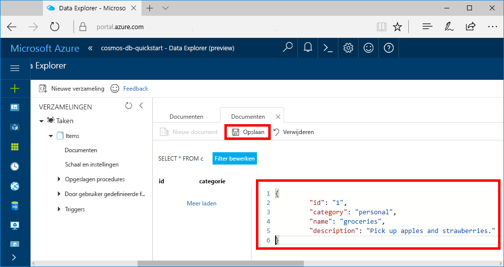
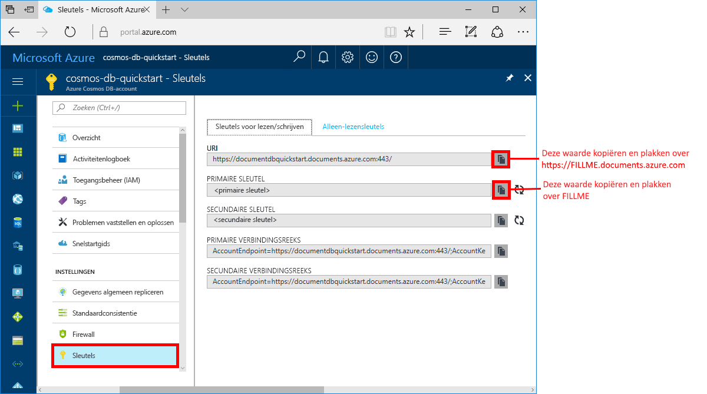

# <a name="azure-cosmos-db-create-a-document-database-using-java-and-the-azure-portal"></a>Azure Cosmos DB: een document maken met behulp van Java en Azure Portal

[!INCLUDE [cosmos-db-sql-api](../../includes/cosmos-db-sql-api.md)] 

Azure Cosmos DB is de globaal gedistribueerde multimodel-databaseservice van Microsoft. Met behulp van Azure Cosmos DB kunt u snel beheerde databases voor documenten, tabellen en grafieken maken en doorzoeken.

In deze snelstartgids wordt een documentdatabase gemaakt met behulp van de hulpprogramma's voor Azure Cosmos DB in Azure Portal. In deze snelstartgids leest u ook hoe u snel een Java-console-app kunt maken via de [SQL Java API](sql-api-sdk-java.md). De instructies in deze snelstartgids kunnen worden uitgevoerd in elk besturingssysteem waarmee Java kan worden uitgevoerd. Als u deze quickstart hebt voltooid, weet u hoe u documentdatabaseresources kunt maken en wijzigen in de UI of via een programma, afhankelijk van uw voorkeur.

## <a name="prerequisites"></a>Vereisten

[!INCLUDE [quickstarts-free-trial-note](../../includes/quickstarts-free-trial-note.md)] 
[!INCLUDE [cosmos-db-emulator-docdb-api](../../includes/cosmos-db-emulator-docdb-api.md)]

Daarnaast doet u het volgende: 

* [Java Development Kit (JDK) 1.7+](http://www.oracle.com/technetwork/java/javase/downloads/jdk8-downloads-2133151.html)
    * Voer op Ubuntu `apt-get install default-jdk` uit om de JDK te installeren.
    * Zorg dat de omgevingsvariabele JAVA_HOME verwijst naar de map waarin de JDK is geïnstalleerd.
* [Download](http://maven.apache.org/download.cgi) en [installeer](http://maven.apache.org/install.html) een binair [Maven](http://maven.apache.org/)-archief
    * Op Ubuntu kunt u `apt-get install maven` uitvoeren om Maven te installeren.
* [Git](https://www.git-scm.com/)
    * Op Ubuntu kunt u `sudo apt-get install git` uitvoeren om Git te installeren.

## <a name="create-a-database-account"></a>Een databaseaccount maken

Voordat u een documentdatabase kunt maken, moet u een SQL-databaseaccount maken met Azure Cosmos DB.

[!INCLUDE [cosmos-db-create-dbaccount](../../includes/cosmos-db-create-dbaccount.md)]

## <a name="add-a-collection"></a>Een verzameling toevoegen

[!INCLUDE [cosmos-db-create-collection](../../includes/cosmos-db-create-collection.md)]

<a id="add-sample-data"></a>
## <a name="add-sample-data"></a>Voorbeeldgegevens toevoegen

U kunt nu gegevens aan uw nieuwe verzameling toevoegen met behulp van Data Explorer.

1. Vouw de verzameling **Items** uit en klik op **Documenten** > **Nieuw Document**.

   
  
2. Voeg nu een document toe aan de verzameling met de volgende structuur en klik op **Opslaan**.

     ```json
     {
         "id": "1",
         "category": "personal",
         "name": "groceries",
         "description": "Pick up apples and strawberries.",
         "isComplete": false
     }
     ```

    

3.  Maak nog één document en sla dit op wanneer u `id` in 2 wijzigt en wijzig de andere eigenschappen naar eigen inzicht. De nieuwe documenten kunnen elke gewenste structuur hebben, omdat in Azure Cosmos DB uw gegevens geen schema krijgen opgelegd.

## <a name="query-your-data"></a>Uw gegevens opvragen

U kunt nu query's in Data Explorer gebruiken om uw gegevens te halen en te filteren.

1. U ziet dat de query standaard is ingesteld op `SELECT * FROM c`. Deze standaardquery haalt alle documenten in de verzameling op en geeft ze weer. 

    

2. Wijzig de query door te klikken op de knop **Filter bewerken**, `ORDER BY c._ts DESC` toe te voegen aan het vak Querypredicaat en vervolgens te klikken op **Filter toepassen**.

    

Deze gewijzigde query sorteert documenten in aflopende volgorde op basis van hun tijdstempel. Uw tweede document wordt nu dus als eerste weergegeven. Als u bekend bent met SQL-syntaxis, kunt u een van de ondersteunde [SQL-query's](sql-api-sql-query.md) in dit vak invoeren. 

Ons werk in Data Explorer is voltooid. Voordat we verdergaan met het werken met code, willen we u erop wijzen dat u Data Explorer ook kunt gebruiken voor het maken van opgeslagen procedures, UDF's en triggers om bedrijfslogica aan de serverzijde uit te voeren en doorvoer te schalen. In Data Explorer wordt alle ingebouwde programmatische gegevenstoegang zichtbaar die beschikbaar is in de API's, maar biedt eenvoudige toegang tot uw gegevens in Azure Portal.

## <a name="clone-the-sample-application"></a>De voorbeeldtoepassing klonen

Nu gaan we werken met code. We gaan nu een SQL API-app klonen vanaf GitHub, de verbindingsreeks instellen en de app uitvoeren. U zult zien hoe gemakkelijk het is om op een programmatische manier met gegevens te werken. 

1. Open een opdrachtprompt, maak een nieuwe map met de naam git-samples en sluit vervolgens de opdrachtprompt.

    ```bash
    md "C:\git-samples"
    ```

2. Open een git-terminalvenster, bijvoorbeeld git bash, en gebruik de `cd`-opdracht om naar de nieuwe map te gaan voor het installeren van de voorbeeld-app. 

    ```bash
    cd "C:\git-samples"
    ```

3. Voer de volgende opdracht uit om de voorbeeldopslagplaats te klonen. Deze opdracht maakt een kopie van de voorbeeld-app op uw computer.

    ```bash
    git clone https://github.com/Azure-Samples/azure-cosmos-db-documentdb-java-getting-started.git
    ```

## <a name="review-the-code"></a>De code bekijken

Deze stap is optioneel. Als u wilt weten hoe de databaseresources in de code worden gemaakt, kunt u de volgende codefragmenten bekijken. De codefragmenten zijn allemaal afkomstig uit het `Program.java`-bestand dat is geïnstalleerd in de map C:\git-samples\azure-cosmos-db-documentdb-java-getting-started\src\GetStarted folder. Als u deze stap wilt overslaan, kunt u verdergaan naar [Uw verbindingsreeks bijwerken](#update-your-connection-string). 

* Initialisatie van `DocumentClient`. De [DocumentClient](https://docs.microsoft.com/java/api/com.microsoft.azure.documentdb._document_client) biedt een logische weergaven aan de clientzijde voor de databaseservice van Microsoft Azure Cosmos DB. Deze client wordt gebruikt om aanvragen aan de service te configureren en uitvoeren.

    ```java
    this.client = new DocumentClient("https://FILLME.documents.azure.com",
            "FILLME", 
            new ConnectionPolicy(),
            ConsistencyLevel.Session);
    ```

* [Database](https://docs.microsoft.com/java/api/com.microsoft.azure.documentdb._database) maken.

    ```java
    Database database = new Database();
    database.setId(databaseName);
    
    this.client.createDatabase(database, null);
    ```

* [DocumentCollection](https://docs.microsoft.com/java/api/com.microsoft.azure.documentdb._document_collection) maken.

    ```java
    DocumentCollection collectionInfo = new DocumentCollection();
    collectionInfo.setId(collectionName);

    ...

    this.client.createCollection(databaseLink, collectionInfo, requestOptions);
    ```

* Documenten maken met behulp van de methode [createDocument](https://docs.microsoft.com/java/api/com.microsoft.azure.documentdb._document_client.createdocument).

    ```java
    // Any Java object within your code can be serialized into JSON and written to Azure Cosmos DB
    Family andersenFamily = new Family();
    andersenFamily.setId("Andersen.1");
    andersenFamily.setLastName("Andersen");
    // More properties

    String collectionLink = String.format("/dbs/%s/colls/%s", databaseName, collectionName);
    this.client.createDocument(collectionLink, family, new RequestOptions(), true);
    ```

* SQL-query's via JSON worden uitgevoerd met behulp van de methode [queryDocuments](https://docs.microsoft.com/java/api/com.microsoft.azure.documentdb._document_client.querydocuments).

    ```java
    FeedOptions queryOptions = new FeedOptions();
    queryOptions.setPageSize(-1);
    queryOptions.setEnableCrossPartitionQuery(true);

    String collectionLink = String.format("/dbs/%s/colls/%s", databaseName, collectionName);
    FeedResponse<Document> queryResults = this.client.queryDocuments(
        collectionLink,
        "SELECT * FROM Family WHERE Family.lastName = 'Andersen'", queryOptions);

    System.out.println("Running SQL query...");
    for (Document family : queryResults.getQueryIterable()) {
        System.out.println(String.format("\tRead %s", family));
    }
    ```    

## <a name="update-your-connection-string"></a>Uw verbindingsreeks bijwerken

Ga nu terug naar Azure Portal om de verbindingsreeksinformatie op te halen en kopieer deze in de app. Hierdoor kan de app communiceren met de gehoste database.

1. Klik in [Azure Portal](http://portal.azure.com/) op **Sleutels**. 

    Gebruik de kopieerknoppen aan de rechterkant van het scherm om de bovenste waarde (de URI) te kopiëren.

    

2. Open het `Program.java`-bestand uit de map C:\git-samples\azure-cosmos-db-documentdb-java-getting-started\src\GetStarted. 

3. Plak de URI-waarde van de portal via `https://FILLME.documents.azure.com` op regel 45.

4. Ga terug naar de portal en kopieer de waarde PRIMARY KEY zoals weergegeven in de schermafbeelding. Plak de waarde PRIMARY KEY van de portal via `FILLME` op regel 46.

    De methode getStartedDemo moet er nu ongeveer als volgt uitzien: 
    
    ```java
    private void getStartedDemo() throws DocumentClientException, IOException {
        this.client = new DocumentClient("https://youraccountname.documents.azure.com:443/",
                "your-primary-key...RJhQrqQ5QQ==", 
                new ConnectionPolicy(),
                ConsistencyLevel.Session);
    ```

5. Sla het bestand Program.java op.

## <a name="run-the-app"></a>De app uitvoeren

1. `cd` in het git-terminalvenster naar de map azure-cosmos-db-documentdb-java-getting-started.

    ```git
    cd "C:\git-samples\azure-cosmos-db-documentdb-java-getting-started"
    ```

2. Gebruik in het git-terminalvenster de volgende opdracht om de vereiste Java-pakketten te installeren.

    ```
    mvn package
    ```

3. Gebruik in het git-terminalvenster de volgende opdracht om de Java-toepassing te starten.

    ```
    mvn exec:java -D exec.mainClass=GetStarted.Program
    ```

    Het terminalvenster geeft een melding dat de database FamilyDB is gemaakt. 
    
4. Druk op een toets om de verzameling te maken. 

5. Ga vervolgens terug naar Data Explorer. U ziet nu dat deze een FamilyDB-database bevat.
    
6. Blijf toetsen in het consolevenster indrukken om de code documenten te laten maken en een query te laten uitvoeren.
    
    Alle resources uit deze app worden aan het einde van het programma verwijderd uit uw account, zodat er geen kosten in rekening worden gebracht. 

    


## <a name="review-slas-in-the-azure-portal"></a>SLA’s bekijken in Azure Portal

[!INCLUDE [cosmosdb-tutorial-review-slas](../../includes/cosmos-db-tutorial-review-slas.md)]

## <a name="clean-up-resources"></a>Resources opschonen

[!INCLUDE [cosmosdb-delete-resource-group](../../includes/cosmos-db-delete-resource-group.md)]

## <a name="next-steps"></a>Volgende stappen

In deze snelstartgids hebt u geleerd hoe u een Azure Cosmos DB-account, documentdatabase en verzameling kunt maken met behulp van Data Explorer, en hoe u een app kunt uitvoeren die hetzelfde doet via een programma. Nu kunt u aanvullende gegevens in uw Microsoft Azure Cosmos DB-verzameling importeren. 

> [!div class="nextstepaction"]
> [Gegevens importeren in Azure Cosmos DB](import-data.md)


