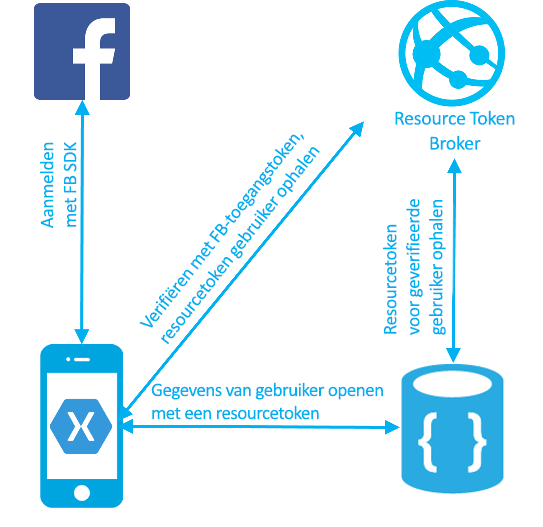
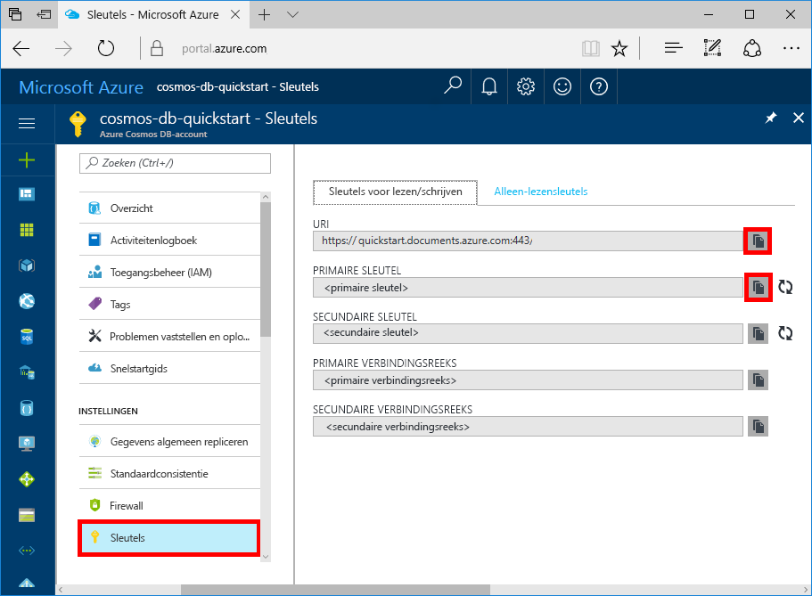

# <a name="azure-cosmos-db-build-a-web-app-with-net-xamarin-and-facebook-authentication"></a>Azure Cosmos DB: een web-app ontwikkelen met .NET, Xamarin, en Facebook-authenticatie

[!INCLUDE [cosmos-db-sql-api](../../includes/cosmos-db-sql-api.md)] 

Azure Cosmos DB is de globaal gedistribueerde multimodel-databaseservice van Microsoft. U kunt snel databases maken van documenten, sleutel/waarde-paren en grafieken en hier query’s op uitvoeren. Deze databases genieten allemaal het voordeel van de globale distributie en horizontale schaalmogelijkheden die ten grondslag liggen aan Azure Cosmos DB. 

Deze Quick Start laat zien hoe u een Azure Cosmos DB-account, een documentdatabase en een verzameling kunt maken met behulp van Azure Portal. Vervolgens ontwikkelt en implementeert u een web-app voor een takenlijst op basis van de [SQL .NET API](sql-api-sdk-dotnet.md), [Xamarin](https://www.xamarin.com/) en de Azure Cosmos DB-autorisatie-engine. De web-app voor een takenlijst implementeert een gegevenspatroon per gebruiker waarmee gebruikers zich kunnen aanmelden met Facebook Auth en hun eigen to-do-items kunnen beheren.

## <a name="prerequisites"></a>Vereisten

Als u Visual Studio 2017 nog niet hebt geïnstalleerd, kunt u het downloaden en de **gratis** [Community Edition van Visual Studio 2017](https://www.visualstudio.com/downloads/) gebruiken. Zorg ervoor dat u **Azure-ontwikkeling** inschakelt tijdens de installatie van Visual Studio.

[!INCLUDE [quickstarts-free-trial-note](../../includes/quickstarts-free-trial-note.md)]
[!INCLUDE [cosmos-db-emulator-docdb-api](../../includes/cosmos-db-emulator-docdb-api.md)]

## <a name="create-a-database-account"></a>Een databaseaccount maken

[!INCLUDE [cosmos-db-create-dbaccount](../../includes/cosmos-db-create-dbaccount.md)]

## <a name="add-a-collection"></a>Een verzameling toevoegen

[!INCLUDE [cosmos-db-create-collection](../../includes/cosmos-db-create-collection.md)]

## <a name="clone-the-sample-application"></a>De voorbeeldtoepassing klonen

We gaan nu een SQL API-app klonen vanaf GitHub, de verbindingsreeks instellen en de app uitvoeren. U zult zien hoe gemakkelijk het is om op een programmatische manier met gegevens te werken. 

1. Open een venster in een git-terminal zoals git bash en `cd` naar een werkmap.  

2. Voer de volgende opdracht uit om de voorbeeldopslagplaats te klonen. 

    ```bash
    git clone https://github.com/Azure/azure-documentdb-dotnet.git
    ```

3. Open vervolgens het bestand DocumentDBTodo.sln in de map samples/xamarin/UserItems/xamarin.forms in Visual Studio. 

## <a name="review-the-code"></a>De code bekijken

De code in de map Xamarin bevat het volgende:

* Xamarin-app. De app slaat de to-do-items van de gebruiker op in een gepartitioneerde verzameling met de naam UserItems.
* Resourcetokenbroker-API. Een eenvoudige ASP.NET Web-API om Azure Cosmos DB-resourcetokens ter beschikking te stellen aan de aangemelde gebruikers van de app. Resourcetokens zijn kortdurende toegangstokens die de app voorzien van toegang tot de gegevens van de aangemelde gebruiker.

De authenticatie- en gegevenstroom wordt afgebeeld in onderstaand diagram.

* De verzameling UserItems wordt gemaakt met de partitiesleutel '/userid'. Door een partitiesleutel op te geven voor een verzameling kan Azure Cosmos DB oneindig worden geschaald naarmate het aantal gebruikers en items toeneemt.
* Met de Xamarin-app zijn gebruikers in staat om aan te melden met hun Facebook-referenties.
* De Xamarin-app gebruikt Facebook-toegangstokens om te authenticeren met de ResourceTokenBroker-API
* De resourcetokenbroker-API authenticeert het verzoek met behulp van de functie App Service Auth en verzoekt om een Azure Cosmos DB-resourcetoken met lees-/schrijftoegang tot alle documenten die de geauthenticeerde partitiesleutel van de gebruiker delen.
* Resourcetokenbroker retourneert de resourcetoken naar de client-app.
* De app gebruikt de resourcetoken om toegang te krijgen tot de to-do-items van de gebruiker.


    
## <a name="update-your-connection-string"></a>Uw verbindingsreeks bijwerken

Ga nu terug naar Azure Portal om de verbindingsreeksinformatie op te halen en kopieer deze in de app.

1. Klik in [Azure Portal](http://portal.azure.com/), in uw Azure Cosmos DB-account, in het linker navigatiegedeelte op **Sleutels** en klik vervolgens op **Sleutels voor lezen/schrijven**. In de volgende stap gebruikt u de kopieerknoppen aan de rechterkant van het scherm om de URI en primaire sleutel in het bestand web.config te kopiëren.

    

2. Open het bestand Web.config in de map azure-documentdb-dotnet/samples/xamarin/UserItems/ResourceTokenBroker/ResourceTokenBroker in Visual Studio 2017. 

3. Kopieer uw URI-waarde vanaf de portal (met de kopieerknop) en geef deze als waarde aan de accountUrl in Web.config. 

    `<add key="accountUrl" value="{Azure Cosmos DB account URL}"/>`

4. Kopieer vervolgens de waarde van uw PRIMAIRE SLEUTEL vanaf de portal en geef deze waarde aan accountKey in web.config. 

    `<add key="accountKey" value="{Azure Cosmos DB secret}"/>`

U hebt uw app nu bijgewerkt met alle informatie die nodig is voor de communicatie met Azure Cosmos DB. 

## <a name="build-and-deploy-the-web-app"></a>De web-app ontwikkelen en implementeren

1. Maak een App Service-website in de Azure Portal om de Resourcetokenbroker-API te hosten.
2. Open in de Azure Portal de blade App Settings van de website van de Resourcetokenbroker-API. Vul de volgende instellingen in voor de app:

    * accountUrl - de URL van het Azure Cosmos DB-account van het tabblad Sleutels van uw Azure Cosmos DB-account.
    * accountKey - de hoofdsleutel van het Azure Cosmos DB-account van het tabblad Sleutels van uw Azure Cosmos DB-account.
    * databaseId en collectionId van de database en verzameling die u hebt gemaakt

3. Publiceer de ResourceTokenBroker-oplossing op de website die u hebt gemaakt.

4. Open het Xamarin-project en ga naar TodoItemManager.cs. Vul de waarden in voor accountURL, collectionId, databaseId, en voor resourceTokenBrokerURL als de basis https-url voor de website van de resourcetokenbroker.

5. Voltooi de zelfstudie [Hoe u uw App Service-toepassing moet configureren om aanmelding via Facebook te gebruiken](../app-service/app-service-mobile-how-to-configure-facebook-authentication.md) om Facebook-authenticatie in te stellen en de ResourceTokenBroker-website te configureren.

    Voer de Xamarin-app uit.

## <a name="review-slas-in-the-azure-portal"></a>SLA’s bekijken in Azure Portal

[!INCLUDE [cosmosdb-tutorial-review-slas](../../includes/cosmos-db-tutorial-review-slas.md)]

## <a name="clean-up-resources"></a>Resources opschonen

Als u deze app niet verder gaat gebruiken, kunt u alle resources verwijderen die door deze Quick Start zijn aangemaakt door onderstaande stappen te volgen in Azure Portal: 

1. Klik in het menu aan de linkerkant in Azure Portal op **Resourcegroepen** en klik vervolgens op de naam van de resource die u hebt gemaakt. 
2. Klik op de pagina van uw resourcegroep op **Verwijderen**, typ de naam van de resource die u wilt verwijderen in het tekstvak en klik vervolgens op **Verwijderen**.

## <a name="next-steps"></a>Volgende stappen

In deze Quick Start hebt u geleerd hoe u een Azure Cosmos DB-account kunt maken en hebt u een verzameling gemaakt met de Data Explorer en een Xamarin-app ontwikkeld en geïmplementeerd. Nu kunt u aanvullende gegevens in uw Cosmos DB-account importeren. 

> [!div class="nextstepaction"]
> [Gegevens importeren in Azure Cosmos DB](import-data.md)
