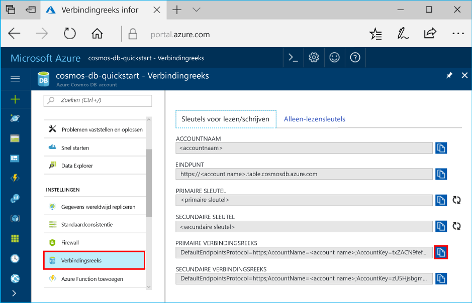

# <a name="quickstart-build-a-table-api-app-with-java-and-azure-cosmos-db"></a>Snelstartgids: Een Table-API compileren met Java en Azure Cosmos DB

> [!div class="op_single_selector"]
> * [.NET](create-table-dotnet.md)
> * [Java](create-table-java.md)
> * [Node.js](create-table-nodejs.md)
> * [Python](create-table-python.md)
> 

Deze quickstart laat zien hoe u Java en de [Table-API](table-introduction.md) van Azure Cosmos DB gebruikt voor het compileren van een app door een voorbeeld uit GitHub te klonen. In deze quickstart ziet u ook hoe u een Azure Cosmos DB-account maakt en hoe u Data Explorer gebruikt om tabellen en entiteiten te maken in Azure Portal op internet.

Azure Cosmos DB is de globaal gedistribueerde multimodel-databaseservice van Microsoft. U kunt snel databases maken van documenten, sleutel/waarde-paren en grafieken en hier query’s op uitvoeren. Deze databases genieten allemaal het voordeel van de globale distributie en horizontale schaalmogelijkheden die ten grondslag liggen aan Azure Cosmos DB. 

## <a name="prerequisites"></a>Vereisten

[!INCLUDE [quickstarts-free-trial-note](../../includes/quickstarts-free-trial-note.md)]
[!INCLUDE [cosmos-db-emulator-docdb-api](../../includes/cosmos-db-emulator-docdb-api.md)]

Daarnaast doet u het volgende: 

* [Java Development Kit (JDK) 1.7+](https://aka.ms/azure-jdks)
    * Voer op Ubuntu `apt-get install default-jdk` uit om de JDK te installeren.
    * Zorg dat de omgevingsvariabele JAVA_HOME verwijst naar de map waarin de JDK is geïnstalleerd.
* [Download](https://maven.apache.org/download.cgi) en [installeer](https://maven.apache.org/install.html) een binair [Maven](https://maven.apache.org/)-archief
    * Op Ubuntu kunt u `apt-get install maven` uitvoeren om Maven te installeren.
* [Git](https://www.git-scm.com/)
    * Op Ubuntu kunt u `sudo apt-get install git` uitvoeren om Git te installeren.

## <a name="create-a-database-account"></a>Een databaseaccount maken

> [!IMPORTANT] 
> U moet een nieuw Table-API-account maken om te kunnen werken met de algemeen beschikbare SDK's voor de Table-API. Table-API-accounts die zijn gemaakt tijdens de preview worden niet ondersteund door de algemeen beschikbare SDK's.
>

[!INCLUDE [cosmos-db-create-dbaccount-table](../../includes/cosmos-db-create-dbaccount-table.md)]

## <a name="add-a-table"></a>Een tabel toevoegen

[!INCLUDE [cosmos-db-create-table](../../includes/cosmos-db-create-table.md)]

## <a name="add-sample-data"></a>Voorbeeldgegevens toevoegen

[!INCLUDE [cosmos-db-create-table-add-sample-data](../../includes/cosmos-db-create-table-add-sample-data.md)]

## <a name="clone-the-sample-application"></a>De voorbeeldtoepassing klonen

We gaan nu een Table-app klonen vanaf GitHub, de verbindingsreeks instellen en de app uitvoeren. U zult zien hoe gemakkelijk het is om op een programmatische manier met gegevens te werken. 

1. Open een opdrachtprompt, maak een nieuwe map met de naam git-samples en sluit vervolgens de opdrachtprompt.

    ```bash
    md "C:\git-samples"
    ```

2. Open een git-terminalvenster, bijvoorbeeld git bash, en gebruik de `cd`-opdracht om naar de nieuwe map te gaan voor het installeren van de voorbeeld-app.

    ```bash
    cd "C:\git-samples"
    ```

3. Voer de volgende opdracht uit om de voorbeeldopslagplaats te klonen. Deze opdracht maakt een kopie van de voorbeeld-app op uw computer.

    ```bash
    git clone https://github.com/Azure-Samples/storage-table-java-getting-started.git 
    ```

## <a name="update-your-connection-string"></a>Uw verbindingsreeks bijwerken

Ga nu terug naar Azure Portal om de verbindingsreeksinformatie op te halen en kopieer deze in de app. Hierdoor kan de app communiceren met de gehoste database. 

1. Klik in [Azure Portal](https://portal.azure.com/) op **Verbindingsreeks**. 

   

2. Kopieer de PRIMARY CONNECTION STRING met behulp van de knop Kopiëren aan de rechterkant.

3. Open config.properties vanuit de map C:\git-samples\storage-table-java-getting-started\src\main\resources. 

5. De volgende stap is het uitcommentariëren van regel 1, waarna u het commentaar van regel 2 verwijdert. De eerste twee regels moeten er nu als volgt uitzien.

    ```
    #StorageConnectionString = UseDevelopmentStorage=true
    StorageConnectionString = DefaultEndpointsProtocol=https;AccountName=[ACCOUNTNAME];AccountKey=[ACCOUNTKEY]
    ```

6. Plak de PRIMARY CONNECTION STRING vanuit de portal in de waarde StorageConnectionString in regel 2. 

    > [!IMPORTANT]
    > Als uw eindpunt documents.azure.com gebruikt, hebt u een preview-account en moet u een [nieuw Table-API-account](#create-a-database-account) maken om te kunnen werken met de algemeen beschikbare SDK voor Table- API.
    >

7. Sla het bestand config.properties op.

U hebt uw app nu bijgewerkt met alle informatie die nodig is voor de communicatie met Azure Cosmos DB. 

## <a name="run-the-app"></a>De app uitvoeren

1. `cd` in het git-terminalvenster naar de map storage-table-java-getting-started.

    ```git
    cd "C:\git-samples\storage-table-java-getting-started"
    ```

2. Voer in het git-terminalvenster de volgende opdrachten uit om de Java-toepassing te starten.

    ```git
    mvn compile exec:java 
    ```

    In het consolevenster worden de tabelgegevens weergegeven die worden toegevoegd aan de nieuwe tabeldatabase in Azure Cosmos DB.

    U kunt nu teruggaan naar Data Explorer en deze nieuwe gegevens bekijken, wijzigen, een query erop uitvoeren of er iets anders mee doen. 

## <a name="review-slas-in-the-azure-portal"></a>SLA’s bekijken in Azure Portal

[!INCLUDE [cosmosdb-tutorial-review-slas](../../includes/cosmos-db-tutorial-review-slas.md)]

## <a name="clean-up-resources"></a>Resources opschonen

[!INCLUDE [cosmosdb-delete-resource-group](../../includes/cosmos-db-delete-resource-group.md)]

## <a name="next-steps"></a>Volgende stappen

In deze Quick Start hebt u geleerd hoe u een Azure Cosmos DB-account kunt maken, hebt u een tabel gemaakt met de Data Explorer en hebt u een app uitgevoerd.  Nu kunt u een query uitvoeren op uw gegevens met de Table-API.  

> [!div class="nextstepaction"]
> [Tabelgegevens importeren in de Table-API](table-import.md)
