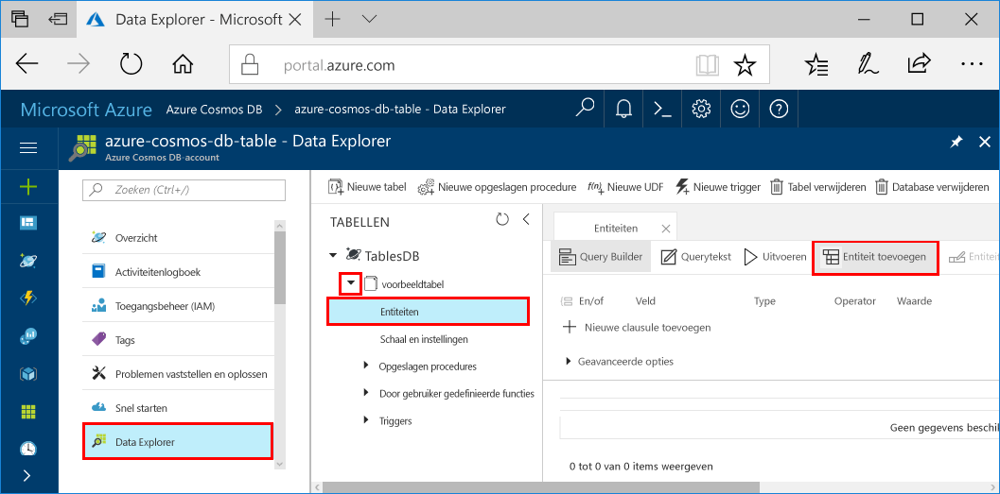
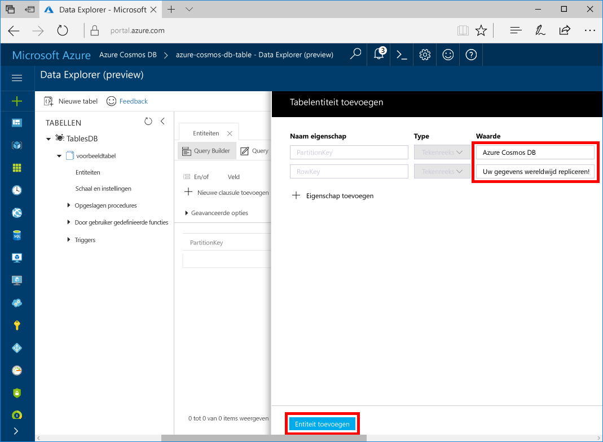

# <a name="quickstart-build-a-table-api-app-with-nodejs-and-azure-cosmos-db"></a>Quickstart: Een Table-API compileren met Node.js en Azure Cosmos DB

Deze quickstart laat zien hoe u Node.js en de [Table-API](table-introduction.md) van Azure Cosmos DB gebruikt voor het compileren van een app door een voorbeeld uit GitHub te klonen. In deze quickstart ziet u ook hoe u een Azure Cosmos DB-account maakt en hoe u Data Explorer gebruikt om tabellen en entiteiten te maken in Azure Portal op internet.

Azure Cosmos DB is de wereldwijd gedistribueerde multimodel-databaseservice van Microsoft. U kunt snel databases maken van documenten, sleutel/waarde-paren, kolom- en grafiekdatabases en hier query's op uitvoeren. Deze databases genieten allemaal het voordeel van de wereldwijde distributie en horizontale schaalmogelijkheden die ten grondslag liggen aan Azure Cosmos DB. 

## <a name="prerequisites"></a>Vereisten

[!INCLUDE [quickstarts-free-trial-note](../../includes/quickstarts-free-trial-note.md)]
[!INCLUDE [cosmos-db-emulator-docdb-api](../../includes/cosmos-db-emulator-docdb-api.md)]

Daarnaast doet u het volgende:

* [Node.js](https://nodejs.org/en/) versie v0.10.29 of hoger
* [Git](http://git-scm.com/)

## <a name="create-a-database-account"></a>Een databaseaccount maken

> [!IMPORTANT] 
> U moet een nieuw Table-API-account maken om te kunnen werken met de algemeen beschikbare SDK’s voor de Table-API. Table-API-accounts die zijn gemaakt tijdens de preview worden niet ondersteund door de algemeen beschikbaar SDK's.
>

[!INCLUDE [cosmos-db-create-dbaccount-table](../../includes/cosmos-db-create-dbaccount-table.md)]

## <a name="add-a-table"></a>Een tabel toevoegen

[!INCLUDE [cosmos-db-create-table](../../includes/cosmos-db-create-table.md)]

## <a name="add-sample-data"></a>Voorbeeldgegevens toevoegen

U kunt nu gegevens aan uw nieuwe tabel toevoegen met behulp van Data Explorer.

1. Vouw in Data Explorer **sample-table** uit, klik op **Entiteiten** en klik vervolgens op **Entiteit toevoegen**.

   
2. Voeg nu gegevens toe aan de vakken met een waarde voor PartitionKey en RowKey en klik op **Entiteit toevoegen**.

   
  
    U kunt nu meer entiteiten toevoegen aan uw tabel, uw entiteiten bewerken of een query op uw gegevens uitvoeren in Data Explorer. Data Explorer is ook de plek waar u uw doorvoer kunt schalen en opgeslagen procedures, door de gebruiker gedefinieerde functies en triggers aan uw tabel kunt toevoegen.

## <a name="clone-the-sample-application"></a>De voorbeeldtoepassing klonen

We gaan nu een Table-app klonen vanaf GitHub, de verbindingsreeks instellen en de app uitvoeren. U zult zien hoe gemakkelijk het is om op een programmatische manier met gegevens te werken. 

1. Open een git-terminalvenster, bijvoorbeeld git bash, en gebruik de `cd`-opdracht om naar een map te gaan voor het installeren van de voorbeeld-app. 

    ```bash
    cd "C:\git-samples"
    ```

2. Voer de volgende opdracht uit om de voorbeeldopslagplaats te klonen. Deze opdracht maakt een kopie van de voorbeeld-app op uw computer. 

    ```bash
    git clone https://github.com/Azure-Samples/storage-table-node-getting-started.git
    ```

## <a name="update-your-connection-string"></a>Uw verbindingsreeks bijwerken

Ga nu terug naar Azure Portal om de verbindingsreeksinformatie op te halen en kopieer deze in de app. Hierdoor kan de app communiceren met de gehoste database. 

1. Klik in [Azure Portal](http://portal.azure.com/) op **Verbindingsreeks**. 

    

2. Kopieer de PRIMAIRE VERBINDINGSREEKS met behulp van de knop Kopiëren aan de rechterkant.

3. Open het bestand app.config en plak de waarde in de connectionString op regel drie. 

    > [!IMPORTANT]
    > Als uw eindpunt documents.azure.com gebruikt, hebt u een preview-account en moet u een [nieuw Table-API-account](#create-a-database-account) maken om te kunnen werken met de algemeen beschikbare SDK voor Table- API.
    >

3. Sla het bestand app.config op.

U hebt uw app nu bijgewerkt met alle informatie die nodig is voor de communicatie met Azure Cosmos DB. 

## <a name="run-the-app"></a>De app uitvoeren

1. `cd` in het git-terminalvenster naar de map storage-table-java-getting-started.

    ```
    cd "C:\git-samples\storage-table-node-getting-started"
    ```

2. Voer de volgende opdracht uit om de modules [azure], [node-uuid], [nconf] en [async] lokaal uit te voeren en een vermelding voor deze modules op te slaan in het bestand package.json

   ```
   npm install azure-storage node-uuid async nconf --save
   ```

2. Voer in het git-terminalvenster de volgende opdrachten uit om de Node-toepassing te starten.

    ```
    node ./tableSample.js 
    ```

    In het consolevenster worden de tabelgegevens weergegeven die worden toegevoegd aan de nieuwe tabeldatabase in Azure Cosmos DB.

    U kunt nu teruggaan naar Data Explorer en deze nieuwe gegevens bekijken, wijzigen, een query erop uitvoeren of er iets anders mee doen. 

## <a name="review-slas-in-the-azure-portal"></a>SLA’s bekijken in Azure Portal

[!INCLUDE [cosmosdb-tutorial-review-slas](../../includes/cosmos-db-tutorial-review-slas.md)]

## <a name="clean-up-resources"></a>Resources opschonen

[!INCLUDE [cosmosdb-delete-resource-group](../../includes/cosmos-db-delete-resource-group.md)]

## <a name="next-steps"></a>Volgende stappen

In deze Quick Start hebt u geleerd hoe u een Azure Cosmos DB-account kunt maken, hebt u een tabel gemaakt met de Data Explorer en hebt u een app uitgevoerd.  Nu kunt u een query uitvoeren op uw gegevens met de Table-API.  

> [!div class="nextstepaction"]
> [Tabelgegevens importeren in de Table-API](table-import.md)
