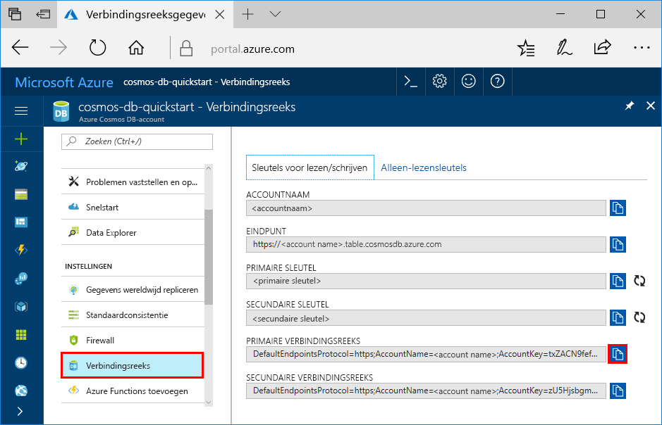

# <a name="quickstart-build-a-table-api-app-with-python-and-azure-cosmos-db"></a>Snelstartgids: Een tabel met Python en Azure Cosmos DB API-app bouwen

Deze snelstartgids laat zien hoe u Python en de Azure DB die Cosmos [tabel API](table-introduction.md) voor het bouwen van een app door het klonen van een voorbeeld van GitHub. Deze snelstartgids ziet u ook een Cosmos-DB Azure-account maken en hoe Data Explorer gebruiken om te maken van tabellen en entiteiten in de Azure portal op Internet.

Azure Cosmos DB is de wereldwijd gedistribueerde multimodel-databaseservice van Microsoft. U kunt snel maken en query document, sleutel/waarde, wide kolom en grafiek databases, die allemaal van de algemene distributie en de mogelijkheden van de horizontale schaal de kern van Azure Cosmos DB profiteren. 

## <a name="prerequisites"></a>Vereisten

[!INCLUDE [quickstarts-free-trial-note](../../includes/quickstarts-free-trial-note.md)]
[!INCLUDE [cosmos-db-emulator-docdb-api](../../includes/cosmos-db-emulator-docdb-api.md)]

Daarnaast doet u het volgende:

* Als u Visual Studio 2017 nog niet hebt geïnstalleerd, kunt u het downloaden en de **gratis** [Community Edition van Visual Studio 2017](https://www.visualstudio.com/downloads/) gebruiken. Zorg ervoor dat u **Azure-ontwikkeling** inschakelt tijdens de installatie van Visual Studio.
* Python Tools for Visual Studio van [GitHub](http://microsoft.github.io/PTVS/). In deze zelfstudie wordt gebruikgemaakt van Python Tools for VS 2015.
* Python 2.7 van [python.org](https://www.python.org/downloads/release/python-2712/)

## <a name="create-a-database-account"></a>Een databaseaccount maken

[!INCLUDE [cosmos-db-create-dbaccount-table](../../includes/cosmos-db-create-dbaccount-table.md)]

## <a name="add-a-table"></a>Een tabel toevoegen

[!INCLUDE [cosmos-db-create-table](../../includes/cosmos-db-create-table.md)]

## <a name="add-sample-data"></a>Voorbeeldgegevens toevoegen

U kunt nu gegevens aan uw nieuwe tabel toevoegen met behulp van Data Explorer.

1. Vouw in Data Explorer **sample-table** uit, klik op **Entiteiten** en klik vervolgens op **Entiteit toevoegen**.

   
2. Nu gegevens toevoegen aan de waarde PartitionKey en RowKey waarde vakken en klik op **entiteit toevoegen**.

   
  
    U kunt nu meer entiteiten toevoegen aan uw tabel, uw entiteiten bewerken of een query op uw gegevens uitvoeren in Data Explorer. Data Explorer is ook de plek waar u uw doorvoer kunt schalen en opgeslagen procedures, door de gebruiker gedefinieerde functies en triggers aan uw tabel kunt toevoegen.

## <a name="clone-the-sample-application"></a>De voorbeeldtoepassing klonen

We gaan nu een Table-app klonen vanaf GitHub, de verbindingsreeks instellen en de app uitvoeren. U zult zien hoe gemakkelijk het is om op een programmatische manier met gegevens te werken. 

1. Open een git-terminalvenster zoals git bash, en gebruik de `cd` opdracht om te wijzigen naar een map voor het installeren van de voorbeeld-app. 

    ```bash
    cd "C:\git-samples"
    ```

2. Voer de volgende opdracht uit om de voorbeeldopslagplaats te klonen. Deze opdracht maakt u een kopie van de voorbeeld-app op uw computer. 

    ```bash
    git clone https://github.com/Azure-Samples/storage-python-getting-started.git
    ```

3. Open vervolgens het oplossingenbestand in Visual Studio. 

## <a name="update-your-connection-string"></a>Uw verbindingsreeks bijwerken

Ga nu terug naar Azure Portal om de verbindingsreeksinformatie op te halen en kopieer deze in de app. Hierdoor kan uw app kan communiceren met uw gehoste-database. 

1. In de [Azure-portal](http://portal.azure.com/), klikt u op **verbindingsreeks**. 

    

2. Open het bestand config.py en kopieer de vereiste eigenschappen van een verbindingsreeks in het configuratiebestand.

3. Sla het bestand config.py.

## <a name="run-the-app"></a>De app uitvoeren

1. Klik in Visual Studio met de rechtermuisknop op het project in **Solution Explorer**, selecteer de huidige Python-omgeving en klik er met de rechtermuisknop op.

2. Selecteer de Python-pakket installeren, en typ vervolgens **azure-opslag-tabel**

3. Druk op F5 om de toepassing uit te voeren. Uw app wordt in uw browser weergegeven. 

U kunt nu teruggaan naar Data Explorer en deze nieuwe gegevens bekijken, wijzigen, een query erop uitvoeren of er iets anders mee doen. 

## <a name="review-slas-in-the-azure-portal"></a>SLA’s bekijken in Azure Portal

[!INCLUDE [cosmosdb-tutorial-review-slas](../../includes/cosmos-db-tutorial-review-slas.md)]

## <a name="clean-up-resources"></a>Resources opschonen

[!INCLUDE [cosmosdb-delete-resource-group](../../includes/cosmos-db-delete-resource-group.md)]

## <a name="next-steps"></a>Volgende stappen

In deze Quick Start hebt u geleerd hoe u een Azure Cosmos DB-account kunt maken, hebt u een tabel gemaakt met de Data Explorer en hebt u een app uitgevoerd.  Nu kunt u een query uitvoeren op uw gegevens met de Table-API.  

> [!div class="nextstepaction"]
> [Tabelgegevens importeren in de tabel-API](table-import.md)
