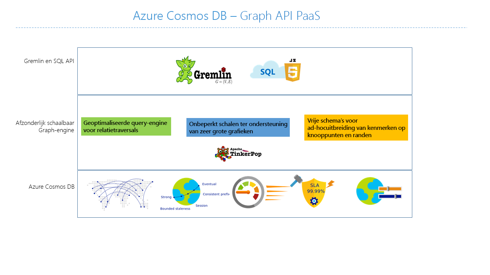

# Inleiding tot Azure Cosmos DB: Gremlin-API

[Azure Cosmos DB](introduction.md) is de wereldwijd gedistribueerde multimodel-databaseservice van Microsoft voor essentiële toepassingen. Deze service beschikt over meerdere modellen en ondersteunt modellen voor document-, sleutelwaarde-, graaf- en kolomgegevens. De Azure Cosmos DB Gremlin-API wordt gebruikt om graafgegevens op te slaan en hiermee te werken. De Gremlin-API ondersteunt het maken van modellen voor graafgegevens en biedt API's om de graafgegevens te doorkruisen.

Dit artikel biedt een overzicht van de Azure Cosmos DB Gremlin API en legt uit hoe u deze kunt gebruiken om zeer grote grafieken met miljarden hoekpunten en randen op te slaan. U kunt query’s uitvoeren voor de grafieken met een latentie van milliseconden en eenvoudig de grafiekstructuur en het schema ontwikkelen. Als u een query wilt uitvoeren voor Azure Cosmos DB, kunt u de taal voor grafiekdoorkruising [Apache TinkerPop](https://tinkerpop.apache.org) gebruiken, of [Gremlin](https://tinkerpop.apache.org/docs/current/reference/#graph-traversal-steps).

## Wat is een graafdatabase?
Gegevens zoals deze in werkelijkheid voorkomen, zijn op natuurlijke wijze verbonden. Traditionele gegevensmodellering richt zich op entiteiten. Voor veel toepassingen is modellering ook vereist of moeten zowel entiteiten als relaties op natuurlijke wijze worden gemodelleerd.

Een [grafiek](http://mathworld.wolfram.com/Graph.html) is een structuur die is samengesteld uit [hoekpunten](http://mathworld.wolfram.com/GraphVertex.html) en [randen](http://mathworld.wolfram.com/GraphEdge.html). Zowel hoekpunten als randen kunnen een willekeurig aantal eigenschappen hebben. 

* **Hoekpunten**: Hoekpunten duiden afzonderlijke objecten aan, zoals een persoon, plaats of gebeurtenis. 

* **Kanten**: Kanten duiden relaties tussen hoekpunten aan. Bijvoorbeeld, een persoon kent mogelijk een andere persoon, is betrokken bij een gebeurtenis, en is onlangs op een bepaalde locatie geweest. 

* **Eigenschappen**: Eigenschappen geven informatie over de hoekpunten en kanten. Denk bijvoorbeeld aan een hoekpunt met een naam en leeftijd. Een kant heeft bijvoorbeeld een tijdstempel en/of gewicht. Dit model is meer formeel bekend als een [eigenschappengrafiek](https://tinkerpop.apache.org/docs/current/reference/#intro). Azure Cosmos DB biedt ondersteuning voor het eigenschappengrafiekmodel.

In het volgende voorbeeld worden bijvoorbeeld relaties weergegeven tussen personen, mobiele apparaten, interesses en besturingssystemen:

Met grafiekdatabasen kunt u grafieken natuurlijk en efficiënt modelleren en opslaan, waardoor ze kunnen worden gebruikt in meerdere scenario’s. Grafiekdatabases zijn meestal NoSQL-databases, omdat voor deze gebruiksvoorbeelden vaak ook schemaflexibiliteit en snelle iteratie nodig is.

U kunt de snelle traversals die grafiekdatabases bieden combineren met grafiekalgoritmen, zoals diepte eerst-zoekopdracht, breedte eerst-zoekopdracht, en het algoritme van Dijkstra, om problemen op te lossen in verschillende domeinen zoals sociale netwerken, inhoudsbeheer, georuimtelijk en aanbevelingen.

## Functies van Azure Cosmos DB-graafdatabase
 
Azure Cosmos DB is een volledig beheerde grafiekdatabase met wereldwijde distributie, elastisch schalen van opslag en doorvoer, automatisch indexeren en doorzoeken, instelbare consistentieniveaus, en ondersteuning voor de standaardversie van TinkerPop.

Azure Cosmos DB biedt de volgende gedifferentieerde mogelijkheden in vergelijking met andere bestaande grafiekdatabases:

* Elastische schaalbare doorvoer en opslag

 Grafieken moeten in de praktijk hoger worden geschaald dan de capaciteit van een enkele server. Met Azure Cosmos DB kunt u grafieken naadloos schalen over meerdere servers. U kunt de doorvoer van de grafiek ook onafhankelijk schalen op basis van uw toegangspatronen. Azure Cosmos DB biedt ondersteuning voor grafiekdatabases waarvan de opslaggrootte en ingerichte doorvoer vrijwel onbeperkt kan worden geschaald.

* Replicatie met meerdere regio’s

 Azure Cosmos DB repliceert op transparante wijze uw grafiekgegevens naar alle regio’s die u hebt gekoppeld aan uw account. Replicatie stelt u in staat om toepassingen te ontwikkelen waarvoor globale toegang tot gegevens is vereist. Er is sprake van balans op het gebied van consistentie, beschikbaarheid, en prestaties en de bijbehorende garanties. Azure Cosmos DB biedt transparante regionale failovers met multihoming-API's. U kunt doorvoer en opslag elastisch schalen, wereldwijd.

* Snelle query’s en traversals met vertrouwde Gremlin-syntaxis

 Sla heterogene hoekpunten en randen op, en doorzoek deze documenten met behulp van de vertrouwde Gremlin-syntaxis. Azure Cosmos DB maakt gebruik van een vrijwel gelijktijdige en vergrendelingsvrije indexeringstechnologie op basis van logboeken om alle inhoud automatisch te indexeren. Deze mogelijkheid stelt u in staat om query's en traversals in realtime uit te voeren zonder dat u schemahints, secundaire indexen of weergaven hoeft op te geven. Meer informatie vindt u in [Querygrafieken met behulp van Gremlin](gremlin-support.md).

* Volledig beheerd

 Dankzij Azure Cosmos DB is het niet meer nodig om database- en machineresources te beheren. U hoeft voor een volledig beheerde Microsoft Azure-service geen virtuele machines te beheren, software te implementeren en te configureren, schaalwijzigingen te beheren of complexe upgrades voor gegevenslagen uit te voeren. Er wordt automatisch een back-up van elke grafiek gemaakt en de databases worden automatisch beveiligd tegen regionale fouten. U kunt gemakkelijk een Azure Cosmos DB-account toevoegen en de capaciteit inrichten die u nodig hebt, zodat u zich kunt richten op uw toepassing in plaats van op de uitvoer en het beheer van uw database.

* Automatisch indexeren

 In Azure Cosmos DB worden standaard alle eigenschappen in de knooppunten en randen van de grafiek geïndexeerd. Er wordt geen schema verwacht of vereist en er hoeven geen secundaire indexen te worden gemaakt.

* Compatibiliteit met Apache TinkerPop

 Azure Cosmos DB biedt systeemeigen ondersteuning voor de open-source standaardversie van Apache TinkerPop en kan worden geïntegreerd met andere grafieksystemen waarvoor TinkerPop is ingeschakeld. Op deze manier kunt u dus eenvoudig migreren vanuit een andere grafiekdatabase, zoals Titan of Neo4j, of Azure Cosmos DB gebruiken met analyseframeworks voor grafieken, zoals Apache Spark GraphX.

* Instelbare consistentieniveaus

 Selecteer een van de vijf goed gedefinieerde consistentieniveaus voor een optimale balans tussen consistentie en prestaties. Voor query's en leesbewerkingen biedt Azure Cosmos DB vijf verschillende consistentieniveaus: sterk, gebonden-verouderd, sessie, consistent voorvoegsel en mogelijk. Op basis van deze gedetailleerde, goed gedefinieerde consistentieniveaus kunt u een goede balans vinden tussen de consistentie, beschikbaarheid en latentie. Meer informatie over [Instelbare gegevensconsistentieniveaus in Azure Cosmos DB](consistency-levels.md).

Azure Cosmos DB kan meerdere modellen, zoals document en grafiek, gebruiken binnen dezelfde containers/databases. U kunt een documentcontainer gebruiken om grafiekgegevens naast documenten op te slaan. U kunt zowel SQL-query’s met JSON gebruiken, als Gremlin-query’s om dezelfde gegevens te doorzoeken als een grafiek.

## Aan de slag

U kunt de opdrachtregelinterface van Azure (CLI), Azure PowerShell of de Azure-portal gebruiken om Gremlin API-accounts van Azure Cosmos DB te maken. Nadat u een account hebt gemaakt, zijn de graafdatabases binnen dat account toegankelijk via een service-eindpunt van de Gremlin-API `https://<youraccount>.gremlin.cosmosdb.azure.com`, dat een WebSocket-front-end biedt voor Gremlin. U kunt hulpprogramma’s configureren die compatibel zijn met TinkerPop, zoals de [Gremlin-console](https://tinkerpop.apache.org/docs/current/reference/#gremlin-console), om verbinding te maken met dit eindpunt en toepassingen te bouwen in Java, Node.js of een ander clientstuurprogramma van Gremlin.

In de volgende tabel ziet u populaire Gremlin-stuurprogramma’s die u kunt gebruiken met Azure Cosmos DB:

| Downloaden | Documentatie | Aan de slag | Ondersteunde connectorversie |
| --- | --- | --- | --- |
| [.NET](https://tinkerpop.apache.org/docs/3.3.1/reference/#gremlin-DotNet) | [Gremlin.NET in GitHub](https://github.com/apache/tinkerpop/tree/master/gremlin-dotnet) | [Grafiek maken met behulp van .NET](create-graph-dotnet.md) | 3.4.0-RC2 |
| [Java](https://mvnrepository.com/artifact/com.tinkerpop.gremlin/gremlin-java) | [Gremlin JavaDoc](https://tinkerpop.apache.org/javadocs/current/full/) | [Grafiek maken met behulp van Java](create-graph-java.md) | 3.2.0+ |
| [Node.js](https://www.npmjs.com/package/gremlin) | [Gremlin-JavaScript in GitHub](https://github.com/jbmusso/gremlin-javascript) | [Grafiek maken met behulp van Node.js](create-graph-nodejs.md) | 2.6.0|
| [Python](https://tinkerpop.apache.org/docs/3.3.1/reference/#gremlin-python) | [Gremlin-Python in GitHub](https://github.com/apache/tinkerpop/tree/master/gremlin-python) | [Grafiek maken met behulp van Python](create-graph-python.md) | 3.2.7 |
| [PHP](https://packagist.org/packages/brightzone/gremlin-php) | [Gremlin-PHP in GitHub](https://github.com/PommeVerte/gremlin-php) | [Grafiek maken met behulp van PHP](create-graph-php.md) | 3.1.0 |
| [Gremlin-console](https://tinkerpop.apache.org/downloads.html) | [TinkerPop-documenten](https://tinkerpop.apache.org/docs/current/reference/#gremlin-console) |  [Grafiek maken met behulp van de Gremlin-console](create-graph-gremlin-console.md) | 3.2.0 + |

## Overwegingen bij het ontwerpen van graafdatabases

Wanneer u een graaf ontwerpt en u een keuze maakt tussen het modelleren van een entiteit als zelfstandig hoekpunt of als eigenschap van andere hoekpuntentiteiten, moet u rekening houden met de gevolgen voor prestaties en kosten. Het belangrijkste argument voor deze beslissing is afhankelijk van hoe de gegevens worden opgevraagd, evenals de schaalbaarheid van het model zelf.

Houd rekening met de volgende vragen voordat u plant hoe u de entiteit gaat modelleren:

* Welke entiteiten moeten worden opgehaald als hoekpunten voor het merendeel van mijn query's?

* Welke informatie neem ik op in de graaf en voeg ik toe om gegevens te kunnen filteren?

* Welke entiteiten zijn enkel verbindingen met andere entiteiten, die vervolgens worden opgehaald voor hun waarden?

* Welke gegevens moet mijn query ophalen en wat bedragen de RU-kosten die hierdoor ontstaan?

Stel dat u het volgende graafontwerp kiest:

* Afhankelijk van de query's wordt de Regio->Winkel-relatie mogelijk uitsluitend gebruikt om de Winkel-hoekpunten te filteren. Dit geldt bijvoorbeeld voor query's met de indeling 'alle winkels ophalen die tot een specifieke regio behoren'. Als dit het geval is, kunt u overwegen om de Regio-entiteit om te zetten van een zelfstandig hoekpunt in een eigenschap van het Winkel-hoekpunt. 

* Het voordeel van deze benadering is dat u minder kosten maakt wanneer u elk Winkel-hoekpunt ophaalt. Waar u eerst drie graafobjecten per keer ophaalde (Regio, Regio->Winkel, Winkel), haalt u nu slechts één Winkel-hoekpunt op. Dit kan prestatieverbeteringen opleveren en de kosten per query beperken.

* Het Winkel-hoekpunt is gekoppeld aan twee verschillende entiteiten: Werknemer en Product. Het Winkel-hoekpunt is daarom nodig, aangezien het meerdere mogelijkheden om te doorkruisen kan bieden.  

## Scenario's waarin de Gremlin-API kan worden gebruikt
Hier zijn enkele scenario’s waarin ondersteuning voor grafieken in Azure Cosmos DB kan worden gebruikt:

* Sociale netwerken

 Door gegevens over uw klanten en hun interacties met andere personen te combineren kunt u een persoonlijke ervaring ontwikkelen, het gedrag van klanten voorspellen of personen in contact brengen met anderen die gelijksoortige interesses hebben. Azure Cosmos DB kan worden gebruikt om sociale netwerken te beheren en klantvoorkeuren en -gegevens bij te houden.

* Aanbevelingsengines

 Dit scenario wordt doorgaans gebruikt in de detailhandel. Door informatie over producten, gebruikers en interactie tussen gebruikers, zoals het kopen, zoeken of beoordelen van een item, te combineren, kunt u aangepaste aanbevelingen genereren. De lage latentie, elastische schaal en systeemeigen ondersteuning voor grafieken van Azure Cosmos DB is ideaal voor het modelleren van deze interacties.

* Georuimtelijk

 In veel toepassingen voor telecommunicatie, logistiek en reisplanning moet vaak worden gezocht naar belangrijke locaties binnen een gebied, of moet de kortste/snelste route tussen twee locaties worden berekend. Azure Cosmos DB is zeer geschikt voor dit soort taken.

* Internet of Things

 Omdat het netwerk en de verbindingen tussen IoT-apparaten zijn gemodelleerd als een grafiek krijgt u een beter beeld van de status van uw apparaten en activa. U krijgt ook inzicht in hoe wijzigingen in één deel van het netwerk van invloed kunnen zijn op een ander deel.

## Volgende stappen
Voor meer informatie over ondersteuning voor grafieken in Azure Cosmos DB raadpleegt u:

* Aan de slag met de [zelfstudie voor grafieken in Azure Cosmos DB](create-graph-dotnet.md).
* Meer informatie over het [doorzoeken van grafieken in Azure Cosmos DB met behulp van Gremlin](gremlin-support.md).
