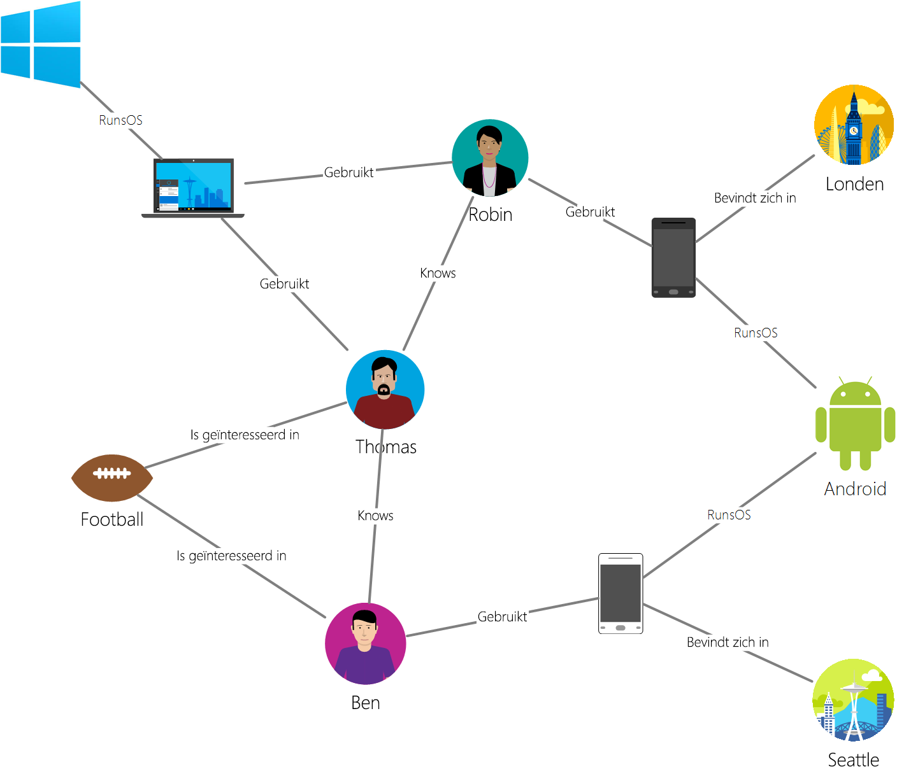

# <a name="azure-cosmos-db-gremlin-graph-support"></a>Ondersteuning van Azure DB-Gremlin Cosmos-grafiek
Biedt ondersteuning voor Azure Cosmos DB [van Apache Tinkerpop](http://tinkerpop.apache.org) graph traversal taal, [Gremlin](http://tinkerpop.apache.org/docs/current/reference/#graph-traversal-steps), namelijk een Graph-API voor het maken van de grafiek entiteiten en grafiek querybewerkingen uitvoert. U kunt de taal Gremlin grafiek entiteiten (hoekpunten en randen) maken, aanpassen van eigenschappen binnen deze entiteiten, uitvoeren van query's en traversals en entiteiten te verwijderen. 

Azure Cosmos DB brengt op ondernemingsniveau functies met grafiek databases. Dit omvat globale distributie, onafhankelijke schalen van opslag en doorvoer, voorspelbare één cijfer milliseconde latenties, automatische indexeren, sla's, de beschikbaarheid van de database accounts spanning van twee of meer Azure-regio's gelezen. Omdat Azure Cosmos DB TinkerPop/Gremlin ondersteunt, kunt u eenvoudig toepassingen die zijn geschreven met behulp van een andere grafiek database zonder codewijzigingen aanbrengen migreren. Bovendien grond Gremlin ondersteuning, Azure Cosmos DB naadloos kan worden geïntegreerd met TinkerPop ingeschakeld analytics frameworks zoals [Apache Spark GraphX](http://spark.apache.org/graphx/). 

In dit artikel wij bieden een snel overzicht van Gremlin en inventariseren van de Gremlin functies en de stappen die worden ondersteund door de Graph API.

## <a name="gremlin-by-example"></a>Gremlin door voorbeeld
We gaan een grafiek voorbeeld gebruiken om te begrijpen hoe query's kunnen worden uitgedrukt in Gremlin. De volgende afbeelding ziet een zakelijke toepassing die gegevens over gebruikers, interesses en apparaten in de vorm van een grafiek beheert.  

 

Deze grafiek bevat de volgende hoekpunt-typen ('label' in Gremlin genoemd):

- Personen: de grafiek bevat drie personen, Robin, Thomas en Ben
- Interesses: hun interesses, in dit voorbeeld wordt de game van Football
- : De apparaten die gebruiken mensen
- Besturingssystemen: de besturingssystemen die op de apparaten worden uitgevoerd

Er gelden voor de relaties tussen deze entiteiten via de volgende typen edge/labels:

- Kent: bijvoorbeeld 'Thomas kent Robin"
- Geïnteresseerd: Als u wilt de interesses van de personen die in onze grafiek vertegenwoordigen, bijvoorbeeld 'Ben is geïnteresseerd in Football'
- RunsOS: Laptop wordt uitgevoerd het Windows-besturingssysteem
- Vormen van gebruik: Ter vertegenwoordiging van een persoon voor welk apparaat wordt gebruikt. Robin gebruikt bijvoorbeeld een telefoon Motorola met serienummer 77

Laten we enkele bewerkingen worden uitgevoerd tegen het gebruik van deze grafiek de [Gremlin Console](http://tinkerpop.apache.org/docs/current/reference/#gremlin-console). U kunt ook deze bewerkingen met behulp van Gremlin stuurprogramma's van het platform van uw keuze (Java, Node.js, Python of .NET) uitvoeren.  Voordat we wat wordt ondersteund in Azure Cosmos DB kijken, bekijken we enkele voorbeelden om vertrouwd te raken met de syntaxis.

Eerste bekijken we CRUD. De volgende Gremlin instructie voegt het hoekpunt 'Thomas' in de grafiek:

```
:> g.addV('person').property('id', 'thomas.1').property('firstName', 'Thomas').property('lastName', 'Andersen').property('age', 44)
```

Vervolgens voegt de volgende Gremlin-instructie een edge 'kent' tussen Thomas en Robin.

```
:> g.V('thomas.1').addE('knows').to(g.V('robin.1'))
```

De volgende query retourneert 'degene' hoekpunten in aflopende volgorde van de namen van de eerste:
```
:> g.V().hasLabel('person').order().by('firstName', decr)
```

Indien grafieken harte is wanneer u moet beantwoorden vragen, zoals 'welke besturingssystemen vrienden of van Thomas gebruik?'. U kunt dit eenvoudige Gremlin doorlopen voor het ophalen van die gegevens uit de grafiek uitvoeren:

```
:> g.V('thomas.1').out('knows').out('uses').out('runsos').group().by('name').by(count())
```
Nu gaan we kijken wat Azure Cosmos DB voor ontwikkelaars Gremlin biedt.

## <a name="gremlin-features"></a>Gremlin functies
TinkerPop is een standaard die betrekking heeft op een breed scala aan graph-technologieën. Daarom heeft standaard terminologie te beschrijven welke functies worden geleverd door een provider van de grafiek. Azure Cosmos DB voorziet in een permanente, hoge gelijktijdigheid, beschrijfbare graph-database die op meerdere servers of clusters kan worden gepartitioneerd. 

De volgende tabel bevat de TinkerPop-functies die worden geïmplementeerd door Azure Cosmos DB: 

| Category | Azure DB Cosmos-implementatie |  Opmerkingen | 
| --- | --- | --- |
| Grafiek-functies | Persistentie en ConcurrentAccess biedt. Ter ondersteuning van transacties | Computer-methoden kunnen worden geïmplementeerd via de connector Spark. |
| Variabele functies | Ondersteunt Booleaans, Integer, Byte, dubbelklik, Float, Integer, Long, tekenreeks | Biedt ondersteuning voor primitieve typen, is compatibel met complexe typen via gegevensmodel |
| Hoekpunt functies | Ondersteunt RemoveVertices, MetaProperties, AddVertices, MultiProperties, StringIds, UserSuppliedIds, AddProperty, RemoveProperty  | Ondersteunt het maken, wijzigen en verwijderen van hoekpunten |
| Hoekpunt eigenschap functies | StringIds, UserSuppliedIds, AddProperty, RemoveProperty, BooleanValues, ByteValues, DoubleValues, FloatValues, IntegerValues, LongValues, StringValues | Ondersteunt het maken, wijzigen en verwijderen van hoekpunt eigenschappen |
| Edge-functies | AddEges, RemoveEdges, StringIds, UserSuppliedIds, AddProperty, RemoveProperty | Ondersteunt het maken, wijzigen en verwijderen van randen |
| Rand eigenschap functies | Eigenschappen van BooleanValues, ByteValues, DoubleValues, FloatValues, IntegerValues, LongValues, StringValues | Ondersteunt het maken, wijzigen en verwijderen van eigenschappen van rand |

## <a name="gremlin-wire-format-graphson"></a>Gremlin draadindeling: GraphSON

Azure Cosmos DB gebruikt de [GraphSON indeling](https://github.com/thinkaurelius/faunus/wiki/GraphSON-Format) bij het retourneren van resultaten van Gremlin bewerkingen. GraphSON is de standaard Gremlin-indeling voor het voorstellen hoekpunten randen en met een JSON-eigenschappen (eigenschappen van één of meerdere waarden). 

Bijvoorbeeld, het volgende fragment toont een GraphSON representatie van een hoekpunt *geretourneerd naar de client* uit Azure Cosmos-database. 

```json
  {
    "id": "a7111ba7-0ea1-43c9-b6b2-efc5e3aea4c0",
    "label": "person",
    "type": "vertex",
    "outE": {
      "knows": [
        {
          "id": "3ee53a60-c561-4c5e-9a9f-9c7924bc9aef",
          "inV": "04779300-1c8e-489d-9493-50fd1325a658"
        },
        {
          "id": "21984248-ee9e-43a8-a7f6-30642bc14609",
          "inV": "a8e3e741-2ef7-4c01-b7c8-199f8e43e3bc"
        }
      ]
    },
    "properties": {
      "firstName": [
        {
          "value": "Thomas"
        }
      ],
      "lastName": [
        {
          "value": "Andersen"
        }
      ],
      "age": [
        {
          "value": 45
        }
      ]
    }
  }
```

De eigenschappen die worden gebruikt door GraphSON voor hoekpunten zijn als volgt:

| Eigenschap | Beschrijving |
| --- | --- |
| id | De ID voor het hoekpunt. Moet uniek zijn (in combinatie met de waarde van _partition indien van toepassing) |
| Label | Het label van het hoekpunt. Dit is optioneel en gebruikt voor het beschrijven van het entiteitstype. |
| type | Gebruikt om te onderscheiden van de hoekpunten van documenten voor niet-grafiek |
| properties | De eigenschappenverzameling van de gebruiker gedefinieerde eigenschappen die zijn gekoppeld aan het hoekpunt. Elke eigenschap kan meerdere waarden hebben. |
| _partition (configureren) | De partitiesleutel van het hoekpunt. Kan worden gebruikt voor scale-out grafieken met meerdere servers |
| outE | Dit document bevat een lijst met uit randen van een hoekpunt. Opslaan van de informatie Aangrenzing met hoekpunt kunt u snel de uitvoering van traversals. Randen zijn gegroepeerd op basis van hun labels. |

En de rand bevat de volgende informatie om te helpen bij navigatie naar andere onderdelen van de grafiek.

| Eigenschap | Beschrijving |
| --- | --- |
| id | De ID voor de rand. Moet uniek zijn (in combinatie met de waarde van _partition indien van toepassing) |
| Label | Het label van de rand. Deze eigenschap is optioneel en gebruikt voor het beschrijven van het relatietype. |
| Geïnventariseerde | Dit document bevat een lijst met in hoekpunten voor een edge. Het opslaan van de informatie Aangrenzing met de rand kunt u snel de uitvoering van traversals. Hoekpunten worden gegroepeerd op basis van hun labels. |
| properties | De eigenschappenverzameling van de gebruiker gedefinieerde eigenschappen die zijn gekoppeld aan de rand. Elke eigenschap kan meerdere waarden hebben. |

Elke eigenschap kunnen meerdere waarden binnen een matrix worden opgeslagen. 

| Eigenschap | Beschrijving |
| --- | --- |
| waarde | De waarde van de eigenschap

## <a name="gremlin-partitioning"></a>Gremlin partitioneren

In Azure Cosmos DB grafieken worden opgeslagen in de containers die kunnen worden geschaald onafhankelijk in termen van opslag en doorvoer (uitgedrukt in genormaliseerde aanvragen per seconde). Elke container moet Definieer een optioneel, maar aanbevolen partitie-sleuteleigenschap die de grens van een logische partitie voor de bijbehorende gegevens bepaalt. Elke hoekpunt/rand moet een hebben een `id` eigenschap die uniek is voor entiteiten in die waarde voor de partitiesleutel. De gegevens worden behandeld in [partitioneren in Azure Cosmos DB](partition-data.md).

Gremlin bewerkingen werken naadloos tussen grafiekgegevens die meerdere partities in Azure Cosmos DB omvatten. Het wordt echter aanbevolen een partitiesleutel voor uw grafieken dat vaak wordt gebruikt als een filter in query's veel afzonderlijke waarden heeft, en vergelijkbare frequentie van toegang tot deze waarden kiezen. 

## <a name="gremlin-steps"></a>Gremlin stappen
Nu we bekijken de Gremlin stappen ondersteund door Azure Cosmos DB. Zie voor een volledig overzicht van Gremlin, [TinkerPop verwijzing](http://tinkerpop.apache.org/docs/current/reference).

| Stap | Beschrijving | TinkerPop 3.2-documentatie | Opmerkingen |
| --- | --- | --- | --- |
| `addE` | Voegt een rand tussen twee hoekpunten | [addE stap](http://tinkerpop.apache.org/docs/current/reference/#addedge-step) | |
| `addV` | Voegt een hoekpunt toe aan de grafiek | [addV stap](http://tinkerpop.apache.org/docs/current/reference/#addvertex-step) | |
| `and` | Zorgt ervoor dat alle traversals een waarde retourneren | [en stap](http://tinkerpop.apache.org/docs/current/reference/#and-step) | |
| `as` | Een stap modulator een variabele toewijzen aan de uitvoer van een stap | [Als stap](http://tinkerpop.apache.org/docs/current/reference/#as-step) | |
| `by` | Een stap modulator gebruikt met `group` en`order` | [door stap](http://tinkerpop.apache.org/docs/current/reference/#by-step) | |
| `coalesce` | Retourneert de eerste traversal die een resultaat retourneert | [coalesce-stap](http://tinkerpop.apache.org/docs/current/reference/#coalesce-step) | |
| `constant` | Retourneert een constante waarde. Gebruikt met`coalesce`| [constante stap](http://tinkerpop.apache.org/docs/current/reference/#constant-step) | |
| `count` | Retourneert de telling van het transport | [aantal stap](http://tinkerpop.apache.org/docs/current/reference/#count-step) | |
| `dedup` | De waarden worden geretourneerd met de dubbele waarden zijn verwijderd | [Ontdubbeling stap](http://tinkerpop.apache.org/docs/current/reference/#dedup-step) | |
| `drop` | Verwijdert de waarden (hoekpunt/zijde) | [stap verwijderen](http://tinkerpop.apache.org/docs/current/reference/#drop-step) | |
| `fold` | Fungeert als een barrière die de statistische functie van de resultaten wordt berekend| [Vouw stap](http://tinkerpop.apache.org/docs/current/reference/#fold-step) | |
| `group` | De waarden op basis van de opgegeven labels groepen| [groep-stap](http://tinkerpop.apache.org/docs/current/reference/#group-step) | |
| `has` | Gebruikt voor het filteren van eigenschappen, hoekpunten en randen. Ondersteunt `hasLabel`, `hasId`, `hasNot`, en `has` varianten. | [stap heeft](http://tinkerpop.apache.org/docs/current/reference/#has-step) | |
| `inject` | Het invoeren van waarden in een stream| [stap invoeren](http://tinkerpop.apache.org/docs/current/reference/#inject-step) | |
| `is` | Gebruikt voor het uitvoeren van een filter met behulp van een Boole-expressie | [stap](http://tinkerpop.apache.org/docs/current/reference/#is-step) | |
| `limit` | Gebruikt voor het aantal items in het transport beperken| [limiet voor-stap](http://tinkerpop.apache.org/docs/current/reference/#limit-step) | |
| `local` | Lokale teruglopen een gedeelte van een traversal, vergelijkbaar met een subquery | [lokale stap](http://tinkerpop.apache.org/docs/current/reference/#local-step) | |
| `not` | Gebruikt voor het produceren van de ontkenning van een filter | [niet-stap](http://tinkerpop.apache.org/docs/current/reference/#not-step) | |
| `optional` | Retourneert het resultaat van de opgegeven traversal als het een resultaat oplevert anders wordt het element aanroepen | [optionele stap](http://tinkerpop.apache.org/docs/current/reference/#optional-step) | |
| `or` | Zorgt ervoor dat ten minste één van de traversals retourneert een waarde | [of -stap](http://tinkerpop.apache.org/docs/current/reference/#or-step) | |
| `order` | Retourneert resultaten in de opgegeven sorteervolgorde | [volgorde-stap](http://tinkerpop.apache.org/docs/current/reference/#order-step) | |
| `path` | Retourneert het volledige pad van het transport | [pad-stap](http://tinkerpop.apache.org/docs/current/reference/#path-step) | |
| `project` | De eigenschappen als een kaart projecten | [Project-stap](http://tinkerpop.apache.org/docs/current/reference/#project-step) | |
| `properties` | Retourneert de eigenschappen voor de opgegeven labels | [stap eigenschappen](http://tinkerpop.apache.org/docs/current/reference/#properties-step) | |
| `range` | Filters voor het opgegeven waardenbereik| [bereik stap](http://tinkerpop.apache.org/docs/current/reference/#range-step) | |
| `repeat` | De stap herhaald voor het opgegeven aantal keren. Gebruikt voor het herhalen | [Herhaal stap](http://tinkerpop.apache.org/docs/current/reference/#repeat-step) | |
| `sample` | Gebruikt voor het voorbeeldresultaten van het transport | [voorbeeld-stap](http://tinkerpop.apache.org/docs/current/reference/#sample-step) | |
| `select` | Gebruikt voor het projectresultaten van het transport |  [Selecteer de stap](http://tinkerpop.apache.org/docs/current/reference/#select-step) | |
| `store` | Voor niet-blokkerende statistische functies van het transport gebruikt | [stap opslaan](http://tinkerpop.apache.org/docs/current/reference/#store-step) | |
| `tree` | Cumulatieve paden van een hoekpunt in een boomstructuur | [structuur stap](http://tinkerpop.apache.org/docs/current/reference/#tree-step) | |
| `unfold` | Een iterator u als een stap| [stap uitgevouwen](http://tinkerpop.apache.org/docs/current/reference/#unfold-step) | |
| `union` | Resultaten van meerdere traversals samenvoegen| [Union stap](http://tinkerpop.apache.org/docs/current/reference/#union-step) | |
| `V` | Bevat de stappen die nodig zijn voor traversals tussen hoekpunten en randen `V`, `E`, `out`, `in`, `both`, `outE`, `inE`, `bothE`, `outV`, `inV`, `bothV`, en `otherV` voor | [hoekpunt stappen](http://tinkerpop.apache.org/docs/current/reference/#vertex-steps) | |
| `where` | Gebruikt voor het filteren van resultaten van het transport. Ondersteunt `eq`, `neq`, `lt`, `lte`, `gt`, `gte`, en `between` operators  | [waar stap](http://tinkerpop.apache.org/docs/current/reference/#where-step) | |

Geoptimaliseerd voor schrijven Azure Cosmos-DB-engine biedt ondersteuning voor automatisch indexeren van alle eigenschappen in hoekpunten en randen standaard. Daarom vraagt met filters, query's sorteren, het bereik of aggregaties aan een eigenschap zijn verwerkt in de index en efficiënt geleverd. Zie voor meer informatie over hoe indexering werkt in Azure Cosmos DB onze paper op [schema networkdirect indexeren](http://www.vldb.org/pvldb/vol8/p1668-shukla.pdf).

## <a name="next-steps"></a>Volgende stappen
* Aan de slag bouwen van een toepassing grafiek [met onze SDK's](create-graph-dotnet.md) 
* Meer informatie over [Azure Cosmos DB graph-ondersteuning](graph-introduction.md)
