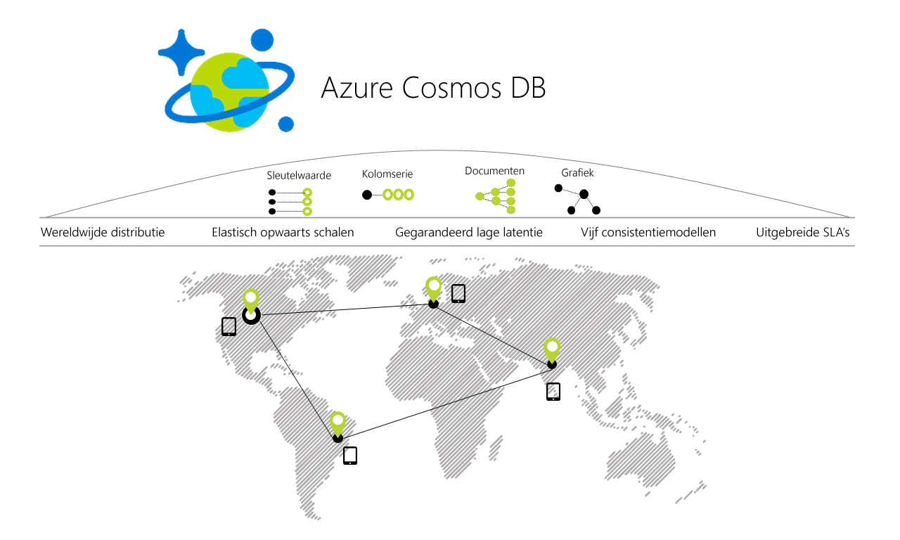

# Welkom bij Azure Cosmos DB

[!INCLUDE [cosmos-db-sql-api](../../includes/cosmos-db-sql-api.md)]

Azure Cosmos DB is de wereldwijd gedistribueerde database van Microsoft met meerdere modellen. Azure Cosmos DB maakt het mogelijk om met één muisklik doorvoer en opslag elastisch en onafhankelijk te schalen binnen een onbeperkt aantal geografische regio's van Azure. De oplossing biedt gegarandeerde doorvoer, latentie, beschikbaarheid en consistentie, vastgelegd in uitgebreide [serviceovereenkomsten](https://aka.ms/acdbsla) (SLA's), iets wat geen andere databaseservice kan bieden. [Probeer Azure Cosmos DB gratis uit](https://azure.microsoft.com/try/cosmosdb/) zonder Azure-abonnement, zonder kosten en zonder verplichtingen.

> [!div class="nextstepaction"]
> [Azure Cosmos DB gratis uitproberen](https://azure.microsoft.com/try/cosmosdb/)

## Belangrijkste mogelijkheden
Als een wereldwijd gedistribueerde databaseservice maakt Azure Cosmos DB het eenvoudig om schaalbare en zeer responsieve toepassingen te bouwen op een wereldwijde schaal:

* **Kant-en-klare wereldwijde distributie**
    * U kunt [uw gegevens distribueren](distribute-data-globally.md) naar een willekeurig aantal [Azure-regio's](https://azure.microsoft.com/regions/) met [slechts één druk op de knop](tutorial-global-distribution-sql-api.md). Op deze manier kunt u uw gegevens daar opslaan waar uw gebruikers zijn, waardoor uw klanten profiteren van de laagst mogelijke latentie. 
    * Dankzij de multihoming-API's van Azure Cosmos DB weet de app altijd wat de dichtstbijzijnde regio is en worden aanvragen naar het dichtstbijzijnde datacenter verzonden. Dit alles is mogelijk zonder wijzigingen in de configuratie. U stelt uw schrijfregio in en net zo veel leesregio's als u wilt, en de rest wordt automatisch afgehandeld.
    * Bij het toevoegen en verwijderen van regio's voor uw Cosmos DB-database, hoeft uw toepassing hoeft niet opnieuw te worden geïmplementeerd en blijft deze maximaal beschikbaar dankzij de multihoming-API-functie.

* **Meerdere gegevensmodellen en populaire API's voor het raadplegen en opvragen van gegevens**
    * Het op 'atom-record-sequence' (ARS) gebaseerde gegevensmodel waarop Azure Cosmos DB is gebouwd, biedt systeemeigen ondersteuning voor meerdere gegevensmodellen, waaronder modellen op basis van documenten, grafieken, sleutels en waarden, tabellen en kolomfamilies.
    * API's voor de volgende gegevensmodellen worden ondersteund, waarbij er SDK's beschikbaar zijn in meerdere talen:
        * [SQL-API](sql-api-introduction.md): een JSON-database-engine zonder schema met uitgebreide SQL-querymogelijkheden.
        * [MongoDB-API](mongodb-introduction.md): een zeer schaalbare *MongoDB-as-a-Service*, mogelijk gemaakt door een Azure Cosmos DB-platform. Compatibel met bestaande bibliotheken, stuurprogramma's, hulpprogramma's en toepassingen van MongoDB.
        * [Cassandra-API](cassandra-introduction.md): een wereldwijd gedistribueerde Cassandra-as-a-Service, mogelijk gemaakt door een Azure Cosmos DB-platform. Compatibel met bestaande bibliotheken, stuurprogramma's, hulpprogramma's en toepassingen van [Apache Cassandra](https://cassandra.apache.org/).
        * [Graph-API (Gremlin)](graph-introduction.md): een volledig beheerd, horizontaal schaalbare grafiekdatabase-service waarmee u eenvoudig toepassingen kunt bouwen en uitvoeren die werken met maximaal verbonden gegevenssets met ondersteuning voor Open Graph-API's (op basis van de [Apache TinkerPop-specificatie](http://tinkerpop.apache.org/), Apache Gremlin).
        * [Table-API](table-introduction.md): een sleutelwaarde-databaseservice, ontwikkeld om premium mogelijkheden te bieden (zoals automatisch indexeren, gegarandeerde lage latentie, wereldwijde distributie) voor bestaande Azure Table-opslagtoepassingen zonder dat er wijzigingen in de toepassingen zijn vereist.
        * Er komen binnenkort nog meer gegevensmodellen beschikbaar.

* **Doorvoer en opslag op aanvraag elastisch en onafhankelijk schalen, waar ook ter wereld**
    * U kunt databasedoorvoer op eenvoudige wijze schalen met de granulatie [per seconde](request-units.md) en de instelling op elk gewenst moment wijzigen. 
    * U kunt opslag [transparant en automatisch](partition-data.md) schalen om te allen tijde aan uw opslagbehoeften te voldoen, nu en in de toekomst.

* **Zeer responsieve en bedrijfskritische toepassingen bouwen**
    * Azure Cosmos DB garandeert voor klanten een lage end-to-end latentie in het 99e percentiel. 
    * Voor een gemiddeld item van 1 kB betekent dit dat in 99% van de gevallen een end-to-end latentie van minder dan 10 ms wordt gegarandeerd voor leesbewerkingen en van minder dan 15 ms voor geïndexeerde schrijfbewerkingen (binnen dezelfde Azure-regio). De gemiddelde latenties zijn aanzienlijk lager (minder dan 5 ms).

* **Zorgen voor vrijwel volledige beschikbaarheid**
    * SLA voor een beschikbaarheid van 99,99% voor alle databaseaccounts voor één regio en leesbeschikbaarheid van 99,999% voor alle databaseaccounts voor meerdere regio's.
    * U kunt voor een hogere beschikbaarheid en betere prestaties implementeren naar een willekeurig aantal [Azure-regio's](https://azure.microsoft.com/regions).
    * U kunt dynamisch prioriteiten instellen voor regio's en [fouten simuleren](regional-failover.md) voor een of meer regio's met garanties dat er geen gegevensverlies optreedt om zo de end-to-end beschikbaarheid voor de hele app te testen (dus meer dan alleen de database). 

* **Op correcte wijze wereldwijd gedistribueerde toepassingen schrijven**
    * De vijf duidelijk omschreven, praktische en intuïtieve [consistentiemodellen](consistency-levels.md) bieden een breed spectrum aan mogelijkheden: van sterke SQL-achtige consistentie tot soepele NoSQL-achtige eindconsistentie en alles daartussenin. 
  
* **Niet-goed-geld-teruggarantie**
    * Toonaangevende, uitgebreide [serviceovereenkomsten](https://aka.ms/acdbsla) met financiële garanties garanderen beschikbaarheid, latentie, doorvoer en de consistentie van uw bedrijfskritieke gegevens. 

* **Geen databaseschema/indexbeheer**
    * U kunt snel nieuwe versies van het schema van uw toepassing implementeren zonder zorgen over het beheer van het schema en/of de index van uw database.
    * De database-engine van Azure Cosmos DB is volledig schemaneutraal. Alle ontvangen gegevens worden automatisch geïndexeerd zonder dat hiervoor schema's of indexen nodig zijn en query's worden razendsnel uitgevoerd. 

* **Lage eigendomskosten**
    * Vijf tot tien keer [kosteneffectiever](https://aka.ms/cosmos-db-tco-paper) dan een niet-beheerde of on-premises NoSQL-oplossing.
    * Drie keer goedkoper dan AWS DynamoDB of Google Spanner.

## Vergelijking van functionaliteit

Azure Cosmos DB biedt de beste mogelijkheden van relationele en niet-relationele databases.

| Functionaliteit | Relationele databases   | Niet-relationele databases (NoSQL) |    Azure Cosmos DB |
| --- | --- | --- | --- |
| Wereldwijde distributie | Nee | Nee | Ja, kant-en-klare distributie in meer dan 30 regio's met multihoming-API's|
| Horizontaal schalen | Nee | Ja | Ja, u kunt doorvoer en opslag onafhankelijk van elkaar schalen | 
| Gegarandeerde latentie | Nee | Ja | Ja, 99% van de leesbewerkingen in < 10 ms en van de schrijfbewerkingen in < 15 ms | 
| Hoge beschikbaarheid | Nee | Ja | Ja, Azure Cosmos DB is altijd ingeschakeld, beschikt over duidelijk omschreven PACELC-tradeoffs, en biedt opties voor automatische en handmatige failover|
| Gegevensmodel + API | Relationeel + SQL | Meerdere modellen + OSS-API | Meerdere modellen + SQL + OSS-API (binnenkort meer) |
| SLA's | Ja | Nee | Ja, uitgebreide SLA's voor latentie, doorvoer, consistentie en beschikbaarheid |

## Oplossingen die profiteren van Azure Cosmos DB

Alle [webtoepassingen, mobiele toepassingen, games en IoT-toepassingen](use-cases.md) die op [wereldwijde](distribute-data-globally.md) schaal en met zeer snelle reactietijden zeer grote hoeveelheden gegevens en lees- en schrijfbewerkingen moeten verwerken voor een verscheidenheid aan gegevens, profiteren van de [gegarandeerde](https://azure.microsoft.com/support/legal/sla/cosmos-db/) hoge beschikbaarheid, hoge doorvoer, lage latentie en instelbare consistentie van Azure Cosmos DB. Lees meer over hoe Azure CosmosDB kan worden toegepast op [IoT en telematica](use-cases.md#iot-and-telematics), [detailhandel en marketing](use-cases.md#retail-and-marketing), [gaming](use-cases.md#gaming) en [web- en mobiele toepassingen](use-cases.md#web-and-mobile-applications).

## Volgende stappen
Lees onze quickstarts om snel aan de slag te gaan met Azure Cosmos DB:

* [Aan de slag met de SQL-API van Azure Cosmos DB](create-sql-api-dotnet.md)
* [Aan de slag met de MongoDB-API van Azure Cosmos DB](create-mongodb-nodejs.md)
* [Aan de slag met de Cassandra-API van Azure Cosmos DB](create-cassandra-dotnet.md)
* [Aan de slag met de Graph-API van Azure Cosmos DB](create-graph-dotnet.md)
* [Aan de slag met de Table-API van Azure Cosmos DB](create-table-dotnet.md)

> [!div class="nextstepaction"]
> [Azure Cosmos DB gratis uitproberen](https://azure.microsoft.com/try/cosmosdb/)
