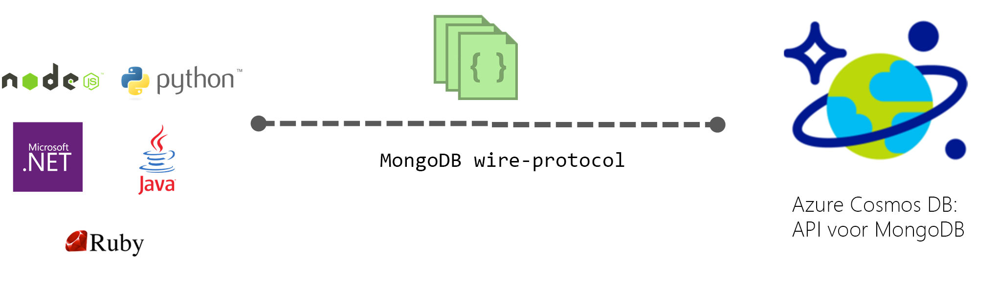

# Inleiding tot Azure Cosmos DB: API voor MongoDB

[Azure Cosmos DB](../cosmos-db/introduction.md) is de wereldwijd gedistribueerde databaseservice met meerdere modellen van Microsoft voor essentiële toepassingen. Azure Cosmos DB biedt [gebruiksklare wereldwijde distributie](distribute-data-globally.md), [elastisch schalen van doorvoer en opslag](partition-data.md), latentie die wereldwijd in het 99e percentiel onder de 10 milliseconden blijft, [vijf goed gedefinieerde consistentieniveaus](consistency-levels.md) en een gegarandeerd hoge beschikbaarheid, allemaal op basis van [toonaangevende serviceovereenkomsten](https://azure.microsoft.com/support/legal/sla/cosmos-db/). Met Azure Cosmos DB worden [gegevens automatisch geïndexeerd](http://www.vldb.org/pvldb/vol8/p1668-shukla.pdf), zonder dat u te maken krijgt met schema- en indexbeheer. Azure Cosmos DB beschikt over meerdere modellen en ondersteunt modellen voor document-, sleutelwaarde-, grafiek- en kolomgegevens. 

 

Azure DB Cosmos-databases kunnen worden gebruikt als gegevensopslag voor apps die zijn geschreven voor [MongoDB](https://docs.mongodb.com/manual/introduction/). Deze functionaliteit betekent dat met behulp van de bestaande [stuurprogramma's](https://docs.mongodb.org/ecosystem/drivers/), uw toepassing geschreven voor MongoDB kan nu met Azure Cosmos DB communiceren en gebruiken van Azure DB die Cosmos-databases in plaats van MongoDB-databases. In veel gevallen kunt u overschakelen van het gebruik van MongoDB bij Azure Cosmos DB door eenvoudigweg een verbindingsreeks. Met deze functionaliteit kunt u gemakkelijk maken en in de MongoDB-databasetoepassingen uitvoeren in Azure cloud met Azure Cosmos DB globale verdeling en [uitgebreide toonaangevende Sla's](https://azure.microsoft.com/support/legal/sla/cosmos-db), maar blijft bekend vaardigheden gebruiken en hulpprogramma's voor MongoDB.

**Compatibiliteit met MongoDB**: U kunt uw bestaande MongoDB-expertise toepassingscode en tooling gebruiken zoals Azure Cosmos DB via het protocol MongoDB 3.4 (versie 5) implementeert en ondersteunt de [MongoDB aggregatie pijplijn](mongodb-feature-support.md#aggregation-pipeline). U kunt ontwikkelen met behulp van MongoDB en deze implementeren in productieomgevingen met een volledig beheerde en globaal gedistribueerde Azure DB die Cosmos-service.

## Wat is het voordeel van het gebruik van Azure DB die Cosmos voor MongoDB toepassingen?

**Elastische schaalbare doorvoer en opslag:** voldoen aan uw toepassingen moeten door te schalen eenvoudig omhoog of omlaag de MongoDB-database. Uw gegevens worden opgeslagen op SSD-schijven (Solid State Disks) voor lage voorspelbare latenties. Azure Cosmos DB ondersteunt MongoDB-verzamelingen die kunnen worden geschaald naar vrijwel onbeperkte opslaggrootte en ingerichte doorvoer. Naarmate uw toepassing groeit, kunt u Azure Cosmos DB probleemloos elastisch schalen met voorspelbare prestaties. 

**Meerdere landen/regio-replicatie:** Azure Cosmos DB transparant uw gegevens worden gerepliceerd naar alle regio's die je hebt gekoppeld aan je account MongoDB, zodat u voor het ontwikkelen van toepassingen waarvoor globale toegang tot gegevens en tegelijkertijd de wisselwerking tussen consistentie, beschikbaarheid en prestaties, met bijbehorende garanties. Azure Cosmos DB biedt transparante regionale failover met multihoming-API's en de mogelijkheid om doorvoer en opslag wereldwijd elastisch te schalen. Meer informatie [Distribueer gegevens globaal](distribute-data-globally.md).

**Er is geen Serverbeheer**: U hoeft te beheren en schalen van uw MongoDB-databases. Azure Cosmos-database is een volledig beheerde service, waardoor u niet beschikt over een infrastructuur of virtuele Machines om zelf te beheren. Azure Cosmos DB is beschikbaar in 30 + [Azure-gebieden](https://azure.microsoft.com/regions/services/).

**Instelbare consistentieniveaus:** selecteer een van de vijf goed gedefinieerde consistentieniveaus voor een optimale balans tussen consistentie en prestaties. Voor query's en leesbewerkingen biedt Azure Cosmos DB vijf verschillende consistentieniveaus: sterk, gebonden-verouderd, sessie, consistent voorvoegsel en mogelijk. Op basis van deze gedetailleerde, goed gedefinieerde consistentieniveaus kunt u een goede balans vinden tussen de consistentie, beschikbaarheid en latentie. Zie [Consistentieniveaus gebruiken om de beschikbaarheid en prestaties te maximaliseren](consistency-levels.md) voor meer informatie.

**Automatische indexering**: standaard Azure Cosmos DB indexeert automatisch alle de documenten in uw MongoDB-eigenschappen van de database en niet verwacht of vereist een schema of het maken van secundaire indexen. De unieke index mogelijkheid kunt bovendien een UNIQUE-beperking voor alle documentvelden die al automatisch geïndexeerd in Azure Cosmos DB zijn.

**Enterprise hoogwaardige**: Azure Cosmos DB ondersteunt meerdere lokale replica's voor het leveren van 99,99% beschikbaarheid en gegevensbescherming, met betrekking tot lokale en regionale fouten. Azure Cosmos DB heeft enterprise hoogwaardige [naleving certificeringen](https://www.microsoft.com/trustcenter) en beveiligingsfuncties. 

Meer informatie in deze video met Azure Cosmos DB Senior Program Manager, Aleksey Savateyev.

> [!VIDEO https://channel9.msdn.com/Events/Connect/2017/T136/player]
> 

## Hoe gaat u aan de slag

Ga als volgt de MongoDB-snelstartgidsen voor het maken van een Cosmos-DB Azure-account en uw bestaande MongoDB-toepassing voor het gebruik van Azure DB die Cosmos migreren of een nieuwe wilt bouwen:

* [Migreren van een bestaande Node.js MongoDB-web-app](create-mongodb-nodejs.md).
* [Een web-App voor MongoDB-API met .NET- en de Azure-portal](create-mongodb-dotnet.md)
* [Maken van een console-app van de MongoDB-API met Java en de Azure-portal](create-mongodb-java.md)

## Volgende stappen

Informatie over Azure Cosmos DB MongoDB-API is geïntegreerd in de algehele Azure DB die Cosmos-documentatie, maar hier zijn enkele verwijzingen naar u op weg:

* Ga als volgt de [verbinding maken met een account MongoDB](connect-mongodb-account.md) zelfstudie voor informatie over het ophalen van de verbindingsinformatie voor uw account.
* Ga als volgt de [gebruik Studio 3T (MongoChef) met Azure Cosmos DB](mongodb-mongochef.md) zelfstudie voor informatie over het maken van een verbinding tussen uw Azure DB die Cosmos-database en de MongoDB-app in Studio 3 T.
* Ga als volgt de [gegevens voor het migreren naar Azure Cosmos DB met het protocol ondersteunen voor MongoDB](mongodb-migrate.md) zelfstudie voor het importeren van uw gegevens naar een API voor MongoDB-database.
* Verbinding maken met een API voor het gebruik van MongoDB-account [Robomongo](mongodb-robomongo.md).
* Meer informatie over hoeveel RUs van uw bewerkingen met gebruikmaakt de [GetLastRequestStatistics opdracht en de Azure portal metrische gegevens](request-units.md#GetLastRequestStatistics).
* Meer informatie over hoe [lezen voorkeuren voor globaal gedistribueerde apps configureren](../cosmos-db/tutorial-global-distribution-mongodb.md).
