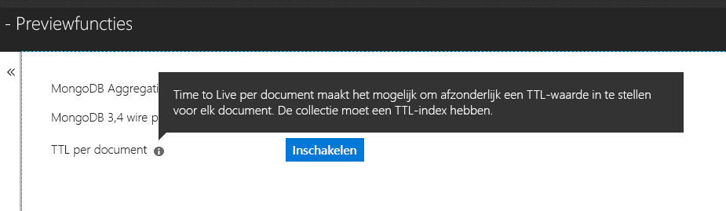

# <a name="expire-data-with-azure-cosmos-dbs-api-for-mongodb"></a>Gegevens automatisch laten verlopen met de Azure Cosmos DB-API voor MongoDB

TTL-functionaliteit (Time-To-Live) is een voorziening om gegevens in een database automatisch te laten verlopen. De Azure Cosmos DB-API voor MongoDB maakt gebruik van de belangrijkste TTL-kenmerken van Cosmos DB. Er worden twee modi ondersteund: het instellen van een standaard-TTL-waarde voor de hele verzameling en het instellen van afzonderlijke TTL-waarden voor elk document. De achterliggende logica van TTL-indexen en TTL-waarden per document in de Cosmos DB-API voor MongoDB is [hetzelfde als die in Cosmos DB](../cosmos-db/mongodb-indexing.md).

## <a name="ttl-indexes"></a>TTL indexen
Als u TTL universeel wilt instellen voor een verzameling, moet u een [TTL-index (Time-To-Live)](../cosmos-db/mongodb-indexing.md) maken. De TTL-index is een index van het veld _ts met een waarde voor 'expireAfterSeconds'.

Voorbeeld:
```JavaScript
globaldb:PRIMARY> db.coll.createIndex({"_ts":1}, {expireAfterSeconds: 10})
{
        "_t" : "CreateIndexesResponse",
        "ok" : 1,
        "createdCollectionAutomatically" : true,
        "numIndexesBefore" : 1,
        "numIndexesAfter" : 4
}
```

Met de opdracht in het bovenstaande voorbeeld wordt een index met TTL-functionaliteit gemaakt. Zodra de index is gemaakt, worden documenten in die verzameling die in de afgelopen 10 seconden niet zijn gewijzigd, automatisch verwijderd uit de database. 

> [!NOTE]
> **_ts** is een veld dat specifiek is voor Cosmos DB en dat niet toegankelijk is vanuit MongoDB-clients. Het is een gereserveerde eigenschap (systeemeigenschap) met het tijdstempel van de laatste wijziging van het document.
>
    
En een voorbeeld met C#: 

```csharp
var options = new CreateIndexOptions {ExpireAfter = TimeSpan.FromSeconds(10)}; 
var field = new StringFieldDefinition<BsonDocument>("_ts"); 
var indexDefinition = new IndexKeysDefinitionBuilder<BsonDocument>().Ascending(field); 
await collection.Indexes.CreateOneAsync(indexDefinition, options); 
``` 

## <a name="set-time-to-live-value-for-a-document"></a>TTL-waarde voor een document instellen 
U kunt ook TTL-waarden per document instellen. Het document moet een eigenschap 'ttl' (kleine letters) op hoofdniveau bevatten en er moet voor deze verzameling een TTL-index zijn gemaakt zoals hierboven is beschreven. TTL-waarden die op documentniveau zijn ingesteld, vervangen de TTL-waarde van de verzameling.

De TTL-waarde moet van het type int32 zijn. Alternatieven zijn een int64 die past in een int32 of een double zonder cijfers achter het decimaalteken die past in een int32. Waarden voor de TTL-eigenschap die niet aan deze specificaties voldoen, zijn toegestaan maar worden niet beschouwd als een geldige TTL-waarde voor een document.

De TTL-waarde voor het document is optioneel. Er kunnen ook documenten zonder een TTL-waarde worden ingevoegd in de verzameling.  In dit geval wordt de TTL-waarde van de verzameling gebruikt. 

De volgende documenten hebben geldige TTL waarden. Zodra de documenten zijn ingevoegd, vervangen de TTL-waarden van het document de TTL-waarden van de verzameling. Dit houdt in dat de documenten na 20 seconden worden verwijderd.   

```JavaScript 
globaldb:PRIMARY> db.coll.insert({id:1, location: "Paris", ttl: 20.0}) 
globaldb:PRIMARY> db.coll.insert({id:1, location: "Paris", ttl: NumberInt(20)}) 
globaldb:PRIMARY> db.coll.insert({id:1, location: "Paris", ttl: NumberLong(20)}) 
```

De volgende documenten hebben ongeldige TTL waarden. De documenten worden ingevoegd, maar de TTL-waarde van de documenten worden niet gebruikt. Dit betekent dat de documenten na tien seconden worden verwijderd omdat de TTL van de verzameling is ingesteld op 10. 

```JavaScript 
globaldb:PRIMARY> db.coll.insert({id:1, location: "Paris", ttl: 20.5}) //TTL value contains non-zero decimal part. 
globaldb:PRIMARY> db.coll.insert({id:1, location: "Paris", ttl: NumberLong(2147483649)}) //TTL value is greater than Int32.MaxValue (2,147,483,648). 
``` 

## <a name="how-to-activate-the-per-document-ttl-feature"></a>TTL per document activeren

TTL per document kan worden geactiveerd met de Azure Cosmos DB-API voor MongoDB.

 

## <a name="next-steps"></a>Volgende stappen
* [Gegevens in Azure Cosmos DB automatisch laten verlopen met TTL](../cosmos-db/time-to-live.md)
* [Cosmos-databases indexeren die zijn geconfigureerd met de Azure Cosmos DB-API voor MongoDB](../cosmos-db/mongodb-indexing.md)
