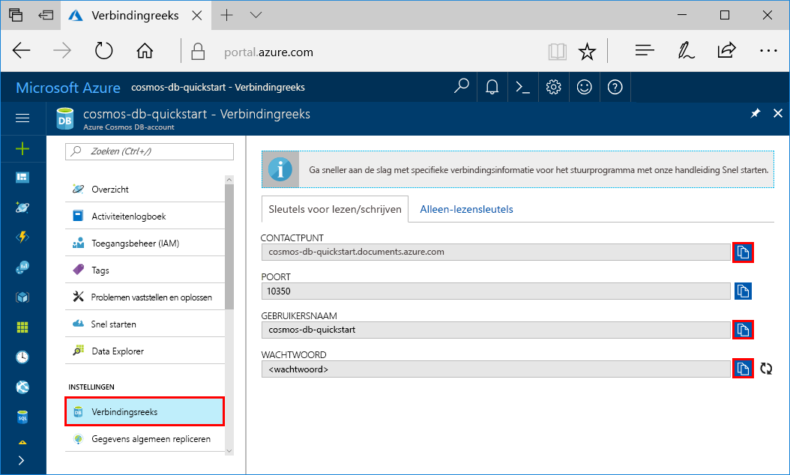

# <a name="azure-cosmosdb-develop-with-the-cassandra-api-in-java"></a>Azure CosmosDB: Ontwikkelen met de Cassandra API in Java

Azure Cosmos-database is de service van Microsoft wereldwijd gedistribueerde database voor meerdere model. U kunt snel databases maken van documenten, sleutel/waarde-paren en grafen en hier query’s op uitvoeren. Deze databases genieten allemaal het voordeel van de wereldwijde distributie en horizontale schaalmogelijkheden die ten grondslag liggen aan Azure Cosmos DB. 

Deze zelfstudie laat zien hoe u een Azure DB die Cosmos-account maken met de Azure-portal en maak vervolgens een Cassandra Table(sql-api-partition-data.md#partition-keys) met de [Cassandra API](cassandra-introduction.md). Als u een primaire sleutel bij het maken van een tabel, wordt uw toepassing voorbereid moeiteloos schalen als uw gegevens groeit. 

Deze zelfstudie bevat de volgende taken met behulp van de API Cassandra:

> [!div class="checklist"]
> * Maak een Azure Cosmos DB-account
> * Een keyspace en een tabel met een primaire sleutel maken
> * Gegevens invoegen
> * Querygegevens
> * Sla's bekijken

## <a name="prerequisites"></a>Vereisten

Toegang tot de API van Azure Cosmos DB Cassandra preview-programma. Als u nog niet voor toegang tot toegepast [nu aanmelden](https://aka.ms/cosmosdb-cassandra-signup).

[!INCLUDE [quickstarts-free-trial-note](../../includes/quickstarts-free-trial-note.md)]U kunt ook [gratis Azure Cosmos DB probeer](https://azure.microsoft.com/try/cosmosdb/) gratis verbintenissen en zonder een Azure-abonnement.

Daarnaast doet u het volgende: 

* [Java Development Kit (JDK) 1.7+](http://www.oracle.com/technetwork/java/javase/downloads/jdk8-downloads-2133151.html)
    * Voer op Ubuntu `apt-get install default-jdk` uit om de JDK te installeren.
    * Zorg dat de omgevingsvariabele JAVA_HOME verwijst naar de map waarin de JDK is geïnstalleerd.
* [Download](http://maven.apache.org/download.cgi) en [installeer](http://maven.apache.org/install.html) een binair [Maven](http://maven.apache.org/)-archief
    * Op Ubuntu kunt u `apt-get install maven` uitvoeren om Maven te installeren.
* [Git](https://www.git-scm.com/)
    * Op Ubuntu kunt u `sudo apt-get install git` uitvoeren om Git te installeren.

## <a name="create-a-database-account"></a>Een databaseaccount maken

Voordat u een documentdatabase maken kunt, moet u een Cassandra-account maken met Azure Cosmos DB.

[!INCLUDE [cosmos-db-create-dbaccount-cassandra](../../includes/cosmos-db-create-dbaccount-cassandra.md)]

## <a name="clone-the-sample-application"></a>De voorbeeldtoepassing klonen

Nu gaan we werken met code. We gaan een app Cassandra vanuit GitHub, de verbindingsreeks instellen en voer dit klonen. U zult zien hoe gemakkelijk het is om op een programmatische manier met gegevens te werken. 

1. Open een git-terminalvenster, bijvoorbeeld git bash, en gebruik de `cd`-opdracht om naar een map te gaan voor het installeren van de voorbeeld-app. 

    ```bash
    cd "C:\git-samples"
    ```

2. Voer de volgende opdracht uit om de voorbeeldopslagplaats te klonen. Deze opdracht maakt een kopie van de voorbeeld-app op uw computer.

    ```bash
    git clone https://github.com/Azure-Samples/azure-cosmos-db-cassandra-java-getting-started.git
    ```

## <a name="review-the-code"></a>De code bekijken

Deze stap is optioneel. Als u wilt weten hoe de databaseresources in de code worden gemaakt, kunt u de volgende codefragmenten bekijken. Als u deze stap wilt overslaan, kunt u verdergaan naar [Uw verbindingsgegevens bijwerken](#update-your-connection-string). Deze fragmenten worden genomen van de src/main/java/com/azure/cosmosdb/cassandra/util/CassandraUtils.java.  

* Cassandra host, poort, gebruikersnaam, wachtwoord en SSL-opties worden ingesteld. De verbindingsinformatie komt uit de pagina van de tekenreeks verbinding in de Azure portal.

   ```java
   cluster = Cluster.builder().addContactPoint(cassandraHost).withPort(cassandraPort).withCredentials(cassandraUsername, cassandraPassword).withSSL(sslOptions).build();
   ```

* De `cluster` maakt verbinding met de Azure-API voor Cassandra Cosmos DB en retourneert een sessie voor toegang tot.

    ```java
    return cluster.connect();
    ```

De volgende codefragmenten zijn uit het bestand src/main/java/com/azure/cosmosdb/cassandra/repository/UserRepository.java.

* Maak een nieuwe keyspace.

    ```java
    public void createKeyspace() {
        final String query = "CREATE KEYSPACE IF NOT EXISTS uprofile WITH replication = {'class': 'SimpleStrategy', 'replication_factor': '3' } ";
        session.execute(query);
        LOGGER.info("Created keyspace 'uprofile'");
    }
    ```

* Een nieuwe tabel maken.

   ```java
   public void createTable() {
        final String query = "CREATE TABLE IF NOT EXISTS uprofile.user (user_id int PRIMARY KEY, user_name text, user_bcity text)";
        session.execute(query);
        LOGGER.info("Created table 'user'");
   }
   ```

* Gebruiker entiteiten met een voorbereide instructie-object worden ingevoegd.

    ```java
    public PreparedStatement prepareInsertStatement() {
        final String insertStatement = "INSERT INTO  uprofile.user (user_id, user_name , user_bcity) VALUES (?,?,?)";
        return session.prepare(insertStatement);
    }

    public void insertUser(PreparedStatement statement, int id, String name, String city) {
        BoundStatement boundStatement = new BoundStatement(statement);
        session.execute(boundStatement.bind(id, name, city));
    }
    ```

* De query voor het ophalen van alle gebruikersgegevens.

    ```java
   public void selectAllUsers() {
        final String query = "SELECT * FROM uprofile.user";
        List<Row> rows = session.execute(query).all();

        for (Row row : rows) {
            LOGGER.info("Obtained row: {} | {} | {} ", row.getInt("user_id"), row.getString("user_name"), row.getString("user_bcity"));
        }
    }
    ```

* Query uitvoeren voor een enkele gebruiker informatie.

    ```java
    public void selectUser(int id) {
        final String query = "SELECT * FROM uprofile.user where user_id = 3";
        Row row = session.execute(query).one();

        LOGGER.info("Obtained row: {} | {} | {} ", row.getInt("user_id"), row.getString("user_name"), row.getString("user_bcity"));
    }
    ```

## <a name="update-your-connection-string"></a>Uw verbindingsreeks bijwerken

Ga nu terug naar Azure Portal om de verbindingsreeksinformatie op te halen en kopieer deze in de app. Hierdoor kan uw app kan communiceren met uw gehoste-database.

1. In de [Azure-portal](http://portal.azure.com/), klikt u op **verbindingsreeks**. 

    

2. Gebruik de  knop aan de rechterkant van het scherm om de waarde van de punt van CONTACT te kopiëren.

3. Open de `config.properties` bestand vanuit de map C:\git-samples\azure-cosmosdb-cassandra-java-getting-started\java-examples\src\main\resources. 

3. De waarde van het punt van CONTACT vanuit de portal via plakken `<Cassandra endpoint host>` op regel 2.

    Regel 2 van config.properties nu zijn vergelijkbaar met 

    `cassandra_host=cosmos-db-quickstarts.documents.azure.com`

3. Ga terug naar de portal en kopieer de waarde van de gebruikersnaam. Na de waarde van de gebruikersnaam van de portal via `<cassandra endpoint username>` op regel 4.

    Regel 4 van config.properties nu zijn vergelijkbaar met 

    `cassandra_username=cosmos-db-quickstart`

4. Ga terug naar de portal en kopieer de waarde van het wachtwoord. De waarde van het wachtwoord van de portal via plakken `<cassandra endpoint password>` op regel 5.

    Regel 5 van config.properties nu zijn vergelijkbaar met 

    `cassandra_password=2Ggkr662ifxz2Mg...==`

5. Op de regel 6, als u een specifieke SSL-certificaat gebruiken wilt, vervangt `<SSL key store file location>` met de locatie van het SSL-certificaat. Als een waarde niet is opgegeven, wordt het JDK certificaat geïnstalleerd op < JAVA_HOME >/jre/lib/beveiliging/cacerts gebruikt. 

6. Als u gewijzigd regel 6 een specifieke SSL-certificaat te gebruiken, bijwerken regel 7 het wachtwoord voor dat certificaat gebruiken. 

7. Sla het bestand config.properties.

## <a name="run-the-app"></a>De app uitvoeren

1. In het terminalvenster git `cd` naar de map azure-cosmosdb-cassandra-java-getting-started\java-examples.

    ```git
    cd "C:\git-samples\azure-cosmosdb-cassandra-java-getting-started\java-examples"
    ```

2. Gebruik de volgende opdracht voor het genereren van het bestand cosmosdb-cassandra-examples.jar in het venster van de git-terminal.

    ```git
    mvn clean install
    ```

3. Voer de volgende opdracht om de Java-toepassing te starten in het venster van de git-terminal.

    ```git
    java -cp target/cosmosdb-cassandra-examples.jar com.azure.cosmosdb.cassandra.examples.UserProfile
    ```

    Het terminalvenster weergegeven meldingen de keyspace en de tabel worden gemaakt. Vervolgens selecteert en retourneert alle gebruikers in de tabel en de uitvoer wordt weergegeven, en vervolgens selecteert een rij door id en wordt de waarde weergegeven.  
    
    U kunt nu teruggaan naar Data Explorer en deze nieuwe gegevens bekijken, wijzigen, een query erop uitvoeren of er iets anders mee doen. 

## <a name="review-slas-in-the-azure-portal"></a>SLA’s bekijken in Azure Portal

[!INCLUDE [cosmosdb-tutorial-review-slas](../../includes/cosmos-db-tutorial-review-slas.md)]

## <a name="clean-up-resources"></a>Resources opschonen

[!INCLUDE [cosmosdb-delete-resource-group](../../includes/cosmos-db-delete-resource-group.md)]

## <a name="next-steps"></a>Volgende stappen

In deze snelstartgids hebt u geleerd hoe u het volgende doen:

> [!div class="checklist"]
> * Maak een Azure Cosmos DB-account
> * Een keyspace en een tabel met een primaire sleutel maken
> * Gegevens invoegen
> * Querygegevens
> * Sla's bekijken

U kunt nu aanvullende gegevens importeren in uw Azure DB die Cosmos-verzameling. 

> [!div class="nextstepaction"]
> [Cassandra gegevens importeren in Azure Cosmos-DB](cassandra-import-data.md)
