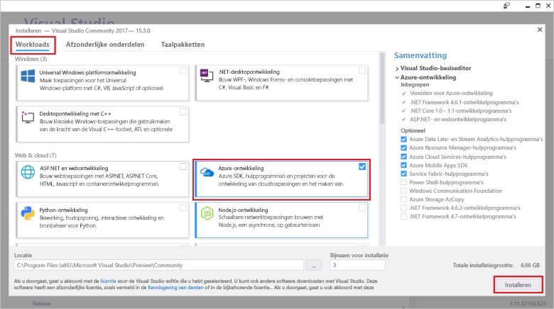

# <a name="create-an-azure-functions-http-trigger-with-an-azure-cosmos-db-input-binding"></a>De trigger van een HTTP-functies van Azure maken met een binding van Azure DB die Cosmos-invoer

Azure Cosmos-database is een globaal gedistribueerd en modellen database schemaloos en zonder server. Azure-functie is een zonder server compute-service waarmee u code op aanvraag uitvoeren. Koppel van deze twee Azure-services en u hebt de basis voor een zonder server architectuur waarmee u zich kunt richten op geweldige apps ontwikkelen en u geen zorgen over inrichten en beheren van servers voor uw berekenings en -database moet.

Deze zelfstudie bouwt voort op de code die is gemaakt in de [Graph API Quick Start voor .NET](create-graph-dotnet.md). Deze zelfstudie wordt een Azure-functie met een [HTTP-trigger](https://github.com/MicrosoftDocs/azure-docs-pr/azure-functions/functions-bindings-http-webhook.md#http-trigger). De HTTP-trigger gebruikt een Cosmos Azure DB [invoer binding](https://github.com/MicrosoftDocs/azure-docs-pr/azure-functions/functions-triggers-bindings.md) gegevens ophalen uit de database van de grafiek in de Quick Start hebt gemaakt. Deze bepaalde HTTP-trigger voert een query Azure Cosmos DB voor gegevens, maar de invoer bindingen van Azure DB die Cosmos kunnen worden gebruikt voor het ophalen van gegevens invoerwaarden voor wat de functie vereist.

Deze zelfstudie bevat de volgende taken:

> [!div class="checklist"]
> * Een Azure-functie-project maken 
> * Maken van een HTTP-trigger
> * De functie Azure publiceren
> * De functie Azure verbinding met de Azure DB die Cosmos-database

## <a name="prerequisites"></a>Vereisten

- [Visual Studio 2017 versie 15.3](https://www.visualstudio.com/vs/preview/), waaronder de **Azure-ontwikkelworkload**.

    
    
- Na het installeren of upgraden naar Visual Studio 2017 versie 15,3, moet u handmatig de 2017 van Visual Studio-hulpprogramma's voor Azure Functions bijwerken. U kunt de hulpprogramma's van bijwerken de **extra** menu onder **uitbreidingen en Updates...**   >  **Updates** > **Visual Studio Marketplace** > **Azure Functions en Web extra taken** > **Update**.

- Voltooi de [bouwen van een .NET-toepassing met behulp van de Graph API](tutorial-develop-graph-dotnet.md) zelfstudie of get in het voorbeeld van code de [azure-cosmos-db-graph-dotnet-getting-started](https://github.com/Azure-Samples/azure-cosmos-db-graph-dotnet-getting-started) GitHub-repo- en bouw het project.
 
## <a name="build-a-function-in-visual-studio"></a>Een functie in Visual Studio wilt bouwen

1. Add een **Azure Functions** project om uw oplossing door met de rechtermuisknop op het knooppunt van de oplossing in **Solution Explorer**, het Kies **toevoegen**  >   **Nieuw Project**. Kies **Azure Functions** in het dialoogvenster vak en noem deze **PeopleDataFunctions**.

   

2. Nadat u de Azure Functions-project maken, er zijn enkele NuGet gerelateerde updates en installeert om uit te voeren. 

    a. Om te zorgen dat u de nieuwste functies SDK hebt, kunt u NuGet Manager gebruiken om bij te werken de **Microsoft.NET.Sdk.Functions** pakket. In **Solution Explorer**, met de rechtermuisknop op het project en selecteer **NuGet-pakketten beheren**. In de **geïnstalleerde** tabblad, Microsoft.NET.Sdk.Functions selecteren en klik op **Update**.

   

    b. In de **Bladeren** tabblad **azure.graphs** vinden de **Microsoft.Azure.Graphs** van het pakket en klik vervolgens op **installeren**. Dit pakket bevat de Graph API .NET Client SDK.

   

    c. In de **Bladeren** tabblad **mono.csharp** vinden de **Mono.CSharp** van het pakket en klik vervolgens op **installeren**.

   

3. Uw Solution Explorer bevatten moet nu de pakketten die u hebt geïnstalleerd, zoals hier wordt weergegeven. 
   
   Vervolgens moet schrijven van code, dus gaan we een nieuwe toevoegen **Azure-functie** item aan het project. 

    a. Klik op de rechtermuisknop op het projectknooppunt in **Solution Explorer** en kies  > **Nieuw item****Toevoegen**.   
    b. In de **Add New Item** dialoogvenster, selecteer **Visual C# Items**, selecteer **Azure-functie**, type **Search** als de naam voor uw project en vervolgens Klik op **toevoegen**.  
 
   

4. De functie Azure reageert op HTTP-aanvragen, zodat de HTTP-trigger-sjabloon hier geschikt is.
   
   In de **nieuwe Azure-functie** de optie **Http-trigger**. We willen deze Azure-functie worden ook 'breed open', zodat we instellen de **toegangsrechten** naar **anoniem**, waarmee iedereen via. Klik op **OK**.

   

5. Nadat u Search.cs aan het project Azure-functie toevoegt, kopieert u deze **met** instructies via de bestaande using-instructies:

   ```csharp
   using Microsoft.Azure.Documents;
   using Microsoft.Azure.Documents.Client;
   using Microsoft.Azure.Documents.Linq;
   using Microsoft.Azure.Graphs;
   using Microsoft.Azure.WebJobs;
   using Microsoft.Azure.WebJobs.Extensions.Http;
   using Microsoft.Azure.WebJobs.Host;
   using System;
   using System.Collections.Generic;
   using System.Configuration;
   using System.Linq;
   using System.Net;
   using System.Net.Http;
   using System.Threading.Tasks;
   ```

6. Vervolgens moet u de Azure-functie klassecode vervangen door hieronder de code. De code zoekt u de Azure DB die Cosmos-database met behulp van de Graph API voor beide alle personen of voor de specifieke persoon geïdentificeerd door de `name` querytekenreeksparameter.

   ```csharp
   public static class Search
   {
       static string endpoint = ConfigurationManager.AppSettings["Endpoint"];
       static string authKey = ConfigurationManager.AppSettings["AuthKey"];

       [FunctionName("Search")]
       public static async Task<HttpResponseMessage> Run(
           [HttpTrigger(AuthorizationLevel.Anonymous, "get", "post", Route = null)]HttpRequestMessage req,
           TraceWriter log)
       {
           log.Info("C# HTTP trigger function processed a request.");

           // the person objects are free-form in structure
           List<dynamic> results = new List<dynamic>();

           // open the client's connection
           using (DocumentClient client = new DocumentClient(
               new Uri(endpoint),
               authKey,
               new ConnectionPolicy
               {
                   ConnectionMode = ConnectionMode.Direct,
                   ConnectionProtocol = Protocol.Tcp
               }))
           {
               // get a reference to the database the console app created
               Database database = await client.CreateDatabaseIfNotExistsAsync(
                   new Database
                   {
                       Id = "graphdb"
                   });

               // get an instance of the database's graph
               DocumentCollection graph = await client.CreateDocumentCollectionIfNotExistsAsync(
                   UriFactory.CreateDatabaseUri("graphdb"),
                   new DocumentCollection { Id = "graphcollz" },
                   new RequestOptions { OfferThroughput = 1000 });

               // build a gremlin query based on the existence of a name parameter
               string name = req.GetQueryNameValuePairs()
                   .FirstOrDefault(q => string.Compare(q.Key, "name", true) == 0)
                   .Value;

               IDocumentQuery<dynamic> query = (!String.IsNullOrEmpty(name))
                   ? client.CreateGremlinQuery<dynamic>(graph, string.Format("g.V('{0}')", name))
                   : client.CreateGremlinQuery<dynamic>(graph, "g.V()");

               // iterate over all the results and add them to the list
               while (query.HasMoreResults)
                   foreach (dynamic result in await query.ExecuteNextAsync())
                       results.Add(result);
           }

           // return the list with an OK response
           return req.CreateResponse<List<dynamic>>(HttpStatusCode.OK, results);
       }
   }
   ```

   De code is in feite dezelfde verbinding logica zoals in de oorspronkelijke consoletoepassing die seeding van de database, met een eenvoudige query voor het ophalen van de overeenkomende records.

## <a name="debug-the-azure-function-locally"></a>Fouten opsporen in de Azure-functie lokaal

Nu dat de code voltooid is, kunt u de Azure-functie lokale hulpprogramma's voor foutopsporing en emulator om uit te voeren van de code lokaal te testen.

1. Voordat u de code correct wordt uitgevoerd, moet u deze configureren voor lokale uitvoering met uw Azure Cosmos DB-verbindingsgegevens. U kunt het bestand local.settings.json gebruiken voor het configureren van de Azure-functie voor lokale uitvoering veel op dezelfde manier zou u het bestand App.config om te configureren van de oorspronkelijke consoletoepassing voor uitvoering.

    U doet dit door de volgende regels code toevoegen aan local.settings.json en kopieer uw eindpunt en AuthKey in het bestand App.Config in het project GraphGetStarted zoals weergegeven in de volgende afbeelding.

   ```json
    "Endpoint": "",
    "AuthKey": ""
    ```

   

2. Opstartproject in de nieuwe functies app wijzigen. In **Solution Explorer**, met de rechtermuisknop op **PeopleDataFunctions**, en selecteer **instellen als opstartproject**.

3. In **Solution Explorer**, klik met de rechtermuisknop **afhankelijkheden** in de **PeopleDataFunctions** project en klik vervolgens op **verwijzing toevoegen**. Selecteer de System.Configuration uit de lijst en klik vervolgens op **OK**.

3. Nu gaan we de app uitvoeren. Druk op F5 om te starten van de lokale foutopsporingsprogramma func.exe met de Azure-functie code gehoste en klaar voor gebruik.

   Aan het einde van de uitvoer van de eerste van func.exe ziet u dat Azure-functie wordt gehost op localhost:7071. Dit is handig om te testen in een client.

   

4. U kunt de Azure-functie testen met [Visual Studio Code](http://code.visualstudio.com/) met de extensie van Huachao Mao, [REST Client](https://marketplace.visualstudio.com/items?itemName=humao.rest-client). REST-Client biedt lokale of externe HTTP-aanvraag mogelijkheid in een enkele klik met de rechtermuisknop. 

    U doet dit door een nieuw bestand met de naam test-functie-locally.http maken en voeg de volgende code:

    ```http
    get http://localhost:7071/api/Search

    get http://localhost:7071/api/Search?name=ben
   ```

    Nu met de rechtermuisknop op de eerste coderegel en selecteer vervolgens **aanvraag verzenden** zoals weergegeven in de volgende afbeelding.

   

   Krijgt u de onbewerkte HTTP-antwoord uit de headers van de Azure-functie lokaal worden uitgevoerd, inhoud van de JSON-hoofdtekst, alles.

   

5. De tweede regel code nu selecteren en selecteer vervolgens **aanvraag verzenden**. Doordat de `name` Querytekenreeksparameter met een waarde die zich in de database, we kunnen de resultaten filteren de Azure-functie retourneert.

   

Nadat de Azure-functie wordt gevalideerd en lijkt correct te werken, is de laatste stap om te publiceren naar Azure App Service en configureer deze in de cloud uit te voeren.

## <a name="publish-the-azure-function"></a>De functie Azure publiceren

1. In **Solution Explorer**, met de rechtermuisknop op het project en selecteer vervolgens **publiceren**.

   

2. Kunt u dit publiceren naar de cloud te testen in een openbaar scenario. In de **publiceren** tabblad **Azure functie-App**, selecteer **nieuw** voor het maken van een Azure-functie in uw Azure-abonnement, klik vervolgens op **publiceren** .

   

3. In de **publiceren** dialoogvenster het volgende doen:
   
    a. In **Appnaam**, een unieke naam voor de functie geven.

    b. In **abonnement**, selecteer de Azure-abonnement te gebruiken.
   
    c. In **resourcegroep**, maakt u een nieuwe resourcegroep en gebruik dezelfde naam als de naam van de app.
   
    d. Voor **App Service-Plan**, klikt u op **nieuw** te maken van een nieuwe op basis van verbruik App Service-Plan omdat we van plan bent de betalen per gebruik facturering om methode te gebruiken voor de server is niet vereist Azure-functie. Gebruik de standaardinstellingen op de **Configure App Service Plan** pagina en klik vervolgens op **OK**.
   
    e. Voor **Opslagaccount**, ook klikken op **nieuw** een nieuw Opslagaccount met de functie Azure gebruiken wanneer ondersteuning voor Blobs, tabellen of wachtrijen voor het activeren van de uitvoering van andere functies ooit moet maken. Gebruik de standaardinstellingen op de **Opslagaccount** pagina en klik vervolgens op **OK**.

    f. Klik vervolgens op de **maken** knop in het dialoogvenster voor het maken van alle resources in uw Azure-abonnement. Visual Studio downloadt een publicatieprofiel (een eenvoudige XML-bestand) die gebruikmaakt van de volgende keer dat u de code van uw Azure-functie publiceren.

   

    Visual Studio geeft een pagina publiceren die u gebruiken kunt als u wijzigingen aan de functie aanbrengt en moet deze opnieuw te publiceren. U hoeft niet te nu geen actie ondernemen op die pagina.

4. Nadat de Azure-functie is gepubliceerd, gaat u naar de [Azure-portal](https://portal.azure.com/) pagina voor uw Azure-functie. Daar ziet u een koppeling naar de Azure-functie **toepassingsinstellingen**. Deze koppeling voor het configureren van de live Azure-functie voor verbinding met de Azure DB die Cosmos-database met uw gegevens persoon openen.

   

5. Net als eerder in de consoletoepassing App.config-bestand en in de Azure-functie-app local.settings.json bestand, moet u het eindpunt en AuthKey toevoegen aan de Azure DB die Cosmos-database naar de gepubliceerde functie. Op deze manier u nooit om te controleren in de configuratiecode die uw sleutels bevat - u kunt deze configureren in de portal en zorg ervoor dat ze niet zijn opgeslagen in broncodebeheer. Elke waarde toevoegen: klik op de **nieuwe instelling toevoegen** knop, het toevoegen van **eindpunt** en de waarde van app.config, klikt u vervolgens op **toevoegen van nieuwe instelling** opnieuw en voeg **AuthKey**  en uw aangepaste waarde. Nadat u hebt toegevoegd en de waarden opgeslagen, worden uw instellingen moeten eruitzien als in het volgende.

   

6. Zodra de Azure-functie correct is geconfigureerd in uw Azure-abonnement, opnieuw kunt u de uitbreiding van de Visual Studio Code REST Client query uitvoeren op de URL van de openbaar Azure-functie. Deze twee regels code toevoegen aan de test-functie-locally.http en voer vervolgens elke regel om deze functie te testen. De naam van de functie in de URL vervangen door de naam van de functie.

    ```json
    get https://peoplesearchfunction.azurewebsites.net/api/Search

    get https://peoplesearchfunction.azurewebsites.net/api/Search?name=thomas
    ```

    De functie reageert met de gegevens zijn opgehaald uit Azure Cosmos-database.

    


## <a name="next-steps"></a>Volgende stappen

In deze zelfstudie hebt u het volgende gedaan:

> [!div class="checklist"]
> * Een Azure-functie-project gemaakt 
> * Een HTTP-trigger gemaakt
> * De functie Azure gepubliceerd
> * De functie verbinding met de Azure DB die Cosmos-database

U kunt nu doorgaan naar de sectie concepten voor meer informatie over Cosmos-DB.

> [!div class="nextstepaction"]
> [Wereldwijde distributie](distribute-data-globally.md) 

In dit artikel is gebaseerd op een blog van [Bart Gaster van Schemaless & zonder server](http://www.bradygaster.com/category/%20Serverless%20&%20Schemaless) blogreeks. Ga naar zijn blog voor aanvullende berichten in de reeks.
