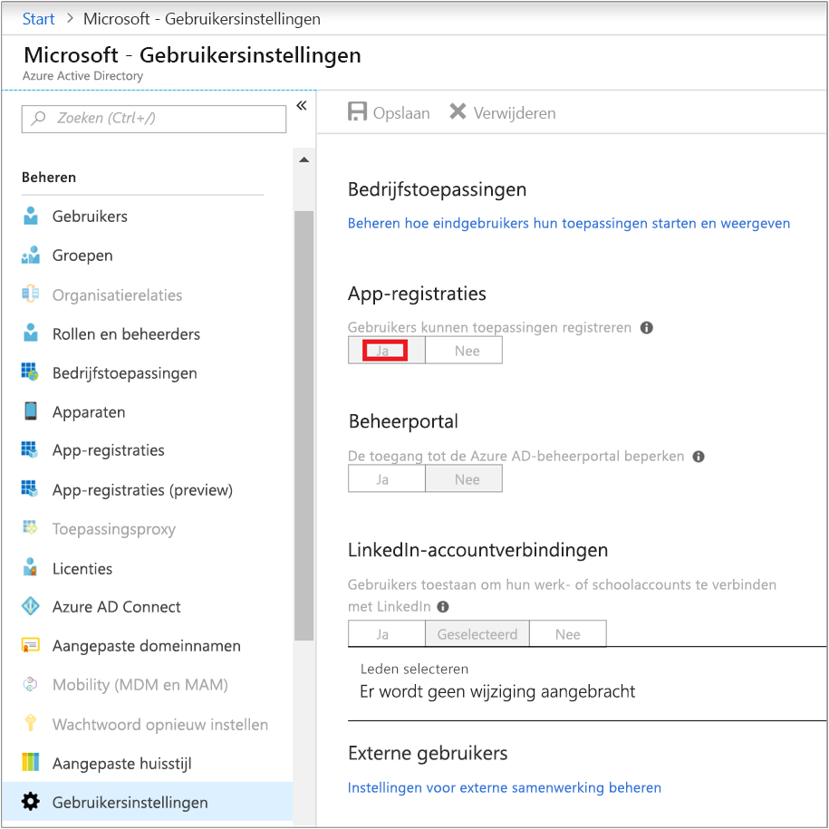
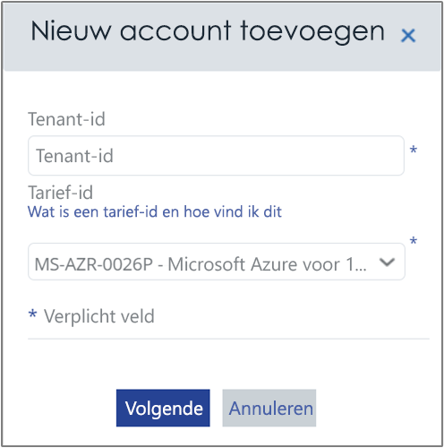
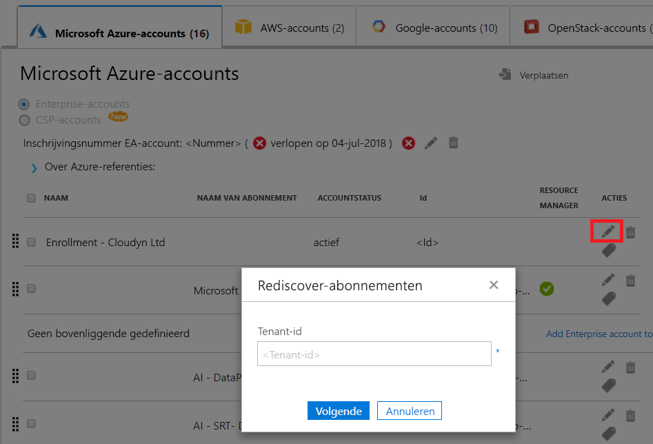

# <a name="activate-azure-subscriptions-and-accounts-with-azure-cost-management"></a>Azure-abonnementen en -accounts activeren met Azure Cost Management

Door het toevoegen of bijwerken van uw referenties van Azure Resource Manager kan Azure Cost Management alle accounts en abonnementen binnen uw Azure-Tenant detecteren. Als ook uw Azure Diagnostics-extensie is ingeschakeld op uw virtuele machines, kan Azure Cost Management uitgebreide metrische gegevens zoals CPU en geheugen verzamelen. In dit artikel wordt beschreven hoe u toegang met Azure Resource Manager-API's mogelijk maakt voor nieuwe en bestaande accounts. Ook wordt beschreven hoe u algemene accountproblemen kunt oplossen.

Azure Cost Management heeft geen toegang tot de meeste gegevens van uw Azure-abonnement wanneer het abonnement _niet geactiveerd_ is. U moet _niet-geactiveerde_ accounts bewerken zodat Azure Cost Management er toegang toe heeft.

## <a name="required-azure-permissions"></a>Vereiste machtigingen voor Azure

Er zijn specifieke machtigingen nodig om de procedures in dit artikel te voltooien. U of uw tenantbeheerder moet beide volgende machtigingen hebben:

- Machtiging voor het registreren van de toepassing CloudynCollector bij uw Azure AD-tenant.
- De mogelijkheid om de toepassing toe te wijzen aan een rol in uw Azure-abonnementen.

Uw Azure-abonnementen moeten uw accounts `Microsoft.Authorization/*/Write` toegang hebben om de toepassing CloudynCollector toe te wijzen. Deze toegang wordt verleend via de rol [Eigenaar](../role-based-access-control/built-in-roles.md#owner) of [Administrator voor gebruikerstoegang](../role-based-access-control/built-in-roles.md#user-access-administrator).

Als uw account is toegewezen aan de rol **Inzender**, hebt u niet voldoende machtiging voor het toewijzen van de toepassing. U ontvangt een fout bij een poging de CloudynCollector-toepassing toe te wijzen aan uw Azure-abonnement.

### <a name="check-azure-active-directory-permissions"></a>Machtigingen voor Azure Active Directory controleren

1. Meld u aan bij de [Azure-portal](https://portal.azure.com).
2. Selecteer in de Azure-portal **Azure Active Directory**.
3. Selecteer in Azure Active Directory, **Gebruikersinstellingen**.
4. Controleer de optie **App-registraties**.
    - Als deze is ingesteld op **Ja**, kunnen de niet-beheerders AD-apps registreren. Deze instelling betekent dat elke gebruiker in de Azure AD-tenant een app kan registreren. U kunt doorgaan met vereiste machtigingen voor Azure-abonnementen.  
    
    - Als de optie **App-registraties** is ingesteld op **Nee**, kunnen alleen tenantbeheerders apps in Azure Active Directory registreren. Uw tenantbeheerder moet de toepassing CloudynCollector registreren.


## <a name="add-an-account-or-update-a-subscription"></a>Een account toevoegen of een abonnement bijwerken

Wanneer u een account updatet een abonnement toevoegt, verleent u Azure Cost Management toegang tot uw Azure-gegevens.

### <a name="add-a-new-account-subscription"></a>Een nieuwe account toevoegen (abonnement)

1. Klik in de Azure Cost Management-portal rechtsboven op het tandwielsymbool en selecteer **Cloud-accounts**.
2. Klik op **Nieuw account toevoegen** en het vak **Nieuw account toevoegen** verschijnt. Voer vereiste gegevens in.  
    

### <a name="update-a-subscription"></a>Een abonnement bijwerken

1. Als u een _niet-geactiveerd_ abonnement wilt bijwerken dat al voorkomt in Azure Cost Management in Account-beheer, klikt u op het potloodsymbool bewerken rechts van de bovenliggende _tenant-GUID_. Abonnementen zijn gegroepeerd onder een bovenliggende tenant, dus vermijd het afzonderlijk activeren van abonnementen.
    
2. Voer, indien nodig, de Tenant-ID in. Als u uw Tenant-ID niet weet, gebruikt u de volgende stappen om die te vinden:
    1. Meld u aan bij [Azure Portal](https://portal.azure.com).
    2. Selecteer in de Azure-portal **Azure Active Directory**.
    3. Haal de tenant-id op door **Eigenschappen** voor uw Azure AD-tenant te selecteren.
    4. Kopieer de map-id-GUID. Deze waarde is uw tenant-id.
    Zie [Tenant-id ophalen](../azure-resource-manager/resource-group-create-service-principal-portal.md#get-tenant-id) voor meer informatie.
3. Selecteer, indien nodig, uw Tarief-id. Als u uw Tenant-id niet weet, gebruikt u de volgende stappen om die te vinden.
    1. Klik in de rechterbovenhoek van de Azure-portal op uw gebruikersgegevens en klik vervolgens op **Mijn factuur weergeven**.
    2. Onder **Factureringsaccount**, klikt u op **Abonnementen**.
    3. Onder **Mijn abonnementen**, selecteert u het abonnement.
    4. De Tarief-id wordt weergegeven onder **Aanbiedings-id**. Kopieer de aanbiedings-id voor het abonnement.
4. Klik in het vak Nieuw account toevoegen (of Abonnement bewerken) op **Opslaan** (of **Volgende**). U wordt omgeleid naar de Azure-portal.
5. Meld u aan bij de portal. Klik op **Accepteren** om Azure Cost Management Collector toegang te geven tot uw Azure-account.

    U bent omgeleid naar de Azure Cost Management-pagina Accounts beheren en uw abonnement wordt bijgewerkt met **actieve** accountstatus. Er moet een groen vinkje worden weergegeven onder de kolom Resource Manager.

    Als u geen groen vinkje ziet voor een of meer van de abonnementen, betekent dit dat u niet bent gemachtigd om de lezer-app (CloudynCollector) te maken voor het abonnement. Een gebruiker met hogere machtigingen voor het abonnement moet dit proces herhalen.

Bekijk de video [Verbinding maken in Azure Resource Manager met Azure Cost Management](https://youtu.be/oCIwvfBB6kk) die bij het proces helpt.

>[!VIDEO https://www.youtube.com/embed/oCIwvfBB6kk?ecver=1]

## <a name="resolve-common-indirect-enterprise-set-up-problems"></a>Oplossen van algemene indirecte installatieproblemen van ondernemingen

Wanneer u de beheerportal van Azure Cost Management voor het eerst gebruikt, ziet u mogelijk de volgende berichten als u een Enterprise Agreement- of Cloud Solution Provider-gebruiker (CSP) bent:

- *De opgegeven API-sleutel is geen inschrijvingssleutel van het hoogste niveau* weergegeven in de wizard **Instellen van Azure Cost Management**.
- *Directe inschrijving – Nee* weergegeven in de Enterprise Agreement-portal.
- *Er zijn geen gebruiksgegevens gevonden voor de afgelopen 30 dagen. Neem contact op met uw leverancier om te controleren of de markering is ingeschakeld voor uw Azure-account* weergegeven in de Azure Cost Management-portal.

De voorgaande berichten geven aan dat u een Azure Enterprise Agreement via een wederverkoper of CSP hebt aangeschaft. Uw wederverkoper of CSP moet _markeren_ inschakelen voor uw Azure-account zodat u uw gegevens kunt weergeven in Azure Cost Management.

Los de problemen als volgt op:

1. Uw wederverkoper moet _markeren_ voor uw account inschakelen. Raadpleeg de [Onboarding-handleiding voor indirecte klanten](https://ea.azure.com/api/v3Help/v2IndirectCustomerOnboardingGuide) voor meer instructies.
2. U genereert de Azure Enterprise Overeenkomst-sleutel om Azure Cost Management te gebruiken. Raadpleeg [Een Azure Enterprise Overeenkomst-sleutel registreren en kostengegevens weergeven](https://docs.microsoft.com/azure/cost-management/quick-register-ea) voor meer instructies.

Voordat u de Azure Enterprise Agreement API-sleutel voor het instellen van Azure Cost Management kunt genereren, moet u de Azure-facturerings-API inschakelen door de instructies te volgen op:

- [Overzicht van Rapportage-API's voor Enterprise-klanten](../billing/billing-enterprise-api.md)
- [Microsoft Azure enterprise portal rapportage-API](https://ea.azure.com/helpdocs/reportingAPI) onder **Gegevenstoegang tot de API inschakelen**

U moet wellicht ook afdelingsbeheerders, accounteigenaars en enterprise-administrators machtigingen geven voor _Kosten weergeven_ met de facturerings-API.

Alleen een Azure-servicebeheerder kan Cost Management inschakelen. Co-beheerdersmachtigingen zijn onvoldoende. U kunt echter de vereiste voor beheerders omzeilen. U kunt uw Azure Active Directory-beheerder vragen u toestemming te geven om de **CloudynAzureCollector** te autoriseren met een PowerShell-script. Het volgende script geeft toestemming om de Azure Active Directory-service-principal **​​CloudynAzureCollector**te registreren.

```
#THE SOFTWARE IS PROVIDED "AS IS", WITHOUT WARRANTY OF ANY KIND, EXPRESS OR IMPLIED, INCLUDING BUT NOT LIMITED TO THE WARRANTIES OF MERCHANTABILITY, FITNESS FOR A PARTICULAR PURPOSE AND NONINFRINGEMENT. IN NO EVENT SHALL THE AUTHORS OR COPYRIGHT HOLDERS BE LIABLE FOR ANY CLAIM, DAMAGES OR OTHER LIABILITY, WHETHER IN AN ACTION OF CONTRACT, TORT OR OTHERWISE, ARISING FROM, OUT OF OR IN CONNECTION WITH THE SOFTWARE OR THE USE OR OTHER DEALINGS IN THE SOFTWARE.

#Tenant - enter your tenant ID or Name
$tenant = "<ReplaceWithYourTenantID>"

#Cloudyn Collector application ID
$appId = "83e638ef-7885-479f-bbe8-9150acccdb3d"

#URL to activate the consent screen
$url = "https://login.windows.net/"+$tenant+"/oauth2/authorize?api-version=1&response_type=code&client_id="+$appId+"&redirect_uri=http%3A%2F%2Flocalhost%3A8080%2FCloudynJava&prompt=consent"

#Choose your browser, the default is Internet Explorer

#Chrome
#[System.Diagnostics.Process]::Start("chrome.exe", "--incognito $url")

#Firefox
#[System.Diagnostics.Process]::Start("firefox.exe","-private-window $url" )

#IExplorer
[System.Diagnostics.Process]::Start("iexplore.exe","$url -private" )

```

## <a name="next-steps"></a>Volgende stappen

- Als u de eerste zelfstudie voor het Cost Management nog niet hebt voltooid, leest u die op [Gebruik en kosten bekijken](tutorial-review-usage.md).
