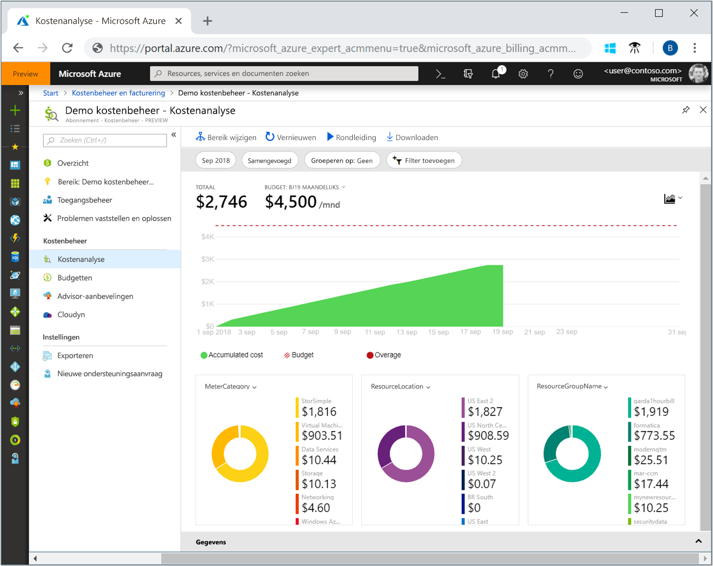
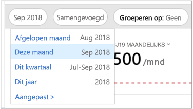
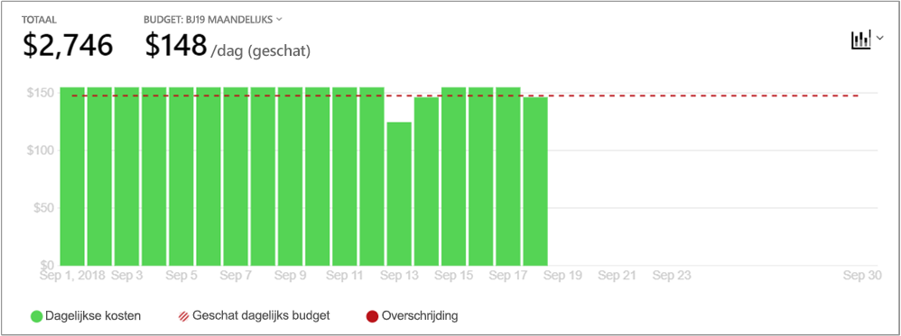
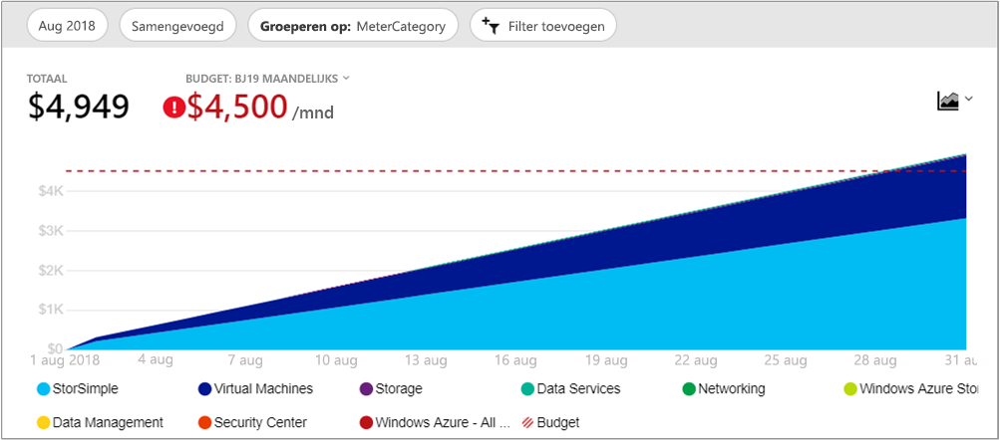
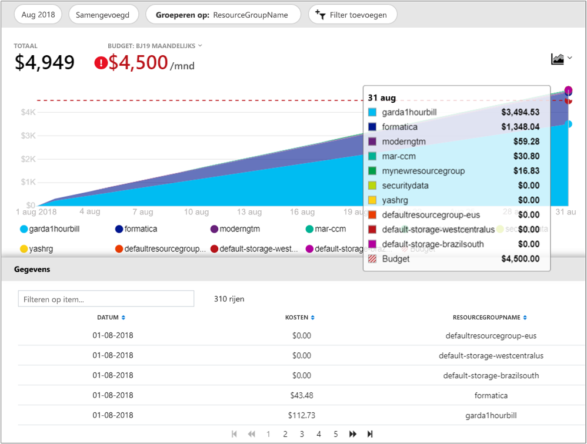

# Snelstart: Kosten verkennen en analyseren met Kostenanalyse

Voordat u de kosten van Azure goed kunt beheren en optimaliseren, moet u de oorsprong van de kosten in uw bedrijf weten. Het is ook handig om te weten hoeveel uw diensten kosten en welke omgevingen en systemen erdoor worden ondersteund. Inzicht in de volle breedte van alle kosten is noodzakelijk om nauwkeurig de uitgavenpatronen van uw bedrijf te leren kennen. Uitgavenpatronen kunnen worden gebruikt om kostenbeheersingsmechanismen als budgetten af te dwingen.

In deze snelstart gebruikt u kostenanalyse om de kosten van Azure voor uw bedrijf te verkennen en te analyseren. U kunt de totale kosten per bedrijf weergeven, zodat u begrijpt waar de kosten worden opgebouwd en uitgavenpatronen kunt identificeren. U kunt de totale kosten bekijken om geschatte kostentrends per maand, per kwartaal en zelfs per jaar naast een budget te leggen. Een budget helpt bij het in acht nemen van financiële beperkingen. En een budget wordt gebruikt om dagelijkse en maandelijkse kosten te bekijken om onregelmatigheden in de uitgaven te isoleren. Plus, u kunt de gegevens van het huidige rapport downloaden voor verdere analyse of om in een extern systeem te gebruiken.

In deze snelstart leert u de volgende zaken:

- Kosten in kostenanalyse beoordelen
- Kostenweergaven aanpassen
- Gegevens van kostenanalyse downloaden

## Vereisten

Kostenanalyse is beschikbaar voor alle klanten met een [Enterprise Overeenkomst (EO)](https://azure.microsoft.com/pricing/enterprise-agreement/). U moet minimaal leestoegang hebben tot een of meer van de volgende bereiken om kostengegevens te kunnen bekijken. Zie [Toegang tot gegevens toewijzen](assign-access-acm-data.md) voor meer informatie over het toewijzen van toegang tot de gegevens in Kostenbeheer.

- Factureringsaccount
- Afdeling
- Inschrijvingsaccount
- Beheergroep
- Abonnement
- Resourcegroep

## Aanmelden bij Azure

- Meld u aan bij Azure Portal op https://portal.azure.com.

## Kosten in kostenanalyse beoordelen

Al u uw kosten met kostenanalyse wilt bekijken, navigeert u in de Azure Portal naar **Kostenbeheer + facturering** &gt; **Kostenbeheer** &gt; **Bereik wijzigen**, kiest u een bereik en klikt u vervolgens op **Selecteren**.

Het bereik dat u selecteert wordt door Cost Management gebruikt om gegevens te bundelen en toegang tot de kostengegevens te beheren. Wanneer u gebruikmaakt van bereiken, moet u geen meervoudige selectie maken. In plaats daarvan selecteert u een groter bereik dat de andere bereiken omvat en filtert u vervolgens wat u wilt. Dit is belangrijk om te begrijpen, omdat bepaalde personen geen toegang mogen hebben in een bovenliggend bereik waartoe een onderliggend bereik behoort.

Klik op **Kostenanalyse openen**.

De initiële kostenanalyseweergave omvat de volgende gebieden:

**Totaal**, toont de totale kosten voor de huidige maand.

**Budget**, toont de geplande uitgavenlimiet voor het geselecteerde bereik, indien beschikbaar.

**Cumulatieve kosten**, toont de totale opgebouwde dagelijkse kosten vanaf het begin van de maand. Nadat u een [budget hebt gemaakt](tutorial-acm-create-budgets.md) voor uw factureringsrekening of abonnement, kunt u snel uw uitgaventrend ten opzichte van het budget bekijken. Beweeg de muisaanwijzer over een datum om de opgebouwde kosten voor die dag te zien.

**Draaigrafieken (ringdiagrammen)**, bieden dynamische draaigrafieken en specificeren de totale kosten, gedetailleerd per algemene standaardeigenschappen. Hiermee ziet u het grootste en kleinste bedrag aan opgebouwde kosten voor de huidige maand. U kunt draaigrafieken op elk moment wijzigen door een andere pivot te selecteren. Kosten worden standaard weergegeven op: service (metercategorie), locatie (regio) en onderliggend bereik. Inschrijvingsaccounts bijvoorbeeld onder factureringsaccounts, resourcegroepen onder abonnementen en bronnen onder brongroepen.

## Kostenweergaven aanpassen

De standaardweergave biedt snel antwoorden op veelgestelde vragen als:

- Hoeveel heb ik uitgegeven?
- Blijf ik binnen mijn budget?

Er zijn echter veel gevallen waar u een meer gedetailleerde analyse nodig hebt. Het aanpassen begint bovenaan de pagina, met de selectie van de datum.

Kostenanalyse toont standaard de gegevens voor de huidige maand. Gebruik de datumselector om snel te schakelen naar: afgelopen maand, deze maand, dit kwartaal, dit jaar of een aangepast datumbereik van uw keuze. De selectie van de laatste maand is de snelste manier om uw laatste Azure-factuur te analyseren en eenvoudig kosten te vergelijken. De opties voor het huidige kwartaal en jaar helpen kosten te traceren voor langeretermijnbudgetten. U kunt ook een ander datumbereik selecteren. U kunt bijvoorbeeld een enkele dag, de afgelopen zeven dagen of een datum die maximaal een jaar vóór de huidige maand valt, kiezen.

Kostenanalyse toont standaard **opgebouwde** kosten. Opgebouwde kosten zijn inclusief alle kosten voor elke dag plus de afgelopen dagen, voor een continu groeiend zicht op uw dagelijks opgebouwde kosten. Deze weergave is geoptimaliseerd om u te laten zien hoe u het doet in verhouding met het budget voor het geselecteerde tijdsbereik.

Er is ook de **dagelijkse** weergave die de kosten voor elke dag toont. De dagelijkse weergave toont geen groeitrend. De weergave is ontworpen om u onregelmatigheden als pieken of dalen in de kosten per dag te laten zien. Als u een budget hebt geselecteerd, toont de dagelijkse weergave ook een schatting van hoe uw dagelijkse budget eruit zou kunnen zien. Als uw dagelijkse kosten stelselmatig boven het geschatte dagelijkse budget uitkomen, dan kunt u ervan uitgaan dat u uw maandelijkse budget overschrijdt. Het geschatte dagelijkse budget is eenvoudig een manier om u te helpen uw budget op een lager niveau te visualiseren. Wanneer u schommelingen hebt in uw dagelijkse kosten dan is de vergelijking tussen het geschatte dagelijkse budget en uw maandelijkse budget minder nauwkeurig.

Over het algemeen zijn binnen acht uur gegevens of meldingen te zien over de verbruikte resources.

U kunt **Groeperen op** kiezen om een groepencategorie te selecteren om de gegevens te wijzigen die worden weergegeven in het bovengebied van de grafiek. Met een groepering kunt u snel zien hoe uw uitgaven worden gecategoriseerd op algemene resource- en gebruikseigenschappen, zoals resourcegroep of resourcetags. Als u wilt groeperen op tags, selecteert u de tagcode waarop u wilt groeperen. De kosten worden dan weergegeven, onderverdeeld in tagwaarde, met een extra segment voor resources waarop die tag niet is toegepast. Cost Management biedt alleen ondersteuning voor resourcetags vanaf de datum waarop de tags rechtstreeks zijn toegepast op de resource. Resourcegroepstags worden op dit moment nog niet ondersteund. Dit is een overzicht van Azure-servicekosten voor een weergave van de afgelopen maand.

Draaigrafieken onder de hoofdgrafiek tonen verschillende groeperingen om u een breder beeld te geven van de totale kosten voor de geselecteerde periode en filters. Selecteer een eigenschap of tag om geaggregeerde kosten voor een dimensie weer te geven. De volledige set gegevens voor de totale weergave vindt u door onderaan het scherm de lade **Gegevens** uit te vouwen of door bovenaan het scherm **Exporteren > CSV downloaden** te selecteren. Hier volgt een voorbeeld van de gegevenslade voor resourcegroepen.

De voorgaande afbeelding toont de resourcegroepnamen. Hoewel u op tags kunt groeperen om de totale kosten per tag weer te geven, is het niet mogelijk om alle tags per resource of resourcegroep weer te geven in een van de weergaven voor kostenanalyse.

Als u kosten groepeert op een specifiek kenmerk, worden de bovenste tien kostenposten van hoog naar laag weergegeven. Als er meer dan tien groepen zijn, worden de negen grootste kostenposten weergegeven, evenals een groep **Overige**, waaronder alle overige groepen vallen. Wanneer u op tags groepeert, ziet u mogelijk ook een groep **Zonder tag** voor kosten waarop nog geen tagcode is toegepast. **Zonder tag** staat altijd onderaan, zelfs als er meer kosten zonder tag dan met tag zijn. Als er 10 of meer tagwaarden zijn, maken kosten zonder tag deel uit van **Overige**.

*Klassiek*: virtuele ASM-machines (Azure Service Management), netwerken en opslagresources delen geen gedetailleerde factureringsgegevens. Ze worden samengevoegd als **Klassieke services** wanneer kosten worden gegroepeerd.

## Gegevens van kostenanalyse downloaden

U kunt gegevens van kostenanalyse **Downloaden** om een CSV-bestand te genereren van alle gegevens die momenteel worden weergegeven in de Azure Portal. Alle toegepaste filters en groeperingen zijn opgenomen in het bestand. Onderliggende gegevens voor de Totaalgrafiek bovenaan die niet actief worden weergegeven, zijn opgenomen in het bestand.

## Volgende stappen

Ga door naar de eerste zelfstudie voor informatie over het maken en beheren van een budget.

> [!div class="nextstepaction"]
> [Budgetten maken en beheren](tutorial-acm-create-budgets.md)
