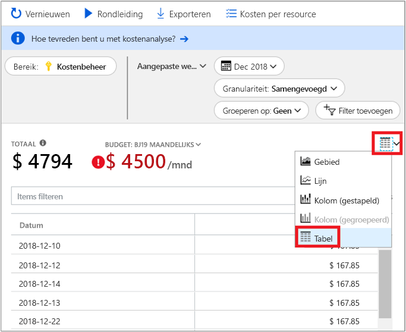

# Snelstart: Kosten verkennen en analyseren met Kostenanalyse

Voordat u de kosten van Azure goed kunt beheren en optimaliseren, moet u de oorsprong van de kosten in uw bedrijf weten. Het is ook handig om te weten hoeveel uw diensten kosten en welke omgevingen en systemen erdoor worden ondersteund. Inzicht in de volle breedte van alle kosten is noodzakelijk om nauwkeurig de uitgavenpatronen van uw bedrijf te leren kennen. Uitgavenpatronen kunnen worden gebruikt om kostenbeheersingsmechanismen als budgetten af te dwingen.

In deze snelstart gebruikt u kostenanalyse om de kosten van Azure voor uw bedrijf te verkennen en te analyseren. U kunt de totale kosten per bedrijf weergeven, zodat u begrijpt waar de kosten worden opgebouwd en uitgavenpatronen kunt identificeren. U kunt de totale kosten bekijken om geschatte kostentrends per maand, per kwartaal en zelfs per jaar naast een budget te leggen. Een budget helpt bij het in acht nemen van financiële beperkingen. En een budget wordt gebruikt om dagelijkse en maandelijkse kosten te bekijken om onregelmatigheden in de uitgaven te isoleren. Plus, u kunt de gegevens van het huidige rapport downloaden voor verdere analyse of om in een extern systeem te gebruiken.

In deze snelstart leert u de volgende zaken:

- Kosten in kostenanalyse beoordelen
- Kostenweergaven aanpassen
- Gegevens van kostenanalyse downloaden

## Vereisten

Kostenanalyse biedt ondersteuning voor verschillende soorten typen Azure-account. Zie voor de volledige lijst met ondersteunde accounttypen [Gegevens van Azure Cost Management begrijpen](understand-cost-mgt-data.md). Als u kostengegevens wilt weergeven, hebt u minimaal leestoegang voor uw Azure-account nodig.

Voor [Enterprise Agreement (EA)](https://azure.microsoft.com/pricing/enterprise-agreement/) moet u minimaal leestoegang hebben tot een of meer van de volgende bereiken om kostengegevens te kunnen bekijken.

- Factureringsaccount
- Afdeling
- Inschrijvingsaccount
- Beheergroep
- Abonnement
- Resourcegroep

Zie [Toegang tot gegevens toewijzen](assign-access-acm-data.md) voor meer informatie over het toewijzen van toegang tot de gegevens in Kostenbeheer.

## Aanmelden bij Azure

- Meld u aan bij Azure Portal op https://portal.azure.com.

## Kosten in kostenanalyse beoordelen

Als u wilt uw kosten in kostenanalyse bekijken, opent u het bereik in de Azure portal en selecteer **Cost analysis** in het menu. Bijvoorbeeld, gaat u naar **abonnementen**, selecteer een abonnement in de lijst en selecteer vervolgens **Cost analysis** in het menu. Gebruik de **bereik** pill om over te schakelen naar een ander bereik in kostenanalyse. Zie voor meer informatie over bereiken [begrijpen en werk met een bereik](understand-work-scopes.md).

Het bereik dat u selecteert wordt gebruikt in de gehele kostenbeheer voor gegevensconsolidatie en voor het beheren van toegang tot gegevens over de kosten. Wanneer u gebruikmaakt van bereiken, moet u geen meervoudige selectie maken. In plaats daarvan selecteert u een groter bereik die anderen tot draaien en filter vervolgens omlaag naar de geneste bereiken die u nodig hebt. Deze aanpak is belangrijk om te begrijpen omdat sommige mensen mogelijk geen toegang hebt tot een enkel bovenliggend bereik bevat informatie over meerdere geneste bereiken.

De initiële kostenanalyseweergave omvat de volgende gebieden:

**Totaal**, toont de totale kosten voor de huidige maand.

**Budget**, toont de geplande uitgavenlimiet voor het geselecteerde bereik, indien beschikbaar.

**Cumulatieve kosten** – ziet u de totale statistische functie dagelijks uitgaven, vanaf het begin van de maand. Nadat u een [budget hebt gemaakt](tutorial-acm-create-budgets.md) voor uw factureringsrekening of abonnement, kunt u snel uw uitgaventrend ten opzichte van het budget bekijken. Beweeg de muisaanwijzer over een datum om de opgebouwde kosten voor die dag te zien.

**Draaigrafieken (ringdiagrammen)**, bieden dynamische draaigrafieken en specificeren de totale kosten, gedetailleerd per algemene standaardeigenschappen. Ze weergegeven het meest naar minst dure voor de huidige maand. U kunt draaigrafieken op elk moment wijzigen door een andere pivot te selecteren. Kosten worden standaard weergegeven op: service (metercategorie), locatie (regio) en onderliggend bereik. Inschrijvingsaccounts bijvoorbeeld onder factureringsaccounts, resourcegroepen onder abonnementen en bronnen onder brongroepen.

## Kostenweergaven aanpassen

Kostenanalyse heeft vier ingebouwde weergaven, geoptimaliseerd voor de meest voorkomende doelen:

Weergeven | Antwoorden op vragen zoals...
--- | ---
Samengevoegde kosten | Hoeveel heb ik besteed aan het tot nu toe voor deze maand? Blijf ik binnen mijn budget?
Dagelijkse kosten | Er zijn een toename in de kosten per dag voor de afgelopen 30 dagen?
Kosten per service | Hoe is mijn maandelijks gebruik variëren gedurende de laatste 3 facturen?
Kosten per resource | Welke bronnen de meeste dusver deze maand kosten?

Er zijn echter veel gevallen waar u een meer gedetailleerde analyse nodig hebt. Het aanpassen begint bovenaan de pagina, met de selectie van de datum.

Kostenanalyse toont standaard de gegevens voor de huidige maand. De datum-selector snel overschakelen naar algemene datumbereiken gebruiken. Enkele voorbeelden zijn de afgelopen zeven dagen, afgelopen maand, huidige jaar, of een aangepast datumbereik. Betalen per gebruik-abonnementen omvatten ook datumbereiken op basis van de factureringsperiode is niet aan de kalendermaand, zoals de huidige factureringsperiode of laatste factuur gebonden. Gebruik de **< vorige** en **volgende >** koppelingen aan de bovenkant van het menu om door te gaan naar de volgende of vorige periode, respectievelijk. Een voorbeeld: **< vorige** van de afgelopen zeven dagen wordt overgeschakeld naar een 8-14 dagen geleden en vervolgens naar 15-21 dagen geleden.

Kostenanalyse toont standaard **opgebouwde** kosten. Totale kosten omvatten alle kosten voor elke dag plus de voorgaande dagen, voor een voortdurend groeiende weergave van uw dagelijkse totale kosten. Deze weergave is geoptimaliseerd om u te laten zien hoe u het doet in verhouding met het budget voor het geselecteerde tijdsbereik.

Er is ook de **dagelijkse** weergave die de kosten voor elke dag toont. De dagelijkse weergave toont geen groeitrend. De weergave is ontworpen om u onregelmatigheden als pieken of dalen in de kosten per dag te laten zien. Als u een budget hebt geselecteerd, toont de dagelijkse weergave ook een schatting van hoe uw dagelijkse budget eruit zou kunnen zien. Als uw dagelijkse kosten stelselmatig boven het geschatte dagelijkse budget uitkomen, dan kunt u ervan uitgaan dat u uw maandelijkse budget overschrijdt. Het geschatte dagelijkse budget is eenvoudig een manier om u te helpen uw budget op een lager niveau te visualiseren. Wanneer u schommelingen hebt in uw dagelijkse kosten dan is de vergelijking tussen het geschatte dagelijkse budget en uw maandelijkse budget minder nauwkeurig.

Over het algemeen kunt u verwachten dat gegevens of meldingen voor de verbruikte resources binnen 8-12 uur weergegeven.

**Groeperen op** topinzenders in het algemene eigenschappen voor het opsplitsen van kosten en identificeren. Als u wilt groeperen op resourcetags, selecteert u bijvoorbeeld de tagsleutel die u groeperen wilt op. Kosten worden opgedeeld per elke tagwaarde, met een extra segment voor resources die geen dat label wordt toegepast.

De meeste [Azure-resources ondersteunen tagging](../azure-resource-manager/tag-support.md), maar sommige tags zijn niet beschikbaar in Cost Management en facturering. Bovendien worden resourcegroeptags niet ondersteund. Cost Management ondersteunt resourcetags alleen vanaf de datum waarop de tags rechtstreeks worden toegepast op de resource. Bekijk de [over het bekijken van beleid voor resourcetags bij Azure Cost Management](https://www.youtube.com/watch?v=nHQYcYGKuyw) video voor meer informatie over het gebruik van Azure-tag-beleid voor het verbeteren van de kosten voor gegevens zichtbaar.

Dit is een overzicht van Azure-servicekosten voor een weergave van de afgelopen maand.

Draaigrafieken onder de hoofdgrafiek tonen verschillende groeperingen om u een breder beeld te geven van de totale kosten voor de geselecteerde periode en filters. Selecteer een eigenschap of tag om geaggregeerde kosten voor een dimensie weer te geven.

De voorgaande afbeelding toont de resourcegroepnamen. Hoewel u op tags kunt groeperen om de totale kosten per tag weer te geven, is het niet mogelijk om alle tags per resource of resourcegroep weer te geven in een van de weergaven voor kostenanalyse.

Als u groepeert kosten op een specifiek kenmerk, worden de bovenste 10 kostenposten van hoogste aantal naar laagste weergegeven. Als meer dan 10, de Actiefste negen kosten leden worden weergegeven met een **anderen** groep, die alle resterende groepen samen worden behandeld. Wanneer u op tags groepeert, ziet u mogelijk ook een groep **Zonder tag** voor kosten waarop de tagcode niet is toegepast. **Niet-gecodeerde** is altijd laatst, zelfs als kosten zonder tag hoger dan gelabelde kosten zijn. Kosten zonder tag wordt deel uitmaken van **anderen**, als 10 of meer tagwaarden bestaat.

*Klassieke* virtuele machines, netwerken en opslagbronnen gedetailleerde factureringsgegevens niet delen. Ze worden samengevoegd als **Klassieke services** wanneer kosten worden gegroepeerd.

U kunt de volledige gegevensset voor elke weergave bekijken. Selecties of filters die u toepast, zijn van invloed op de getoonde gegevens. Als u de volledige gegevensset wilt zien, klikt u op de lijst **grafiektype** en vervolgens op de **Tabel**-weergave.

## Gegevens van kostenanalyse downloaden

U kunt gegevens van kostenanalyse **Downloaden** om een CSV-bestand te genereren van alle gegevens die momenteel worden weergegeven in de Azure Portal. Alle toegepaste filters en groeperingen zijn opgenomen in het bestand. Onderliggende gegevens voor de Totaalgrafiek bovenaan die niet actief worden weergegeven, zijn opgenomen in het bestand.

## Volgende stappen

Ga door naar de eerste zelfstudie voor informatie over het maken en beheren van een budget.

> [!div class="nextstepaction"]
> [Budgetten maken en beheren](tutorial-acm-create-budgets.md)
