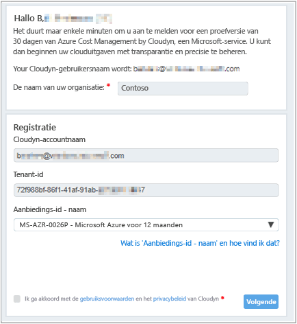
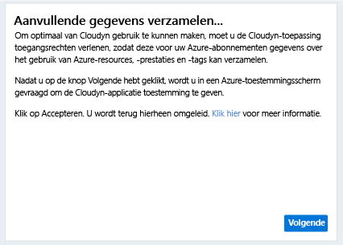
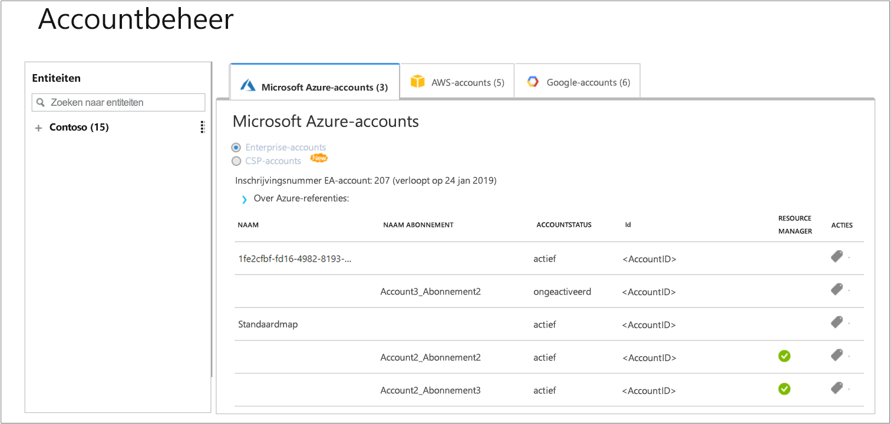

# Een individueel Azure-abonnement registreren en gegevenskosten weergeven

U gebruikt uw Azure-abonnement om u te registreren bij Azure Cost Management by Cloudyn. Uw registratie biedt toegang tot de Cloudyn-portal. In deze quickstart vindt u de details van de registratieprocedure voor het maken van een Cloudyn-proefabonnement en het aanmelden bij de Cloudyn-portal. U vindt er ook informatie over het weergeven van gegevenskosten.

## Meld u aan bij Azure.

- Meld u via http://portal.azure.com aan bij Azure Portal.

## Registratie voor een proefabonnement maken

1. Klik in Azure Portal, in de lijst met services, op **Cost Management en facturering**.
2. Klik onder **Overzicht** op **Cost Management**  
    
3. Klik op de pagina **Cost Management** op **Go to Cost Management** om de Cloudyn-registratiepagina in een nieuw venster te openen.
4. Typ op de pagina voor de registratie van het proefabonnement in de Cloudyn-portal de naam van uw bedrijf en selecteer **Azure Individual Subscription Owner** en klik op **Volgende**. Uw accountnaam en tenant-id worden automatisch toegevoegd aan het formulier.  
    
5. Selecteer uw **Aanbiedings-id - Naam** die is gekoppeld aan uw abonnement. Als u niet zeker bent van de tarief-id voor uw abonnement, kunt u uw Azure-factuur weergeven en zoeken naar **Aanbiedings-id**.
6. Accepteer de Gebruiksvoorwaarden en valideer uw gegevens. Klik vervolgens op **Volgende**.
7. Klik op de pagina **Gather additional data** op **Volgende** om Cloudyn te autoriseren Azure-brongegevens te verzamelen. De gegevens die worden verzameld zijn onder meer gegevens over gebruik, prestaties, facturering en tags van uw abonnementen.  
    
8. U gaat in de browser naar de aanmeldingspagina voor Cloudyn. Meld u aan met de referenties voor uw Azure-abonnement.
9. Klik op **Go to Cloudyn** op de Cloudyn-portal te openen. Op de pagina **Accounts Management** zou u de accountgegevens voor het Azure-abonnement moeten zien.  
    

Zie [Finding your Directory GUID and Rate ID for use in Azure Cost Management by Cloudyn](https://youtu.be/PaRjnyaNGMI) (Uw Directory-GUID en tarief-id zoeken voor gebruik in Azure Cost Management) als u een video met een zelfstudie wilt bekijken over het registreren van uw Azure-abonnement.

[!INCLUDE [cost-management-create-account-view-data](../../includes/cost-management-create-account-view-data.md)]

## Volgende stappen

In deze quickstart hebt u de gegevens van uw Azure-abonnement gebruikt om u te registreren bij Cost Management. U hebt zich ook aangemeld bij de Cloudyn-portal en de gegevenskosten weergegeven. Ga door naar de zelfstudie voor Cost Management voor meer informatie over Azure Cost Management by Cloudyn.

> [!div class="nextstepaction"]
> [Gebruik en kosten controleren](./tutorial-review-usage.md)
