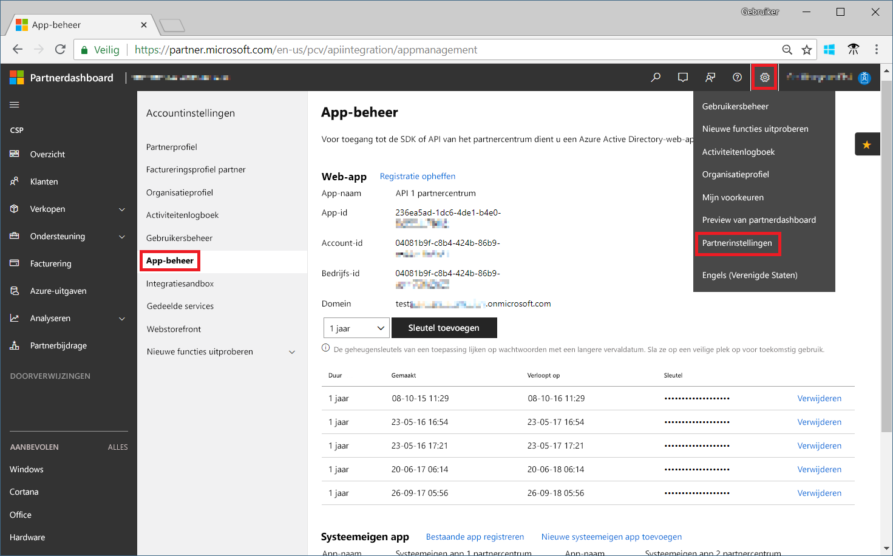
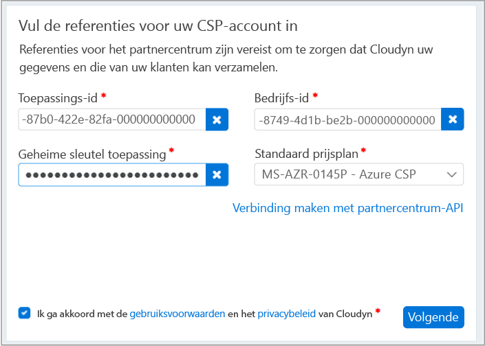

# Registreren bij de Partner van de CSP-programma en de weergave kostengegevens

U kunt met Azure kosten Management Cloudyn registreren als een CSP-partner. Uw registratie biedt toegang tot de portal Cloudyn. De details van deze Quick Start het registratieproces nodig voor het maken van een proefabonnement Cloudyn en meld u aan bij de portal Cloudyn. Deze ook wordt beschreven hoe u meteen kostengegevens bekijken.

>[!NOTE]

>Alleen directe CSP partners en indirecte CSP-Providers kunnen Cloudyn inschrijving voltooien.
>
>Configureren van de Partner Center API is vereist voor verificatie en toegang tot gegevens. Een Partner Center Global Administrator-account is nodig voor het inrichten van de API-toegang.
Zie voor meer informatie [verbinding maken met de Partner Center API](https://msdn.microsoft.com/library/partnercenter/mt709136.aspx).
>
>Toegang tot Cloudyn kunt beschikbaar gesteld aan CSP indirecte Resellers nadat hun indirecte CSP-Provider wordt geregistreerd bij Cloudyn. De indirecte Resellers CSP kan vervolgens Cloudyn toegang verlenen tot Azure-klanten en abonnementen.

## Meld u aan bij Azure.

- Meld u via http://portal.azure.com aan bij Azure Portal.

## Een proefabonnement registratie maken

1. Klik in de Azure-portal op **kostenbeheer + facturering** in de lijst met services.
2. Onder **overzicht**, klikt u op **kostenbeheer**  
    
3. Op de **kostenbeheer** pagina, klikt u op **gaat u naar kostenbeheer** naar de registratiepagina Cloudyn in een nieuw venster openen.
4. Typ de naam van uw bedrijf op de pagina van de portal proefversie registratie Cloudyn, selecteer **Microsoft CSP Partner programma Administrator**, en klik vervolgens op **volgende**.  
5. Voer een **toepassings-ID**, **Commerce ID**, **toepassing geheime sleutel**, en selecteer de **standaard prijzen plannen**. Als u de informatie die handig zijn, geen aanmelden bij de portal Partner Center op [https://partnercenter.microsoft.com](https://partnercenter.microsoft.com) contact op met de primaire account en voer de volgende stappen uit:
  1. Ga naar **Dashboard** > **Accountinstellingen** > **Appbeheer**.
  2. Als u eerder een Web-App hebt gemaakt, kunt u deze stap overslaan. Klik anders op **nieuwe web-app toevoegen** in de **Web-App** sectie.
  3. Kopieer de **App-ID** GUID van uw webtoepassing.
  4. Kopieer de **Commerce ID** GUID van uw webtoepassing.
  5. Selecteer de geldigheidsduur van de sleutel als één of twee jaar, indien nodig. Selecteer **toevoegen sleutel** en kopieert en de waarde van de geheime sleutel opslaan.  
    
  6. Ga terug naar de registratiepagina en plak de informatie.  
      
6. Ga akkoord met de gebruiksvoorwaarden en vervolgens uw informatie te valideren. Klik op **volgende** te autoriseren Cloudyn voor het verzamelen van gegevens van de Azure-resource. Verzamelde gegevens omvatten informatie over het gebruik, prestaties, facturering en labelgegevens van uw abonnementen.  
7. Onder **andere belanghebbenden uitnodigen**, kunt u gebruikers toevoegen door hun e-mailadressen in te voeren. Wanneer voltooid, klikt u op **volgende**. Het duurt ongeveer twee uur voor uw facturering gegevens ophalen die zijn toegevoegd aan Cloudyn.
8. Klik op **gaat u naar Cloudyn** de Cloudyn portal openen en klik vervolgens op de **Cloud accountbeheer** pagina ziet u de gegevens van uw geregistreerde CSP-account.

## Configureer de indirecte CSP-toegang in Cloudyn

De Partner Center API is standaard alleen toegankelijk voor directe CSP's. Een directe CSP-provider kan echter toegang configureren voor hun indirecte CSP klanten of partners, met behulp van entiteitsgroepen in Cloudyn.

Volg de stappen in voor toegang voor indirecte CSP klanten of partners, [maken van de registratie van een evaluatieversie](#create-a-trial-registration) voor het instellen van de registratie van een evaluatieversie. De volgende stappen voor het segment indirecte CSP gegevens vervolgens voltooien met behulp van Cloudyn entiteitsgroepen. Vervolgens de juiste gebruikersmachtigingen toewijzen aan de entiteitsgroepen.

1. Een groep entiteit maken met de informatie op [-entiteiten maken](tutorial-user-access.md#create-entities).
2. Volg de stappen in [abonnementen toewijzen aan kosten entiteiten](https://support.cloudyn.com/hc/en-us/articles/115005139425-Video-Assigning-subscriptions-to-Cost-Entities). Account van de indirecte CSP-klant en de Azure-abonnementen aan de entiteit die u eerder hebt gemaakt koppelen.
3. Volg de stappen in [maken van een gebruiker met beheerderstoegang](tutorial-user-access.md#create-a-user-with-admin-access) maken van een gebruikersaccount met beheerderstoegang. Controleer dat de gebruikersaccount beheerderstoegang heeft tot de specifieke entiteiten die u hebt gemaakt voor de indirecte account eerder.

Indirecte CSP partners zich aanmelden bij de Cloudyn-portal met behulp van de accounts die u hebt gemaakt voor deze.

[!INCLUDE [cost-management-create-account-view-data](../../includes/cost-management-create-account-view-data.md)]

## Volgende stappen

In deze snelstartgids kunt u uw gegevens CSP gebruikt om te registreren kostenbeheer. U ook aangemeld bij de portal Cloudyn en gestart kostengegevens weer te geven. Voor meer informatie over het beheer van Azure kosten door Cloudyn doorgaan naar de zelfstudie voor het beheer van kosten.

> [!div class="nextstepaction"]
> [Bekijk informatie over het gebruik en de kosten](./tutorial-review-usage.md)
