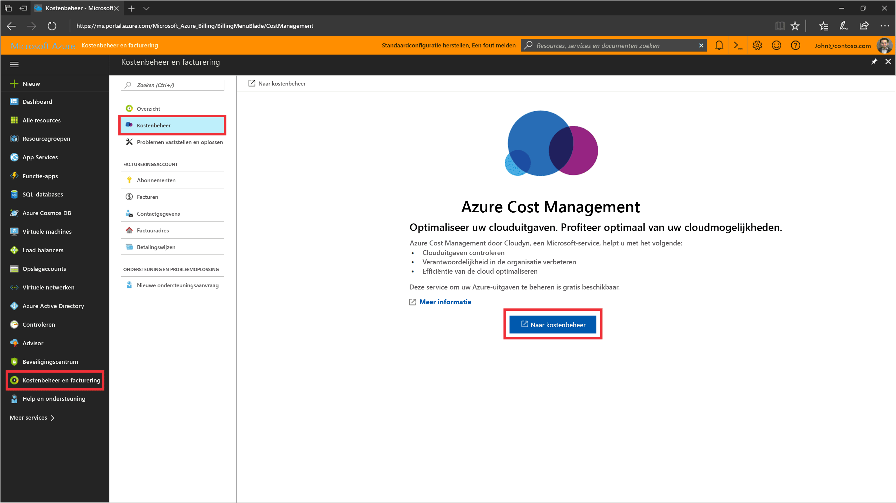
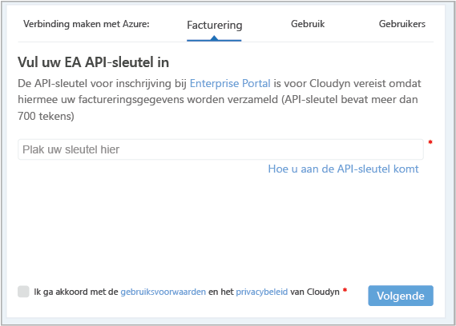
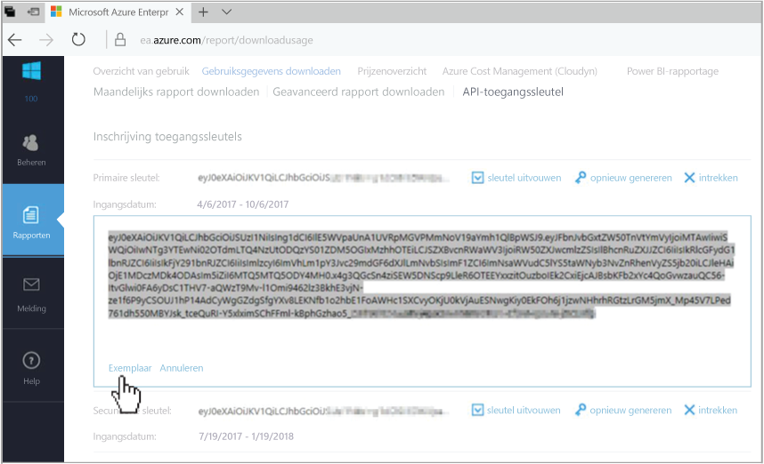

# Een Azure Enterprise Overeenkomst registreren en kostengegevens weergeven

U gebruikt uw Azure Enterprise Overeenkomst om u te registreren bij Azure Cost Management. Uw registratie biedt toegang tot de Cloudyn-portal. In deze quickstart vindt u de details van de registratieprocedure voor het maken van een Cloudyn-proefabonnement en het aanmelden bij de Cloudyn-portal. U vindt er ook informatie over het weergeven van kostengegevens.

## Meld u aan bij Azure.

- Meld u aan bij Azure Portal op http://portal.azure.com.

## Registreren bij Azure Cost Management

1. Klik in Azure Portal, in de lijst met services, op **Cost Management en facturering**.
2. Klik onder **Overzicht** op **Cost Management**  
    
3. Klik op de pagina **Cost Management** op **Go to Cost Management** om de Cloudyn-registratiepagina in een nieuw venster te openen.
4. Typ op de pagina voor de registratie van het proefabonnement in de Cloudyn-portal de naam van uw bedrijf en selecteer **Azure Enterprise Enrollment Administrator**.  
    
5. Voer de API-sleutel voor de Enterprise Portal-registratie in. Als u de sleutel niet bij de hand hebt, klikt u op de koppeling [Enterprise Portal](https://ea.azure.com) en voert u de volgende stappen uit:
  1. Meld u aan bij de Azure Enterprise-website en klik op **Rapporten**, klik op **API Access Key** en kopieer de primaire sleutel.  
    
  3. Ga terug naar de registratiepagina en plak de API-sleutel erin.
6. Accepteer de Gebruiksvoorwaarden en valideer de sleutel. Klik op **Volgende** om Cloudyn te autoriseren Azure-brongegevens te verzamelen. De gegevens die worden verzameld zijn onder meer gegevens over gebruik, prestaties, facturering en tags van uw abonnementen.  
    
7. Onder **Invite other stakeholders** kunt u gebruikers toevoegen door hun e-mailadressen in te voeren. Klik op **Volgende** als u klaar bent. Afhankelijk van de grootte van uw Azure-inschrijving duurt het maximaal 24 uur voor al uw factureringsgegevens zijn toegevoegd aan Cloudyn.
8. Klik op **Go to Cloudyn** op de Cloudyn-portal te openen. Op de pagina **Cloud Accounts Management** zou u de geregistreerde EA-accountgegevens moeten kunnen zien.

Zie [How to Find Your EA Enrollment ID and API Key for use in Azure Cost Management](https://youtu.be/u_phLs_udig) (Uw EA-registratie-id en API-sleutel zoeken voor gebruik in Azure Cost Management) als u een video met een zelfstudie wilt bekijken over het registreren van uw Enterprise Overeenkomst.

[!INCLUDE [cost-management-create-account-view-data](../../includes/cost-management-create-account-view-data.md)]

## Volgende stappen

In deze quickstart hebt u uw Azure Enterprise Overeenkomst gebruikt om u te registreren bij Cost Management. U hebt zich ook aangemeld bij de Cloudyn-portal en de gegevenskosten weergegeven. Ga door naar de zelfstudie voor Cost Management voor meer informatie over Azure Cost Management.

> [!div class="nextstepaction"]
> [Gebruik en kosten controleren](./tutorial-review-usage.md)
