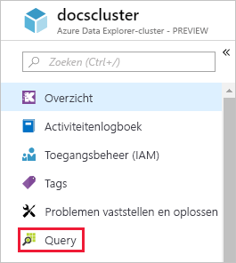
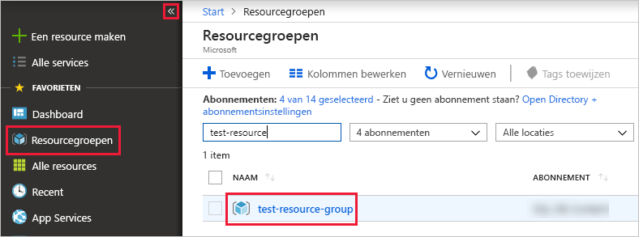

# Snelstart: een Azure Data Explorer-cluster en -database maken

Azure Data Explorer is een snelle en zeer schaalbare service om gegevens in logboeken en telemetrie te verkennen. Als u Azure Data Explorer wilt gebruiken, maakt u eerst een *cluster*. Daarna maakt u een of meer *databases* in het cluster. De volgende stap is het *opnemen* (laden) van gegevens in een database, zodat er query's voor kunt uitvoeren. In deze snelstart maakt u een cluster en een database. In de volgende artikelen wordt uitgelegd hoe u gegevens opneemt.

Als u nog geen abonnement op Azure hebt, maak dan een [gratis Azure-account](https://azure.microsoft.com/free/) aan voordat u begint.

## Aanmelden bij Azure Portal

Meld u aan bij [Azure Portal](https://portal.azure.com/).

## Een cluster maken

U maakt een Azure Data Explorer-cluster in een Azure-resourcegroep, met een gedefinieerde set reken- en opslagresources.

1. Selecteer de knop **Een resource maken** (+) in de linkerbovenhoek van de portal.

1. Zoek naar *Azure Data Explorer* en selecteer vervolgens **Azure Data Explorer**.

   

1. Selecteer in de rechterbenedenhoek **Maken**.

1. Voer een unieke naam in voor uw cluster, selecteer uw abonnement en maak een resourcegroep met de naam *test-resource-group*.

    

1. Vul in het formulier de volgende gegevens in.

   

    **Instelling** | **Voorgestelde waarde** | **Beschrijving van veld**
    |---|---|---|
    | Clusternaam | Een unieke clusternaam | Kies een unieke naam die uw cluster identificeert. Dit kan bijvoorbeeld *mytestcluster* zijn. De domeinnaam *[regio].kusto.windows.net* wordt toegevoegd aan de clusternaam die u opgeeft. De naam mag alleen kleine letters en cijfers bevatten. Het wachtwoord moet tussen 3 en 22 tekens lang zijn.
    | Abonnement | Uw abonnement | Selecteer het Azure-abonnement dat u wilt gebruiken voor uw cluster.|
    | Resourcegroep | *test-resource-group* | Maak een nieuwe resourcegroep. |
    | Locatie | *US - west* | Selecteer *US - west* voor deze snelstart. Selecteer voor een productiesysteem de regio die het beste voldoet aan uw behoeften.
    | Rekenspecificatie | *D13_v2* | Selecteer de laagste prijsspecificatie voor deze snelstart. Selecteer voor een productiesysteem de specificatie die het beste voldoet aan uw behoeften.
    | | |

1. Selecteer **Maken** om het cluster in te richten. Het inrichten duurt doorgaans ongeveer tien minuten. Selecteer **Meldingen** op de werkbalk (pictogram van een klok) om het inrichtingsproces te bewaken.

1. Wanneer het proces is voltooid, selecteert u **Meldingen** en vervolgens **Ga naar resource**.

    

## Een database maken

U bent nu klaar voor de tweede stap in het proces: het maken van de database.

1. Op het tabblad **Overzicht** selecteert u **Database maken**.

    

1. Vul in het formulier de volgende gegevens in.

    

    **Instelling** | **Voorgestelde waarde** | **Beschrijving van veld**
    |---|---|---|
    | Databasenaam | *TestDatabase* | De databasenaam moet uniek zijn binnen het cluster.
    | Bewaarperiode | *3650* | De periode waarin de gegevens gegarandeerd beschikbaar blijven voor query's. De periode wordt gemeten vanaf het moment dat de gegevens zijn opgenomen.
    | Cacheperiode | *31* | De periode waarin vaak opgevraagde gegevens beschikbaar blijven in de SSD-opslag of het RAM-geheugen in plaats van in de langetermijnopslag.
    | | | |

1. Selecteer **Opslaan** om de database te maken. Het maakproces duurt meestal minder dan een minuut. Wanneer het proces is voltooid, keert u terug naar het tabblad **Overzicht** van het cluster.

## Basisopdrachten uitvoeren in de database

Nu u beschikt over een cluster en een database kunt u query's en opdrachten uitvoeren. Er staan nog geen gegevens in de database, maar u kunt wel zien hoe de hulpprogramma's werken.

1. Selecteer onder het cluster de optie **Query**.

    

1. Kopieer de volgende opdracht en plak deze in het queryvenster: `.show databases`. Selecteer dan **Uitvoeren**.

    

    In de resultatenset wordt **TestDatabase** weergegeven, de enige database in het cluster.

1. Kopieer de volgende opdracht en plak deze in het queryvenster: `.show tables`. Selecteer dan die opdracht in het venster. Selecteer **Uitvoeren**.

    Met deze opdracht wordt een lege resultatenset geretourneerd omdat er nog geen tabellen zijn. In het volgende artikel in deze reeks gaat u een tabel toevoegen.

## Het cluster stoppen en opnieuw opstarten

U kunt een cluster stoppen en opnieuw opstarten, afhankelijk van de behoeften van uw bedrijf.

1. Als u een cluster wilt stoppen, selecteert u aan de bovenkant van het tabblad **Overzicht** de optie **Stoppen**.

    Wanneer het cluster is gestopt, kunnen er geen query's worden uitgevoerd voor de gegevens en kunt u geen nieuwe gegevens opnemen.

1. Als u een cluster opnieuw wilt opstarten, selecteert u aan de bovenkant van het tabblad **Overzicht** de optie **Starten**.

    Wanneer het cluster opnieuw is opgestart, duurt het ongeveer tien minuten voordat het weer beschikbaar is (zoals toen het cluster voor het eerst werd ingericht). Het kost meer tijd om de gegevens naar de dynamische cache te laden.  

## Resources opschonen

Als u graag onze andere snelstarts en zelfstudies wilt volgen, bewaart u de gemaakte resources. Als u dit niet van plan bent, verwijdert u **test-resource-group** om kosten te vermijden.

1. Selecteer in Azure Portal **Resourcegroepen** aan de linkerkant en selecteer vervolgens de resourcegroep die u hebt gemaakt.  

    Wanneer het menu links is samengevouwen, klikt u op  om het menu uit te vouwen.

   

1. Selecteer onder **test-resource-group** de optie **Resourcegroep verwijderen**.

1. Typ in het nieuwe venster de naam van de resourcegroep die u wilt verwijderen (*test-resource-group*)en klik vervolgens op **Verwijderen**.

## Volgende stappen

> [!div class="nextstepaction"]
> [Snelstart: gegevens uit Event Hub opnemen in Azure Data Explorer](ingest-data-event-hub.md)

