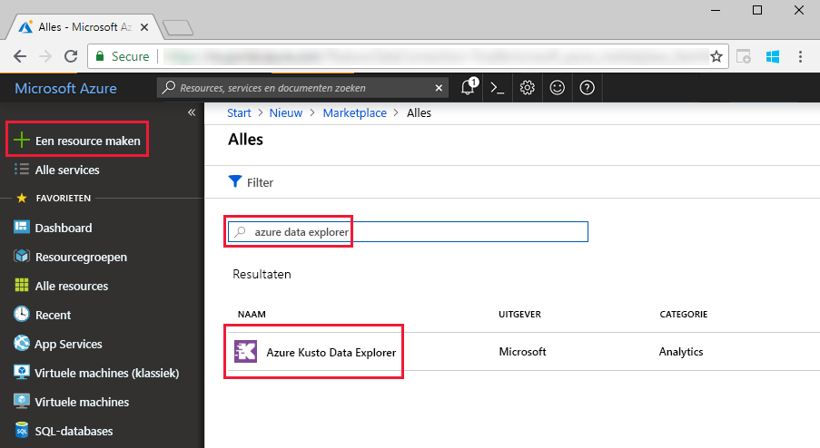
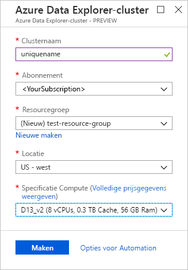
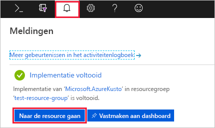
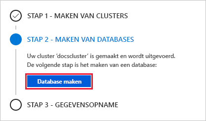
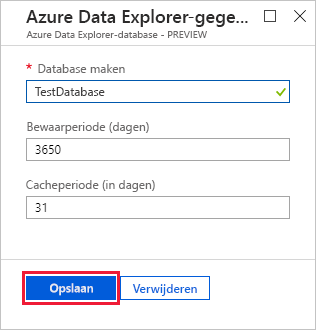
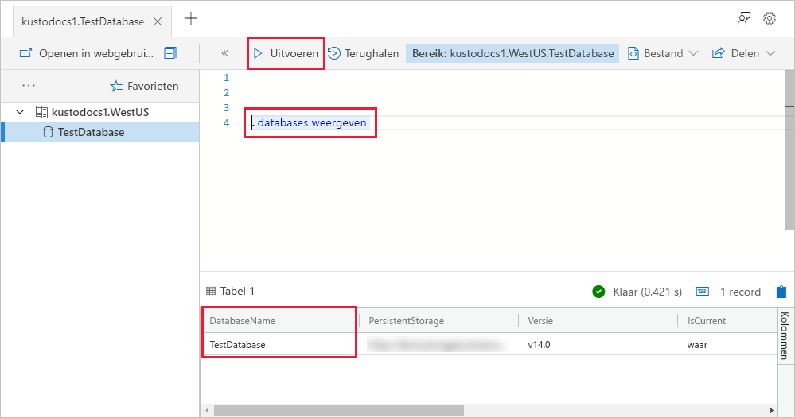

# Quickstart: Een Azure Data Explorer-cluster en -database maken

> [!div class="op_single_selector"]
> * [Portal](create-cluster-database-portal.md)
> * [CLI](create-cluster-database-cli.md)
> * [PowerShell](create-cluster-database-powershell.md)
> * [C#](create-cluster-database-csharp.md)
> * [Python](create-cluster-database-python.md)
>  

Azure Data Explorer is een snelle en zeer schaalbare service om gegevens in logboeken en telemetrie te verkennen. Als u Azure Data Explorer wilt gebruiken, maakt u eerst een cluster. Daarna maakt u een of meer databases in het cluster. De volgende stap is het opnemen (laden) van gegevens in een database, zodat u er query's op kunt uitvoeren. In deze snelstart maakt u een cluster en een database.

Als u nog geen abonnement op Azure hebt, maak dan een [gratis Azure-account](https://azure.microsoft.com/free/) aan voordat u begint.

## Aanmelden bij Azure Portal

Meld u aan bij [Azure Portal](https://portal.azure.com/).

## Een cluster maken

Maak een Azure Data Explorer-cluster met een gedefinieerde set met reken- en opslagresources in een Azure-resourcegroep.

1. Selecteer de knop **Een resource maken** (+) in de linkerbovenhoek van de portal.

1. Zoek naar *Azure Data Explorer*.

   

1. Selecteer onder aan het scherm, onder **Azure Data Explorer**, de optie **Maken**.

1. Vul de basic-cluster in met de volgende informatie.

   

    **Instelling** | **Voorgestelde waarde** | **Beschrijving van veld**
    |---|---|---|
    | Abonnement | Uw abonnement | Selecteer het Azure-abonnement dat u wilt gebruiken voor uw cluster.|
    | Resourcegroep | *test-resource-group* | Gebruik een bestaande resourcegroep of maak een nieuwe. |
    | Clusternaam | Een unieke clusternaam | Kies een unieke naam die uw cluster identificeert. Bijvoorbeeld, *mydataexplorercluster*. De domeinnaam *[regio].kusto.windows.net* wordt toegevoegd aan de clusternaam die u opgeeft. De naam mag alleen kleine letters en cijfers bevatten. Het wachtwoord moet tussen 3 en 22 tekens lang zijn.
    | Locatie | *US - west* | Selecteer *US - west* voor deze snelstart. Selecteer voor een productiesysteem de regio die het beste voldoet aan uw behoeften.
    | Specificaties voor rekenkracht | *D13_v2* | Selecteer de laagste prijsspecificatie voor deze snelstart. Selecteer voor een productiesysteem de specificatie die het beste voldoet aan uw behoeften.
    | | |

1. Selecteer **Bekijken + maken** om de gegevens van uw cluster te controleren, en **Maken** voor het inrichten van het cluster. Het inrichten duurt doorgaans ongeveer 10 minuten.

1. Nadat de implementatie is voltooid, selecteert u **Ga naar resource**.

    

## Een database maken

U bent nu klaar voor de tweede stap in het proces: het maken van de database.

1. Op het tabblad **Overzicht** selecteert u **Database maken**.

    

1. Vul het formulier in met de volgende gegevens.

    

    **Instelling** | **Voorgestelde waarde** | **Beschrijving van veld**
    |---|---|---|
    | Databasenaam | *TestDatabase* | De databasenaam moet uniek zijn binnen het cluster.
    | Bewaarperiode | *3650* | De periode (in dagen) dat de gegevens gegarandeerd beschikbaar blijven voor query's. De periode wordt gemeten vanaf het moment dat de gegevens zijn opgenomen.
    | Cacheperiode | *31* | De periode (in dagen) dat vaak opgevraagde gegevens beschikbaar blijven in de SSD-opslag of het RAM-geheugen in plaats van in de langetermijnopslag.
    | | | |

1. Selecteer **Maken** om het profiel te maken. Het maakproces duurt meestal minder dan een minuut. Wanneer het proces is voltooid, keert u terug naar het tabblad **Overzicht** van het cluster.

## Basisopdrachten uitvoeren in de database

Nu u beschikt over een cluster en een database kunt u query's en opdrachten uitvoeren. Er staan nog geen gegevens in de database, maar u kunt wel zien hoe de hulpprogramma's werken.

1. Selecteer onder het cluster de optie **Query**. Kopieer de opdracht `.show databases` en plak deze in het queryvenster. Selecteer daarna **Uitvoeren**.

    

    In de resultatenset wordt **TestDatabase** weergegeven, de enige database in het cluster.

1. Kopieer de opdracht `.show tables` en plak deze in het queryvenster en selecteer **Uitvoeren**.

    Met deze opdracht wordt een lege resultatenset geretourneerd omdat er nog geen tabellen zijn. In het volgende artikel in deze reeks gaat u een tabel toevoegen.

## Het cluster stoppen en opnieuw opstarten

U kunt een cluster stoppen en opnieuw opstarten, afhankelijk van de behoeften van uw bedrijf.

1. Als u een cluster wilt stoppen, selecteert u aan de bovenkant van het tabblad **Overzicht** de optie **Stoppen**.

    Wanneer het cluster is gestopt, kunnen er geen query's worden uitgevoerd voor de gegevens en kunt u geen nieuwe gegevens opnemen.

1. Als u een cluster opnieuw wilt opstarten, selecteert u aan de bovenkant van het tabblad **Overzicht** de optie **Starten**.

    Wanneer het cluster opnieuw is opgestart, duurt het ongeveer 10 minuten voordat het weer beschikbaar is (zoals toen het cluster voor het eerst werd ingericht). Het kost meer tijd om de gegevens naar de dynamische cache te laden.  

## Resources opschonen

Als u onze andere quickstarts en zelfstudies wilt volgen, behoudt u de gemaakte resources. Als u dit niet van plan bent, verwijdert u uw testresourcegroep om kosten te vermijden.

1. Selecteer in de Azure Portal **Resourcegroepen** aan de linkerkant en selecteer vervolgens de resourcegroep die het Data Explorer-cluster bevat.  

1. Kies **Resourcegroep verwijderen** om de gehele resourcegroep te verwijderen. Als u een bestaande resourcegroep gebruikt, kunt u ervoor kiezen om alleen de Data Explorer-cluster te verwijderen.

## Volgende stappen

> [!div class="nextstepaction"]
> [Snelstart: Gegevens uit Event Hub opnemen in Azure Data Explorer](ingest-data-event-hub.md)

