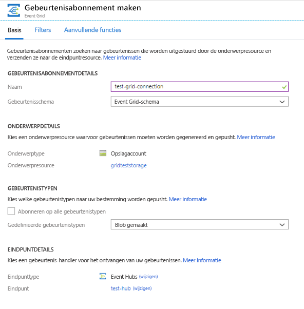
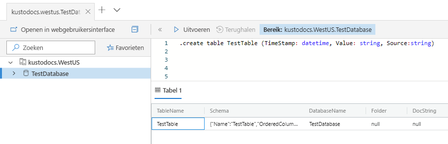
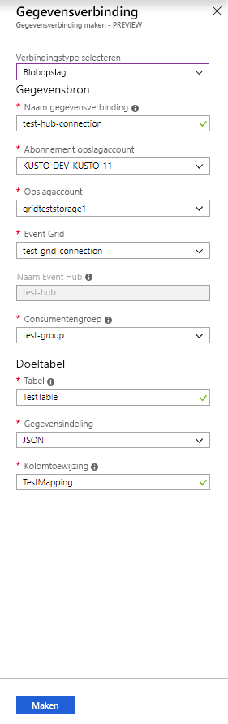
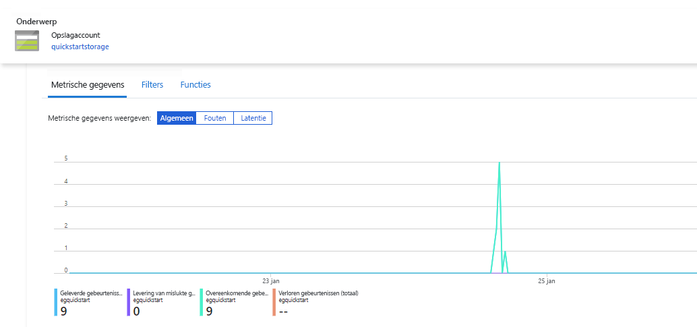
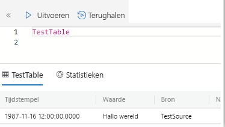

# <a name="quickstart-ingest-blobs-into-azure-data-explorer-by-subscribing-to-event-grid-notifications"></a>Quickstart: Blobs worden opgenomen in Azure Data Explorer door u te abonneren op meldingen voor Event Grid

Azure Data Explorer is een snelle en schaalbare data exploration service voor logboek-en telemetrie. Het biedt continue opname (het laden van gegevens) van blobs die zijn geschreven naar het blob-containers. 

In deze snelstartgids leert u hoe u om in te stellen een [Azure Event Grid](/azure/event-grid/overview) -abonnement en gebeurtenissen van de route naar de Azure Data Explorer via een event hub. Als u wilt beginnen, hebt u een opslagaccount met een event grid-abonnement waarmee waarschuwingsmeldingen worden verzonden naar Azure Event Hubs. Vervolgens de gegevensverbinding van een Event Grid maakt en u de gegevens bekijken in de stroom in het hele systeem.

## <a name="prerequisites"></a>Vereisten

* Een Azure-abonnement. Maak een [gratis Azure-account](https://azure.microsoft.com/free/).
* [Een cluster en de database](create-cluster-database-portal.md).
* [Een opslagaccount](https://docs.microsoft.com/azure/storage/common/storage-quickstart-create-account?tabs=azure-portal).
* [Een event hub](https://docs.microsoft.com/azure/event-hubs/event-hubs-create).

## <a name="create-an-event-grid-subscription-in-your-storage-account"></a>Een Event Grid-abonnement maken in uw opslagaccount

1. Zoek uw opslagaccount in de Azure-portal.
1. Selecteer **gebeurtenissen** > **gebeurtenisabonnement**.

    

1. Geef de volgende waarden op in het venster **Gebeurtenisabonnement maken** in het tabblad **Basic**:

    **Instelling** | **Voorgestelde waarde** | **Beschrijving van veld**
    |---|---|---|
    | Name | *test-grid-connection* | De naam van de event grid dat u wilt maken.|
    | Gebeurtenisschema | *Gebeurtenisschema in het raster* | Het schema dat moet worden gebruikt voor het event grid. |
    | Onderwerptype | *Opslagaccount* | Het type Event Grid-onderwerp. |
    | Onderwerpresource | *gridteststorage* | De naam van uw opslagaccount. |
    | Abonneren op alle gebeurtenistypen | *Wissen* | Geen meldingen ontvangen voor alle gebeurtenissen. |
    | Gedefinieerde gebeurtenistypen | *Blobcreated* | Voor welke specifieke gebeurtenissen u een melding ontvangt. |
    | Eindpunttype | *Eventhubs* | Het type eindpunt waarnaar u de gebeurtenissen verzendt. |
    | Eindpunt | *test-hub* | De Event Hub die u hebt gemaakt. |
    | | |

1. Selecteer het tabblad **Extra functies** als u bestanden uit een specifieke container wilt bijhouden. Stel de filters voor de meldingen als volgt in:
    * **Onderwerp begint met** veld is de *letterlijke* voorvoegsel van de blob-container. Als het patroon toegepast is *startswith*, kan er meerdere containers omvatten. Er zijn geen jokertekens zijn toegestaan.
     Het veld *moet* als volgt zijn ingesteld: *`/blobServices/default/containers/`*[container-voorvoegsel]
    * Het veld **Onderwerp eindigt met** veld is het *letterlijke* achtervoegsel van de blob. Er zijn geen jokertekens zijn toegestaan.

## <a name="create-a-target-table-in-azure-data-explorer"></a>Een doeltabel maken in Azure Data Explorer

Een tabel maken in Azure Data Explorer waarin Event Hubs deze gegevens stuurt. Maak de tabel in het cluster en de database gemaakt in de vereisten.

1. Selecteer in de Azure-portal, onder het cluster, de optie **Query**.

    

1. Kopieer de volgende opdracht in het venster en selecteer **uitvoeren** te maken van de tabel (TestTable) die de opgenomen gegevens worden ontvangen.

    ```Kusto
    .create table TestTable (TimeStamp: datetime, Value: string, Source:string)
    ```

    

1. Kopieer de volgende opdracht in het venster en selecteer **Uitvoeren** om de binnenkomende JSON-gegevens toe te wijzen aan de kolomnamen en gegevenstypen van de tabel (TestTable).

    ```Kusto
    .create table TestTable ingestion json mapping 'TestMapping' '[{"column":"TimeStamp","path":"$.TimeStamp"},{"column":"Value","path":"$.Value"},{"column":"Source","path":"$.Source"}]'
    ```

## <a name="create-an-event-grid-data-connection-in-azure-data-explorer"></a>Een Event Grid-gegevensverbinding maken in Azure Data Explorer

Nu verbinding maken met event grid van Azure Data Explorer, zodat de gegevens die binnenkomen in de blob-container naar de tabel van de test wordt gestreamd.

1. Selecteer op de werkbalk de optie **Meldingen** om te controleren of de implementatie van de Event Hub is geslaagd.

1. Selecteer in het cluster dat u hebt gemaakt, de optie **Databases** > **TestDatabase**.

    

1. Selecteer **gegevensopname** > **gegevensverbinding toevoegen**.

    

1.  Selecteer het verbindingstype: **Blob Storage**.

1. Vul het formulier in met de volgende informatie en selecteer **maken**.

    

     Gegevensbron:

    **Instelling** | **Voorgestelde waarde** | **Beschrijving van veld**
    |---|---|---|
    | Naam van gegevensverbinding | *test-hub-connection* | De naam van de verbinding die u wilt maken in Azure Data Explorer.|
    | Abonnement van opslagaccount | Uw abonnements-id | Het abonnements-id waarin uw opslagaccount zich bevindt.|
    | Storage-account | *gridteststorage* | De naam van het opslagaccount dat u eerder hebt gemaakt.|
    | Event Grid | *test-grid-connection* | De naam van de event grid die u hebt gemaakt. |
    | Event Hub-naam | *test-hub* | De event hub die u hebt gemaakt. Dit veld wordt automatisch ingevuld wanneer u een event grid kiezen. |
    | Consumentengroep | *test-group* | De consumentengroep gedefinieerd in de event hub die u hebt gemaakt. |
    | | |

    Doeltabel:

     **Instelling** | **Voorgestelde waarde** | **Beschrijving van veld**
    |---|---|---|
    | Tabel | *TestTable* | De tabel die u hebt gemaakt in **TestDatabase**. |
    | Gegevensindeling | *JSON* | Ondersteunde indelingen zijn Avro, CSV, JSON, MULTILINE JSON, PSV, SOH, SCSV, TSV en TXT. |
    | Toewijzen van kolommen | *TestMapping* | De toewijzing die u hebt gemaakt in **TestDatabase** en waarmee die binnenkomende JSON-gegevens worden toegewezen aan de kolomnamen en gegevenstypen van **TestTable**.|
    | | |

## <a name="generate-sample-data"></a>Voorbeeldgegevens genereren

Nu dat Azure Data Explorer en de storage-account zijn verbonden, kunt u voorbeeldgegevens maken en uploaden naar de blob-opslag.

U werkt met een klein shellscript dat een paar eenvoudige Azure CLI-opdrachten opgeeft voor interactie met Azure Storage-resources. Met dit script maakt een nieuwe container in uw storage-account, een bestaand bestand (als een blob) naar deze container geüpload en vervolgens worden de blobs in de container. U kunt [Azure Cloud Shell](https://docs.microsoft.com/azure/cloud-shell/overview) om uit te voeren van het script rechtstreeks in de portal.

Sla de gegevens in een bestand en upload het met dit script:

```Json
{"TimeStamp": "1987-11-16 12:00","Value": "Hello World","Source": "TestSource"}
```

```bash
#!/bin/bash
### A simple Azure Storage example script

    export AZURE_STORAGE_ACCOUNT=<storage_account_name>
    export AZURE_STORAGE_KEY=<storage_account_key>

    export container_name=<container_name>
    export blob_name=<blob_name>
    export file_to_upload=<file_to_upload>
    export destination_file=<destination_file>

    echo "Creating the container..."
    az storage container create --name $container_name

    echo "Uploading the file..."
    az storage blob upload --container-name $container_name --file $file_to_upload --name $blob_name

    echo "Listing the blobs..."
    az storage blob list --container-name $container_name --output table

    echo "Done"
```

## <a name="review-the-data-flow"></a>De gegevensstroom controleren

> [!NOTE]
> Azure Data Explorer is een aggregatie (batchverwerking)-beleid voor gegevensopname die zijn ontworpen om de gegevensopname optimaliseren.
Standaard is het beleid geconfigureerd op vijf minuten.
U moet mogelijk zijn om te wijzigen van het beleid op een later tijdstip, indien nodig. Verwacht in deze quickstart een latentie van een paar minuten.

1. In de Azure-portal, onder uw Event Grid, ziet u de piek in activiteit terwijl de app wordt uitgevoerd.

    

1. Als u wilt controleren hoeveel berichten er op dat moment de database hebben bereikt, voert u de volgende query uit in de testdatabase.

    ```Kusto
    TestTable
    | count
    ```

1. Voer de volgende query in uw testdatabase uit om de inhoud van de berichten te bekijken.

    ```Kusto
    TestTable
    ```

    De resultatenset ziet er ongeveer als volgt uit.

    

## <a name="clean-up-resources"></a>Resources opschonen

Als u niet van plan bent de Event Grid opnieuw te gebruiken, wist u de **test-hub-rg** om te voorkomen dat er kosten in rekening worden gebracht.

1. Selecteer in Azure Portal **Resourcegroepen** aan de linkerkant en selecteer vervolgens de resourcegroep die u hebt gemaakt.  

    Als het menu links is samengevouwen, selecteert u  om het menu uit te vouwen.

   

1. Selecteer onder **test-resource-group** de optie **Resourcegroep verwijderen**.

1. Voer in het nieuwe venster de naam van de resourcegroep te verwijderen (*test-hub-rg*), en selecteer vervolgens **verwijderen**.

## <a name="next-steps"></a>Volgende stappen

> [!div class="nextstepaction"]
> [Snelstart: query's uitvoeren op gegevens in Azure Data Explorer](web-query-data.md)
