# <a name="quickstart-ingest-data-from-event-hub-into-azure-data-explorer"></a>Quickstart: gegevens uit Event Hub opnemen in Azure Data Explorer

Azure Data Explorer is een snelle en zeer schaalbare service om gegevens in logboeken en telemetrie te verkennen. Azure Data Explorer biedt opname (laden van gegevens) vanuit Event Hubs, een big data-streamingplatform en service voor gebeurtenisopname. [Event Hubs](/azure/event-hubs/event-hubs-about) kunnen miljoenen gebeurtenissen per seconde in bijna realtime verwerken. In deze quickstart maakt u een Event Hub, maakt u verbinding met deze hub vanuit Azure Data Explorer, en ziet u de gegevens door het systeem stromen.

## <a name="prerequisites"></a>Vereisten

* Als u nog geen abonnement op Azure hebt, maak dan een [gratis Azure-account](https://azure.microsoft.com/free/) aan voordat u begint.

* [Een cluster en database voor testdoeleinden](create-cluster-database-portal.md)

* [Een voorbeeld-app](https://github.com/Azure-Samples/event-hubs-dotnet-ingest) die gegevens genereert en deze verzendt naar een event hub. Download de voorbeeld-app naar uw systeem.

* [Visual Studio 2017-versie 15.3.2 of groter](https://www.visualstudio.com/vs/) om de voorbeeld-app uit te voeren

## <a name="sign-in-to-the-azure-portal"></a>Aanmelden bij Azure Portal

Meld u aan bij [Azure Portal](https://portal.azure.com/).

## <a name="create-an-event-hub"></a>Een Event Hub maken

In deze quickstart genereert u voorbeeldgegevens en verzendt u deze naar een Event Hub. De eerste stap is het maken van een Event Hub. U doet dit door in de Azure Portal een Azure Resource Manager-sjabloon te gebruiken.

1. Als u een Event Hub wilt maken, gebruikt u de volgende knop om de implementatie te starten. Klik met de rechtermuisknop en selecteer **In nieuw venster openen**, zodat u de rest van de stappen in dit artikel kunt volgen.

    [](https://portal.azure.com/#create/Microsoft.Template/uri/https%3A%2F%2Fraw.githubusercontent.com%2FAzure%2Fazure-quickstart-templates%2Fmaster%2F201-event-hubs-create-event-hub-and-consumer-group%2Fazuredeploy.json)

    Als u op de knop **Implementeren in Azure** klikt, wordt u naar de Azure-portal geleid om een implementatieformulier in te vullen.

    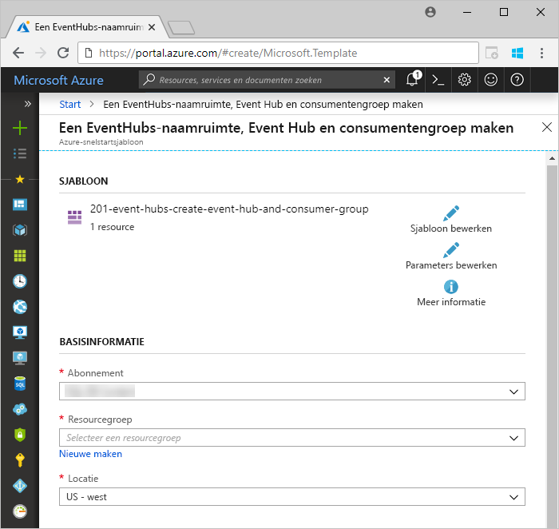

1. Selecteer het abonnement waarvoor u de Event Hub wilt maken, en maak een resourcegroep met de naam *test-hub-rg*.

    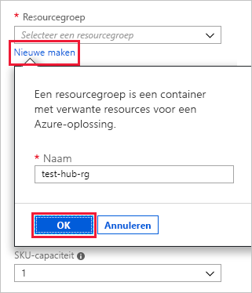

1. Vul het formulier in met de volgende gegevens.

    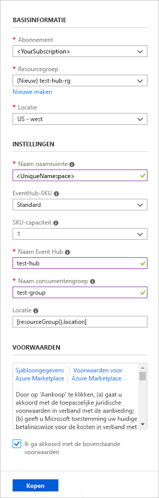

    Gebruik de standaardwaarden voor alle instellingen die niet zijn vermeld in de volgende tabel.

    **Instelling** | **Voorgestelde waarde** | **Beschrijving van veld**
    |---|---|---|
    | Abonnement | Uw abonnement | Selecteer het Azure-abonnement dat u wilt gebruiken voor de Event Hub.|
    | Resourcegroep | *test-hub-rg* | Maak een nieuwe resourcegroep. |
    | Locatie | *US - west* | Selecteer *US - west* voor deze snelstart. Selecteer voor een productiesysteem de regio die het beste voldoet aan uw behoeften. Voor de beste prestaties maakt u de Event Hub-naamruimte op dezelfde locatie als het Kusto-cluster (dit is met name belangrijk voor Event Hub-naamruimten met een hoge doorvoer).
    | Naam van naamruimte | Een unieke naam voor de naamruimte | Kies een unieke naam waarmee de naamruimte kan worden geïdentificeerd. Bijvoorbeeld *mijntestnaamruimte*. De domeinnaam *servicebus.windows.net* wordt toegevoegd aan de naam die u opgeeft. De naam mag alleen letters, cijfers en afbreekstreepjes bevatten. De naam moet beginnen met een letter en moet eindigen met een letter of een cijfer. De waarde moet minimaal 6 en maximaal 50 tekens lang zijn.
    | Naam van Event Hub | *test-hub* | De Event Hub bevindt zich onder de naamruimte, wat een unieke bereikcontainer biedt. De naam van de Event Hub moet uniek zijn binnen de naamruimte. |
    | Naam van consumentengroep | *test-group* | Met consumentengroepen kunnen meerdere gebruikstoepassingen elk een afzonderlijke weergave van de gebeurtenisstroom hebben. |
    | | |

1. Selecteer **Aankopen**. Hiermee bevestigt u dat u resources maakt in het abonnement.

1. Selecteer in de werkbalk de optie **Meldingen** om het inrichtingsproces te controleren. Het kan enkele minuten duren voordat het implementatieproces is voltooid, maar u kunt nu doorgaan met de volgende stap.

    

## <a name="create-a-target-table-in-azure-data-explorer"></a>Een doeltabel maken in Azure Data Explorer

Nu maakt u een tabel in Azure Data Explorer waarnaar via Event Hubs gegevens worden verzonden. U maakt de tabel in het cluster en de database die zijn ingericht in **Vereisten**.

1. Ga in de Azure Portal naar het cluster en selecteer **Query**.

    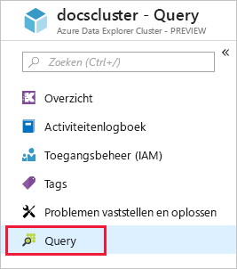

1. Kopieer de volgende opdracht in het venster en selecteer **Uitvoeren** om de tabel (TestTable) te maken waarin de opgenomen gegevens worden geplaatst.

    ```Kusto
    .create table TestTable (TimeStamp: datetime, Name: string, Metric: int, Source:string)
    ```

    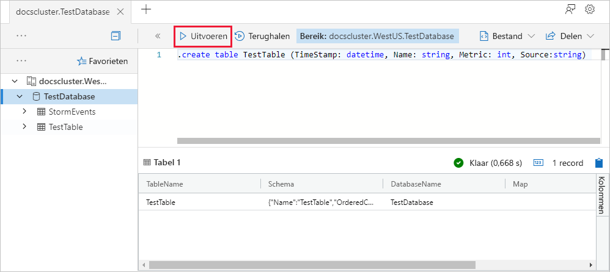

1. Kopieer de volgende opdracht in het venster en selecteer **Uitvoeren** om de binnenkomende JSON-gegevens toe te wijzen aan de kolomnamen en gegevenstypen van de tabel (TestTable).

    ```Kusto
    .create table TestTable ingestion json mapping 'TestMapping' '[{"column":"TimeStamp","path":"$.timeStamp","datatype":"datetime"},{"column":"Name","path":"$.name","datatype":"string"},{"column":"Metric","path":"$.metric","datatype":"int"},{"column":"Source","path":"$.source","datatype":"string"}]'
    ```

## <a name="connect-to-the-event-hub"></a>Verbinding maken met de Event Hub

Nu kunt u vanuit Azure Data Explorer verbinding maken met de event hub. Wanneer deze verbinding is ingesteld, stromen gegevens die via de event hub stromen naar de testtabel die u eerder in dit artikel hebt gemaakt.

1. Selecteer op de werkbalk de optie **Meldingen** om te controleren of de implementatie van de Event Hub is geslaagd.

1. Selecteer onder het gemaakte cluster de optie **Databases** en vervolgens **TestDatabase**.

    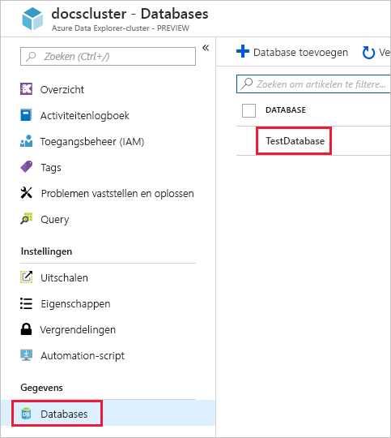

1. Selecteer **Gegevensopname** en **Gegevensverbinding toevoegen**. Vul het formulier in met de volgende gegevens. Selecteer **Maken** wanneer u klaar bent.

    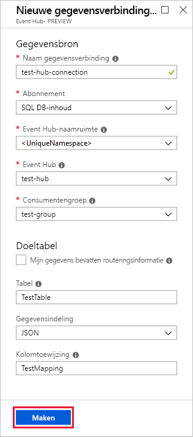

    Gegevensbron:

    **Instelling** | **Voorgestelde waarde** | **Beschrijving van veld**
    |---|---|---|
    | Naam van gegevensverbinding | *test-hub-connection* | De naam van de verbinding die u wilt maken in Azure Data Explorer.|
    | Event hub-naamruimte | Een unieke naam voor de naamruimte | De naam die u eerder hebt gekozen om de naamruimte te identificeren. |
    | Event Hub | *test-hub* | De Event Hub die u hebt gemaakt. |
    | Consumentengroep | *test-group* | De consumentengroep die u hebt gedefinieerd in de gemaakte Event Hub. |
    | | |

    Doeltabel:

    Er zijn twee opties voor de routering: *statische* en *dynamische*. Voor deze snelstart gebruikt u statische routering (standaardinstelling), waarbij u de tabelnaam, bestandsindeling en toewijzing opgeeft. Laat **Mijn gegevens omvatten routeringsgegevens** daarom uitgeschakeld.
    U kunt ook dynamische routering gebruiken, waarbij uw gegevens benodigde routeringsgegevens bevatten.

     **Instelling** | **Voorgestelde waarde** | **Beschrijving van veld**
    |---|---|---|
    | Tabel | *TestTable* | De tabel die u hebt gemaakt in **TestDatabase**. |
    | Gegevensindeling | *JSON* | Ondersteunde indelingen zijn Avro, CSV, JSON, MULTILINE JSON, PSV, SOH, SCSV, TSV en TXT. |
    | Toewijzen van kolommen | *TestMapping* | De toewijzing die u hebt gemaakt in **TestDatabase** en waarmee die binnenkomende JSON-gegevens worden toegewezen aan de kolomnamen en gegevenstypen van **TestTable**.|
    | | |

## <a name="copy-the-connection-string"></a>De verbindingsreeks kopiëren

Wanneer u de [voorbeeld-app](https://github.com/Azure-Samples/event-hubs-dotnet-ingest) uitvoert die in Vereisten wordt genoemd, hebt u de verbindingsreeks nodig voor de naamruimte van de Event Hub.

1. Onder de naamruimte van de Event Hub die u hebt gemaakt, selecteert u **Gedeeld toegangsbeleid** en vervolgens **RootManageSharedAccessKey**.

    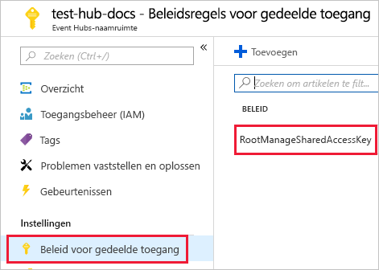

1. Kopieer **Verbindingsreeks - primaire sleutel**. U plak deze in de volgende sectie.

    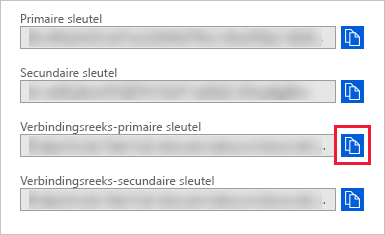

## <a name="generate-sample-data"></a>Voorbeeldgegevens genereren

Gebruik de [voorbeeld-app](https://github.com/Azure-Samples/event-hubs-dotnet-ingest) u hebt gedownload om gegevens te genereren.

1. Open de voorbeeld-app in Visual Studio.

1. Werk in het bestand *program.cs* de constante `connectionString` bij voor de verbindingsreeks die u hebt gekopieerd uit de naamruimte van de Event Hub.

    ```csharp
    const string eventHubName = "test-hub";
    // Copy the connection string ("Connection string-primary key") from your Event Hub namespace.
    const string connectionString = @"<YourConnectionString>";
    ```

1. Bouw de app en voer deze uit. Via de app worden berichten verzonden naar de Event Hub, en wordt elke tien seconden de status afgedrukt.

1. Nadat een aantal berichten is verzonden via de app, gaat u naar de volgende stap: de stroom aan gegevens controleren die in de Event Hub en testtabel stromen.

## <a name="review-the-data-flow"></a>De gegevensstroom controleren

Nu de app gegevens genereert, kunt u de stroom van die gegevens vanuit de event hub naar de tabel in het cluster zien.

1. In de Azure-portal, onder uw Event Hub, ziet u de piek in activiteit terwijl de app wordt uitgevoerd.

    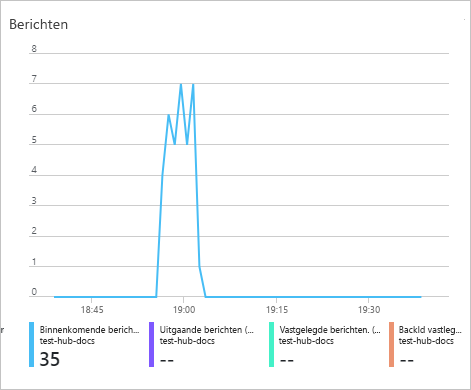

1. Als u wilt controleren hoeveel berichten er op dat moment de database hebben bereikt, voert u de volgende query uit in de testdatabase.

    ```Kusto
    TestTable
    | count
    ```

1. Voer de volgende query uit om de inhoud van de berichten te bekijken:

    ```Kusto
    TestTable
    ```

    De resultatenset ziet er ongeveer als volgt uit:

    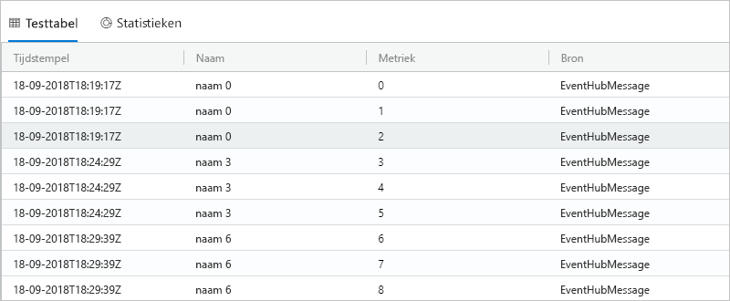

    > [!NOTE]
    > Azure Data Explorer heeft een aggregatiebeleid (batchverwerking) voor gegevensopname, dat is ontworpen om de gegevensopname te optimaliseren. Het beleid is ingesteld op vijf minuten; u kunt dus enige latentie ondervinden.

## <a name="clean-up-resources"></a>Resources opschonen

Als u niet van plan bent de Event Hub opnieuw te gebruiken, wist u de **test-hub-rg** om te voorkomen dat er kosten in rekening worden gebracht.

1. Selecteer in Azure Portal **Resourcegroepen** aan de linkerkant en selecteer vervolgens de resourcegroep die u hebt gemaakt.  

    Als het menu links is samengevouwen, selecteert u  om het menu uit te vouwen.

   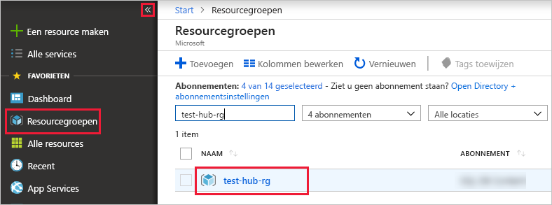

1. Selecteer onder **test-resource-group** de optie **Resourcegroep verwijderen**.

1. Typ in het nieuwe venster de naam van de resourcegroep die u wilt verwijderen (*test-hub-rg*), en klik vervolgens op **Verwijderen**.

## <a name="next-steps"></a>Volgende stappen

> [!div class="nextstepaction"]
> [Snelstart: query's uitvoeren op gegevens in Azure Data Explorer](web-query-data.md)
