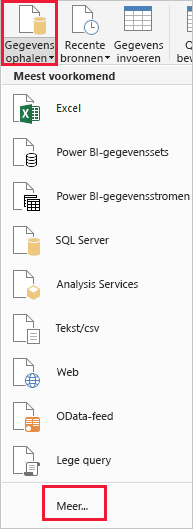
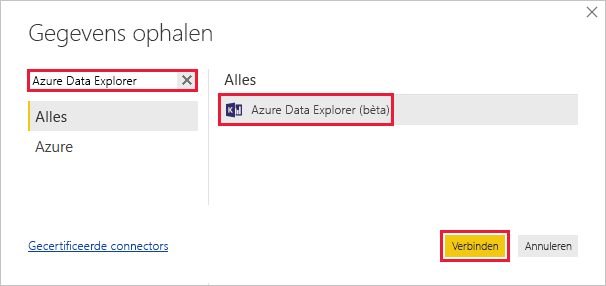
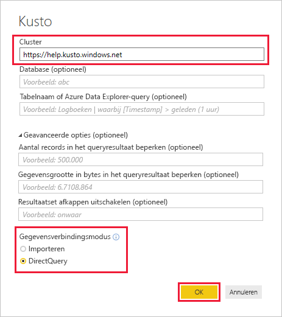
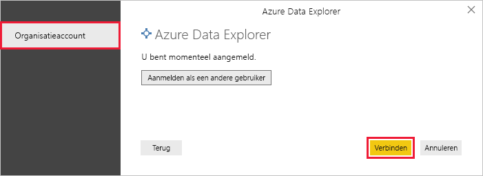
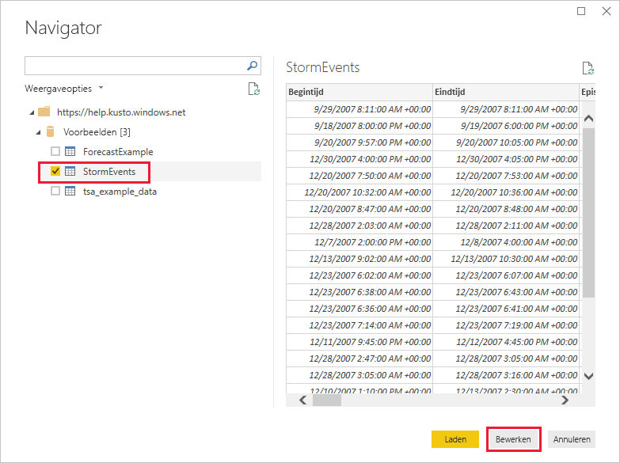
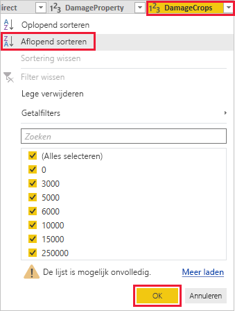
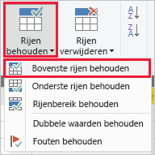
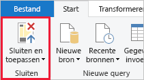

# Quickstart: Gegevens visualiseren met behulp van de Azure Data Explorer-connector voor Power BI

Azure Data Explorer is een snelle en zeer schaalbare service om gegevens in logboeken en telemetrie te verkennen. Power BI is een business analytics-oplossing waarmee u uw gegevens kunt visualiseren en de gegevens kunt delen in uw organisatie.

Azure Data Explorer biedt drie opties om gegevens te verbinden in Power BI: de ingebouwde connector gebruiken, een query importeren uit Azure Data Explorer, of een SQL-query gebruiken. In deze quickstart ziet u hoe u de ingebouwde connector gebruikt om gegevens op te halen en deze te visualiseren in een Power BI-rapport.

Als u nog geen abonnement op Azure hebt, maak dan een [gratis Azure-account](https://azure.microsoft.com/free/) aan voordat u begint.

## Vereisten

U hebt het volgende nodig om deze quickstart te voltooien:

* Een organisatie-e-mailaccount dat lid is van Azure Active Directory, zodat u verbinding kunt maken met het [Azure Data Explorer-helpcluster](https://dataexplorer.azure.com/clusters/help/databases/samples).

* [Power BI Desktop](https://powerbi.microsoft.com/get-started/) (selecteer **GRATIS DOWNLOADEN**)

## Gegevens ophalen uit Azure Data Explorer

Eerst maakt u verbinding met het Azure Data Explorer-helpcluster en daarna haalt u een subset gegevens op uit de tabel *StormEvents*. [!INCLUDE [data-explorer-storm-events](../../includes/data-explorer-storm-events.md)]

1. Ga in Power BI Desktop naar het tabblad **Start** en selecteer de optie **Gegevens ophalen** en vervolgens **Meer**.

    

1. Zoek naar *Azure Data Explorer*, selecteer **Azure Data Explorer (bèta)** en vervolgens **Verbinding maken**.

    

1. Selecteer in het scherm **Preview-connector** de opties **Doorgaan**.

1. In het volgende scherm vult u het formulier in met de volgende gegevens.

    

    **Instelling** | **Waarde** | **Beschrijving van veld**
    |---|---|---|
    | Cluster | *https://help.kusto.windows.net* | De URL voor het helpcluster. Voor andere clusters heeft de URL de notatie *https://\<ClusterName\>.\<Regio\>. kusto.windows.net*. |
    | Database | Leeg laten | Een database die wordt gehost op het cluster waarmee u verbinding maakt. Deze selecteren we in een latere stap. |
    | Tabelnaam | Leeg laten | Een van de tabellen in de database, of een query zoals <code>StormEvents \| take 1000</code>. Deze selecteren we in een latere stap. |
    | Geavanceerde opties | Leeg laten | Opties voor uw query's, zoals grootte van resultatenset. |
    | Gegevensverbindingsmodus | *DirectQuery* | Bepaalt of Power BI de gegevens importeert of rechtstreeks verbinding maakt met de gegevensbron. Met deze connector kunt u een van beide opties gebruiken. |
    | | | |

1. Meld u aan als u nog geen verbinding hebt met het helpcluster. Meld u aan met een organisatieaccount en selecteer **Verbinding maken**.

    

1. In het scherm **Navigator** vouwt u de database **Voorbeelden** uit en selecteert u eerst **StormEvents** en vervolgens **Bewerken**.

    

    De tabel wordt geopend in Power Query-editor. Hier kunt u rijen en kolommen bewerken voordat u de gegevens importeert.

1. In de Power Query-editor selecteert u de pijl naast de kolom **DamageCrops** en klikt u op **Aflopend sorteren**.

    

1. Op het tabblad **Start** selecteert u **Rijen behouden** en vervolgens **Bovenste rijen behouden**. Voer de waarde *1000* in om de bovenste 1000 rijen van de gesorteerde tabel te behouden.

    

1. Selecteer op het tabblad **Start** de optie **Sluiten en toepassen**.

    

## Gegevens visualiseren in een rapport

[!INCLUDE [data-explorer-power-bi-visualize-basic](../../includes/data-explorer-power-bi-visualize-basic.md)]

## Resources opschonen

Als u het rapport dat u voor deze quickstart hebt gemaakt niet meer nodig hebt, verwijdert u het Power BI Desktop-bestand (.pbix).

## Volgende stappen

> [!div class="nextstepaction"]
> [Snelstart: Gegevens visualiseren met behulp van een geïmporteerde query in Power BI](power-bi-imported-query.md)
