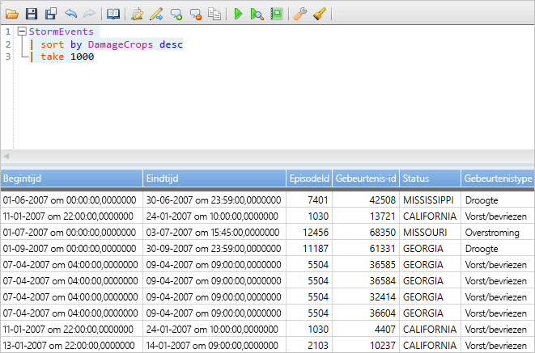
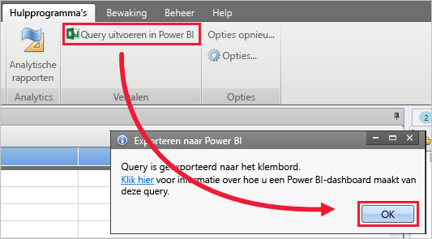
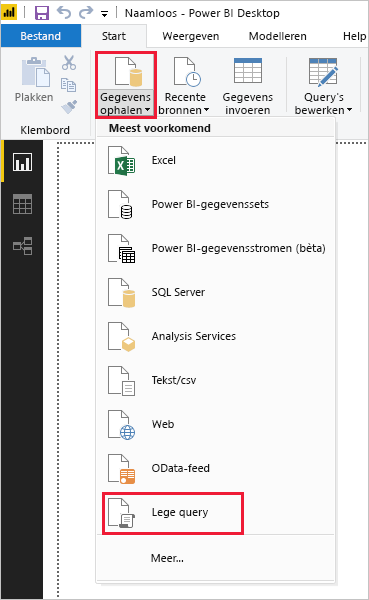
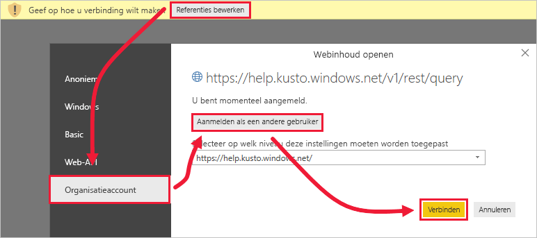
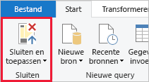

# <a name="quickstart-visualize-data-using-a-query-imported-into-power-bi"></a>Quickstart: Gegevens visualiseren met behulp van een query die is geïmporteerd in Power BI

Azure Data Explorer is een snelle en zeer schaalbare service om gegevens in logboeken en telemetrie te verkennen. Power BI is een business analytics-oplossing waarmee u uw gegevens kunt visualiseren en de gegevens kunt delen in uw organisatie.

Azure Data Explorer biedt drie opties waarmee u verbinding kunt maken met gegevens in Power BI: de ingebouwde connector gebruiken, een query importeren uit Azure Data Explorer, of een SQL-query gebruiken. In deze quickstart ziet u hoe u een query importeert zodat u gegevens kunt ophalen en deze kunt visualiseren in een Power BI-rapport.

Als u nog geen abonnement op Azure hebt, maak dan een [gratis Azure-account](https://azure.microsoft.com/free/) aan voordat u begint.

## <a name="prerequisites"></a>Vereisten

U hebt het volgende nodig om deze quickstart te voltooien:

* Een organisatie-e-mailaccount dat lid is van Azure Active Directory, zodat u verbinding kunt maken met het [Azure Data Explorer-helpcluster](https://dataexplorer.azure.com/clusters/help/databases/samples).

* [Power BI Desktop](https://powerbi.microsoft.com/get-started/) (selecteer **GRATIS DOWNLOADEN**)

* [Azure Data Explorer-desktop-app](/azure/kusto/tools/kusto-explorer)

## <a name="get-data-from-azure-data-explorer"></a>Gegevens ophalen uit Azure Data Explorer

Eerst maakt u een query in de Azure Data Explorer-desktop-app en exporteert u deze voor gebruik in Power BI. Vervolgens maakt u verbinding met het Azure Data Explorer-helpcluster en haalt u een subset gegevens op uit de tabel *StormEvents*. [!INCLUDE [data-explorer-storm-events](../../includes/data-explorer-storm-events.md)]

1. Ga in een browser naar [https://help.kusto.windows.net/](https://help.kusto.windows.net/) om de Azure Data Explorer-desktop-app te starten.

1. Kopieer in de desktop-app de volgende query in het queryvenster rechtsboven, en voer deze uit.

    ```Kusto
    StormEvents
    | sort by DamageCrops desc
    | take 1000
    ```

    De eerste paar rijen van de resultatenset zien eruit zoals in de volgende afbeelding.

    

1. Selecteer op het tabblad **Hulpprogramma’s** de optie **Query uitvoeren in Power BI**, en selecteer **OK**.

    

1. Selecteer in Power BI Desktop op het tabblad **Start** de optie **Gegevens ophalen** en vervolgens **Lege query**.

    

1. Selecteer in de Power Query-editor op het tabblad **Start** de optie **Geavanceerde editor**.

1. Plak in het venster **Geavanceerde editor** de query die u hebt geëxporteerd, en selecteer vervolgens **Gereed**.

    

1. Selecteer in het hoofdvenster van de Power Query-editor de optie **Referenties bewerken**. Selecteer **Organisatieaccount**, meld u aan, en selecteer **Verbinding maken**.

    

1. Selecteer op het tabblad **Start** de optie **Sluiten en toepassen**.

    

## <a name="visualize-data-in-a-report"></a>Gegevens visualiseren in een rapport

[!INCLUDE [data-explorer-power-bi-visualize-basic](../../includes/data-explorer-power-bi-visualize-basic.md)]

## <a name="clean-up-resources"></a>Resources opschonen

Als u het rapport dat u hebt gemaakt voor deze quickstart, niet meer nodig hebt, verwijdert u het Power BI Desktop-bestand (.pbix).

## <a name="next-steps"></a>Volgende stappen

> [!div class="nextstepaction"]
> [Quickstart: Gegevens visualiseren met behulp van een geïmporteerde query in Power BI](power-bi-sql-query.md)