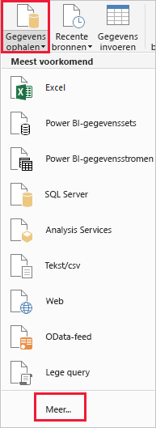
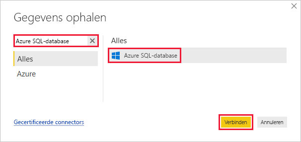
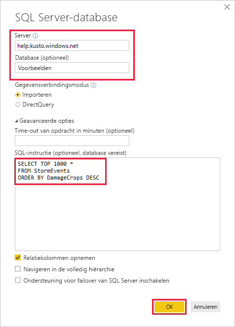
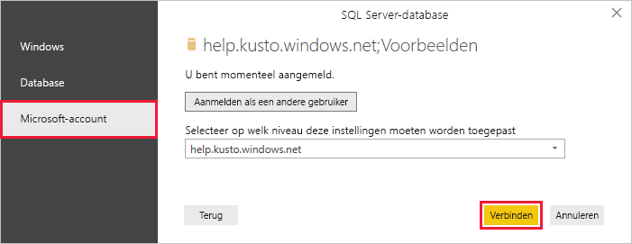
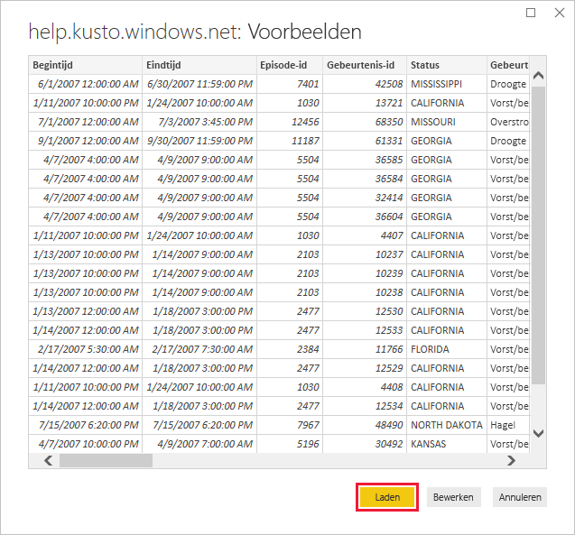

# <a name="quickstart-visualize-data-using-the-azure-data-explorer-connector-for-power-bi"></a>Quickstart: Gegevens visualiseren met de Azure Data Explorer-connector voor Power BI

Azure Data Explorer is een snelle en zeer schaalbare service om gegevens in logboeken en telemetrie te verkennen. Power BI is een business analytics-oplossing waarmee u uw gegevens kunt visualiseren en de gegevens kunt delen in uw organisatie.

Azure Data Explorer biedt drie opties om gegevens te verbinden in Power BI: de ingebouwde connector gebruiken, een query importeren uit Azure Data Explorer, of een SQL-query gebruiken. In deze quickstart ziet u hoe u een SQL-query gebruikt om gegevens op te halen en te visualiseren in een Power BI-rapport.

Als u nog geen abonnement op Azure hebt, maak dan een [gratis Azure-account](https://azure.microsoft.com/free/) aan voordat u begint.

## <a name="prerequisites"></a>Vereisten

U hebt het volgende nodig om deze quickstart te voltooien:

* Een organisatie-e-mailaccount dat lid is van Azure Active Directory, zodat u verbinding kunt maken met het [Azure Data Explorer-helpcluster](https://dataexplorer.azure.com/clusters/help/databases/samples).

* [Power BI Desktop](https://powerbi.microsoft.com/get-started/) (selecteer **GRATIS DOWNLOADEN**)

## <a name="get-data-from-azure-data-explorer"></a>Gegevens ophalen uit Azure Data Explorer

Eerst maakt u verbinding met het Azure Data Explorer-helpcluster en daarna haalt u een subset gegevens op uit de tabel *StormEvents*. [!INCLUDE [data-explorer-storm-events](../../includes/data-explorer-storm-events.md)]

Doorgaans gebruikt u de systeemeigen querytaal met Azure Data Explorer, maar deze ondersteunt ook SQL-query's, en die gaat u hier gebruiken. Azure Data Explorer vertaalt de SQL-query voor u in een systeemeigen query.

1. Ga in Power BI Desktop naar het tabblad **Start** en selecteer de optie **Gegevens ophalen** en vervolgens **Meer**.

    

1. Zoek naar *Azure SQL Database*, selecteer **Azure SQL Database** en vervolgens **Verbinding maken**.

    

1. Vul het formulier in het scherm **SQL Server-database** in met de volgende informatie.

    

    **Instelling** | **Waarde** | **Beschrijving van veld**
    |---|---|---|
    | Server | *help.kusto.windows.net* | De URL voor het helpcluster (zonder *https://*). Voor andere clusters heeft de URL de notatie *\<ClusterName\>.\<Regio\>. kusto.windows.net*. |
    | Database | *Voorbeelden* | De voorbeelddatabase die wordt gehost op het cluster waarmee u verbinding maakt. |
    | Gegevensverbindingsmodus | *Importeren* | Bepaalt of Power BI de gegevens importeert of rechtstreeks verbinding maakt met de gegevensbron. Met deze connector kunt u een van beide opties gebruiken. |
    | Time-out van opdracht | Leeg laten | Hoe lang de query wordt uitgevoerd voordat deze een time-outfout genereert. |
    | SQL-instructie | Kopieer de query onder deze tabel | De SQL-instructie die door Azure Data Explorer wordt vertaald in een systeemeigen query. |
    | Andere opties | Behoud de standaardwaarden | Opties zijn niet van toepassing op Azure Data Explorer-clusters. |
    | | | |

    ```SQL
    SELECT TOP 1000 *
    FROM StormEvents
    ORDER BY DamageCrops DESC
    ```

1. Meld u aan als u nog geen verbinding hebt met het helpcluster. Meld u aan met een Microsoft-account en selecteer vervolgens **Verbinding maken**.

    

1. Selecteer in het scherm **help.kusto.windows.net: Voorbeelden** de optie **Laden**.

    

    De tabel wordt geopend in het hoofdvenster van de Power BI, in de rapportweergave waarin u rapporten kunt maken op basis van de voorbeeldgegevens.

## <a name="visualize-data-in-a-report"></a>Gegevens visualiseren in een rapport

[!INCLUDE [data-explorer-power-bi-visualize-basic](../../includes/data-explorer-power-bi-visualize-basic.md)]

## <a name="clean-up-resources"></a>Resources opschonen

Als u het rapport dat u voor deze quickstart hebt gemaakt niet meer nodig hebt, verwijdert u het Power BI Desktop-bestand (.pbix).

## <a name="next-steps"></a>Volgende stappen

> [!div class="nextstepaction"]
> [Quickstart: Gegevens visualiseren met behulp van een geïmporteerde query in Power BI](power-bi-connector.md)