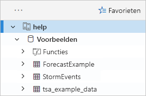
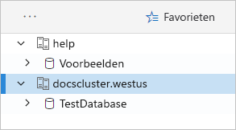
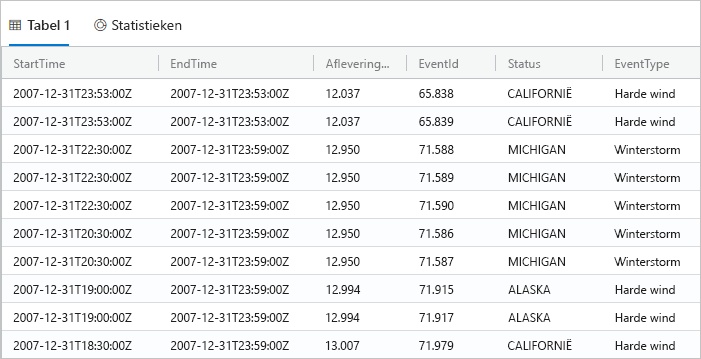
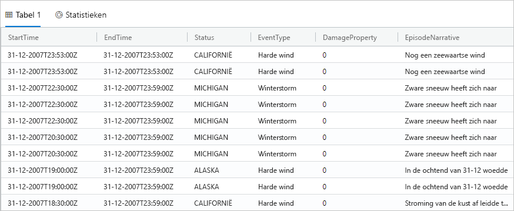
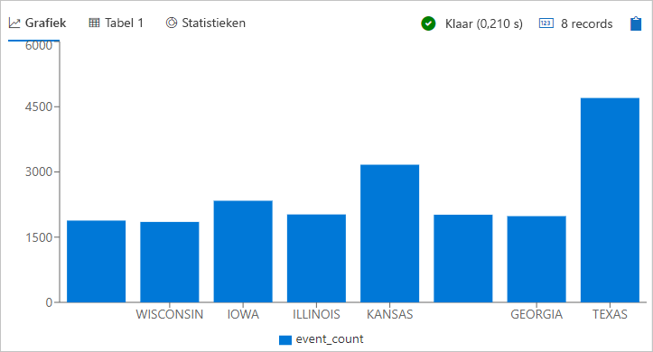
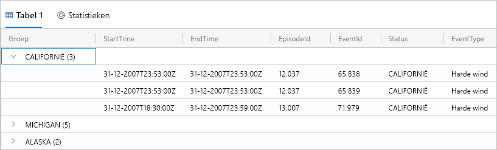
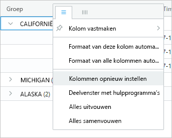
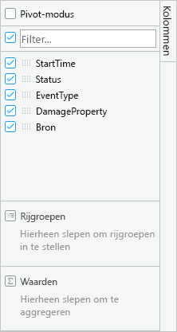
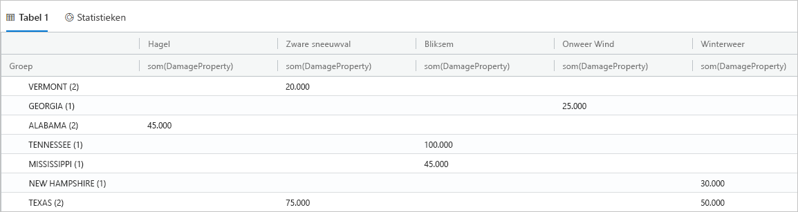
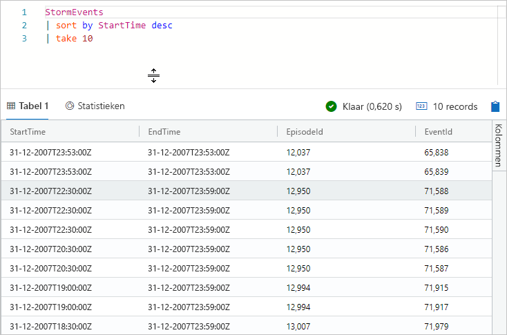

# <a name="quickstart-query-data-in-azure-data-explorer"></a>Snelstart: Query's uitvoeren op gegevens in Azure Data Explorer

Azure Data Explorer is een snelle en zeer schaalbare service om gegevens in logboeken en telemetrie te verkennen. Azure Data Explorer is een webtoepassing voor het uitvoeren en delen van query's. De toepassing is beschikbaar in de Azure Portal en als een zelfstandige webtoepassing. In dit artikel werkt u in de zelfstandige versie, waarmee u verbinding kunt maken met meerdere clusters en dieptekoppelingen naar uw query's kunt delen.

Als u nog geen abonnement op Azure hebt, maak dan een [gratis Azure-account](https://azure.microsoft.com/free/) aan voordat u begint.

## <a name="prerequisites"></a>Vereisten

Naast een Azure-abonnement hebt u een [cluster en database voor testdoeleinden](create-cluster-database-portal.md) nodig om deze snelstart te voltooien.

## <a name="sign-in-to-the-application"></a>Aanmelden bij Azure Portal

Meld u aan bij [de toepassing](https://dataexplorer.azure.com/).

## <a name="add-clusters"></a>Clusters toevoegen

Wanneer u de toepassing voor het eerst opent, zijn er geen verbindingen.


U moet een verbinding voor ten minste één cluster toevoegen voordat u query's kunt uitvoeren. In deze sectie gaat u verbindingen toevoegen aan het cluster *help* dat we al voor u hebben ingesteld en aan het testcluster dat u in een vorige snelstart hebt gemaakt.

1. Selecteer in de linkerbovenhoek van de toepassing **Add Cluster**.

1. In de **toevoegen cluster** in het dialoogvenster, voer de URI en selecteer vervolgens **toevoegen**.

   U kunt het helpcluster URI, `https://help.kusto.windows.net`. Als u uw eigen cluster hebt, geeft u de URI van het cluster. Bijvoorbeeld, `https://mydataexplorercluster.westus.kusto.windows.net` zoals in de volgende afbeelding:

    

1. In het linkerdeelvenster ziet u nu het cluster **help**. Vouw de database **Samples** uit, zodat u de voorbeeldtabellen ziet waartoe u toegang hebt.

    

    We gebruiken de tabel **StormEvents** verderop in deze snelstart en in andere artikelen over Azure Data Explorer.

Voeg nu het testcluster toe dat u hebt gemaakt.

1. Selecteer **Add Cluster**.

1. Voer in het dialoogvenster **Add Cluster** de URL van het testcluster in met de notatie `https://<ClusterName>.<Region>.kusto.windows.net/` en selecteer vervolgens **Toevoegen**.

    In het onderstaande voorbeeld ziet u het cluster **help** en een nieuw cluster, **docscluster.westus** (de volledige URL is `https://docscluster.westus.kusto.windows.net/`).

    

## <a name="run-queries"></a>Query's uitvoeren

U kunt nu op beide verbonden clusters query's uitvoeren (ervan uitgaand dat er gegevens in uw testcluster staan). We concentreren ons op het cluster **help**.

1. Selecteer in het linkerdeelvenster, onder het cluster **help**, de database **Samples**.

1. Kopieer en plak de volgende query in het queryvenster. Selecteer **Run** bovenaan het venster.

    ```Kusto
    StormEvents
    | sort by StartTime desc
    | take 10
    ```
    Deze query retourneert de tien meest recente records uit de tabel **StormEvents**. De linkerkant van de resultatenset ziet er ongeveer uit als deze tabel.

    

    De volgende afbeelding toont de status die de toepassing nu moet hebben, met clusters die zijn toegevoegd en een query met resultaten.

    

1. Kopieer en plak de volgende query in het queryvenster, onder de eerste query. U ziet dat de query niet wordt verdeeld over afzonderlijke regels, zoals bij de eerste query.

    ```Kusto
    StormEvents | sort by StartTime desc | project StartTime, EndTime, State, EventType, DamageProperty, EpisodeNarrative | take 10
    ```

1. Klik op de nieuwe query in het venster om de query te selecteren. Druk op Shift + Alt + F om de query op te maken, zodat deze er als volgt uitziet.

    

1. Druk op Shift + Enter, de snelkoppeling voor het uitvoeren van een query.

   Deze query retourneert dezelfde records als de eerste query, maar alleen de kolommen die zijn opgegeven in de instructie `project`. De resultatenset ziet er uit als de volgende tabel.

    

1. Selecteer bovenaan het venster de optie **Recall**.

    Het queryvenster bevat nu de resultatenset van de eerste query zonder dat u de query opnieuw hoeft uit te voeren. Tijdens een analyse worden er vaak meerdere query's uitgevoerd en met **Recall** kunt u eenvoudig teruggaan naar het resultaat van eerdere query's.

1. We voeren nog een query uit om een ander type uitvoer te zien.

    ```Kusto
    StormEvents
    | summarize event_count=count(), mid = avg(BeginLat) by State
    | sort by mid
    | where event_count > 1800
    | project State, event_count
    | render columnchart
    ```
    De resultatenset moet er ongeveer uitzien als de volgende grafiek.

    

## <a name="work-with-the-table-grid"></a>Werken met het tabelraster

Nu u hebt gezien hoe eenvoudige query's werken, gaan we kijken hoe u het tabelraster kunt gebruiken om resultaten aan te passen en een verdere analyse uit te voeren.

1. Voer de eerste query opnieuw uit. Beweeg de muis over de kolom **State**, selecteer het menu en selecteer **Group by State**.

    

1. Vouw in het raster **California** uit om records voor die staat te zien.

    

    Dit type groepering kan handig zijn bij het uitvoeren van een verkennende analyse.

1. Beweeg de muis over de kolom **Group** en selecteer vervolgens **Reset Colums** in het menu.

    

    Het raster wordt hersteld in de oorspronkelijke staat.

1. Voer de volgende query uit.

    ```Kusto
    StormEvents
    | sort by StartTime desc
    | where DamageProperty > 5000
    | project StartTime, State, EventType, DamageProperty, Source
    | take 10
    ```

1. Selecteer aan de rechterkant van het raster **Columns** om het deelvenster met hulpprogramma's weer te geven.

    

    Dit deelvenster is vergelijkbaar met de lijst met draaitabelvelden in Excel en stelt u in staat om aanvullende analyse uit te voeren in het raster zelf.

1. Selecteer **Pivot Mode** en versleep de kolommen als volgt: **State** naar **Row Groups**, **DamageProperty** naar **Values** en **EventType** naar **Column labels**.  

    

    De resultatenset ziet er ongeveer uit als de volgende draaitabel.

    

    U ziet dat Vermont en Alabama twee gebeurtenissen hebben in dezelfde categorie, terwijl Texas twee gebeurtenissen in verschillende categorieën heeft. Gebruik draaitabellen om snel gegevens zoals deze te vinden. Draaitabellen zijn een uitstekend hulpmiddel voor een snelle analyse.

## <a name="share-queries"></a>Query's delen

Het zal regelmatig voorkomen dat u de query's die u maakt met anderen wilt delen. U kunt in dat geval een dieptekoppeling versturen, zodat andere gebruikers met toegang tot het cluster de query's kunnen uitvoeren.

1. Selecteer in het queryvenster de eerste query die u hebt gekopieerd.

1. Selecteer bovenaan het venster de optie **Share**.

1. Selecteer **Link, query to clipboard**.

1. Kopieer de koppeling en query naar een tekstbestand.

1. Plak de koppeling in een nieuw browservenster. De resultatenset ziet er ongeveer als volgt uit nadat de query is uitgevoerd.

    

## <a name="provide-feedback"></a>Feedback geven

Data Explorer is momenteel in preview en we stellen feedback over uw ervaring dan ook zeer op prijs. U kunt dit nu doen of wachten totdat u wat meer met de service hebt gewerkt.

1. Selecteer in de rechterbovenhoek van de toepassing het pictogram Feedback: .

1. Geef uw feedback en selecteer vervolgens **Submit**.

## <a name="clean-up-resources"></a>Resources opschonen

In deze snelstart zijn geen resources gemaakt. Als u echter een of beide clusters wilt verwijderen uit de toepassing, klikt u met de rechtermuisknop op het cluster en selecteert u **Verbinding verwijderen**.

## <a name="next-steps"></a>Volgende stappen

> [!div class="nextstepaction"]
> [Query's schrijven voor Azure Data Explorer](write-queries.md)
