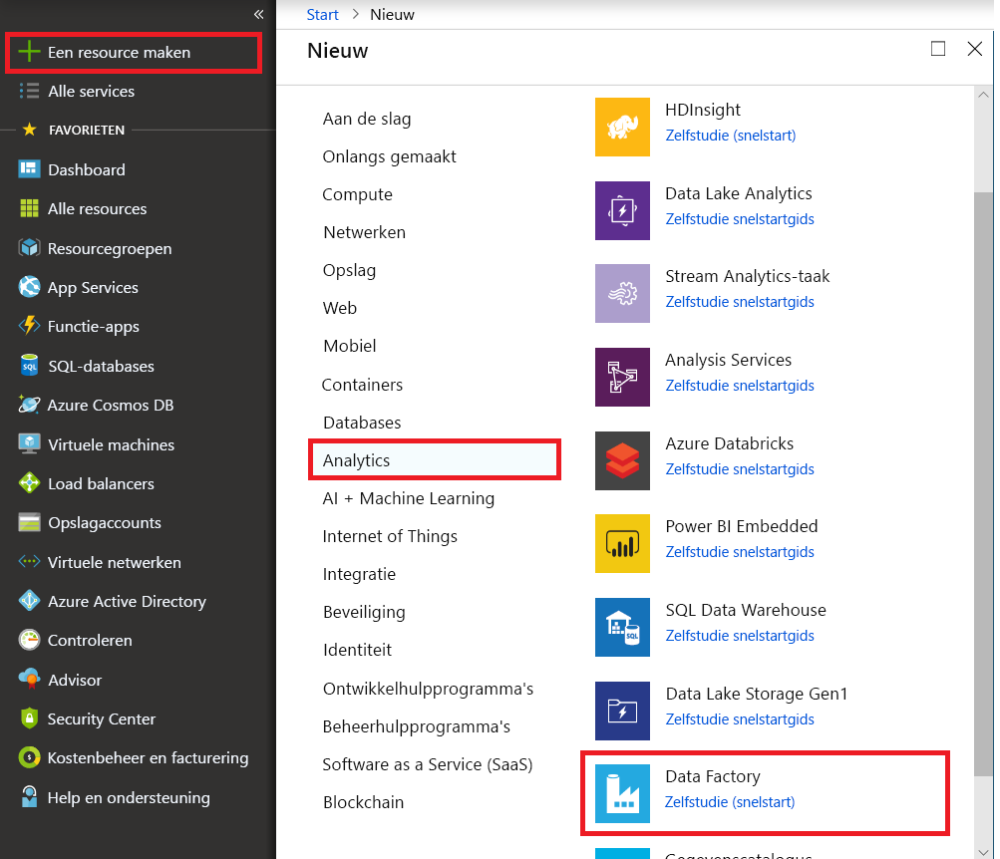
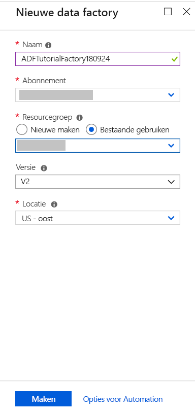
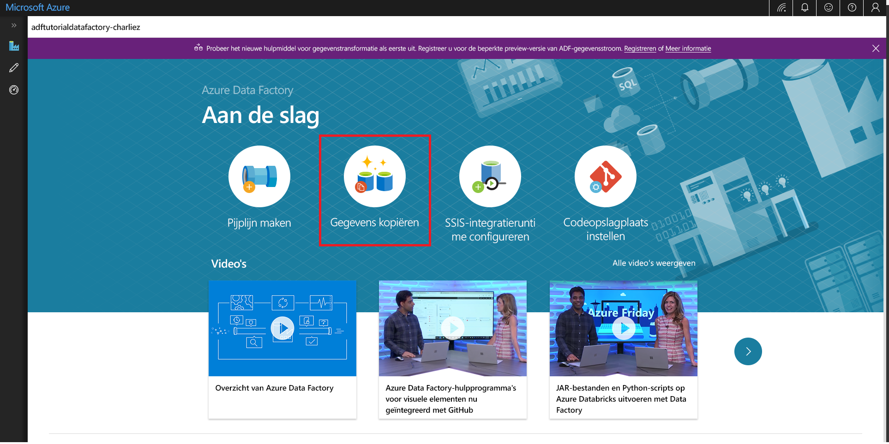

# Het hulpprogramma Copy Data gebruiken om gegevens te kopiëren 
> [!div class="op_single_selector" title1="Select the version of Data Factory service that you are using:"]
> * [Versie 1:](v1/data-factory-copy-data-from-azure-blob-storage-to-sql-database.md)
> * [Huidige versie](quickstart-create-data-factory-copy-data-tool.md)

In deze snelstart gebruikt u Azure Portal voor het maken van een data factory. Gebruik vervolgens het hulpprogramma Copy Data om een pijplijn te maken waarmee gegevens uit een map in Azure Blob Storage worden gekopieerd naar een andere map. 

> [!NOTE]
> Als u niet bekend bent met Azure Data Factory, raadpleegt u eerst de [Inleiding voor Azure Data Factory](data-factory-introduction.md) voordat u deze quickstart uitvoert. 

[!INCLUDE [data-factory-quickstart-prerequisites](../../includes/data-factory-quickstart-prerequisites.md)] 

## Een gegevensfactory maken

1. Selecteer **Nieuw** in het menu links, selecteer **Gegevens en analyses** en selecteer vervolgens **Data Factory**. 
   
   
1. Voer op de pagina **Nieuwe data factory** **ADFTutorialDataFactory** in als **naam**. 
      
   
 
   De naam van de Azure-gegevensfactory moet *wereldwijd uniek* zijn. Als u het volgende foutbericht ziet, wijzigt u de naam van de data factory (bijvoorbeeld **&lt;uwnaam&gt;ADFTutorialDataFactory**) en probeert u het opnieuw. Zie het artikel [Data factory - Naamgevingsregels](naming-rules.md) voor naamgevingsregels voor Data Factory-artefacten.
  
   
1. Selecteer voor **Abonnement** het Azure-abonnement waarin u de gegevensfactory wilt maken. 
1. Voer een van de volgende stappen uit voor **Resourcegroep**:
     
   - Selecteer **Bestaande gebruiken** en selecteer een bestaande resourcegroep in de lijst. 
   - Selecteer **Nieuwe maken** en voer de naam van een resourcegroep in.   
         
   Zie [Resourcegroepen gebruiken om Azure-resources te beheren](../azure-resource-manager/resource-group-overview.md) voor meer informatie.  
1. Selecteer **V2** als **Versie**.
1. Selecteer voor **Locatie** een locatie voor de data factory. 

   In de lijst worden alleen ondersteunde locaties getoond. De gegevensarchieven (zoals Azure Storage en Azure SQL Database) en -berekeningen (zoals Azure HDInsight) die Data Factory gebruikt, kunnen zich in andere locaties of regio's bevinden.

1. Selecteer **Vastmaken aan dashboard**.     
1. Selecteer **Maken**.
1. Op het dashboard ziet u de volgende tegel met de status: **Data Factory implementeren**: 

    
1. Wanneer het maken is voltooid, ziet u de pagina **Data Factory**. Selecteer de tegel **Maken en controleren** om de gebruikersinterface (UI) van Azure Data Factory te openen op een afzonderlijk tabblad.
   
   

## Het hulpprogramma Copy Data starten

1. Selecteer op de pagina **Aan de slag** de tegel **Copy Data** om het hulpprogramma Copy Data te starten. 

   

1. Op de pagina **Eigenschappen** van het hulpprogramma Copy Data, kunt u een naam en beschrijving opgeven voor de pijplijn. Selecteer vervolgens **Volgende**. 

   
1. Voltooi op de pagina **Brongegevensarchief** de volgende stappen:

    a. Klik op **+ Nieuwe verbinding maken** om een verbinding toe te voegen.

    

    b. Selecteer in de galerie de optie **Azure Blob Storage**. Selecteer vervolgens **Volgende**.

    

    c. Selecteer op de pagina **Azure Blob Storage-account opgeven** uw opslagaccount in de lijst **Naam van opslagaccount** en selecteer **Voltooien**. 

   

   d. Selecteer de zojuist gemaakte gekoppelde service als bron. Klik vervolgens op **Volgende**.

   

1. Voltooi op de pagina **Invoerbestand of invoermap kiezen** de volgende stappen:

   a. Klik op **Bladeren** om naar de map **adftutorial/input** te gaan en selecteer het bestand **emp.txt**. Klik vervolgens op **Kiezen**. 

   

   d. Schakel de optie **Binair exemplaar** in om het bestand as-is te kopiëren. Selecteer vervolgens **Volgende**. 

   

1. Selecteer op de pagina **Doelgegevensarchief** de gekoppelde **Azure Blob Storage**-service die u zojuist hebt gemaakt. Selecteer vervolgens **Volgende**. 

   

1. Voer op de pagina **Uitvoerbestand of uitvoermap kiezen** voor het mappad in: **adftutorial/output**. Selecteer vervolgens **Volgende**. 

    

1. Selecteer op de pagina **Instellingen** de optie **Volgende** om de standaardconfiguraties te gebruiken. 

1. Controleer op de pagina **Overzicht** alle instellingen. Selecteer vervolgens **Volgende**. 

    

1. Selecteer op de pagina **Implementatie voltooid** de optie **Controleren** om de pijplijn of taak die u hebt gemaakt, te controleren. 

    

1. De toepassing wordt overgeschakeld naar het **Monitor**-tabblad. U ziet de status van de pijplijn op dit tabblad. Selecteer **Vernieuwen** om de lijst te vernieuwen. 
    
    

1. Selecteer de koppeling **Uitvoeringen van activiteit weergeven** in de kolom **Acties**. De pijplijn heeft slechts één activiteit van het type **Kopiëren**. 

    
    
1. Selecteer de koppeling **Details** (afbeelding van een bril) in de kolom **Acties** om details over de kopieerbewerking weer te geven. Zie [Overzicht van kopieeractiviteit](copy-activity-overview.md) voor meer informatie over de eigenschappen.

    

1. Controleer of er een **emp.txt**- bestand is gemaakt in de **uitvoermap** van de container **adftutorial**. Als de uitvoermap niet bestaat, wordt deze automatisch aangemaakt in de Data Factory-service. 

1. Schakel over naar het tabblad **Auteur** boven het tabblad **Monitor** op het linkerpaneel, zodat u de gekoppelde services, gegevenssets en pijplijnen kunt bewerken. Zie [Een gegevensfactory maken in Azure Portal](quickstart-create-data-factory-portal.md) voor meer informatie over het bewerken hiervan in de gebruikersinterface van Data Factory.

## Volgende stappen
Met de pijplijn in dit voorbeeld worden gegevens gekopieerd van de ene locatie naar een andere locatie in Azure Blob Storage. Doorloop de [zelfstudies](tutorial-copy-data-portal.md) voor meer informatie over het gebruiken van Data Factory in andere scenario's. 