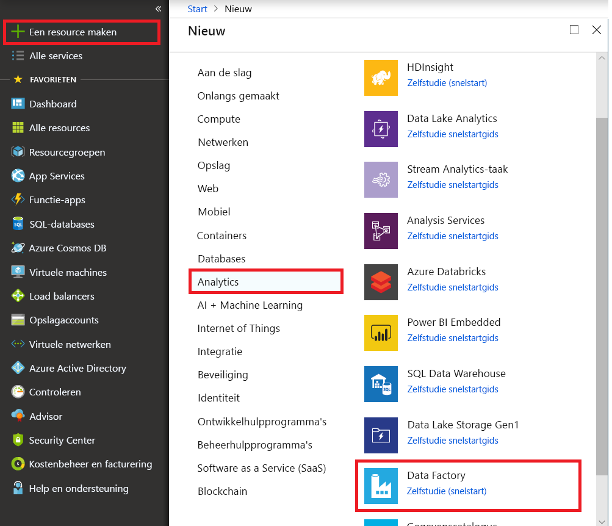
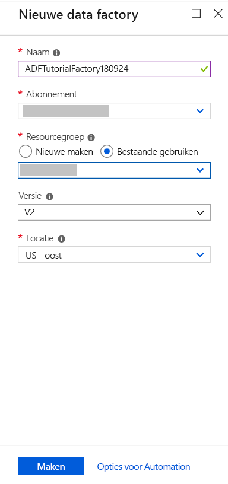

# Een Azure data factory maken met behulp van Azure-portal
Azure Data Factory is een cloudgebaseerde gegevensintegratieservice waarmee u gegevensgestuurde werkstromen kunt maken in de cloud. Op deze manier kunt u de verplaatsing en transformatie van gegevens indelen en automatiseren. Met Azure Data Factory kunt u gegevensgestuurde werkstromen (ook wel pijplijnen) maken en plannen die gegevens uit verschillende gegevensarchieven kunnen opnemen en de gegevens kunnen verwerken/transformeren met behulp van rekenservices zoals Azure HDInsight Hadoop, Spark, Azure Data Lake Analytics en Azure Machine Learning. Daarnaast kunt u de uitvoergegevens publiceren naar gegevensarchieven zoals Azure SQL Data Warehouse, zodat BI-toepassingen (business intelligence) ze kunnen gebruiken. 

In deze snelstartgids gebruikt u Azure Portal voor het maken van een data factory. Nadat u de data factory hebt gemaakt, moet u in andere snelstartgidsen PowerShell, .NET SDK, Python SDK of REST API gebruiken om een pijplijn te maken waarmee gegevens van een brongegevensopslag naar een doelgegevensopslag worden gekopieerd. Momenteel is het niet mogelijk om met behulp van Azure Portal pijplijnen te maken in een data factory.

Als u nog geen Azure-abonnement hebt, maakt u een [gratis account](https://azure.microsoft.com/free/) voordat u begint.

## Aanmelden bij Azure Portal
Meld u aan bij [Azure Portal](https://portal.azure.com/).

## Een data factory maken
Hier volgen de stappen die u uitvoert als onderdeel van deze snelstartgids:
1. Klik op **Nieuw** in het linkermenu en klik vervolgens op **Gegevens en analyses** en **Data Factory**. 
   
   
2. Voer op de blade **Nieuwe data factory** **ADFTutorialDataFactory** in bij **name**. 
      
     
 
   De naam van de Azure-gegevensfactory moet **wereldwijd uniek** zijn. Als u het volgende foutbericht krijgt, wijzigt u de naam van de gegevensfactory (bijvoorbeeld uwnaamADFTutorialDataFactory) en probeert u het opnieuw. Raadpleeg het onderwerp [Data Factory - Naamgevingsregels](naming-rules.md) voor meer informatie over naamgevingsregels voor Data Factory-artefacten.
  
       `Data factory name “ADFTutorialDataFactory” is not available`
3. Selecteer het Azure-**abonnement** waarin u de gegevensfactory wilt maken. 
4. Voer een van de volgende stappen uit voor de **Resourcegroep**:
     
      - Selecteer **Bestaande gebruiken** en selecteer een bestaande resourcegroep in de vervolgkeuzelijst. 
      - Selecteer **Nieuwe maken** en voer de naam van een resourcegroep in.   
         
      Voor sommige van de stappen in deze snelstartgids wordt ervan uitgegaan dat u voor de resourcegroep de naam **ADFTutorialResourceGroup** gebruikt. Zie [Resourcegroepen gebruiken om Azure-resources te beheren](../azure-resource-manager/resource-group-overview.md) voor meer informatie.  
4. Selecteer **V2 (Preview)** als de **versie**.
5. Selecteer de **locatie** voor de gegevensfactory. Op dit moment kunt u alleen in de regio **VS-Oost** V2-data factory's maken. De compute en gegevensopslag die in data factory's worden gebruikt, kunnen zich echter in andere regio's bevinden. 
6. Selecteer **Vastmaken aan dashboard**.     
7. Klik op **Create**.
      
      > [!IMPORTANT]
      > Als u Data Factory-exemplaren wilt maken, moet u lid zijn van de rol [Inzender Data Factory](../active-directory/role-based-access-built-in-roles.md#data-factory-contributor) op abonnements-/resourcegroepsniveau.
      > 
      > De naam van de gegevensfactory wordt in de toekomst mogelijk geregistreerd als DNS-naam en wordt daarmee ook voor iedereen zichtbaar.             
3. Op het dashboard ziet u de volgende tegel met de status: **Gegevensfactory implementeren**. 

    
1. Wanneer het maken is voltooid, ziet u de blade **Data Factory** zoals in de afbeelding is weergegeven.
   
   

## Volgende stappen
Met de pijplijn in dit voorbeeld worden gegevens gekopieerd van de ene locatie naar een andere locatie in een Azure Blob-opslag. Doorloop de [zelfstudies](tutorial-copy-data-dot-net.md) voor meer informatie over het gebruiken van Data Factory in andere scenario's. 