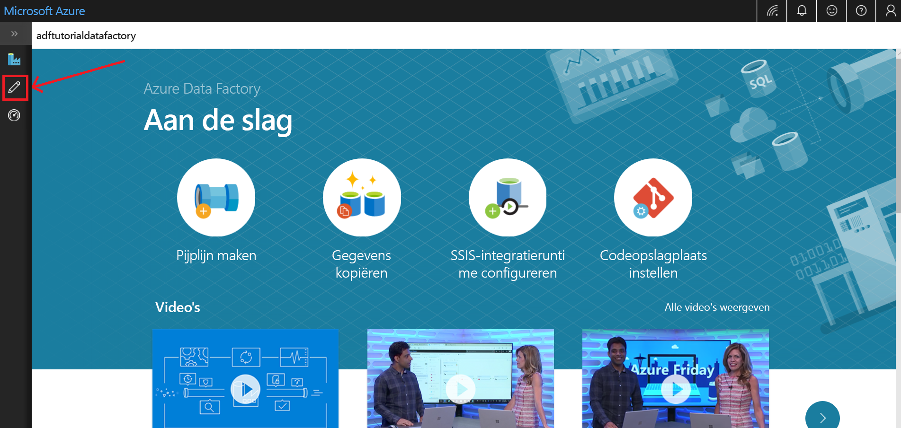
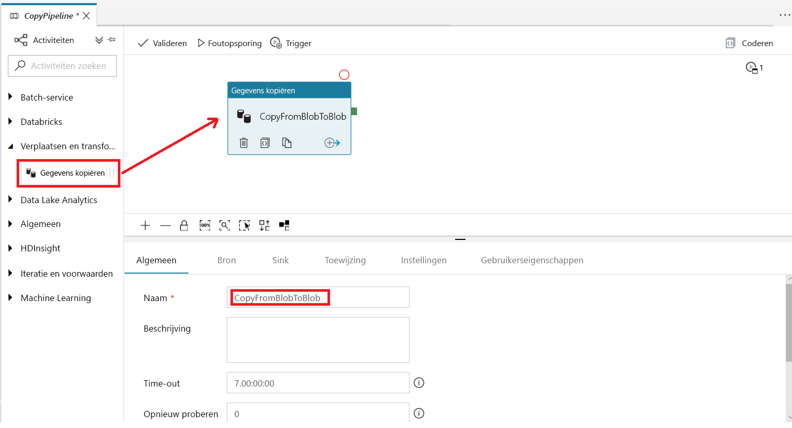
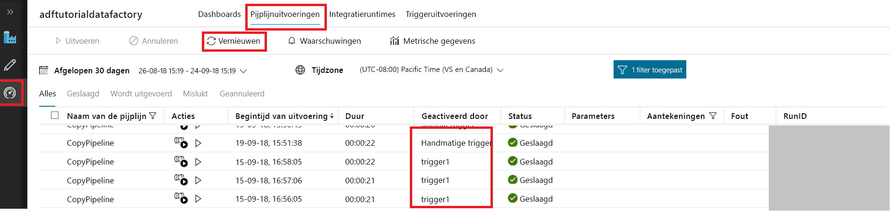
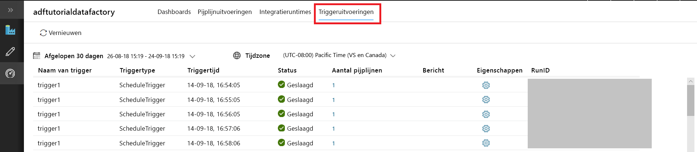

# Een gegevensfactory maken met de Azure Data Factory-UI
> [!div class="op_single_selector" title1="Select the version of Data Factory service that you are using:"]
> * [Versie 1 - Algemene beschikbaarheid](v1/data-factory-copy-data-from-azure-blob-storage-to-sql-database.md)
> * [Versie 2 - Preview](quickstart-create-data-factory-portal.md)

In deze quickstart wordt beschreven hoe u de Azure Data Factory-UI kunt gebruiken om een Azure-gegevensfactory te maken en te controleren. Met de pijplijn die u in deze data factory maakt, worden gegevens *gekopieerd* van één map naar een andere map in een Azure Blob-opslag. Zie [Zelfstudie: Gegevens transformeren met Spark](tutorial-transform-data-spark-portal.md) voor meer informatie over het *transformeren* van gegevens met Azure Data Factory. 

> [!NOTE]
> Als u niet bekend bent met Azure Data Factory, raadpleegt u eerst de [Inleiding voor Azure Data Factory](data-factory-introduction.md) voordat u deze quickstart uitvoert. 
>
> Dit artikel is van toepassing op versie 2 van Data Factory, dat zich momenteel in de previewfase bevindt. Als u versie 1 van de service gebruikt die algemeen beschikbaar is, raadpleegt u [Zelfstudie: Data Factory-versie 1](v1/data-factory-copy-data-from-azure-blob-storage-to-sql-database.md).

[!INCLUDE [data-factory-quickstart-prerequisites](../../includes/data-factory-quickstart-prerequisites.md)] 

### Video 
Bekijk deze video voor een beter begrip van de Data Factory-UI: 
>[!VIDEO https://channel9.msdn.com/Shows/Azure-Friday/Visually-build-pipelines-for-Azure-Data-Factory-v2/Player]

## Een gegevensfactory maken

1. Ga naar de [Azure Portal](https://portal.azure.com). 
2. Selecteer **Nieuw** in het menu links, selecteer **Gegevens en analyses** en selecteer vervolgens **Data Factory**. 
   
   
2. Voer op de pagina **Nieuwe data factory** **ADFTutorialDataFactory** in als **naam**. 
      
   
 
   De naam van de Azure-gegevensfactory moet *wereldwijd uniek* zijn. Als u het volgende foutbericht ziet, wijzigt u de naam van de data factory (bijvoorbeeld **&lt;uwnaam&gt;ADFTutorialDataFactory**) en probeert u het opnieuw. Zie het artikel [Data factory - Naamgevingsregels](naming-rules.md) voor naamgevingsregels voor Data Factory-artefacten.
  
   
3. Selecteer voor **Abonnement** het Azure-abonnement waarin u de gegevensfactory wilt maken. 
4. Voer een van de volgende stappen uit voor **Resourcegroep**:
     
   - Selecteer **Bestaande gebruiken** en selecteer een bestaande resourcegroep in de lijst. 
   - Selecteer **Nieuwe maken** en voer de naam van een resourcegroep in.   
         
   Zie [Resourcegroepen gebruiken om Azure-resources te beheren](../azure-resource-manager/resource-group-overview.md) voor meer informatie.  
4. Selecteer **V2 (Preview)** voor **Versie**.
5. Selecteer voor **Locatie** de locatie voor de data factory.

   In de lijst worden alleen locaties getoond die door Data Factory worden ondersteund. De gegevensarchieven (zoals Azure Storage en Azure SQL Database) en berekeningen (zoals Azure HDInsight) die Data Factory gebruikt, kunnen zich in andere locaties bevinden.
6. Selecteer **Vastmaken aan dashboard**.     
7. Selecteer **Maken**.
8. Op het dashboard ziet u de volgende tegel met de status: **Data Factory implementeren**: 

   
9. Wanneer het maken is voltooid, ziet u de pagina **Data Factory**. Selecteer de tegel **Maken en controleren** om de gebruikersinterface (UI) van Azure Data Factory te openen op een afzonderlijk tabblad.
   
   
10. Schakel op de pagina **Aan de slag** naar het tabblad **Bewerken** in het linkerpaneel. 

    

## Een gekoppelde service maken
In deze procedure maakt u een gekoppelde service om uw Azure Storage-account te koppelen aan de data factory. De gekoppelde service beschikt over de verbindingsgegevens die de Data Factory-service tijdens runtime gebruikt om er een verbinding mee tot stand te brengen.

1. Selecteer **Verbindingen** en selecteer vervolgens in de werkbalk de knop **Nieuw**. 

       
2. Selecteer op de pagina **Nieuwe gekoppelde service** de optie **Azure Blob-opslag** en selecteer vervolgens**Doorgaan**. 

   
3. Voltooi de volgende stappen: 

   a. Voer bij **Naam** **AzureStorageLinkedService** in.

   b. Selecteer bij **Naam van opslagaccount** uw Azure-opslagaccount.

   c. Selecteer **Verbinding testen** om te bevestigen dat de Data Factory-service verbinding mag maken met het opslagaccount. 

   d. Selecteer **Opslaan** om de gekoppelde service op te slaan. 

    
4. Controleer of **AzureStorageLinkedService** wordt weergegeven in de lijst met gekoppelde services. 

   

## Gegevenssets maken
In deze procedure maakt u twee gegevenssets: **InputDataset** en **OutputDataset**. Deze gegevenssets zijn van het type **AzureBlob**. Ze verwijzen naar de gekoppelde Azure Storage-service die u in de vorige sectie hebt gemaakt. 

De invoergegevensset vertegenwoordigt de brongegevens in de invoermap. In de definitie van de invoergegevensset geeft u de blob-container (**adftutorial**) en de map (**invoer**) op, en het bestand (**emp.txt**) dat de brongegevens bevat. 

De uitvoergegevensset vertegenwoordigt de gegevens die worden gekopieerd naar de bestemming. In de definitie van de uitvoergegevensset geeft u de blob-container (**adftutorial**) en de map (**uitvoer**) op, en het bestand waarin de brongegevens zijn gekopieerd. Elke uitvoering van een pijplijn heeft een unieke id die eraan is gekoppeld. U hebt toegang tot deze id via de systeemvariabele **RunId**. De naam van het uitvoerbestand wordt dynamisch geëvalueerd op basis van de run-id van de pijplijn.   

In de instellingen voor de gekoppelde service hebt u het Azure Storage-account opgegeven dat de brongegevens bevat. In de instellingen voor de brongegevensset geeft u de precieze locatie van de brongegevens op (blob-container, map en bestand). In de instellingen voor de sink-gegevensset geeft u de locatie op waarnaar de gegevens worden gekopieerd (blob-container, map en bestand). 
 
1. Selecteer de knop **+** (plus) en vervolgens **Gegevensset**.

   
2. Selecteer op de pagina **Nieuwe gegevensset** de optie **Azure Blob-opslag** en selecteer vervolgens **Voltooien**. 

   
3. Voer in het venster **Eigenschappen** voor de gegevensset **InputDataset** in als **Naam**. 

   
4. Ga naar het tabblad **Verbinding** en voer de volgende stappen uit: 

   a. Selecteer **AzureStorageLinkedService** bij **Linked service**.

   b. Selecteer de knop **Bladeren** bij **Bestandspad**.

       c. Ga in het venster **Een bestand of map kiezen** naar de map **invoer** in de container **adftutorial**, selecteer het bestand **emp.txt** en selecteer vervolgens **Voltooien**.

      
    
   d. (optioneel) Klik op **Gegevens vooraf bekijken** om een voorbeeld van de gegevens in het bestand emp.txt te bekijken.     
5. Herhaal de stappen om de uitvoergegevensset te maken:  

   a. Selecteer de knop **+** (plus) en vervolgens **Gegevensset**.

   b. Selecteer op de pagina **Nieuwe gegevensset** de optie **Azure Blob-opslag** en selecteer vervolgens **Voltooien**.

   c. Geef **OutputDataset** op als de naam.

   d. Voer **adftutorial/output** in als de map. Als de map **output**niet bestaat, wordt deze in runtime gemaakt door de kopieeractiviteit.

   e. Voer `@CONCAT(pipeline().RunId, '.txt')` in als bestandsnaam. 
   
      Telkens wanneer u een pijplijn uitvoert, heeft de pijplijnuitvoering een unieke gekoppelde id. Via de expressie wordt de run-id van de pijplijn samengevoegd met **.txt** om de naam van het uitvoerbestand te evalueren. Zie [Systeemvariabelen](control-flow-system-variables.md) en [Expressietaal](control-flow-expression-language-functions.md) voor de lijst met ondersteunde systeemvariabelen en expressies.

   

## Een pijplijn maken 
In deze procedure maakt en valideert u een pijplijn via een kopieeractiviteit die gebruikmaakt van de invoer- en uitvoergegevenssets. Met de kopieeractiviteit worden gegevens uit het bestand dat is opgegeven bij de instellingen voor de invoergegevensset gekopieerd naar het bestand dat is opgegeven in de instellingen voor de uitvoergegevensset. Als in de invoergegevensset alleen een map is opgegeven (en geen bestandsnaam), worden met de kopieeractiviteit alle bestanden in de bronmap gekopieerd naar de bestemming. 

1. Selecteer de knop **+** (plus) en selecteer vervolgens **Pijplijn**. 

   
2. Geef bij **Naam** in het venster **Eigenschappen** **CopyPipeline** op. 

   
3. Vouw in de werkset **Activiteiten** **Gegevensstroom** uit. Sleep de activiteit **Kopiëren** vanuit de werkset **Activities** naar het ontwerpoppervlak voor pijplijnen. U kunt ook zoeken naar activiteiten in de werkset **Activiteiten**. Geef **CopyFromBlobToBlob** op bij **Naam**.

   
4. Ga naar het tabblad **Bron** in de instellingen voor de kopieeractiviteit en selecteer **InputDataset** als de **brongegevensset**.

       
5. Ga naar het tabblad **Sink** in de instellingen voor de kopieeractiviteit en selecteer **OutputDataset** bij **Sink-gegevensset**.

       
7. Selecteer **Valideren** om de instellingen voor de pijplijn te valideren. Controleer of de pijplijn is gevalideerd. Klik op de **>>** (pijl-rechts) om de uitvoergegevens van de validatie te sluiten. 

   

## De uitvoering van de pijplijn testen
In deze stap test u de uitvoering van de pijplijn voordat u deze implementeert in Data Factory. 

1. Selecteer in de werkbalk voor de pijplijn de optie **Testuitvoering**. 
    
   
2. Controleer of de status van de pijplijnuitvoering wordt weergegeven op het tabblad **Uitvoer** van de pijplijninstellingen. 

       
3. Controleer of een uitvoerbestand wordt weergegeven in de **uitvoermap** van de container **adftutorial**. Als de uitvoermap niet bestaat, wordt deze automatisch gemaakt in de Data Factory-service. 
    
   

## De pijplijn handmatig activeren
In deze procedure implementeert u entiteiten (gekoppelde services, gegevenssets, pijplijnen) in Azure Data Factory. Vervolgens activeert u handmatig een pijplijnuitvoering. U kunt ook entiteiten publiceren in uw eigen Visual Studio Team Services Git-archief. Dit wordt behandeld in een [andere zelfstudie](tutorial-copy-data-portal.md?#configure-code-repository).

1. Voordat u een pijplijn activeert, moet u eerst entiteiten publiceren in Data Factory. Selecteer hiervoor in het linkerdeelvenster de optie **Alles publiceren**. 

   
2. Als u de pijplijn handmatig wilt activeren, selecteert in de werkbalk de optie **Activeren** en vervolgens **Nu activeren**. 
    
   

## De pijplijn bewaken

1. Ga naar het tabblad **Controleren** aan de linkerkant. Gebruik de knop **Vernieuwen** om de lijst te vernieuwen.

   
2. Selecteer onder **Acties** de koppeling **Uitvoeringen van activiteit weergeven**. Op deze pagina ziet u de status van de uitvoering van de kopieeractiviteit. 

   
3. Selecteer de koppeling **Details** (afbeelding van een bril) in de kolom **Acties** om details over de kopieerbewerking weer te geven. Zie [Overzicht van kopieeractiviteit](copy-activity-overview.md) voor meer informatie over de eigenschappen. 

   
4. Controleer of een nieuw bestand wordt weergegeven in de **uitvoermap**. 
5. Als u vanuit de weergave **Uitvoeringen van activiteit** wilt terugkeren naar de weergave **Pijplijnuitvoeringen**,selecteert u de koppeling **Pijplijnen**. 

## De pijplijn activeren volgens een schema
Deze procedure is optioneel in deze zelfstudie. U kunt een *Scheduler-trigger* maken om in te plannen dat de pijplijn periodiek wordt uitgevoerd (elk uur, dagelijks, enzovoort). In deze procedure maakt u een trigger die elke minuut wordt uitgevoerd en stopt op een door u bepaald tijdstip. 

1. Ga naar het tabblad **Bewerken**. 

   
1. Selecteer **Trigger** in het menu selecteer vervolgens **Nieuw/Bewerken**. 

   
2. Selecteer op de pagina **Triggers toevoegen** de optie **Trigger kiezen** en selecteer vervolgens **Nieuw**. 

   
3. Selecteer op de pagina **Nieuwe trigger**, onder **Beëindigen**, de optie **Op datum** en geef een eindtijd op die enkele minuten later is dan de huidige tijd. Selecteer ten slotte **Toepassen**. 

   Aan elke pijplijnuitvoering zijn kosten verbonden. Geef daarom een eindtijd op die slechts enkele minuten later is dan de begintijd. Zorg ervoor dat de eindtijd op dezelfde dag is. Zorg er echter wel voor dat er voldoende tijd is om de pijplijn uit te voeren tussen de publicatietijd en de eindtijd. De trigger gaat pas van kracht nadat u de oplossing hebt gepubliceerd in Data Factory, niet wanneer u de trigger opslaat in de UI. 

   
4. Schakel op de pagina **Nieuwe trigger** het selectievakje **Geactiveerd** in en selecteer **Volgende**. 

   
5. Lees het waarschuwingsbericht en selecteer **Voltooien**.

   
6. Selecteer **Alles publiceren** om wijzigingen te publiceren naar Data Factory. 

   
8. Ga naar het tabblad **Controleren** aan de linkerkant. Selecteer **Vernieuwen** om de lijst te vernieuwen. U ziet dat de pijplijn één keer per minuut wordt uitgevoerd vanaf het moment van publiceren tot de eindtijd. 

   Bekijk de waarden in de kolom **Geactiveerd door**. De handmatige triggeruitvoering is afkomstig uit de stap (**Nu activeren**) die u eerder hebt uitgevoerd. 

   
9. Selecteer de pijl-omlaag naast **Pijplijnuitvoeringen** om naar de weergave **Triggeruitvoeringen** te gaan. 

       
10. Controleer of er tot de opgegeven datum en tijd voor elke pijplijnuitvoering een uitvoerbestand is gemaakt in de **uitvoermap**. 

## Volgende stappen
Met de pijplijn in dit voorbeeld worden gegevens gekopieerd van de ene locatie naar een andere locatie in Azure Blob Storage. Doorloop de [zelfstudies](tutorial-copy-data-portal.md) voor meer informatie over het gebruiken van Data Factory in andere scenario's. 