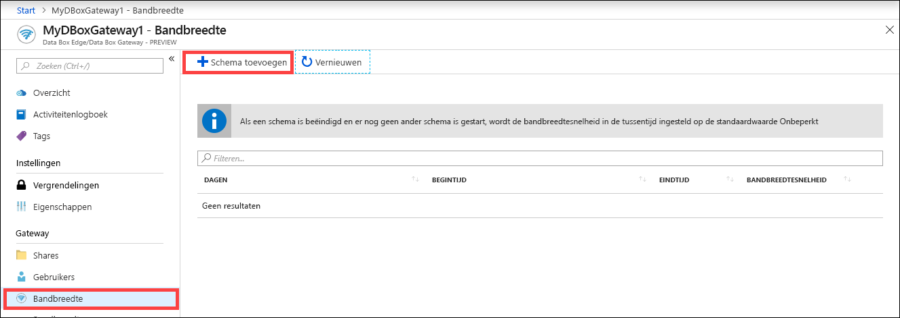
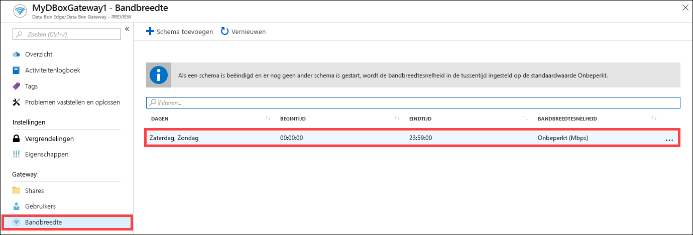
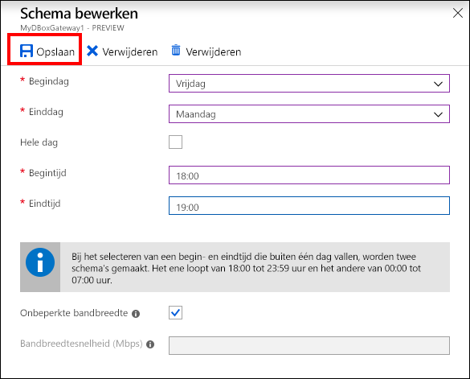
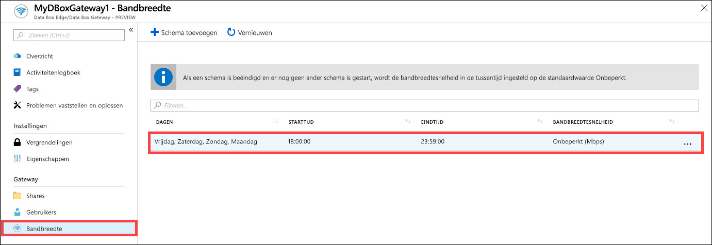
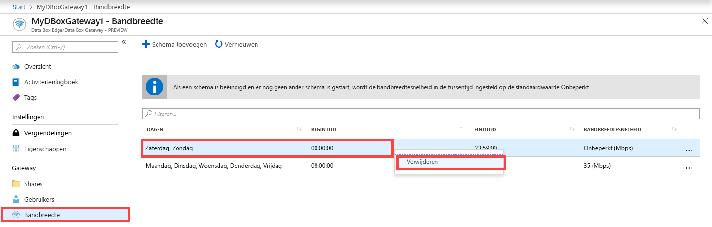

# De Azure Portal gebruiken om bandbreedteschema's te beheren in uw Azure Data Box Gateway  

Dit artikel beschrijft hoe u gebruikers beheert in uw Azure Data Box Gateway. Met bandbreedteschema's kunt u het gebruik van netwerkbandbreedte beheren over schema's voor meerdere tijdstippen. Deze schema's kunnen worden toegepast op upload- en downloadbewerkingen van uw apparaat naar de cloud. 

U kunt de bandbreedteschema's voor uw Data Box Gateway toevoegen, wijzigen of verwijderen via de Azure Portal.

> [!IMPORTANT]
> - Data Box Gateway verkeert in de preview-fase. Lees de [Gebruiksvoorwaarden voor de preview](https://azure.microsoft.com/support/legal/preview-supplemental-terms/) voordat u deze oplossing bestelt en implementeert.

In dit artikel leert u het volgende:

> [!div class="checklist"]
> * Een schema toevoegen
> * Een schema wijzigen
> * Een schema verwijderen 

## Een schema toevoegen

Voer in Azure Portal de volgende stappen uit om een gebruiker toe te voegen.

1. Ga in de Azure Portal voor uw Data Box Gateway naar **Bandbreedte**.
2. Klik in het rechterdeelvenster op **+ Schema toevoegen**.

    

3. Doe het volgende in **Schema toevoegen**: 

   1. Geef de **Eerste dag**, **Laatste dag**, **Begintijd** en **Eindtijd** van de planning op. 
   2. Als dit schema de hele dag wordt uitgevoerd, kunt u de optie **Hele dag** inschakelen. 
   3. **Bandbreedtesnelheid** is de bandbreedte in Megabits per seconde (Mbps) die door uw apparaat wordt gebruikt bij bewerkingen die betrekking hebben op de cloud (uploaden en downloaden). Geef voor dit veld een waarde op tussen 1 en 1000. 
   4. Schakel **Onbeperkte** bandbreedte in als u de datumupload en -download niet wilt regelen. 
   5. Klik op **Add**.

      

3. Er wordt een schema gemaakt met de opgegeven parameters. Dit schema wordt vervolgens weergegeven in de lijst van bandbreedteschema's in de portal.

## Schema bewerken

Voer de volgende stappen uit als u een bandbreedteschema wilt bewerken. 

1. Ga in de Azure Portal naar uw Data Box Gateway-resource en vervolgens naar Bandbreedte. 
2. Klik in de lijst met bandbreedteschema's op een schema dat u wilt wijzigen.
    

3. Breng de gewenste wijzigingen aan en sla de wijzigingen op.

    

4. Wanneer het schema is gewijzigd, wordt de lijst met schema's bijgewerkt met het gewijzigde schema.

    

## Een schema verwijderen

Voer de volgende stappen uit als u een bandbreedteschema wilt verwijderen dat is gekoppeld aan uw Data Box Gateway-apparaat.

1. Ga in de Azure Portal naar uw Data Box Gateway-resource en vervolgens naar **Bandbreedte**.  

2. Selecteer in de lijst met bandbreedteschema's een schema dat u wilt verwijderen. Klik met de rechtermuisknop om het contextmenu weer te geven en klik op **Verwijderen**. 

   

3.  Wanneer de planning is verwijderd, wordt de lijst met schema's bijgewerkt.

## Volgende stappen

- Meer informatie over [Bandbreedte beheren](data-box-gateway-manage-bandwidth-schedules.md).
