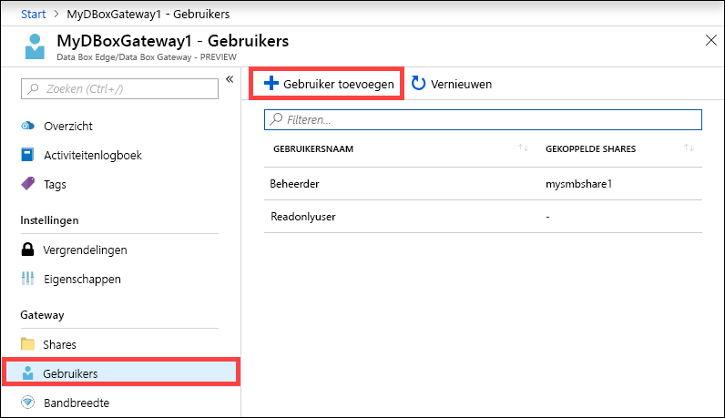
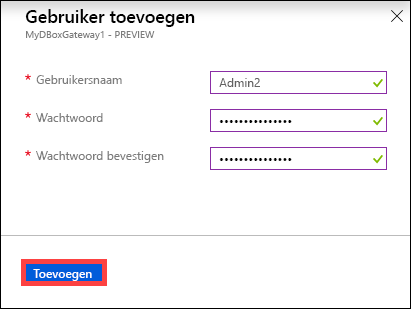
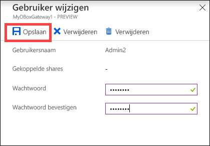
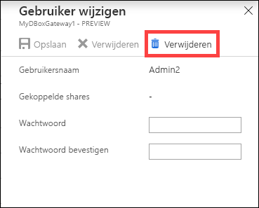
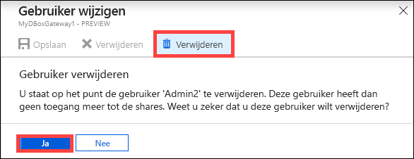
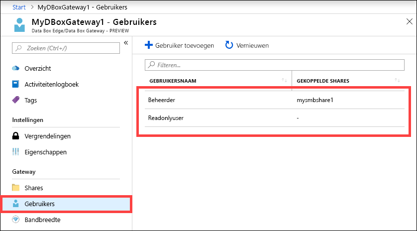

# Azure Portal gebruiken om gebruikers te beheren in uw Azure Data Box Gateway 

Dit artikel beschrijft hoe u gebruikers beheert in uw Azure Data Box Gateway. U kunt de Azure Data Box Gateway beheren via Azure Portal of via de lokale webinterface. Gebruik Azure Portal om gebruikers toe te voegen, te wijzigen of te verwijderen.

In dit artikel leert u het volgende:

> [!div class="checklist"]
> * Een gebruiker toevoegen
> * Gebruiker wijzigen
> * Een gebruiker verwijderen 

## Over gebruikers

Gebruikers kunnen het recht alleen-lezen of volledige bevoegdheid hebben. Zoals de naam al aangeeft, kunnen gebruikers met het recht alleen-lezen de sharegegevens alleen weergeven. Gebruikers met volledige bevoegdheid kunnen sharegegevens lezen, schrijven, wijzigen of verwijderen. 

 - **Gebruiker met volledige bevoegdheden** - een lokale gebruiker met volledige toegang. 
 - **Alleen-lezengebruiker** - een lokale gebruiker met alleen-lezentoegang. Deze gebruikers zijn gekoppeld aan shares waarmee alleen-lezenbewerkingen mogelijk zijn.

De gebruikersmachtigingen worden eerst gedefinieerd wanneer de gebruiker wordt gemaakt tijdens het maken van de share. Wanneer de machtigingen voor een gebruiker zijn gedefinieerd, kunnen deze worden gewijzigd via Windows Verkenner. 

## Een gebruiker toevoegen

Voer in Azure Portal de volgende stappen uit om een gebruiker toe te voegen.

1. Ga in Azure Portal naar uw Data Box Gateway-resource en navigeer vervolgens naar **Overzicht**. Klik in de opdrachtbalk op **+ Gebruiker toevoegen**.

    

2. Geef de gebruikersnaam en het wachtwoord op voor de gebruiker die u wilt toevoegen. Bevestig het wachtwoord en klik op **Toevoegen**.

    

    > [!IMPORTANT] 
    > Deze gebruikers zijn gereserveerd door het systeem en mag niet worden gebruikt: Administrator, EdgeUser, EdgeSupport, HcsSetupUser, WDAGUtilityAccount, CLIUSR, DefaultAccount, Guest.  

3. U krijgt een melding wanneer het maken van de gebruiker wordt gestart en is voltooid. Wanneer de gebruiker is gemaakt, klikt u in de opdrachtbalk op **Vernieuwen** om de bijgewerkte lijst met gebruikers weer te geven.

## Gebruiker wijzigen

U kunt het wachtwoord dat is gekoppeld aan een gebruiker, wijzigen wanneer de gebruiker is gemaakt. Selecteer en klik in de lijst met gebruikers. Geef het nieuwe wachtwoord op en bevestig het. Sla de wijzigingen op.
 

## Een gebruiker verwijderen

Voer in Azure Portal de volgende stappen uit om een gebruiker te verwijderen.

1. Selecteer een gebruiker door erop te klikken in de lijst met gebruikers en klik vervolgens op **Verwijderen**.  

   

2. Bevestig de verwijdering als u daarom wordt gevraagd. 

   

De lijst met gebruikers wordt bijgewerkt en de verwijderde gebruiker wordt niet meer weergegeven.

## Volgende stappen

- Meer informatie over [Bandbreedte beheren](data-box-gateway-manage-bandwidth-schedules.md).
