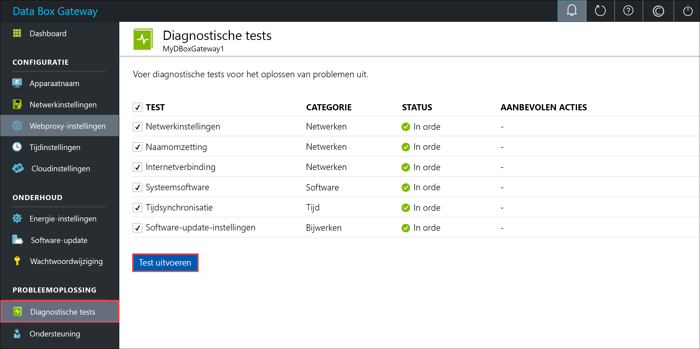
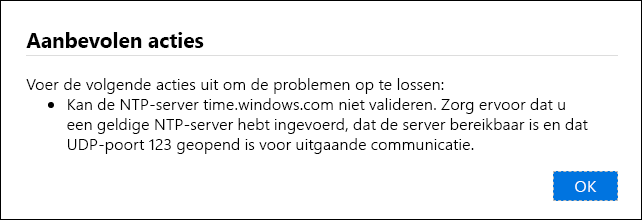
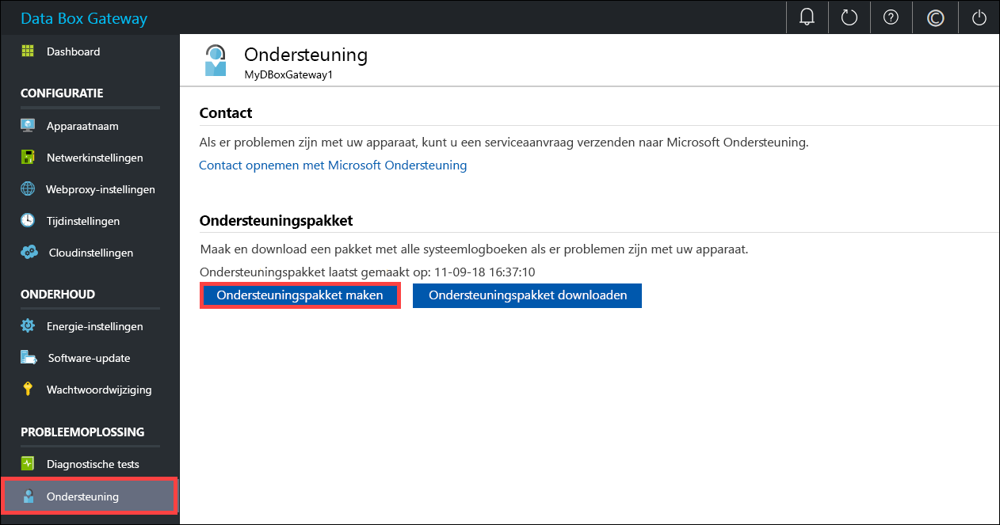
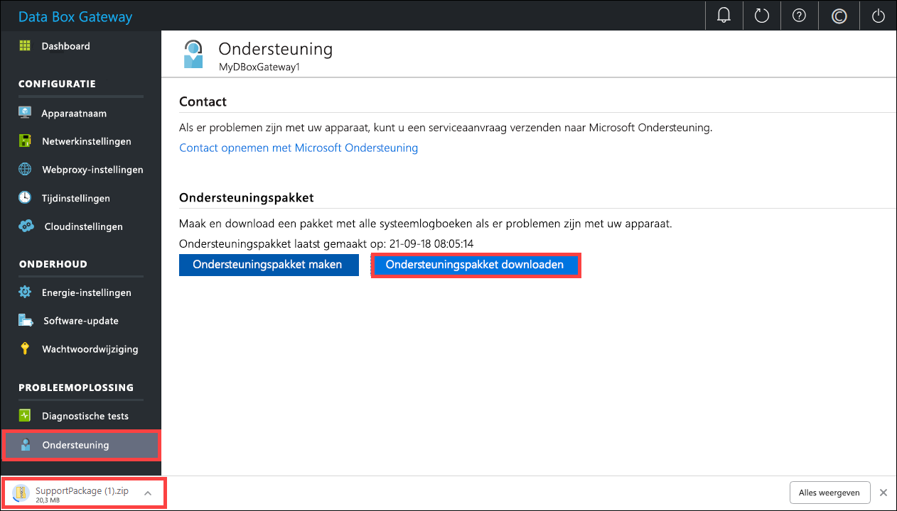
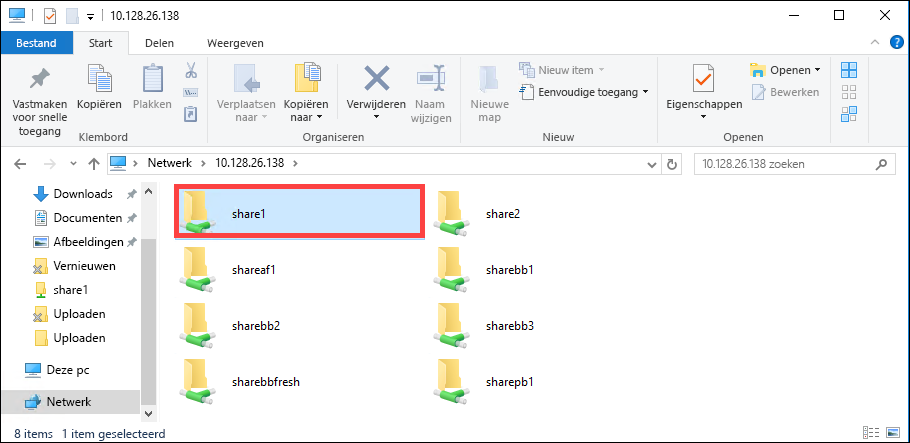

# <a name="troubleshoot-your-azure-data-box-gateway-issues"></a>Problemen met uw Azure Data Box Gateway oplossen 

In dit artikel wordt beschreven hoe u problemen met uw Azure Data Box Gateway oplost. 

> [!IMPORTANT]
> - Data Box Gateway verkeert in de preview-fase. Lees de [Gebruiksvoorwaarden voor de preview](https://azure.microsoft.com/support/legal/preview-supplemental-terms/) voordat u deze oplossing bestelt en implementeert.

In dit artikel leert u het volgende:

> [!div class="checklist"]
> * Diagnose uitvoeren
> * Ondersteuningspakket verzamelen
> * Logboeken gebruiken om problemen op te lossen


## <a name="run-diagnostics"></a>Diagnose uitvoeren

U kunt de diagnostische tests uitvoeren om apparaatfouten vast te stellen en op te lossen. Voer de volgende stappen uit in de lokale webinterface van uw apparaat om diagnostische tests uit te voeren.

1. Ga in de lokale webinterface naar **Probleemoplossing > Diagnostische tests**. Selecteer de test die u wilt uitvoeren en klik op **Test uitvoeren**. Hiermee voert u de tests uit om mogelijke problemen met uw netwerk-, apparaat-, webproxy-, tijd- of cloudinstellingen vast te stellen. U ontvangt een melding dat er tests op het apparaat worden uitgevoerd.

    
 
2. Wanneer de tests zijn voltooid, worden de resultaten weergegeven. Als een test mislukt, wordt er een URL voor de aanbevolen actie weergegeven. U kunt op de URL klikken om de aanbevolen actie weer te geven. 
 
    


## <a name="collect-support-package"></a>Ondersteuningspakket verzamelen

Er wordt een logboekpakket samengesteld van alle relevante logboeken die Microsoft Ondersteuning kunnen helpen bij het oplossen van eventuele problemen met het apparaat. U kunt een logboekpakket genereren via de lokale webinterface.

Voer de volgende stappen uit om een ondersteuningspakket te verzamelen. 

1. Ga in de lokale webinterface naar **Probleemoplossing > Ondersteuning**. Klik op **Ondersteuningspakket maken**. Het systeem begint met het verzamelen van het ondersteuningspakket. Het verzamelen van het pakket kan enkele minuten duren.

    
 
2. Wanneer het ondersteuningspakket is gemaakt, klikt u op **Ondersteuningspakket downloaden**. Er wordt een gecomprimeerd pakket gedownload naar het pad dat u hebt gekozen. U kunt het pakket uitpakken en de systeemlogboekbestanden bekijken.

    

## <a name="use-logs-to-troubleshoot"></a>Logboeken gebruiken om problemen op te lossen

Eventuele fouten die zich hebben voorgedaan tijdens de upload- en vernieuwingsprocessen zijn opgenomen in de respectieve foutbestanden.

1. Om de foutbestanden te bekijken, gaat u naar uw share en klikt u op de share om de inhoud weer te geven. 

      

2. Klik op de _map Microsoft Data Box Gateway_. Deze map heeft twee submappen:

    - uploadmap met logboekbestanden van fouten tijdens het uploaden.
    - vernieuwingsmap met logboekbestanden van fouten tijdens het vernieuwen.

    Hier volgt een voorbeeld van een logboekbestand voor vernieuwen.

    ```
    <root container="brownbag1" machine="VM15BS020663" timestamp="07/18/2018 00:11:10" />
    <file item="test.txt" local="False" remote="True" error="16001" />
    <summary runtime="00:00:00.0945320" errors="1" creates="2" deletes="0" insync="3" replaces="0" pending="9" />
    ``` 

3. Als u in dit bestand een fout ziet (gemarkeerd in het voorbeeld), noteert u de foutcode (in dit geval 16001). Zoek de beschrijving van deze foutcode op in de volgende naslaginformatie voor fouten.

    |     Foutcode     |     Naam van uitzondering                                         |     Foutbeschrijving                                                                                                                                                                                                                     |
    |--------------------|------------------------------------------------------------|-------------------------------------------------------------------------------------------------------------------------------------------------------------------------------------------------------------------------------------------|
    |    100             |    ERROR_CONTAINER_OR_SHARE_NAME_LENGTH                    |    De naam van de container of share moet bestaan uit 3 tot 63 tekens.                                                                                                                                                                     |
    |    101             |    ERROR_CONTAINER_OR_SHARE_NAME_ALPHA_NUMERIC_DASH        |    De naam van de container of share mag alleen letters, cijfers of afbreekstreepjes bevatten.                                                                                                                                                       |
    |    102             |    ERROR_CONTAINER_OR_SHARE_NAME_IMPROPER_DASH             |    De naam van de container of share mag alleen letters, cijfers of afbreekstreepjes bevatten.                                                                                                                                                       |
    |    103             |    ERROR_BLOB_OR_FILE_NAME_CHARACTER_CONTROL               |    De naam van de blob of het bestand bevat niet-ondersteunde tekens.                                                                                                                                                                       |
    |    104             |    ERROR_BLOB_OR_FILE_NAME_CHARACTER_ILLEGAL               |    De naam van de blob of het bestand bevat ongeldige tekens.                                                                                                                                                                                   |
    |    105             |    ERROR_BLOB_OR_FILE_NAME_SEGMENT_COUNT                   |    De naam van de blob of het bestand bevat te veel segmenten (elk segment is gescheiden met een slash -/).                                                                                                                                              |
    |    106             |    ERROR_BLOB_OR_FILE_NAME_AGGREGATE_LENGTH                |    De naam van de blob of het bestand is te lang.                                                                                                                                                                                                     |
    |    107             |    ERROR_BLOB_OR_FILE_NAME_COMPONENT_LENGTH                |    Een van de segmenten in de blob- of bestandsnaam is te lang.                                                                                                                                                                            |
    |    108             |    ERROR_BLOB_OR_FILE_SIZE_LIMIT                           |    De bestandsgrootte overschrijdt de maximale bestandsgrootte voor uploaden.                                                                                                                                                                              |
    |    109             |    ERROR_BLOB_OR_FILE_SIZE_ALIGNMENT                       |    De blob of het bestand is niet juist uitgelijnd.                                                                                                                                                                                               |
    |    110             |    ERROR_NAME_NOT_VALID_UNICODE                            |    De bestandsnaam of blob met Unicode-codering is niet geldig.                                                                                                                                                                                  |
    |    111             |    ERROR_RESERVED_NAME_NOT_ALLOWED                         |    De naam of het voorvoegsel van het bestand of de blob is een gereserveerde naam die niet wordt ondersteund (bijvoorbeeld COM1).                                                                                                                             |
    |    2000            |    ERROR_ETAG_MISMATCH                                     |    Niet-overeenstemmende etags houdt in dat er een conflict is tussen een blok-blob in de cloud en op het apparaat. U lost dit conflict op door een van die bestanden te verwijderen: ofwel de versie in de cloud of de versie op het apparaat.    |
    |    2001            |    ERROR_UNEXPECTED_FINALIZE_FAILURE                       |    Er is een onverwacht probleem opgetreden tijdens het verwerken van een bestand nadat het bestand is geüpload.    Als deze fout zich langer dan 24 uur blijft voordoen, neemt u contact op met ondersteuning.                                                      |
    |    2002            |    ERROR_ALREADY_OPEN                                      |    Het bestand is al geopend in een ander proces en kan pas worden geüpload wanneer de ingang is gesloten.                                                                                                                                       |
    |    2003            |    ERROR_UNABLE_TO_OPEN                                    |    Het bestand kan niet worden geopend om te uploaden. Neem contact op met Microsoft Ondersteuning als u deze fout ziet.                                                                                                                                                |
    |    2004            |    ERROR_UNABLE_TO_CONNECT                                 |    Kan geen verbinding maken met de container om gegevens naar deze container te uploaden.                                                                                                                                                                             |
    |    2005            |    ERROR_INVALID_CLOUD_CREDENTIALS                         |    Kan geen verbinding maken met de container omdat de accountmachtigingen onjuist zijn of zijn verlopen. Controleer uw toegang.                                                                                                               |
    |    2006            |    ERROR_CLOUD_ACCOUNT_DISABLED                            |    Kan geen gegevens uploaden naar het account omdat het account of de share is uitgeschakeld.                                                                                                                                                            |
    |    2007            |    ERROR_CLOUD_ACCOUNT_PERMISSIONS                         |    Kan geen verbinding maken met de container omdat de accountmachtigingen onjuist zijn of zijn verlopen. Controleer uw toegang.                                                                                                               |
    |    2008            |    ERROR_CLOUD_CONTAINER_SIZE_LIMIT_REACHED                |    Kan geen nieuwe gegevens toevoegen omdat de container vol is. Controleer de Azure-specificaties voor de ondersteunde containergrootten op basis van type. Azure File bijvoorbeeld biedt ondersteuning voor een maximale bestandsgrootte van slechts 5 TB.                                     |
    |    2998            |    ERROR_UNMAPPED_FAILURE                                  |    Er is een onverwachte fout opgetreden. Het is mogelijk dat de fout automatisch wordt opgelost, maar als het probleem zich langer dan 24 uur blijft voordoen, neem dan contact op met Microsoft Ondersteuning.                                                                                                     |
    |    16000           |    RefreshException                                        |    Kan dit bestand niet downloaden.                                                                                                                                                                                                        |
    |    16001           |    RefreshAlreadyExistsException                           |    Kan dit bestand niet downloaden omdat het al op uw lokale systeem bestaat.                                                                                                                                                         |
    |    16002           |    RefreshWorkNeededException                              |    Kan dit bestand niet vernieuwen omdat het niet volledig is geüpload.                                                                                                                                                                          | 


## <a name="next-steps"></a>Volgende stappen

- Meer informatie over de [bekende problemen in deze versie](data-box-gateway-release-notes.md).
