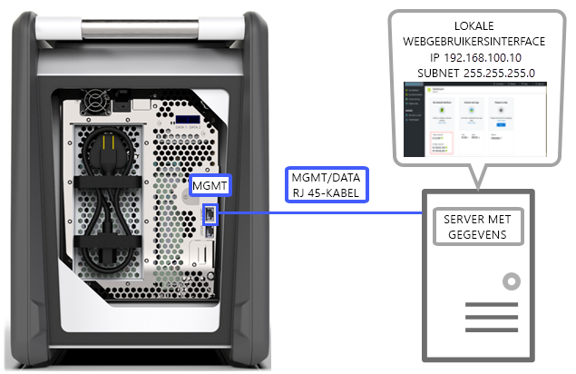
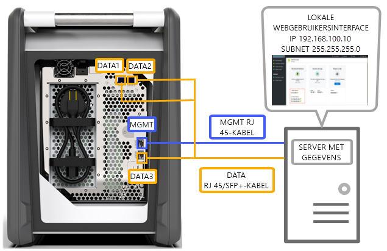
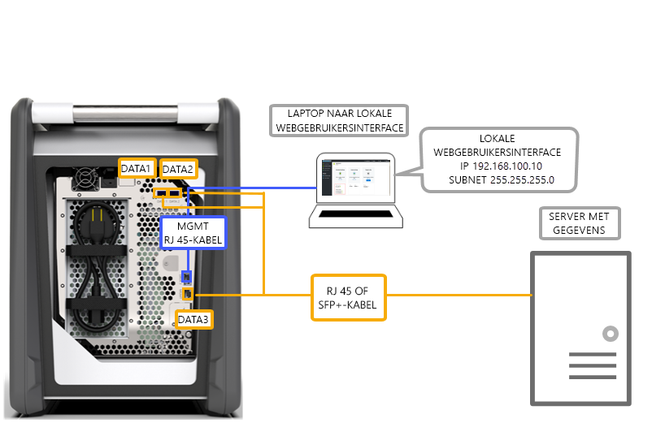
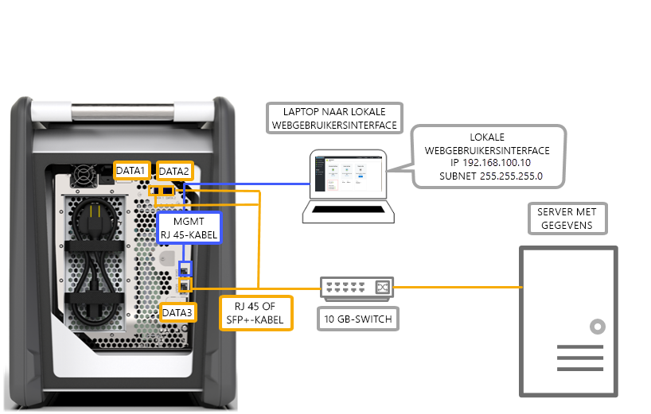
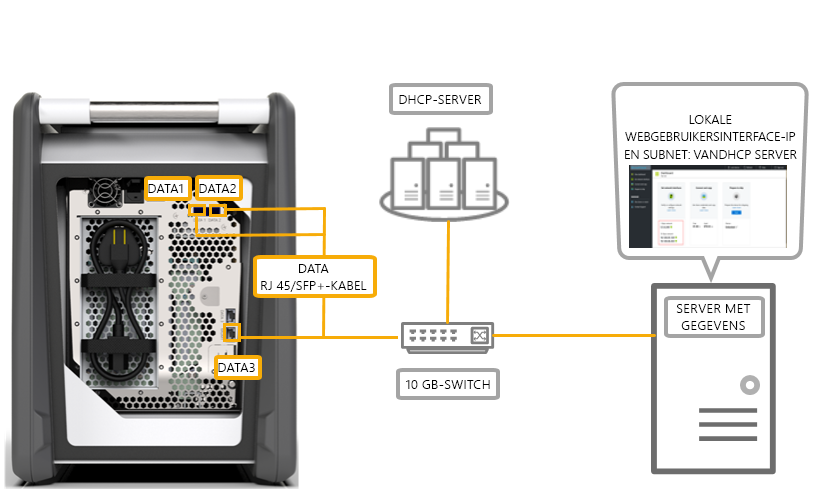

# Bekabelingsopties voor uw Azure Data Box

In dit artikel worden de diverse manieren beschreven voor het bekabelen van uw Azure Data Box voor de overdracht van gegevens.

## Overdracht via MGMT-poort

Deze optie is de absoluut minimale configuratie voor uw Data Box. U kunt alleen de MGMT-poort voor zowel beheerfuncties als gegevens configureren.

Voordat u begint, controleert u of u over het volgende beschikt:

- Een RJ45 Ethernet-kabel voor de MGMT-poort.
- Een gegevensbron met een [ondersteund besturingssysteem](data-box-system-requirements.md#supported-operating-systems-for-clients).

Voer de volgende stappen uit om uw apparaat te bekabelen.

1. Gebruik een RJ45-kabel om de MGMT-poort te verbinden met de server waarop zich de gegevens bevinden.

    

2. Stel op de server het volgende in:

    - **IP-adres** op 192.168.100.5
    - **Subnet** op 255.255.255.0

3. Open de lokale webgebruikersinterface van het apparaat op 192.168.100.10. Meld u aan en ontgrendel de Data Box met behulp van het wachtwoord voor ontgrendelen op de Azure-portal.

## Overdragen via DATA-poort met statische IP-adressen

U kunt twee poorten voor uw Data Box configureren: de MGMT-poort voor het beheer van verkeer en een van de gegevenspoorten voor gegevens. De gegevenspoorten kunnen DATA 1, DATA 2 of DATA 3 zijn.

Als u maar één gegevenspoort configureert, raden we ten zeerste een 10 GbE-poort aan, zoals DATA 1 of DATA 2. Een 1 GbE-poort zou de tijd die nodig is voor de gegevensoverdracht aanzienlijk verlengen.

Voordat u begint, controleert u of u over het volgende beschikt:

- Een RJ45 Ethernet-kabel voor de MGMT-poort.
- Een 10 GbE SFP+ Twinax koperen kabel voor elke 10 GbE-gegevenspoort waarmee u verbinding wilt maken.
- Een of meer gegevensbronnen waarop een [ondersteund besturingssysteem](data-box-system-requirements.md#supported-operating-systems-for-clients) wordt uitgevoerd.

### Optie 1: eerste setup via server

Voer de volgende stappen uit om uw apparaat te bekabelen.

1. Gebruik voor de configuratie een RJ45 Ethernet-kabel van de server rechtstreeks naar de MGMT-poort.
2. Gebruik een RJ45-kabel voor DATA 3 of SFP+-kabels om DATA 1 of DATA 2 te verbinden met de server die als gegevensbron fungeert. U wordt aangeraden om 10 GbE voor DATA 1- of DATA 2-poorten te gebruiken voor goede prestaties.
3. Stel op de server het volgende in:

    - **IP-adres** op 192.168.100.5
    - **Subnet** op 255.255.255.0

    

3. Open de lokale webgebruikersinterface van het apparaat op 192.168.100.10. Meld u aan en ontgrendel de Data Box met behulp van het wachtwoord voor ontgrendelen op de Azure-portal.
4. Wijs statische IP-adressen toe aan de gegevenspoorten die u hebt geconfigureerd.

### Optie 2: eerste setup via afzonderlijke computer

Voer de volgende stappen uit om uw apparaat te bekabelen.

1. Gebruik voor de configuratie een RJ45 Ethernet-kabel van de server rechtstreeks naar de MGMT-poort.
2. Gebruik een RJ45-kabel voor DATA 3 of SFP+-kabels om DATA 1 of DATA 2 te verbinden met de server. U wordt aangeraden om 10 GbE voor DATA 1- of DATA 2-poorten te gebruiken voor goede prestaties. De gegevenspoorten zijn verbonden via een 10 GbE-switch op de server met gegevens.
3. Configureer de Ethernet-adapter op de laptop waarmee u verbinding maakt met het apparaat:

    - **IP-adres**: 192.168.100.5
    - **Subnet** : 255.255.255.0.

    

3. Open de lokale webgebruikersinterface van het apparaat op 192.168.100.10. Meld u aan en ontgrendel de Data Box met behulp van het wachtwoord voor ontgrendelen op de Azure-portal.
4. Kijk welke IP-adressen er door de DHCP-server zijn toegewezen.

## Overdracht via DATA-poort met statische IP-adressen met een switch 

Gebruik deze configuratie voor meerdere gegevensbronnen op 1 GbE- en 10 GbE-netwerken.

Voordat u begint, controleert u of u over het volgende beschikt:

- Een RJ45 Ethernet-kabel voor de MGMT-poort.
- Een 10 GbE SFP+ Twinax koperen kabel voor elke 10 GbE-gegevenspoort waarmee u verbinding wilt maken.
- Een of meer gegevensbronnen waarop een [ondersteund besturingssysteem](data-box-system-requirements.md#supported-operating-systems-for-clients) wordt uitgevoerd. Deze gegevensbronnen kunnen zich in verschillende netwerken bevinden, zoals 1 GbE- of 10 GbE-netwerken.

Voer de volgende stappen uit om uw apparaat te bekabelen.

1. Gebruik voor de configuratie een RJ45 Ethernet-kabel van de server rechtstreeks naar de MGMT-poort.
2. Gebruik een RJ45-kabel voor DATA 3 of SFP+-kabels om DATA 1 of DATA 2 te verbinden met de server. U wordt aangeraden om 10 GbE voor DATA 1- of DATA 2-poorten te gebruiken voor goede prestaties.
3. Configureer de Ethernet-adapter op de laptop waarmee u verbinding maakt met het apparaat:

    - **IP-adres**: 192.168.100.5
    - **Subnet** : 255.255.255.0.

    

3. Open de lokale webgebruikersinterface van het apparaat op 192.168.100.10. Meld u aan en ontgrendel de Data Box met behulp van het wachtwoord voor ontgrendelen op de Azure-portal.
4. Wijs statische IP-adressen toe aan de gegevenspoorten die u hebt geconfigureerd.

## Overdracht via DATA-poort in een DHCP-omgeving

Gebruik deze configuratie als het apparaat onderdeel wordt van een DHCP-omgeving.

Voordat u begint, controleert u of u over het volgende beschikt:

- Een RJ45-kabel als u DATA 1 wilt verbinden.
- Een 10 GbE SFP+ Twinax koperen kabel voor elke 10 GbE-gegevenspoort waarmee u verbinding wilt maken.
- Een of meer gegevensbronnen waarop een [ondersteund besturingssysteem](data-box-system-requirements.md#supported-operating-systems-for-clients) wordt uitgevoerd. Deze gegevensbronnen kunnen zich in verschillende netwerken bevinden, zoals 1 GbE- of 10 GbE-netwerken.

Voer de volgende stappen uit om uw apparaat te bekabelen.

1. Gebruik een RJ45- of SFP +-kabel via een switch (waar de DHCP-server toegankelijk is) naar de server.

    
2. Gebruik de DHCP-server of DNS-server voor het identificeren van het IP-adres.
3. Open vanaf een server op hetzelfde netwerk de lokale webgebruikersinterface van het apparaat met behulp van het IP-adres dat door de DHCP-server is toegewezen. Meld u aan en ontgrendel de Data Box met behulp van het wachtwoord voor ontgrendelen op de Azure-portal.

## Volgende stappen

- Nadat u het apparaat hebt bekabeld, gaat u naar [Gegevens naar uw Azure Data Box kopiëren](data-box-deploy-copy-data.md).
