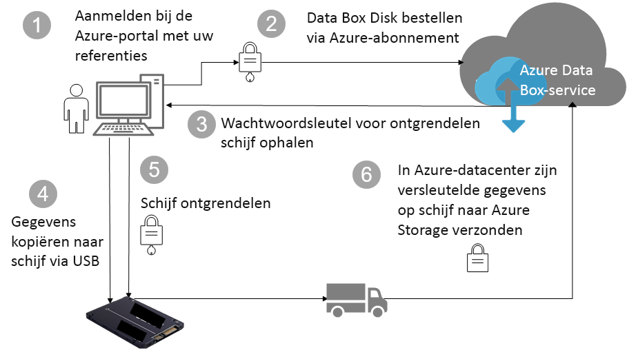

# Azure Data Box Disk-beveiliging en -gegevensbescherming

In dit artikel worden de Azure Data Box Disk-beveiligingsfuncties beschreven die elk van de Data Box-oplossingsonderdelen helpen te beschermen, evenals de gegevens die daarin worden opgeslagen. 

## Gegevens stromen door onderdelen

De Microsoft Azure Data Box-oplossing bestaat uit vier hoofdonderdelen die met elkaar samenwerken:

- **Azure Data Box-service die in Azure wordt gehost** – De beheerservice die u gebruikt om de schijforder te maken, de schijven te configureren en de order vervolgens bij te houden totdat deze is voltooid.
- **Data Box Disks** – De fysieke schijven die naar u worden verzonden om uw on-premises gegevens in Azure te importeren. 
- **Clients/hosts die met de schijven zijn verbonden** – De clients in uw infrastructuur die via USB verbinding maken met de Data Box Disk en gegevens bevatten die moeten worden beschermd.
- **Cloudopslag** – De locatie in de Azure-cloud waar gegevens worden opgeslagen. Dit is meestal het opslagaccount dat is gekoppeld aan de Azure Data Box-resource die u hebt gemaakt.

Het volgende diagram toont de stroom van gegevens via de Azure Data Box Disk-oplossing van on-premises naar Azure.

## Beveiligingsfuncties

Data Box Disk biedt een veilige oplossing voor gegevensbescherming door te verzekeren dat alleen bevoegde entiteiten uw gegevens kunnen bekijken, wijzigen of verwijderen. De beveiligingsfuncties van deze oplossing zijn voor de schijf en voor de bijbehorende service, zodat de gegevens worden beschermd die daarop worden opgeslagen. 

### Data Box Disk-bescherming

De Data Box Disk wordt door de volgende functies beschermd:

- Voortdurende BitLocker AES-128-bits versleuteling voor de schijf.
- Veilige updatemogelijkheid voor de schijven.
- Schijven worden vergrendeld verzonden en kunnen alleen worden ontgrendeld via een Data Box Disk-ontgrendelingsprogramma. Het ontgrendelingsprogramma is beschikbaar in de Data Box Disk-serviceportal.

### Data Box Disk-gegevensbescherming

De gegevens die in en uit de Data Box Disk stromen, worden door de volgende functies beschermd:

- Voortdurende BitLocker-versleuteling van gegevens. 
- Veilige verwijdering van gegevens van de schijf zodra ze naar Azure zijn geüpload. Gegevensverwijdering is in overeenstemming met NIST 800-88r1-standaarden.

### Data Box-servicebescherming

De Data Box-service wordt door de volgende functies beschermd:

- Voor toegang tot de Data Box Disk-service moet uw organisatie een Azure-abonnement hebben dat Data Box Disk omvat. Uw abonnement bepaalt tot welke functies u toegang hebt in de Azure-portal.
- Omdat de Data Box-service in Azure wordt gehost, wordt deze beschermd door de Azure-beveiligingsfuncties. Ga naar het [Vertrouwenscentrum van Microsoft Azure](https://www.microsoft.com/TrustCenter/Security/default.aspx) voor meer informatie over de beveiligingsfuncties die worden geleverd door Microsoft Azure. 
- In de Data Box Disk-service wordt een wachtwoordsleutel opgeslagen die wordt gebruikt om de schijf te ontgrendelen. 
- In de Data Box Disk-service worden de ordergegevens en -status opgeslagen. Deze informatie wordt verwijderd wanneer de order wordt verwijderd. 

## Persoonlijke gegevens beheren

[!INCLUDE [GDPR-related guidance](../../includes/gdpr-intro-sentence.md)]

Azure Data Box Disk verzamelt en toont persoonlijke informatie in de volgende belangrijke gevallen in de service:

- **Meldingsinstellingen** – Wanneer u een order maakt, configureert u het e-mailadres van gebruikers onder Meldingsinstellingen. Deze informatie kan worden bekeken door de beheerder. Deze informatie wordt verwijderd door de service wanneer de order de definitieve status bereikt of wanneer u de order verwijdert.

- **Ordergegevens** – Zodra de order is gemaakt, worden het verzendadres, het e-mailadres en de contactgegevens van gebruikers in de Azure-portal opgeslagen. De opgeslagen informatie omvat:

  - Naam van contactpersoon
  - Telefoonnummer
  - Email
  - Adres
  - Plaats
  - Postcode
  - Status
  - Land/Provincie/Regio
  - Stations-ID
  - Accountnummer van transporteur
  - Volgnummer van verzending

    De ordergegevens worden verwijderd door de Data Box-service wanneer de order is voltooid of wanneer u de order verwijdert.

- **Verzendadres** – Nadat de order is geplaatst, geeft de Data Box-service het verzendadres aan externe transporteurs zoals UPS of DHL. 

Bekijk het Microsoft-privacybeleid in het [Vertrouwenscentrum](https://www.microsoft.com/trustcenter) voor meer informatie.

## Volgende stappen

- De [Vereisten voor Data Box Disk](data-box-disk-system-requirements.md) bekijken.
- De [Limieten voor Data Box Disk](data-box-disk-limits.md) begrijpen.
- Snel [Azure Data Box Disk](data-box-disk-quickstart-portal.md) in Azure Portal implementeren.
