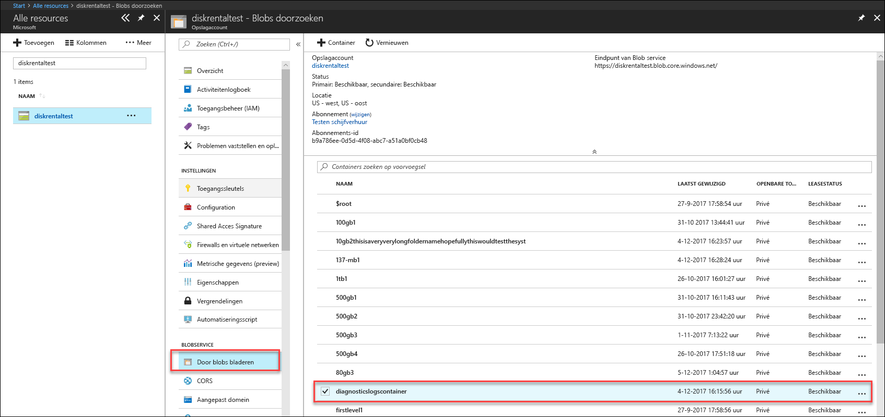

# Oplossen van problemen in Azure Data Box-schijf

Dit artikel is van toepassing op Microsoft Azure Data Box-schijf en een beschrijving van de werkstromen die wordt gebruikt voor het oplossen van problemen die u ziet wanneer u deze oplossing implementeert. 

In dit artikel bevat de volgende secties:

- Logboeken met diagnostische gegevens downloaden
- Logboeken met queryactiviteit
- Fouten met het ontgrendelingsprogramma voor Data Box Disk
- Fouten met het splits- en kopieerprogramma voor Data Box Disk

## Logboeken met diagnostische gegevens downloaden

Als er fouten optreden tijdens het kopiëren van gegevens, geeft de portal een pad weer naar de map waarin de logboeken met diagnostische gegevens zich bevinden. 

De soorten diagnostische logboeken van Azure zijn:
- Foutenlogboeken
- Uitgebreide logboeken  

Als u naar het pad met een kopie van het logboek wilt navigeren, gaat u naar het dat is gekoppeld aan uw Data Box-order. 

1.  Ga naar **Algemeen > Ordergegevens** en noteer het opslagaccount dat is gekoppeld aan uw order.
 

2.  Ga naar **Alle resources** en zoek naar het opslagaccount dat in de vorige stap is aangegeven. Selecteer en klik op het opslagaccount.

    

3.  Ga naar **Blob-service > Blobs verkennen** en zoek naar de blob die overeenkomt met het opslagaccount. Ga naar **diagnosticslogcontainer > waies**. 

    

    U ziet zowel de foutenlogboeken als de uitgebreide logboeken voor het kopiëren van gegevens. Selecteer en klik op elk bestand en download vervolgens een lokale kopie.

## Logboeken met queryactiviteit

Gebruik de activiteitenlogboeken om fouten te vinden bij foutoplossing of om te controleren hoe een gebruiker in uw organisatie een resource heeft gewijzigd. Met activiteitenlogboeken kunt u het volgende bepalen:

- Welke bewerkingen zijn uitgevoerd voor de resources in uw abonnement.
- Wie de bewerking heeft gestart. 
- Wanneer de bewerking is uitgevoerd.
- De status van de bewerking.
- De waarden van andere eigenschappen die u kunnen helpen bij het onderzoeken van het probleem.

In het activiteitenlogboek staan alle schrijfbewerkingen (zoals PUT, POST, DELETE) die op uw resources zijn uitgevoerd, maar er staan geen leesbewerkingen (zoals GET) in. 

Activiteitenlogboeken worden gedurende 90 dagen bewaard. U kunt een query uitvoeren voor een willekeurig bereik van datums, zolang de begindatum niet verder dan 90 dagen in het verleden is. U kunt ook filteren op een van de ingebouwde query's in Insights. Klik bijvoorbeeld op een fout en selecteer vervolgens specifieke problemen om de hoofdoorzaak te begrijpen.

## Fouten met het ontgrendelingsprogramma voor Data Box Disk

| Fout bericht/gedrag hulpprogramma      | Aanbevelingen                                                                                               |
|-------------------------------------------------------------------------------------------------------------------------------------|------------------------------------------------------------------------------------------------------|
| Geen  Het ontgrendelingsprogramma voor Data Box Disk loopt vast.                                                                            | BitLocker is niet geïnstalleerd. Zorg ervoor dat het hulpprogramma BitLocker is geïnstalleerd op de computer waarop het ontgrendelingsprogramma voor Data Box Disk wordt uitgevoerd.                                                                            |
| Het huidige .NET Framework wordt niet ondersteund. De ondersteunde versies zijn 4.5 of hoger.  Hulpprogramma wordt beëindigd met een bericht.  | .NET 4.5 is niet geïnstalleerd. Installeer .NET 4.5 of hoger op de hostcomputer waarop het ontgrendelingsprogramma voor Data Box Disk wordt uitgevoerd.                                                                            |
| Kan geen volumes ontgrendelen of verifiëren. Neem contact op met Microsoft Ondersteuning.    Vergrendelde stations kunnen niet worden ontgrendeld of geverifieerd door het hulpprogramma. | De vergrendelde stations kunnen niet worden ontgrendeld door het hulpprogramma met de verstrekte wachtwoordsleutel. Neem contact op met Microsoft Ondersteuning voor volgende stappen.                                                |
| De volgende volumes zijn ontgrendeld en geverifieerd.  Volume stationsletters: E: Er konden geen volumes worden ontgrendeld met de volgende wachtwoordsleutels: werwerqomnf, qwerwerqwdfda   Door het hulpprogramma worden sommige stations ontgrendeld en worden de letters van stations waarbij het is mislukt weergegeven.| Gedeeltelijk geslaagd. Sommige van de stations kunnen niet worden ontgrendeld met de verstrekte wachtwoordsleutel. Neem contact op met Microsoft Ondersteuning voor volgende stappen. |
| De vergrendelde volumes zijn niet gevonden. Controleer of de schijf die is ontvangen van Microsoft op de juiste manier is aangesloten en is vergrendeld.          | Er zijn geen vergrendelde stations gevonden door het hulpprogramma. De stations zijn al ontgrendeld of niet gedetecteerd. Zorg ervoor dat de stations zijn verbonden en zijn vergrendeld.                                                           |
| Onherstelbare fout: Ongeldige parameter Parameternaam: invalid_arg GEBRUIK: DataBoxDiskUnlock /PassKeys:<passkey_list_separated_by_semicolon>  Voorbeeld: DataBoxDiskUnlock /PassKeys:passkey1; passkey2; passkey3 Voorbeeld: DataBoxDiskUnlock /SystemCheck Voorbeeld: DataBoxDiskUnlock/Help  / Sleutels:       Deze sleutel ophalen uit Azure DataBox schijforder. De wachtwoordsleutel ontgrendelt uw schijven. / Help:           Deze optie biedt Help-informatie voor cmdlet-syntaxis en voorbeelden. / SystemCheck:    Deze optie wordt gecontroleerd of uw systeem voldoet aan de vereisten voor het uitvoeren van het hulpprogramma.  Druk op een willekeurige toets om af te sluiten. | Ongeldige parameter ingevoerd. De enige toegestane parameters zijn /SystemCheck, /PassKey en /Help.                                                                            |

## Fouten met het splits- en kopieerprogramma voor Data Box Disk

|Foutbericht/waarschuwingen  |Aanbevelingen |
|---------|---------|
|[Info] Bitlocker-wachtwoord ophalen voor volume: m  [Fout] Uitzondering opgetreden tijdens het ophalen van bitlocker-sleutel voor volume m:  Reeks bevat geen elementen.|Deze fout wordt gegenereerd als de doel-Data Box Disk offline is.   Gebruik hulpprogramma `diskmgmt.msc` voor online schijven.|
|[Fout] Uitzondering geretourneerd: WMI-bewerking is mislukt:  Method=UnlockWithNumericalPassword, ReturnValue=2150694965,  Win32Message=De indeling van het verstrekte herstelwachtwoord is ongeldig.  BitLocker-herstelwachtwoorden bestaan uit 48 cijfers.  Controleer of het herstelwachtwoord de juiste indeling heeft en probeer het opnieuw.|Gebruik eerst het ontgrendelingsprogramma van Data Box Disk om de schijven te ontgrendelen en voer dan de opdracht opnieuw uit. Voor meer informatie gaat u naar <li> [Data Box Disk ontgrendelen voor Windows-clients](data-box-disk-deploy-set-up.md#unlock-disks-on-windows-client). </li><li> [Data Box Disk ontgrendelen voor Linux-clients](data-box-disk-deploy-set-up.md#unlock-disks-on-linux-client). </li>|
|[Fout] Uitzondering geretourneerd: Er bestaat een DriveManifest.xml-bestand op de doel-station.   Dit betekent dat het doelstation mogelijk is voorbereid met een ander logboekbestand.  Als u meer gegevens aan hetzelfde station wilt toevoegen, gebruik dan het vorige logboekbestand. Als u bestaande gegevens wilt verwijderen en het doelstation wilt hergebruiken voor een nieuwe importtaak, verwijdert u het bestand DriveManifest.xml van de schijf. Voer deze opdracht opnieuw uit met een nieuw logboekbestand.| Deze fout wordt gegenereerd wanneer u dezelfde reeks stations probeert te gebruiken voor meerdere importsessies.   Gebruik één set schijven maar voor één splits- en kopieersessie.|
|[Fout] Uitzondering geretourneerd: CopySessionId importgegevens-september-test-1 verwijst naar een eerdere sessie. kopiëren en niet opnieuw kan worden gebruikt voor een nieuwe kopieersessie.|Deze fout wordt gerapporteerd wanneer wordt geprobeerd om dezelfde taaknaam voor een nieuwe taak te gebruiken als een eerder met succes voltooide taak.  Geef een unieke naam op voor de nieuwe taak.|
|[Info] De naam van het doelbestand of de doelmap overschrijdt de lengtelimiet van NTFS. |Dit bericht wordt gegenereerd als de naam van het doelbestand is gewijzigd vanwege een lang pad.  Wijzig de verwijderingsoptie in bestand `config.json` om dit gedrag te regelen.|
|[Fout] Uitzondering geretourneerd: Ongeldige JSON escape-volgorde. |Dit bericht wordt gegenereerd als de config.json een ongeldige opmaak heeft.   Valideer uw `config.json` met behulp van [JSONlint](https://jsonlint.com/) voordat u het bestand opslaat.|

## Problemen bij de implementatie voor Linux

In deze sectie worden enkele van de meest voorkomende problemen tijdens de implementatie van de Data Box-schijf met het gebruik van een Linux-client voor het kopiëren van gegevens.

### Probleem: Schijf ophalen gekoppeld als alleen-lezen
 
**Oorzaak** 

Dit kan zijn vanwege een niet schoon bestandssysteem. 

Een station als lezen / schrijven stationseigendom werkt niet met de Data Box-schijven. In dit scenario wordt niet ondersteund met schijven die door dislocker ontsleuteld. U kunt het apparaat met de volgende opdracht met succes hebt gekoppeld: 

    `# mount -o remount, rw / mnt / DataBoxDisk / mountVol1 ß`

Hoewel de stationseigendom voltooid is, blijft de gegevens niet actief.

**Resolutie**

Als u de bovenstaande fout ziet, kunt u een van de volgende oplossingen proberen:

- Installeer [ `ntfsfix` ](https://linux.die.net/man/8/ntfsfix) (beschikbaar in `ntfsprogs` pakket) en deze uitvoeren op de betreffende partitie.

- Als u toegang tot een Windows-systeem hebt

    - Het laden van het station in het Windows-systeem.
    - Open een opdrachtprompt met beheerdersbevoegdheden. Voer `chkdsk` op het volume.
    - Veilig verwijderen van het volume en probeer het opnieuw.
 
### Probleem: Fout met de gegevens niet permanent worden gemaakt na het kopiëren
 
**Oorzaak** 

Als u ziet dat het station geen gegevens nadat deze is ontkoppeld (Hoewel de gegevens zijn gekopieerd naar het), dan is het mogelijk dat u een station als lezen / schrijven opnieuw gekoppeld nadat het station is gekoppeld als alleen-lezen.

**Resolutie**
 
Als dit het geval is, raadpleegt u de oplossing voor [ophalen gekoppeld als alleen-lezen-stations](#issue-drive-getting-mounted-as-read-only).

Als dat niet het geval is, kopieert u de logboeken uit de map met het hulpprogramma Data Box Disk ontgrendelen en [Neem contact op met Microsoft Support](data-box-disk-contact-microsoft-support.md).

## Problemen bij de implementatie voor Windows

In deze sectie vindt u details van de meest voorkomende problemen tijdens de implementatie van de Data Box-schijf met het gebruik van een Windows-client voor het kopiëren van gegevens

### Probleem: Station BitLocker kan niet worden ontgrendeld.
 
**Oorzaak** 

U hebt het wachtwoord in het dialoogvenster BitLocker gebruikt en stations dialoogvenster voor het ontgrendelen van de schijf via de BitLocker probeert ontgrendelen. Dit werkt niet. 

**Resolutie**

Om toegang te krijgen tot de Data Box-schijven, moet u het hulpprogramma voor het ontgrendelen van gegevens in het schijf gebruikt en geeft u het wachtwoord van de Azure-portal. Ga voor meer informatie naar [zelfstudie: Uitpakken, verbinden en ontgrendelen van Azure Data Box-schijf](data-box-disk-deploy-set-up.md#connect-to-disks-and-get-the-passkey).
 
### Probleem: Kan geen ontgrendelen of enkele volumes te controleren. Neem contact op met Microsoft Ondersteuning.
 
**Oorzaak** 

U ziet mogelijk de volgende fout in het foutenlogboek en zijn niet in staat om te ontgrendelen of enkele volumes te verifiëren.

`Exception System.IO.FileNotFoundException: Could not load file or assembly 'Microsoft.Management.Infrastructure, Version=1.0.0.0, Culture=neutral, PublicKeyToken=31bf3856ad364e35' or one of its dependencies. The system cannot find the file specified.`
 
Hiermee wordt aangegeven dat u waarschijnlijk de juiste versie van Windows PowerShell op uw Windows-client ontbreken.

**Resolutie**

U kunt installeren [v Windows PowerShell 5.0](https://www.microsoft.com/download/details.aspx?id=54616) en probeer het opnieuw.
 
Als u nog steeds niet lukt de volumes ontgrendelen, de logboeken gekopieerd van de map met het hulpprogramma Data Box Disk ontgrendelen en [Neem contact op met Microsoft Support](data-box-disk-contact-microsoft-support.md).

## Volgende stappen

- Meer informatie over [Data Box Disk beheren via Azure Portal](data-box-portal-ui-admin.md).
