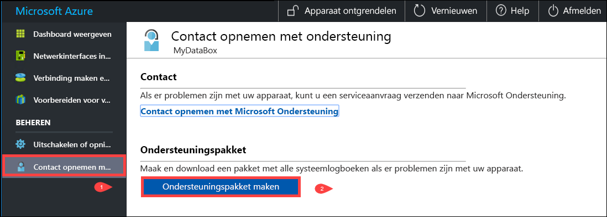
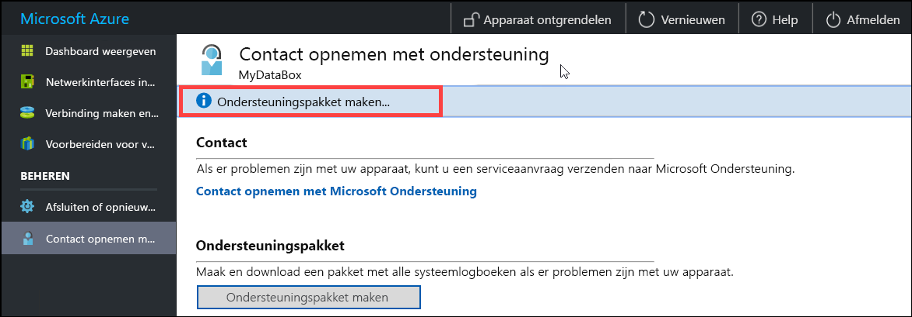
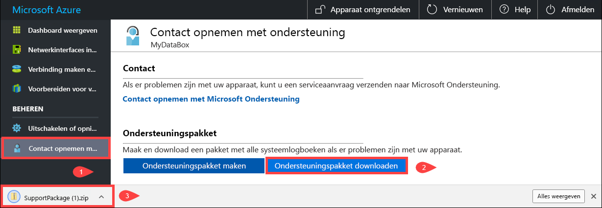
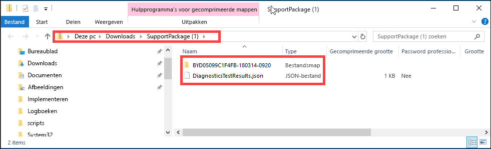
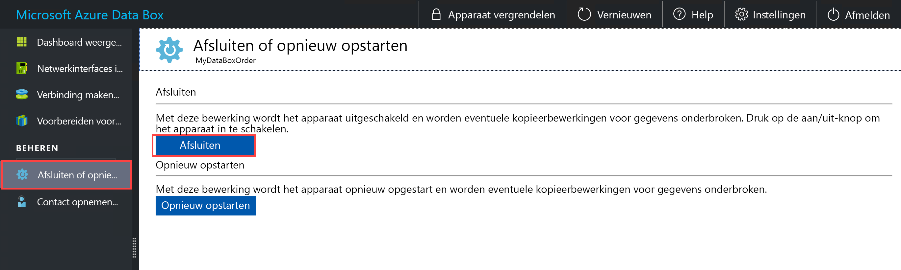
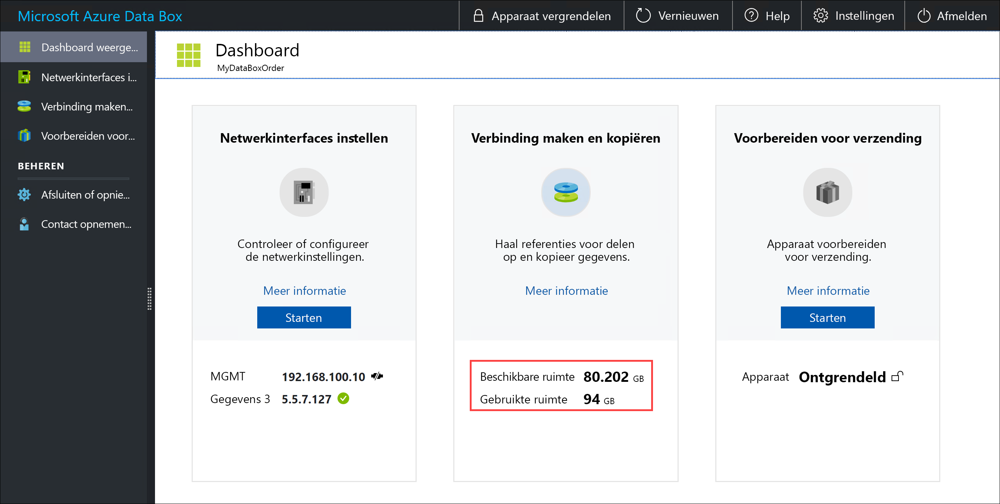

# De lokale webinterface gebruiken om uw Data Box beheren

In dit artikel worden enkele van de complexe werkstromen en beheertaken beschreven die kunnen worden uitgevoerd voor de Data Box. U kunt de Data Box beheren via de gebruikersinterface van Azure Portal en de lokale webinterface voor het apparaat. Dit artikel richt zich op de taken die u kunt uitvoeren met behulp van de lokale webinterface.

De lokale webinterface voor de Data Box wordt gebruikt voor de initiële configuratie van het apparaat. U kunt de lokale webinterface ook gebruiken om de Data Box af te sluiten of opnieuw te starten, diagnostische tests uit te voeren, software bij te werken, logboeken te bekijken en een logboekpakket voor Microsoft Ondersteuning te genereren.

Dit artikel bevat de volgende zelfstudies:

- Een ondersteuningspakket genereren
- Apparaat uitschakelen of opnieuw opstarten
- Gegevens veilig wissen van uw apparaat
- Beschikbare capaciteit van het apparaat monitoren
- De controlesomvalidatie overslaan 

## Ondersteuningspakket genereren

Als u problemen met het apparaat ondervindt, kunt u een ondersteuningspakket maken vanuit het systeemlogboek. Microsoft Ondersteuning gebruikt dit pakket om het probleem op te lossen. Ga als volgt te werk om een ondersteuningspakket te genereren:

1. Ga in de lokale webinterface naar **Contact opnemen met de ondersteuning**  en klik op **Ondersteuningspakket maken**.

    

2. Er wordt een ondersteuningspakket verzameld. Deze bewerking duurt enkele minuten.

    

3. Nadat het maken van het ondersteuningspakket is voltooid, klikt u op **Ondersteuningspakket downloaden**. 

    

4. Blader naar en kies de downloadlocatie. Open de map om de inhoud weer te geven.

    

## Apparaat uitschakelen of opnieuw opstarten

U kunt uw Data Box afsluiten of opnieuw starten met de lokale webinterface. We raden u aan de shares vóór de herstart offline te zetten op de host en vervolgens op het apparaat. Dit minimaliseert de kans op beschadigde gegevens. Zorg ervoor dat er geen gegevens worden gekopieerd wanneer u het apparaat afsluit.

Voer de volgende stappen uit om uw Data Box af te sluiten.

1. Ga in de lokale webinterface naar **Afsluiten of opnieuw opstarten**.
2. Klik op **Afsluiten**.

    

3. Klik op **OK** als u om bevestiging wordt gevraagd.

    

Nadat het apparaat is uitgeschakeld, gebruikt u de aan-uitknop op het voorpaneel om het apparaat in te schakelen.

Voer de volgende stappen uit om uw Data Box opnieuw op te starten.

1. Ga in de lokale webinterface naar **Afsluiten of opnieuw opstarten**.
2. Klik op **Opnieuw opstarten**.

    

3. Klik op **OK** als u om bevestiging wordt gevraagd.

   Het apparaat wordt afgesloten en opnieuw opgestart.

## Beschikbare capaciteit van het apparaat weergeven

U kunt het apparaatdashboard gebruiken om de beschikbare en gebruikte capaciteit van het apparaat weer te geven. 

1. Ga in de lokale webinterface naar **Dashboard weergeven**.
2. Onder **Verbinding maken en kopiëren** wordt de beschikbare en gebruikte ruimte op het apparaat weergegeven.

    

## De controlesomvalidatie overslaan

Een controlesom wordt standaard gegenereerd voor uw gegevens tijdens de voorbereiding voor verzending. In sommige zeldzame gevallen, afhankelijk van het gegevenstype (kleine bestandsgrootten), kan dit erg lang duren. In dergelijke gevallen kunt u de controlesom overslaan. 

We raden u ten zeerste aan om de controlesom niet uit te schakelen, tenzij de prestaties te veel worden beïnvloed.

1. Ga naar Instellingen in de rechterbovenhoek van de lokale webinterface van uw apparaat.

    

2. Controlesomvalidatie **Uitschakelen**
3. Klik op **Toepassen**.

## Volgende stappen

- Informatie over het [beheren van de Data Box Disk via Azure Portal](data-box-portal-admin.md).

