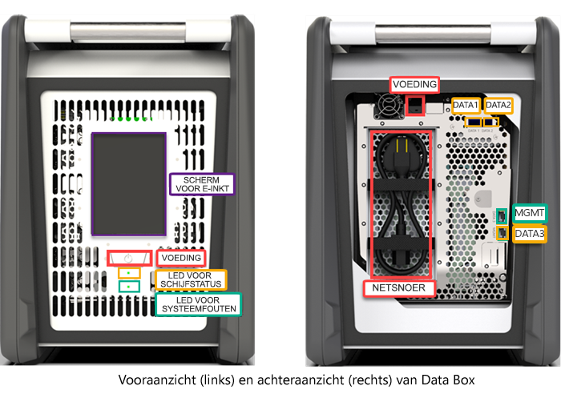
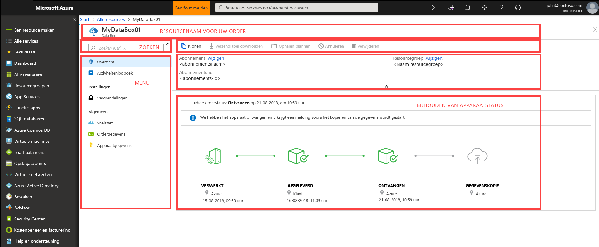
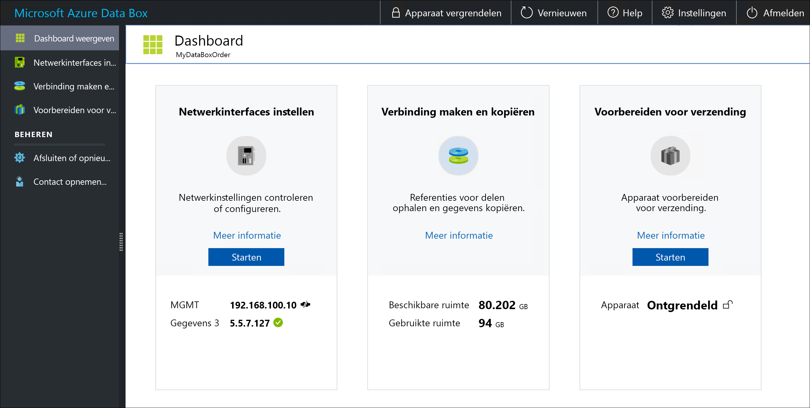

# Wat is Azure Data Box?

Met de cloudoplossing Microsoft Azure Data Box kunt u terabytes aan on-premises gegevens op een snelle, goedkope en betrouwbare manier naar Azure verzenden. De veilige gegevensoverdracht wordt versneld door u een systeemeigen Data Box-opslagapparaat toe te sturen. Elk opslagapparaat heeft een maximaal bruikbare opslagcapaciteit van 80 TB en wordt via een regionale koerier naar uw datacenter vervoerd. Dit apparaat heeft een stevige behuizing om uw gegevens tijdens het verzenden te beschermen.

U kunt het Data Box-apparaat bestellen via de Azure Portal. Nadat het apparaat is ontvangen, kunt u het snel instellen via de lokale webinterface. Kopieer de gegevens van uw servers naar het apparaat en stuur het terug naar Azure. In het Azure-datacenter worden uw gegevens automatisch geüpload van de schijven naar Azure. Het volledige proces wordt gevolgd door de Data Box-service in de Azure-portal.

## Gebruiksvoorbeelden

Data Box is ideaal voor het overbrengen van gegevens met een totale omvang van 40 TB in scenario’s met geen tot beperkte netwerkbandbreedte. De gegevensverplaatsing kan eenmalig of periodiek zijn, of eerst een grote gegevensoverdracht, gevolgd door meerdere periodieke overdrachten. Hier volgen de verschillende scenario’s waarin Data Box kan worden gebruikt voor gegevensoverdracht.

 - **Eenmalige migratie**: wanneer grote aantallen on-premises gegevens worden verplaatst naar Azure. 
     - Verplaatsen van een mediabibliotheek van offline tapes naar Azure, voor het maken van een online mediabibliotheek.
     - Uw virtuele machines, SQL Server en toepassingen migreren naar Azure
     - Historische gegevens naar Azure verplaatsen voor gedetailleerde analyse en rapportage met HDInsight

 - **Initiële bulkoverdracht**: wanneer eerst een grote overdracht plaatsvindt met Data Box (seed), gevolgd door incrementele overdrachten via het netwerk. 
     - Bijvoorbeeld: voor de eerste grote back-up van historische gegevens naar Azure wordt gebruikgemaakt van een back-upoplossing van Commvault of Data Box. Zodra dat is voltooid, worden gegevens incrementeel via het netwerk overgebracht naar Azure-opslag.

- **Periodieke uploads**: wanneer er periodiek grote aantallen gegevens worden gegenereerd en verplaatst moeten worden naar Azure. Bijvoorbeeld in de energie-exploitatie, waar er video's worden gegenereerd op olieplatforms en windmolenparken.      

## Voordelen

Data Box is ontworpen om grote aantallen gegevens naar Azure te verplaatsen met weinig tot geen impact op het netwerk. Deze oplossing biedt de volgende voordelen:

- **Snelheid** : Data Box maakt gebruik van netwerkinterfaces van 1 Gbps of 10 Gbps om maximaal 80 TB aan gegevens in Azure te verplaatsen.

- **Beveiligd**: Data Box heeft ingebouwde beveiliging voor het apparaat, de gegevens en de service.
    - Het apparaat heeft een robuuste behuizing die is beveiligd met fraudebestendige schroeven en verzegelde stickers. 
    - De gegevens op het apparaat zijn altijd beveiligd met AES 256-bitsversleuteling.
    - Het apparaat kan alleen worden ontgrendeld met een wachtwoord dat via Azure Portal wordt doorgegeven.
    - De service wordt beschermd door beveiligingsfuncties van Azure.
    - Nadat uw gegevens zijn geüpload naar Azure, worden alle schijven in het apparaat gewist overeenkomstig NIST 800-88r1-standaarden.
    
    Ga naar [Azure Data Box-beveiliging en -gegevensbescherming](data-box-security.md) voor meer informatie.

## Functies en specificaties

Het Data Box-apparaat biedt de volgende functies in deze versie.

| Specificaties                                          | Beschrijving              |
|---------------------------------------------------------|--------------------------|
| Gewicht                                                  | < 50 pond.                |
| Dimensies                                              | Apparaat - Breedte: 309,0 mm Hoogte: 430,4 mm Diepte: 502,0 mm |            
| Rackruimte                                              | 7 U wanneer het op zijn apparaat in het rack wordt geplaatst (kan niet in rack worden gemonteerd)|
| Vereiste kabels                                         | 1 x voedingskabel (inbegrepen)   2 RJ45-kabels   2 x SFP+ Twinax-koperen kabels|
| Opslagcapaciteit                                        | 100 TB-apparaat bevat bruikbare capaciteit van 80 TB na RAID 5-bescherming|
| Nominaal vermogen                                            | De voedingseenheid is geraamd op 700 W.   Normaal gesproken verbruikt de eenheid 375 W.|
| Netwerkinterfaces                                      | 2 X 1 GbE interface - MGMT, DATA 3.   MGMT - Eén beheerinterface, niet configureerbaar door gebruikers, gebruikt voor eerste installatie   DATA3 - Voor gegevens, kan door gebruiker worden geconfigureerd en is standaard dynamisch   MGMT en DATA 3 kunnen ook werken als 10 GbE   2 x 10 GbE-interface - DATA 1, DATA 2   Beide zijn voor gegevens en kunnen dynamisch (standaard) of statisch worden geconfigureerd |
| Media voor gegevensoverdracht                                     | RJ45, SFP+ copper 10 GbE Ethernet  |
| Beveiliging                                                | Robuust apparaat met fraudebestendige, aangepaste schroeven   Verzegeling aan de onderkant van het apparaat|
| Overdrachtssnelheid                                      | Maximaal 80 TB in een dag via 10 GbE-netwerkaansluiting        |
| Beheer                                              | Lokale webgebruikersinterface - eenmalige initiële installatie en configuratie   Azure Portal - Dagelijks apparaatbeheer        |

## Componenten van Data Box

De Data Box bevat de volgende componenten:

* **Data Box-apparaat** - Een fysiek apparaat dat primaire opslag biedt, communicatie met opslag in de cloud beheert en de beveiliging en geheimhouding van alle gegevens die op het apparaat zijn opgeslagen helpt garanderen. Het Data Box-apparaat heeft een bruikbare opslagcapaciteit van 80 TB. 

    

    
* **Data Box-service**: Een extensie in Azure Portal waarmee u een Data Box-apparaat kunt beheren via een webinterface waartoe u toegang hebt vanaf verschillende geografische locaties. U kunt de Data Box-service gebruiken voor het dagelijkse beheer van uw Data Box-apparaat. Met de service kunt u taken uitvoeren zoals orders maken en beheren, waarschuwingen bekijken en beheren en shares beheren.  

    

    Ga naar [De Data Box-service gebruiken om uw Data Box-apparaat te beheren](data-box-portal-ui-admin.md) voor meer informatie.

* **Lokale webinterface**: een webinterface die wordt gebruikt voor het configureren van het apparaat, zodat u verbinding kunt maken met het lokale netwerk en het apparaat bij de Data Box-service kunt registreren. Gebruik de lokale webinterface om het Data Box-apparaat uit te schakelen of opnieuw op te starten, logboeken met kopieerbewerkingen te bekijken en contact op te nemen met Microsoft Ondersteuning om een serviceaanvraag in te dienen.

    

    Ga naar [De webgebaseerde gebruikersinterface gebruiken om uw Data Box te beheren](data-box-portal-ui-admin.md) voor informatie over het gebruik van de webgebaseerde gebruikersinterface.

## De werkstroom

Een typische stroom bestaat uit de volgende stappen:

1. **Bestellen**: plaats een bestelling in Azure Portal en geef de verzendingsgegevens en het Azure-doelopslagaccount voor uw gegevens op. Wanneer het apparaat beschikbaar is, bereidt Azure het voor en verstuurt Azure het met volgnummer.

2. **Ontvangen**: Nadat het apparaat wordt geleverd, sluit u de opgegeven netwerk- en voedingskabels aan. Zet het apparaat aan en sluit het aan. Configureer de netwerkinstellingen voor het apparaat en koppel bestandsshares op de hostcomputer van waar u gegevens wilt kopiëren.

3. **Gegevens kopiëren**: Kopieer gegevens naar Data Box-shares.

4. **Retourneren**: Bereid het apparaat voor, zet het uit en stuur het terug naar het Azure-datacenter.

5. **Uploaden**: De gegevens worden automatisch van het apparaat naar Azure gekopieerd. De schijven in het apparaat worden veilig gewist overeenkomstig de richtlijnen van het National Institute of Standards and Technology.

Tijdens dit proces wordt u via e-mail op de hoogte gesteld van alle statuswijzigingen. Ga naar [Data Box in Azure Portal implementeren](data-box-deploy-ordered.md) voor meer informatie over de gedetailleerde werkstroom.

## Beschikbaarheid in regio’s

Data Box kan bestanden overgedragen op basis van de regio waarin de service is geïmplementeerd, het land waar het apparaat naar wordt verzonden, en het Azure-opslagaccount waarnaar de gegevens worden overgebracht. 

- **Beschikbaarheid van service**: voor deze release is de Data Box-service beschikbaar in de volgende regio’s:
    - Alle regio's in de Verenigde Staten: US - west-centraal, US - west 2, US - west, US - zuid-centraal, US - centraal, US - noord-centraal, US - oost en US - oost 2.
    - Europese Unie: Europa - west en Europa - noord.
    - Verenigd Koninkrijk: UK - zuid en UK - west.
    - Frankrijk: Frankrijk - centraal en Frankrijk - zuid.

- **Doelopslagaccounts**: De opslagaccounts waarin de gegevens worden opgeslagen, zijn beschikbaar in alle Azure-regio’s waar de service beschikbaar is.  

## Volgende stappen

- De [Systeemvereisten voor Data Box](data-box-system-requirements.md) lezen.
- Informatie over de [Limieten voor Data Box](data-box-limits.md).
- [Azure Data Box](data-box-quickstart-portal.md) snel implementeren in de Azure-portal.

