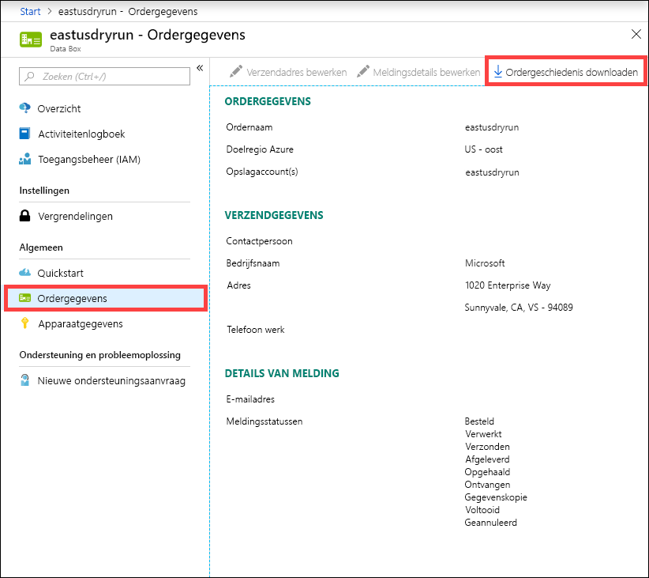
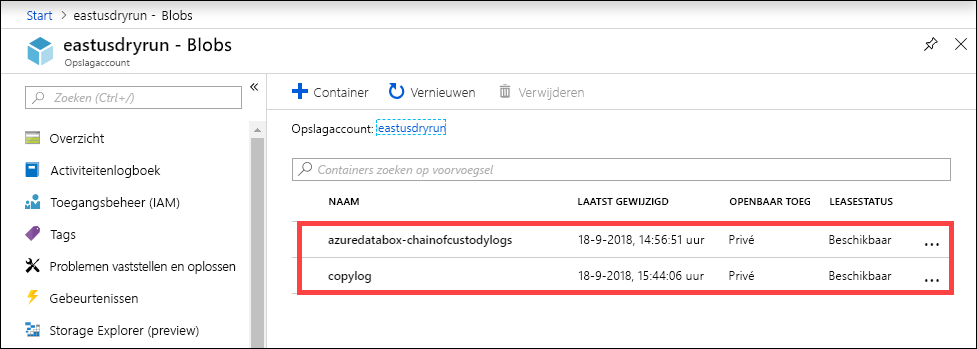
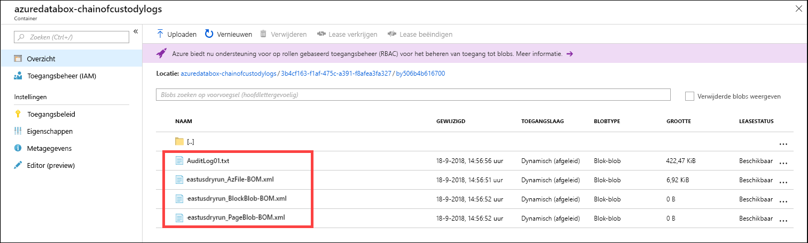

# <a name="use-the-azure-portal-to-administer-your-data-box"></a>De Azure-portal gebruiken om uw Data Box te beheren

In dit artikel worden enkele van de complexe werkstromen en beheertaken beschreven die kunnen worden uitgevoerd voor de Data Box. U kunt de Data Box beheren via de Azure-portal of via de lokale webinterface. 

Dit artikel richt zich op de taken die u kunt uitvoeren met behulp van de Azure-portal. Gebruik de Azure-portal voor het beheren van orders, het beheren van Data Box en het bijhouden van de status van de order totdat deze is voltooid.


## <a name="cancel-an-order"></a>Een order annuleren

Soms moet u een order om een bepaalde reden annuleren nadat u deze hebt geplaatst. U kunt de order alleen annuleren als deze nog niet is verwerkt. Zodra de order is verwerkt en Data Box is voorbereid, kan de order niet meer worden geannuleerd. 

Voer de volgende stappen uit om een order te annuleren.

1.  Ga naar **Overzicht > Annuleren**. 

    

2.  Geef een reden op voor het annuleren van de order.  

    

3.  Zodra de order is geannuleerd, werkt de portal de status van de order bij naar **Geannuleerd**. 

## <a name="clone-an-order"></a>Een order klonen

Klonen is handig in bepaalde situaties. Een voorbeeld: Een gebruiker heeft Data Box gebruikt om wat gegevens over te dragen. Naarmate er meer gegevens worden gegenereerd, is er nog een Data Box nodig om die gegevens naar Azure over te dragen. In dit geval kan dezelfde order gewoon worden gekloond.

Voer de volgende stappen uit om een order te klonen.

1.  Ga naar **Overzicht > Klonen**. 

    

2.  Alle details van de order blijven hetzelfde. De ordernaam is de oorspronkelijke ordernaam met *-Kloon* eraan toegevoegd. Schakel het selectievakje in om te bevestigen dat u de privacyinformatie hebt gelezen. Klik op **Create**.

De kloon wordt binnen enkele minuten gemaakt en de portal wordt bijgewerkt met de nieuwe order.


## <a name="delete-order"></a>Order verwijderen

Wanneer de order is voltooid, wilt u deze wellicht verwijderen. De order bevat uw persoonlijke informatie, zoals naam, adres en contactgegevens. Deze persoonlijke informatie wordt verwijderd wanneer de order wordt verwijderd.

U kunt alleen orders verwijderen die zijn voltooid of geannuleerd. Voer de volgende stappen uit om een order te verwijderen.

1. Ga naar **Alle resources**. Zoek uw order.

2. Klik op de order die u wilt verwijderen en ga naar **Overzicht**. Klik in de opdrachtbalk op **Verwijderen**.

    

3. Voer de naam van de order in wanneer u wordt gevraagd de orderverwijdering te bevestigen. Klik op **Verwijderen**.

## <a name="download-shipping-label"></a>Verzendlabel downloaden

Als het E-ink-scherm van uw Data Box niet werkt en het verzendlabel voor retourzending niet weergeeft, kunt u het verzendlabel downloaden. 

Voer de volgende stappen uit om een verzendlabel te downloaden.

1.  Ga naar **Overzicht > Verzendlabel downloaden**. Deze optie is alleen beschikbaar nadat het apparaat is verzonden. 

    

2.  Hiermee downloadt u het volgende verzendlabel voor retourzending. Sla het label op en druk het af. Vouw het label en steek het in de doorzichtige plastic hoes op het apparaat. Zorg dat het label zichtbaar is. Verwijder eventuele stickers van de vorige verzending die op het apparaat zitten.

    

## <a name="edit-shipping-address"></a>Verzendadres bewerken

U moet het verzendadres wellicht bewerken nadat de order is geplaatst. Dit kan alleen als het apparaat nog niet is verzonden. Zodra het apparaat is verzonden, is deze optie niet meer beschikbaar.

Voer de volgende stappen uit om de order te bewerken.

1. Ga naar **Ordergegevens > Verzendadres bewerken**.

    

2. Bewerk en valideer het verzendadres en sla de wijzigingen vervolgens op.

    

## <a name="edit-notification-details"></a>Meldingsdetails bewerken

U moet wellicht wijzigen welke gebruikers de e-mails met de orderstatus ontvangen. Een voorbeeld: Een bepaalde gebruiker moet worden geïnformeerd wanneer het apparaat wordt afgeleverd of opgehaald. Een andere gebruiker moet worden geïnformeerd wanneer het kopiëren van de gegevens is voltooid, zodat hij kan verifiëren dat de gegevens zich in het Azure-opslagaccount bevinden voordat hij ze uit de bron verwijdert. In deze gevallen kunt u de meldingsdetails bewerken.

Voer de volgende stappen uit om meldingsdetails te bewerken.

1. Ga naar **Ordergegevens > Meldingsdetails bewerken**.

    

2. U kunt de meldingsdetails nu bewerken en de wijzigingen vervolgens opslaan.
 
    


## <a name="download-order-history"></a>Ordergeschiedenis downloaden

Nadat de Data Box-order is voltooid, worden de gegevens op de schijven van het apparaat gewist. Wanneer het opschonen van het apparaat is voltooid, kunt u de ordergeschiedenis downloaden in de Azure-portal.

Voer de volgende stappen uit om de ordergeschiedenis te downloaden.

1. Ga in uw Data Box-order naar **Overzicht**. Controleer of de order is voltooid. Als de order is voltooid en het opschonen van het apparaat is voltooid, gaat u naar **Ordergegevens**. De optie **Ordergeschiedenis downloaden** is beschikbaar.

    

2. Klik op **Ordergeschiedenis downloaden**. In de downloadgeschiedenis ziet u een record met logboeken voor tracering van de koerier. Als u naar de onderkant van dit logboek bladert, kunt u koppelingen zien naar:
    
   - **Logboeken kopiëren**: hier vindt u de lijst met bestanden met fouten tijdens het kopiëren van gegevens van de Data Box naar uw Azure Storage-account.
   - **Auditlogboeken**: hier vindt u informatie over het inschakelen en delen van toegang tot de Data Box wanneer deze zich buiten het Azure-datacenter bevindt.
   - **BOM-bestanden**: hier vindt u de lijst met bestanden (ook wel bekend als het bestandsmanifest) die u kunt downloaden tijdens **Voorbereiding voor verzending** en de bestandsnamen, grootte en de bestandscontrolesommen.

       ```
       -------------------------------
       Microsoft Data Box Order Report
       -------------------------------
        
       Name                                               : eastusdryrun                                      
       StartTime(UTC)                                     : 9/6/2018 12:54:47 PM +00:00                       
       DeviceType                                         : ImolaPod                                          
        
       -------------------
       Data Box Activities
       -------------------
        
       Time(UTC)             | Activity                       | Status          | Description                                                                                                                                           
        
       9/6/2018 12:54:51 PM  | OrderCreated         | Completed  |                                                                                                                              
       9/11/2018 8:57:38 PM  | DevicePrepared       | Completed  |                                                                                                                                                       
       9/12/2018 7:28:15 PM  | ShippingToCustomer   | InProgress | Pickup Scan. Local Time : 9/12/2018 2:52:31 PM at Chantilly                                                                                           
       9/13/2018 2:33:04 AM  | ShippingToCustomer   | InProgress | Departure Scan. Local Time : 9/12/2018 9:00:00 PM at Chantilly                                                                                                                                                                                                                                                              
       9/13/2018 12:40:31 PM | ShippingToCustomer   | InProgress | Arrival Scan. Local Time : 9/13/2018 5:00:00 AM at Oakland                                                                                            
       9/13/2018 2:42:10 PM  | ShippingToCustomer   | InProgress | Departure Scan. Local Time : 9/13/2018 6:08:00 AM at Oakland                                                                                          
       9/13/2018 3:42:12 PM  | ShippingToCustomer   | InProgress | Destination Scan. Local Time : 9/13/2018 8:14:08 AM at Sunnyvale                                                                                      
       9/13/2018 4:43:05 PM  | ShippingToCustomer   | InProgress | Destination Scan. Local Time : 9/13/2018 8:56:54 AM at Sunnyvale                                                                                      
       9/13/2018 4:43:05 PM  | ShippingToCustomer   | InProgress | Out For Delivery Today. Local Time : 9/13/2018 9:11:21 AM at Sunnyvale                                                                                
       9/13/2018 5:43:07 PM  | ShippingToCustomer   | Completed  | Delivered. Local Time : 9/13/2018 9:44:17 AM at SUNNYVALE                                                                                             
       9/14/2018 11:48:35 PM | ShippingToDataCenter | InProgress | Pickup Scan. Local Time : 9/14/2018 3:55:37 PM at Sunnyvale                                                                                                                                                                                 
       9/15/2018 1:52:35 AM  | ShippingToDataCenter | InProgress | Arrival Scan. Local Time : 9/14/2018 6:31:00 PM at San Jose                                                                                           
       9/15/2018 2:52:39 AM  | ShippingToDataCenter | InProgress | Departure Scan. Local Time : 9/14/2018 7:17:00 PM at San Jose                                                                                                                                                                             
       9/17/2018 8:23:31 AM  | ShippingToDataCenter | InProgress | Destination Scan. Local Time : 9/17/2018 4:14:37 AM at Chantilly                                                                                      
       9/17/2018 12:24:42 PM | ShippingToDataCenter | InProgress | Loaded on Delivery Vehicle. Local Time : 9/17/2018 7:45:36 AM at Chantilly                                                                            
       9/17/2018 1:25:11 PM  | ShippingToDataCenter | InProgress | Out For Delivery Today. Local Time : 9/17/2018 8:27:11 AM at Chantilly                                                                                
       9/17/2018 2:25:51 PM  | ShippingToDataCenter | Completed | Delivered. Local Time : 9/17/2018 9:56:32 AM at STERLING                                                                                              
       9/18/2018 9:55:41 PM  | DeviceBoot           | Completed | Appliance booted up successfully                                                                                                                      
       9/18/2018 11:00:25 PM | DataCopy             | Started   |                                                                                                                                                       
       9/18/2018 11:01:33 PM | DataCopy             | Completed | Copy Completed.                                                                                                                                       
       9/18/2018 11:20:58 PM | SecureErase          | Started   |                                                                                                                                                       
       9/18/2018 11:28:46 PM | SecureErase          | Completed | Azure Data Box:BY506B4B616700 has been sanitized according to NIST 800 -88 Rev 1.                                                                     
        
       ----------------------
       Data Box Job Log Links
       ----------------------
        
       Account Name         : eastusdryrun                                         
       Copy Logs Path       : copylog/copylogd695869a2a294396b7b903296c208388.xml                                                                                                                                                     
       Audit Logs Path      : azuredatabox-chainofcustodylogs\3b4cf163-f1af-475c-a391-f8afea3fa327\by506b4b616700                                                                                                                     
       BOM Files Path       : azuredatabox-chainofcustodylogs\3b4cf163-f1af-475c-a391-f8afea3fa327\by506b4b616700
       ```
     U kunt vervolgens naar uw opslagaccount gaan en de logboeken met kopieerbewerkingen bekijken.



U kunt ook de bewakingsketenlogboeken bekijken die de controlelogboeken en de BOM-bestanden bevatten.



## <a name="view-order-status"></a>Orderstatus bekijken

Wanneer de apparaatstatus in de portal verandert, wordt u per e-mail op de hoogte gesteld.

|Orderstatus |Description |
|---------|---------|
|Besteld     | De order is geplaatst. <br>Als het apparaat beschikbaar is, identificeert Microsoft het apparaat dat moet worden verzonden en bereidt Microsoft het apparaat voor. <br> Als het apparaat niet onmiddellijk beschikbaar is, wordt de order verwerkt zodra het apparaat beschikbaar is. Het kan enkele dagen tot een paar maanden duren voordat de order is verwerkt. Als de order niet binnen 90 dagen kan worden voltooid, wordt deze geannuleerd en wordt u op de hoogte gesteld.         |
|Verwerkt     | De order is verwerkt. In overeenstemming met uw order wordt het apparaat in het datacenter voorbereid voor verzending.         |
|Verzonden     | De order is verzonden. Gebruik het volgnummer dat in uw order in de portal wordt weergegeven om de verzending bij te houden.        |
|Afgeleverd     | De verzending is afgeleverd op het adres dat in de order is opgegeven.        |
|Opgehaald     |Uw retourzending is opgehaald en gescand door de vervoerder.         |
|Ontvangen     | Uw apparaat is ontvangen en gescand in het Azure-datacenter. <br> Zodra de verzending is geïnspecteerd, wordt de apparaatupload gestart.      |
|Gegevens kopiëren     | Het kopiëren van gegevens is in voortgang. Houd de kopieervoortgang voor uw order bij in de Azure-portal. <br> Wacht totdat het kopiëren van gegevens is voltooid. |
|Voltooid       |De order is voltooid.<br> Verifieer dat uw gegevens zich in Azure bevinden voordat u de on-premises gegevens van servers verwijdert.         |
|Voltooid met fouten| Het kopiëren van gegevens is voltooid, maar er zijn fouten opgetreden tijdens het kopiëren. <br> Bekijk de logboeken met kopieerbewerkingen via het pad in de Azure-portal.   |
|Geannuleerd            |De order is geannuleerd. <br> U hebt de order zelf geannuleerd, of er is een fout opgetreden waardoor de service de order heeft geannuleerd. Als de order niet binnen 90 dagen kan worden voltooid, wordt deze ook geannuleerd en wordt u op de hoogte gesteld.     |
|Opruimen | De gegevens op het apparaat worden gewist. Het opruimen van het apparaat wordt als voltooid beschouwd zodra de ordergeschiedenis beschikbaar is om te downloaden in de Azure-portal.|


## <a name="next-steps"></a>Volgende stappen

- Leren hoe u [problemen met Data Box oplost](data-box-faq.md).
