# De Azure-portal gebruiken om uw Data Box te beheren

De zelfstudies in dit artikel zijn van toepassing op de preview-versie van de Microsoft Azure Data Box Disk. In dit artikel worden enkele van de complexe werkstromen en beheertaken beschreven die kunnen worden uitgevoerd in de Data Box Disk. 

U kunt de Data Box Disk beheren via de Azure-portal. Dit artikel richt zich op de taken die u kunt uitvoeren met behulp van de Azure-portal. Gebruik de Azure-portal voor het beheren van orders, beheren van apparaten en bijhouden van de status van de order terwijl deze naar de definitieve fase gaat.

## Een order annuleren

Soms moet u een order om een bepaalde reden annuleren nadat u deze hebt geplaatst. U kunt de order alleen annuleren als de schijfvoorbereiding nog niet is gestart. Zodra de schijven zijn voorbereid en de order is verwerkt, is het niet meer mogelijk de order te annuleren. 

Voer de volgende stappen uit om een order te annuleren.

1.  Ga naar **Overzicht > Annuleren**. 

    

2.  Geef een reden op voor het annuleren van de order.  

    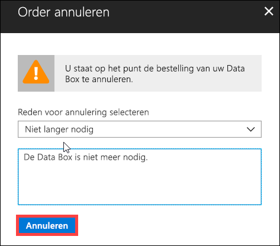

3.  Zodra de order is geannuleerd, werkt de portal de status van de order bij naar **Geannuleerd**.

    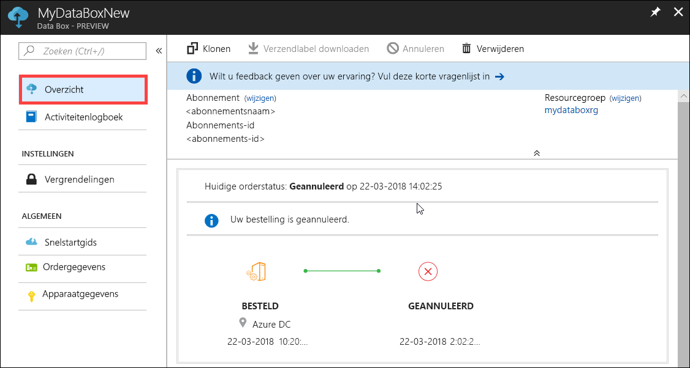

U ontvangt geen e-mailmelding wanneer de order is geannuleerd.

## Een order klonen

Klonen is handig in bepaalde situaties. Een voorbeeld: Een gebruiker heeft Data Box Disk gebruikt om wat gegevens over te dragen. Naarmate er meer gegevens worden gegenereerd, zijn er meer schijven nodig om die gegevens naar Azure over te dragen. In dit geval kan dezelfde order gewoon worden gekloond.

Voer de volgende stappen uit om een order te klonen.

1.  Ga naar **Overzicht > Klonen**. 

    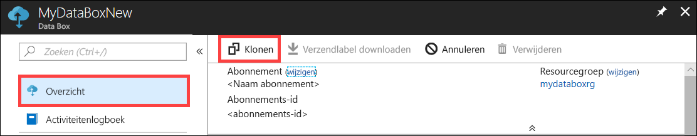

2.  Alle details van de order blijven hetzelfde. De ordernaam is de oorspronkelijke ordernaam met *-Kloon* eraan toegevoegd. Schakel het selectievakje in om te bevestigen dat u de privacyinformatie hebt gelezen. Klik op **Create**.    

De kloon wordt binnen enkele minuten gemaakt en de portal wordt bijgewerkt met de nieuwe order.

[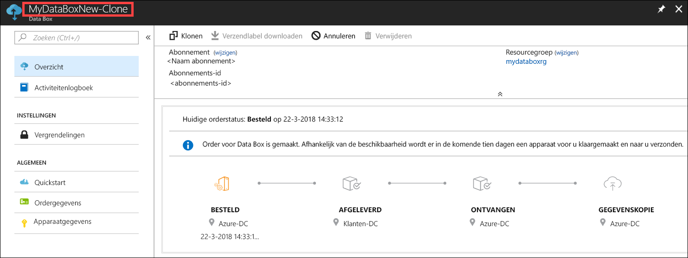](media/data-box-portal-ui-admin/clone-order3.png#lightbox) 

## Order verwijderen

Wanneer de order is voltooid, wilt u deze wellicht verwijderen. De order bevat uw persoonlijke informatie, zoals naam, adres en contactgegevens. Deze persoonlijke informatie wordt verwijderd wanneer de order wordt verwijderd.

U kunt alleen orders verwijderen die zijn voltooid of geannuleerd. Voer de volgende stappen uit om een order te verwijderen.

1. Ga naar **Alle resources**. Zoek uw order.

    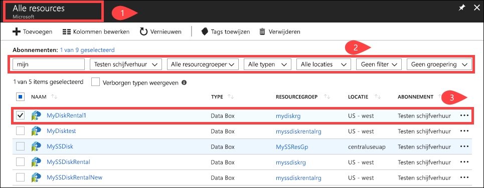

2. Klik op de order die u wilt verwijderen en ga naar **Overzicht**. Klik in de opdrachtbalk op **Verwijderen**.

    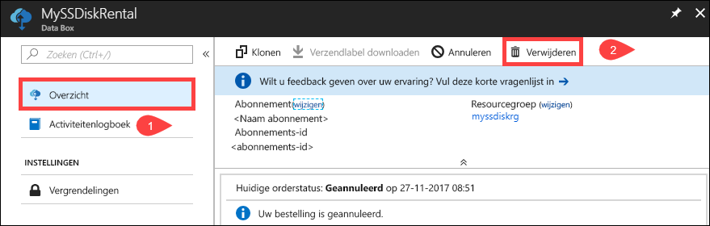

3. Voer de naam van de order in wanneer u wordt gevraagd de orderverwijdering te bevestigen. Klik op **Verwijderen**.

     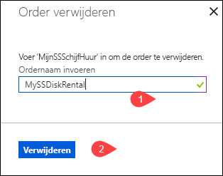

## Verzendlabel downloaden

Als het verzendlabel voor retourzending dat bij uw schijven is meegeleverd is kwijtgeraakt, kunt u het downloaden. 

Voer de volgende stappen uit om een verzendlabel te downloaden.
1.  Ga naar **Overzicht > Verzendlabel downloaden**. Deze optie is alleen beschikbaar nadat de schijf is verzonden. 

    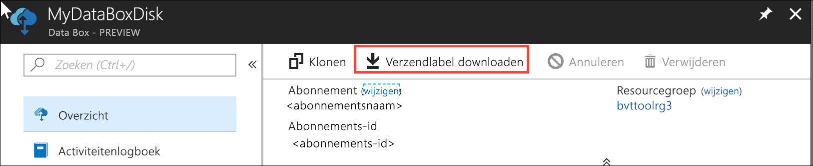

2.  Hiermee downloadt u het volgende verzendlabel voor retourzending. Sla het label op, druk het af en bevestig het aan de retourzending.

    

## Verzendadres bewerken

U moet het verzendadres wellicht bewerken nadat de order is geplaatst. Dit kan alleen als de schijf nog niet is verzonden. Zodra de schijf is verzonden, is deze optie niet meer beschikbaar.

Voer de volgende stappen uit om de order te bewerken.

1. Ga naar **Ordergegevens > Verzendadres bewerken**.

    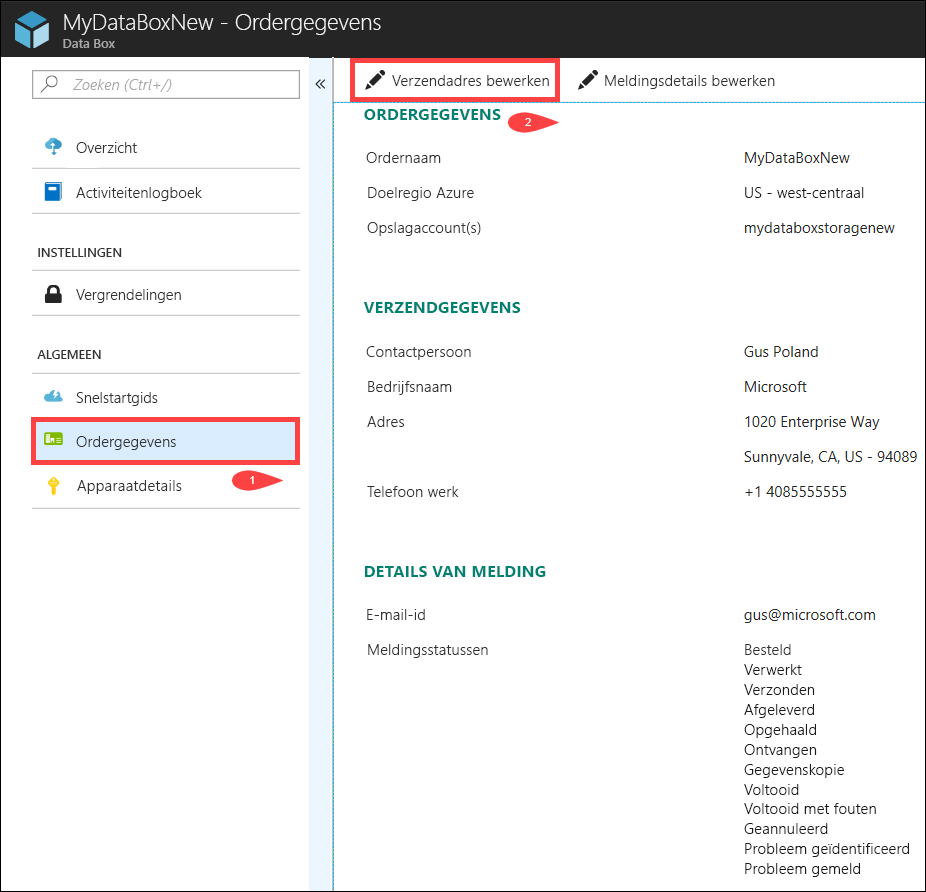

2. U kunt het verzendadres nu bewerken en de wijzigingen vervolgens opslaan.

    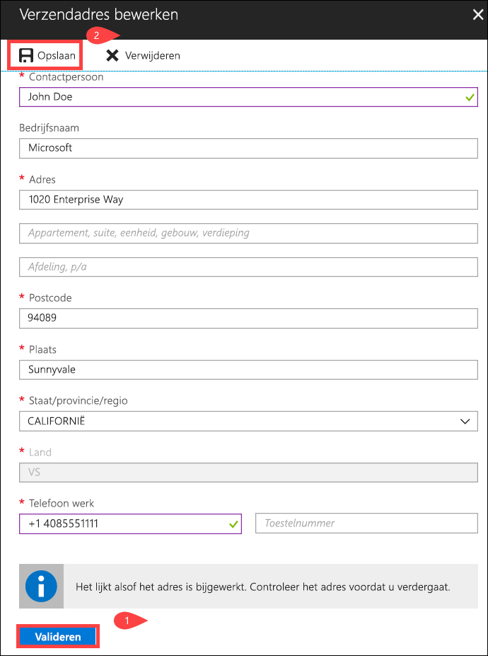

## Meldingsdetails bewerken

U moet wellicht wijzigen welke gebruikers de e-mails met de orderstatus ontvangen. Een voorbeeld: Een bepaalde gebruiker moet worden geïnformeerd wanneer de schijf wordt afgeleverd of opgehaald. Een andere gebruiker moet worden geïnformeerd wanneer het kopiëren van de gegevens is voltooid, zodat hij kan verifiëren dat de gegevens zich in het Azure-opslagaccount bevinden voordat hij ze uit de bron verwijdert. In deze gevallen kunt u de meldingsdetails bewerken.

Voer de volgende stappen uit om meldingsdetails te bewerken.

1. Ga naar **Ordergegevens > Meldingsdetails bewerken**.

    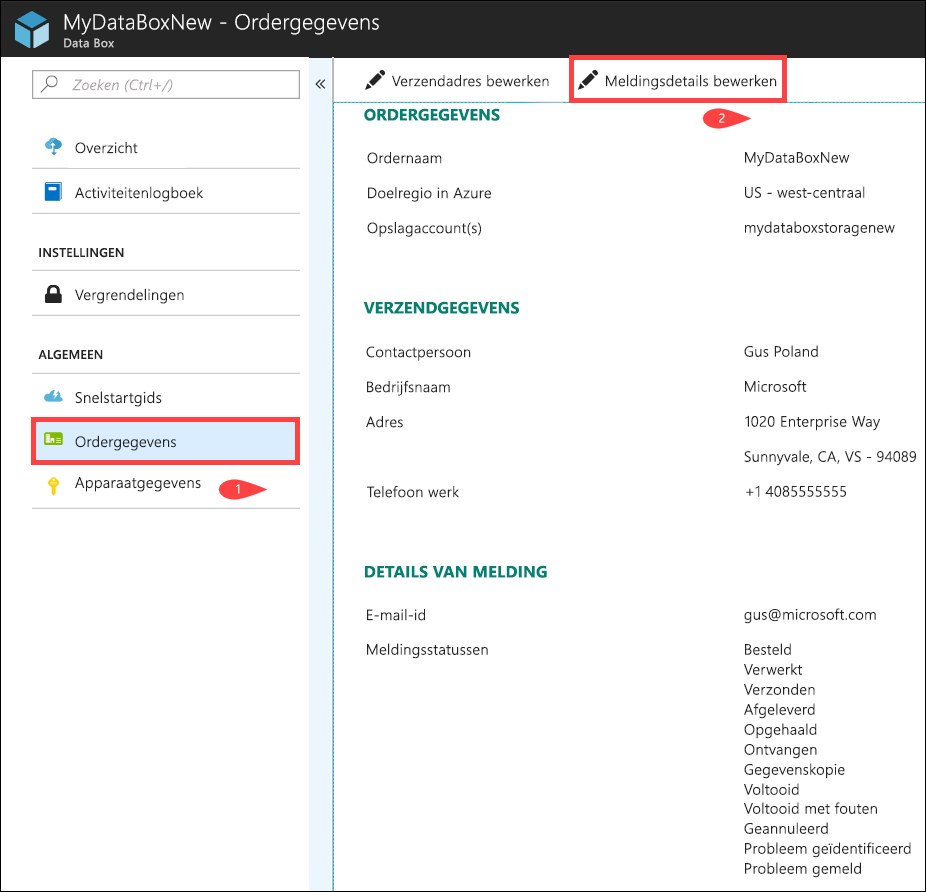

2. U kunt de meldingsdetails nu bewerken en de wijzigingen vervolgens opslaan.
 
    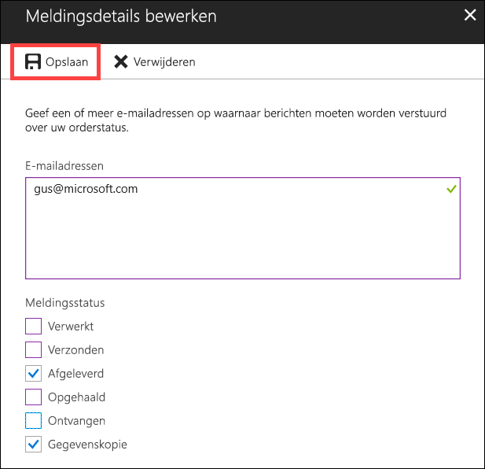

## Orderstatus bekijken

|Orderstatus |Beschrijving |
|---------|---------|
|Besteld     | De order is geplaatst.   Als de schijven niet beschikbaar zijn, ontvangt u een melding.  Als de schijven beschikbaar zijn, identificeert Microsoft een schijf die moet worden verzonden en bereidt Microsoft een schijfpakket voor.        |
|Verwerkt     | De order is verwerkt.   Tijdens de orderverwerking vinden de volgende acties plaats:<li>Schijven worden versleuteld met AES-128 BitLocker-versleuteling. </li> <li>De Data Box Disks worden vergrendeld om onbevoegde toegang te voorkomen.</li><li>De wachtwoordsleutel die de schijven ontgrendelt, wordt tijdens dit proces gegenereerd.</li>        |
|Verzonden     | De order is verzonden. U moet de order binnen 1 tot 2 dagen ontvangen.        |
|Afgeleverd     | De order is afgeleverd op het adres dat in de order is opgegeven.        |
|Opgehaald     |Uw retourzending is opgehaald.   Zodra de retourzending is ontvangen in het Azure-datacenter, worden de gegevens automatisch geüpload naar Azure.         |
|Ontvangen     | Uw schijven zijn ontvangen door het Azure-datacenter. Het kopiëren van gegevens zal binnenkort starten.        |
|Gegevens gekopieerd     |Het kopiëren van gegevens is in voortgang.  Wacht totdat het kopiëren van gegevens is voltooid.         |
|Voltooid       |De order is voltooid.  Verifieer dat uw gegevens zich in Azure bevinden voordat u de on-premises gegevens van servers verwijdert.         |
|Voltooid met fouten| Het kopiëren van gegevens is voltooid, maar er zijn fouten ontvangen.   Bekijk de logboeken met kopieerbewerkingen via het pad in **Overzicht**. Ga naar [Logboeken met diagnostische gegevens downloaden](data-box-disk-troubleshoot.md#download-diagnostic-logs) voor meer informatie.   |
|Geannuleerd            |De order is geannuleerd.   U hebt de order zelf geannuleerd, of er is een fout opgetreden waardoor de service de order heeft geannuleerd.     |

## Volgende stappen

- Leren hoe u [problemen met Data Box Disk oplost](data-box-disk-troubleshoot.md).
