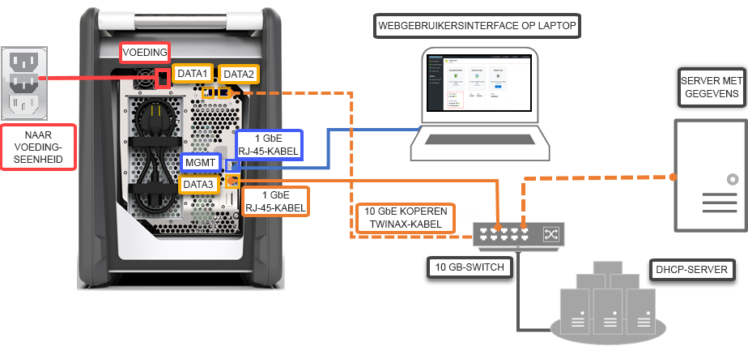

# Quickstart: De Azure Data Box implementeren met behulp van de Azure-portal

In deze quickstart wordt beschreven hoe u de Azure Data Box implementeert met behulp van de Azure-portal. De stappen omvatten het aansluiten van de kabels, het configureren en het kopiëren van gegevens naar de Data Box, zodat deze kunnen worden geüpload naar Azure. De quickstart wordt uitgevoerd in de Azure-portal en op de lokale webgebruikersinterface van het apparaat.

Ga naar [Zelfstudie: Azure Data Box bestellen](data-box-deploy-ordered.md) voor gedetailleerde stapsgewijze instructies voor implementatie en tracering

## Vereisten

Voordat u begint:

- Zorg ervoor dat het abonnement dat u voor de Data Box-service gebruikt, een van de volgende typen is:
    - Microsoft Enterprise Agreement (EA). Meer informatie over [EA-abonnementen](https://azure.microsoft.com/pricing/enterprise-agreement/).
    - Cloud Solution Provider (CSP). Meer informatie over het [Azure CSP-programma](https://docs.microsoft.com/azure/cloud-solution-provider/overview/azure-csp-overview).
    - Consumption - Betalen per gebruik. Meer informatie over [Betalen per gebruik-abonnementen](https://azure.microsoft.com/offers/ms-azr-0003p/) van Azure.
    - Microsoft Azure Sponsorship. Meer informatie over het [Azure Sponsorship-programma](https://azure.microsoft.com/offers/ms-azr-0036p/). 

- U hebt eigenaars- of inzenderstoegang tot het abonnement nodig om een Data Box-order te kunnen maken.
- Controleer de [veiligheidsrichtlijnen voor uw Data Box](data-box-safety.md).
- U hebt een hostcomputer waarop de gegevens staan die u naar de Data Box wilt kopiëren. Op uw hostcomputer moet
    - Een [ondersteund besturingssysteem](data-box-system-requirements.md) worden uitgevoerd.
    - Een verbinding bestaan met een netwerk met hoge snelheid. Het wordt aangeraden dat u beschikt over minstens één 10 GbE-verbinding. Als er geen 10 GbE-verbinding beschikbaar is, kan een 1 GbE-gegevenskoppeling worden gebruikt. Dit heeft echter wel invloed op de kopieersnelheid. 
- U moet de beschikking hebben over een plat oppervlak waarop u de Data Box kunt plaatsen. Als u het apparaat op een plank van een standaardrek wilt plaatsen, moet het datacenterrek beschikken over een 7U-sleuf. U kunt het apparaat plat of rechtop in het rek plaatsen.
- U hebt de volgende kabels aangeschaft om de Data Box aan te sluiten op de hostcomputer.
    - Twee koperen 10 GbE-kabels van het type SFP+ Twinax (gebruiken met DATA 1-, DATA 2-netwerkinterfaces)
    - Eén RJ-45-netwerkkabel van het type CAT 6 (gebruiken met de MGMT-netwerkinterface)
    - Eén RJ-45-netwerkkabel van het type CAT 6A OF CAT 6 (gebruiken met DATA 3-netwerkinterface die is geconfigureerd als respectievelijk 10 Gbps of 1 Gbps)

## Aanmelden bij Azure

Meld u aan bij de Azure Portal op [http://portal.azure.com](http://portal.azure.com).

## Bestellen

Deze stap neemt ongeveer 5 minuten in beslag.

1. Maak een nieuwe Azure Data Box-resource in de Azure-portal.
2. Selecteer een bestaand abonnement dat is ingeschakeld voor deze service, en kies **Importeren** als overdrachtstype. Geef het **Bronland** op waar de gegevens zijn opgeslagen, en geef de **Azure-doelregio** voor de gegevensoverdracht op.
3. Selecteer **Data Box**. De maximale bruikbare capaciteit is 80 TB, en voor grotere hoeveelheden gegevens kunt u meerdere orders maken.
4. Voer de order- en verzendgegevens in. Als de service beschikbaar is in uw regio, geeft u e-mailadressen voor meldingen op, controleert u de samenvatting en maakt u vervolgens de order.

Zodra de order is gemaakt, wordt het apparaat voorbereid voor verzending.

## Kabels aansluiten 

Deze stap duurt ongeveer tien minuten.

Als u de Data Box hebt ontvangen, voert u de volgende stappen uit om de kabels aan te sluiten, en het apparaat te verbinden en in te schakelen. Deze stap duurt ongeveer tien minuten.

1. Ga niet verder als u vermoedt dat er met het apparaat is geknoeid of dat het is beschadigd. Neem contact op met Microsoft Ondersteuning om een vervangend apparaat naar u te laten verzenden.
2. Controleer of u de volgende kabels hebt, voordat u het apparaat gaat aansluiten:
    
    - (Meegeleverd) geaard netsnoer met een vermogen van 10 A of hoger met een IEC60320 C-13-connector aan één eind om het apparaat te koppelen.
    - Eén RJ-45-netwerkkabel van het type CAT 6 (gebruiken met de MGMT-netwerkinterface)
    - Twee koperen 10 GbE-kabels van het type SFP+ Twinax (gebruiken met 10 Gbps DATA 1-, DATA 2-netwerkinterfaces)
    - Eén RJ-45-netwerkkabel van het type CAT 6A OF CAT 6 (gebruiken met DATA 3-netwerkinterface die is geconfigureerd als respectievelijk 10 Gbps of 1 Gbps)

3. Haal het apparaat uit de doos en plaats het op een plat oppervlak. 
    
4. Sluit de kabels aan zoals hieronder wordt weergegeven.  

      

    1. Sluit de voedingskabel aan op het apparaat.
    2. Gebruik de RJ-45-netwerkkabel van het type CAT-6 om de hostcomputer te koppelen aan de MGMT-poort (Managementpoort) op het apparaat. 
    3. Gebruik de koperen kabel van het type SFP+ Twinax om verbinding te maken met minstens één 10 Gbps-netwerkinterface (liever dan 1 Gbps), DATA 1 of DATA 2 voor gegevens. 
    4. Schakel het apparaat in. De Aan/uit-knop bevindt zich op het voorpaneel van het apparaat.

## Verbinding maken

Deze stap neemt ongeveer 5 tot 7 minuten in beslag.

1. Als u het wachtwoord van het apparaat wilt ophalen, gaat u naar **Algemeen > Apparaatdetails** in de [Azure-portal](http://portal.azure.com).
2. Wijs een statisch IP-adres 192.168.100.5 en subnet 255.255.255.0 toe aan de Ethernet-adapter op de computer die u gebruikt om verbinding te maken met Data Box. U hebt op `https://192.168.100.10` toegang tot de webgebruikersinterface van het apparaat. Nadat u het apparaat hebt ingeschakeld, duurt het maximaal 5 minuten om de verbinding tot stand te brengen. 
3. Meld u aan met het wachtwoord uit de Azure-portal. U ziet nu een foutmelding over een probleem met het beveiligingscertificaat van de website. Volg de browserinstructies om naar de webpagina te gaan.
4. De netwerkinstellingen voor de 10 Gbps-gegevensinterface (of 1 Gbps) zijn standaard geconfigureerd als DHCP. Indien nodig kunt u deze interface configureren als statisch en een IP-adres opgeven. 

## Gegevens kopiëren

De duur van deze bewerking hangt af van de hoeveelheid gegevens en de snelheid van het netwerk.
 
1. Als u een Windows-host gebruikt, gebruikt u een SMB-compatibel hulpprogramma voor het kopiëren van bestanden, zoals Robocopy. Voor een NFS-host gebruikt u de opdracht `cp` of `rsync` om de gegevens te kopiëren. Verbind het hulpprogramma met het apparaat en begin met het kopiëren van gegevens naar de shares. Ga naar [Robocopy](https://technet.microsoft.com/library/ee851678.aspx) voor meer informatie over het gebruik van Robocopy om gegevens te kopiëren.
2. Maak verbinding met de shares via het pad: `\\<IP address of your device>\ShareName`. Als u de toegangsreferenties voor de shares wilt ophalen, gaat u naar de pagina **Verbinding maken en kopiëren** in de lokale webgebruikersinterface van de Data Box.
3. Zorg ervoor dat de namen van shares en mappen, en de gegevens de richtlijnen volgen die worden beschreven in [Servicelimieten in Azure Storage en Data Box](data-box-limits.md).

## Verzenden naar Azure 

Het voltooien van deze bewerking duurt ongeveer 10 tot 15 minuten.

1. Ga naar de pagina **Voorbereiden voor verzending** in de lokale webgebruikersinterface en start de voorbereiding voor verzending. 
2. Schakel het apparaat uit in de lokale webgebruikersinterface. Verwijder de kabels uit het apparaat. 
3. Het retourlabel moet zichtbaar zijn in de E-ink-weergave. Als het label niet zichtbaar is in de E-ink-weergave, downloadt u het verzendlabel in de Azure-portal en schuift u deze in de doorzichtige sleuf die is vastgemaakt aan het apparaat.
4. Sluit de doos af en verzend deze naar Microsoft. 

## Gegevens controleren

De duur van deze bewerking hangt af van de hoeveelheid gegevens.

1. Wanneer het Data Box-apparaat is verbonden met het datacenternetwerk van Azure, wordt de gegevensupload naar Azure automatisch gestart. 
2. De Azure Data Box-service laat u weten dat het kopiëren van de gegevens is voltooid via de Azure-portal. 

    1. Controleer foutenlogboeken op eventuele fouten en onderneem toepasselijke acties.
    2. Controleer of uw gegevens zich in de opslagaccount(s) bevinden voordat u deze uit de bron verwijdert.

## Resources opschonen

Deze stap neemt 2 tot 3 minuten in beslag.

- U kunt de Data Box-order in de Azure-portal annuleren voordat de order wordt verwerkt. Zodra de order is verwerkt, kan deze niet meer worden geannuleerd. De order doorloopt verwerkingsfasen totdat deze is voltooid. Als u de order wilt annuleren, gaat u naar **Overzicht** en klikt u in de opdrachtbalk op **Annuleren**.

- U kunt de order verwijderen zodra de status als **Voltooid** of **Geannuleerd** wordt weergegeven in de Azure-portal. Als u de order wilt verwijderen, gaat u naar **Overzicht** en klikt u in de opdrachtbalk op **Verwijderen**.

## Volgende stappen

In deze quickstart hebt u Azure Data Box geïmplementeerd om u te helpen uw gegevens te importeren in Azure. Ga verder naar de volgende zelfstudie voor meer informatie over Azure Data Box-beheer: 

> [!div class="nextstepaction"]
> [De Azure-portal gebruiken om Data Box te beheren](data-box-portal-admin.md)

