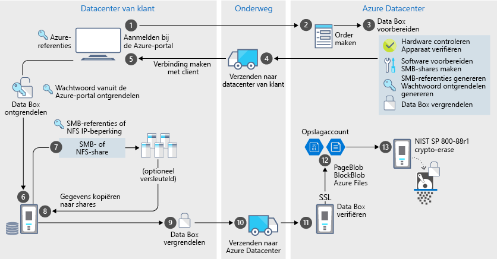

# Azure Data Box-beveiliging en -gegevensbescherming

Data Box biedt een veilige oplossing voor gegevensbescherming door te garanderen dat alleen bevoegde entiteiten uw gegevens kunnen bekijken, wijzigen of verwijderen. In dit artikel worden de Azure Data Box-beveiligingsfuncties beschreven die de Data Box-oplossingsonderdelen helpen te beschermen, evenals de gegevens die daarin worden opgeslagen. 

[!INCLUDE [GDPR-related guidance](../../includes/gdpr-intro-sentence.md)]

## Gegevens stromen door onderdelen

De Microsoft Azure Data Box-oplossing bestaat uit vier hoofdonderdelen die met elkaar samenwerken:

- **Azure Data Box-service die in Azure wordt gehost** – De beheerservice die u gebruikt om de apparaatorder te maken, het apparaat te configureren en de order vervolgens bij te houden totdat deze is voltooid.
- **Data Box-apparaat** – Het overdrachtsapparaat dat naar u worden verzonden om uw on-premises gegevens in Azure te importeren. 
- **Clients/hosts die met het apparaat zijn verbonden** – De clients in uw infrastructuur die via USB verbinding maken met de Data Box-apparaat en gegevens bevatten die moeten worden beschermd.
- **Cloudopslag** – De locatie in de Azure-cloud waar gegevens worden opgeslagen. Dit is meestal het opslagaccount dat is gekoppeld aan de Azure Data Box-resource die u hebt gemaakt.

Het volgende diagram toont de stroom van gegevens via de Azure Data Box-oplossing van on-premises naar Azure.

## Beveiligingsfuncties

Data Box biedt een veilige oplossing voor gegevensbescherming door te garanderen dat alleen bevoegde entiteiten uw gegevens kunnen bekijken, wijzigen of verwijderen. De beveiligingsfuncties van deze oplossing zijn voor de schijf en voor de bijbehorende service, zodat de gegevens worden beschermd die daarop worden opgeslagen. 

### Data Box-apparaatbescherming

Het Data Box-apparaat wordt door de volgende functies beschermd:

- Een robuuste apparaatbehuizing die bestand is tegen schokken, nadelig transport en milieuomstandigheden. 
- Speciale verzegeling die eventuele onrechtmatig gebruik tijdens transport aangeeft.
- Detectie van onrechtmatig gebruik van de hard- en software die verder gebruik van het apparaat voorkomt.
- Kan alleen worden uitgevoerd met Data Box-specifieke software.
- Wordt in vergrendelde toestand opgestart.
- Apparaattoegang via wachtwoordontgrendeling.
- Toegangsreferenties om gegevens van en naar het apparaat te kopiëren.

### Data Box-gegevensbescherming

De gegevens die in en uit de Data Box stromen, worden door de volgende functies beschermd:

- AES 256-bits versleuteling voor data-at-rest. 
- Versleutelde protocollen kunnen worden gebruikt voor data-in-flight.
- Veilige verwijdering van gegevens van apparaat zodra ze naar Azure zijn geüpload. Gegevensverwijdering is in overeenstemming met NIST 800-88r1-standaarden.

### Data Box-servicebescherming

De Data Box-service wordt door de volgende functies beschermd:

- Voor toegang tot de Data Box-service moet uw organisatie een Azure-abonnement hebben dat Data Box omvat. Uw abonnement bepaalt tot welke functies u toegang hebt in de Azure-portal.
- Omdat de Data Box-service in Azure wordt gehost, wordt deze beschermd door de Azure-beveiligingsfuncties. Ga naar het [Vertrouwenscentrum van Microsoft Azure](https://www.microsoft.com/TrustCenter/Security/default.aspx) voor meer informatie over de beveiligingsfuncties die worden geleverd door Microsoft Azure. 
- In de Data Box-service is Wachtwoord ontgrendelen opgeslagen, dat wordt gebruikt om het apparaat in de service te ontgrendelen. 
- In de Data Box-service worden de ordergegevens en -status opgeslagen. Deze informatie wordt verwijderd wanneer de order wordt verwijderd. 

## Persoonlijke gegevens beheren

Azure Data Box verzamelt en toont persoonlijke informatie in de volgende belangrijke gevallen in de service:

- **Meldingsinstellingen** – Wanneer u een order maakt, configureert u het e-mailadres van gebruikers onder Meldingsinstellingen. Deze informatie kan worden bekeken door de beheerder. Deze informatie wordt verwijderd door de service wanneer de order de definitieve status bereikt of wanneer u de order verwijdert.

- **Ordergegevens** – Zodra de order is gemaakt, worden het verzendadres, het e-mailadres en de contactgegevens van gebruikers in de Azure-portal opgeslagen. De opgeslagen informatie omvat:

  - Naam van contactpersoon
  - Telefoonnummer
  - Email
  - Adres
  - Plaats
  - Postcode
  - Status
  - Land/Provincie/Regio
  - Accountnummer van transporteur
  - Volgnummer van verzending

    De ordergegevens worden verwijderd door de Data Box-service wanneer de order is voltooid of wanneer u de order verwijdert.

- **Verzendadres** – Nadat de order is geplaatst, geeft de Data Box-service het verzendadres aan externe transporteurs, zoals UPS of DHL. 

Bekijk het Microsoft-privacybeleid in het [Vertrouwenscentrum](https://www.microsoft.com/trustcenter) voor meer informatie.

## Naslag met richtlijnen voor beveiliging

De volgende beveiligingsrichtlijnen zijn geïmplementeerd in Data Box: 

|Richtlijn   |Description   |
|---------|---------|
|[IEC 60529 IP52](https://www.iec.ch/)    | Voor bescherming tegen water en stof         |
|[ISTA 2A](https://ista.org/docs/2Aoverview.pdf)     | Voor het weerstaan van nadelige vervoersomstandigheden          |
|[NIST SP 800-147](https://nvlpubs.nist.gov/nistpubs/Legacy/SP/nistspecialpublication800-147.pdf)      | Voor het veilig bijwerken van firmware         |
|[FIPS 140-2 Level 2](https://csrc.nist.gov/csrc/media/publications/fips/140/2/final/documents/fips1402.pdf)      | Voor gegevensbescherming         |
|[NIST SP 800-88r1](https://nvlpubs.nist.gov/nistpubs/SpecialPublications/NIST.SP.800-88r1.pdf)      | Voor het opschonen van gegevens         |

## Volgende stappen

- De [Vereisten voor Data Box](data-box-system-requirements.md) bekijken.
- Informatie over de [Limieten voor Data Box](data-box-limits.md).
- [Azure Data Box](data-box-quickstart-portal.md) snel implementeren in de Azure-portal.
