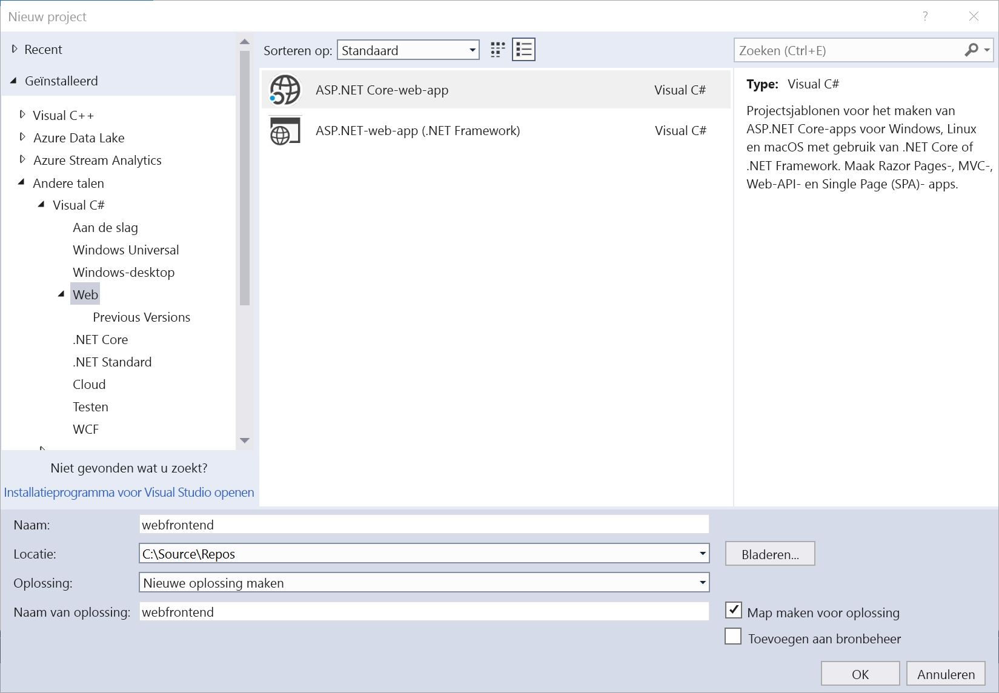
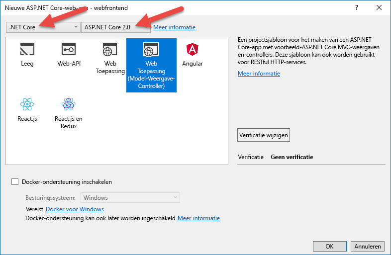

# <a name="get-started-on-azure-dev-spaces-with-net-core-and-visual-studio"></a>Aan de slag in Azure Dev Spaces met behulp van .NET Core en Visual Studio

In deze handleiding leert u het volgende:

- Een Kubernetes-omgeving maken in Azure die is geoptimaliseerd voor ontwikkeling.
- Iteratief code ontwikkelen in containers met Visual Studio.
- Twee afzonderlijke services ontwikkelen en de DNS-servicedetectie van Kubernetes gebruiken om een andere service aan te roepen.
- Uw code op een productieve manier ontwikkelen en testen in een teamomgeving.

[!INCLUDE[](includes/see-troubleshooting.md)]

[!INCLUDE[](includes/portal-aks-cluster.md)]

## <a name="get-the-visual-studio-tools"></a>Visual Studio-hulpprogramma's downloaden
1. Installeer de nieuwste versie van [Visual Studio 2017](https://www.visualstudio.com/vs/)
1. Zorg ervoor dat de volgende werkbelasting is geselecteerd in het installatieprogramma van Visual Studio:
    * ASP.NET-ontwikkeling en webontwikkeling
1. Installeer de [Visual Studio-extensie voor Azure Dev Spaces](https://aka.ms/get-azds-visualstudio)

U kunt nu een ASP.NET-web-app maken met Visual Studio.

## <a name="create-an-aspnet-web-app"></a>Een ASP.NET-web-app maken

Maak een nieuw project in Visual Studio 2017. Op dit moment moet het project een **ASP.NET Core-webtoepassing** zijn. Geef het project de naam **webfrontend**.



Selecteer de sjabloon **Web Application (Model-View-Controller)** en selecteer **.NET Core** en **ASP.NET Core 2.0** in de twee vervolgkeuzelijsten boven in het dialoogvenster. Klik op **OK** om het project aan te maken.




## <a name="create-a-dev-environment-in-azure"></a>Een ontwikkelomgeving maken in Azure

Met Azure Dev Spaces kunt u ontwikkelomgevingen op basis van Kubernetes maken die volledig worden beheerd in Azure en die zijn geoptimaliseerd voor ontwikkeling. Open het project dat u zojuist hebt gemaakt en selecteer **Azure Dev Spaces** in de vervolgkeuzelijst met opstartinstellingen, zoals hieronder wordt weergegeven.


Controleer in het dialoogvenster dat vervolgens wordt weergegeven, of u bent aangemeld bij het juiste account, en selecteer vervolgens een bestaand Kubernetes-cluster.


Laat de waarde in de vervolgkeuzelijst **Space** voorlopig op `default` staan. Later besteden we meer aandacht aan deze optie. Schakel het selectievakje **Publicly Accessible** in zodat de web-app toegankelijk is via een openbaar eindpunt. Deze instelling is niet vereist, maar is wel handig om verderop in dit scenario enkele dingen te demonstreren. Maar u hoeft u geen zorgen te maken, want in beide gevallen kunt u fouten op de website opsporen met Visual Studio.


Klik op **OK** om het cluster te selecteren of een cluster te maken.

Als u een cluster kiest dat niet is ingeschakeld om te werken met Azure Dev Spaces, ziet u een bericht waarin u wordt gevraagd of u dit cluster wilt configureren.


Kies **OK**.

 Er wordt een achtergrondtaak gestart om dit te doen. Het uitvoeren van deze taak duurt enkele minuten. Als u wilt zien of de taak nog steeds actief is, plaatst u de muisaanwijzer op het pictogram **Background tasks** in de linkerhoek onder in de statusbalk, zoals wordt weergegeven in de volgende afbeelding.


> [!Note]
> U kunt pas fouten oplossen voor de toepassing wanneer de ontwikkelomgeving is gemaakt.

## <a name="look-at-the-files-added-to-project"></a>Bestanden bekijken die zijn toegevoegd aan het project
Terwijl u wacht totdat de ontwikkelomgeving is gemaakt, kunt u kijken welke bestanden aan het project zijn toegevoegd toen u ervoor koos om een ontwikkelomgeving te gebruiken.

Allereerst ziet u dat een map met de naam `charts` is toegevoegd, en dat er binnen deze map een [Helm-grafiek](https://docs.helm.sh) voor de toepassing is klaargezet. Deze bestanden worden gebruikt om de toepassing te implementeren in de ontwikkelomgeving.

U ziet dat er een bestand met de naam `Dockerfile` is toegevoegd. Dit bestand bevat gegevens die nodig zijn om van de toepassing een pakket te maken met de standaard-Docker-indeling. Er is ook een `HeaderPropagation.cs`-bestand gemaakt. Dit bestand wordt later in het overzicht besproken. 

Ten slotte ziet u een bestand met de naam `azds.yaml`, met daarin configuratiegegevens die nodig zijn voor de ontwikkelomgeving, bijvoorbeeld of de toepassing toegankelijk moet zijn via een openbaar eindpunt.


## <a name="debug-a-container-in-kubernetes"></a>Fouten opsporen in een Kubernetes-container
Zodra de ontwikkelomgeving is gemaakt, kunt u fouten oplossen voor de toepassing. Stel een onderbrekingspunt in de code in, bijvoorbeeld op regel 20 in het bestand `HomeController.cs`, waarbij de variabele `Message` wordt ingesteld. Druk op **F5** om de foutopsporing te starten. 

Visual Studio communiceert met de ontwikkelomgeving om de toepassing te bouwen en te implementeren. Vervolgens wordt een browser geopend met de web-app. Het lijkt misschien alsof de container lokaal wordt uitgevoerd, maar dat is niet zo. De container wordt uitgevoerd in de ontwikkelomgeving in Azure. De reden voor het localhost-adres is dat Azure Dev Spaces een tijdelijke SSH-tunnel maakt naar de container die wordt uitgevoerd in Azure.

Klik boven aan de pagina op de koppeling **About** om het onderbrekingspunt te activeren. U hebt volledige toegang tot foutopsporingsgegevens (net als wanneer de code lokaal wordt uitgevoerd), zoals als de aanroep-stack, lokale variabelen, informatie over uitzonderingen, enzovoort.

## <a name="call-another-container"></a>Een andere container aanroepen
In deze sectie maakt u een tweede service, `mywebapi`, en laat u deze aanroepen in `webfrontend`. Elke service wordt uitgevoerd in een afzonderlijke container. Vervolgens spoort u fouten op in beide containers.


## <a name="download-sample-code-for-mywebapi"></a>Voorbeeldcode voor *mywebapi* downloaden
Omwille van de tijd downloaden we voorbeeldcode uit een GitHub-opslagplaats. Ga naar https://github.com/Azure/dev-spaces en selecteer **Clone or Download** om de GitHub-opslagplaats te downloaden. De code voor deze sectie bevindt zich in `samples/dotnetcore/getting-started/mywebapi`.

## <a name="run-mywebapi"></a>*mywebapi* uitvoeren
1. Open het `mywebapi`-project in een *afzonderlijk Visual Studio-venster*.
1. Selecteer **Azure Dev Spaces** in de vervolgkeuzelijst met opstartinstellingen zoals u eerder hebt gedaan voor het `webfrontend`-project. Selecteer deze keer dezelfde ontwikkelomgeving die u al eerder hebt gemaakt, in plaats van een nieuwe te maken. Laat ook hier de standaard bij Space ingesteld op `default` en klik op **OK**. In het uitvoervenster ziet u mogelijk dat deze nieuwe service in de ontwikkelomgeving wordt ‘opgewarmd’ in Visual Studio om ervoor te zorgen dat het proces sneller verloopt wanneer u begint met de foutopsporing.
1. Druk op F5 en wacht tot de service is gebouwd en geïmplementeerd. Dit proces is voltooid, zodra de Visual Studio-statusbalk oranje wordt
1. Noteer de eindpunt-URL die wordt weergegeven in het deelvenster **Azure Dev Spaces for AKS** in het **uitvoervenster**. Deze ziet er ongeveer als volgt uit: http://localhost:\<portnumber\>. Het lijkt misschien alsof de container lokaal wordt uitgevoerd, maar dat is niet zo. De container wordt uitgevoerd in de ontwikkelomgeving in Azure.
2. Wanneer `mywebapi` klaar is, opent u de browser naar het localhost-adres en voegt u `/api/values` toe aan het eind van de URL om de standaard-GET API voor de `ValuesController` aan te roepen. 
3. Als alle stappen zijn voltooid, ziet u een reactie van de `mywebapi`-service die er ongeveer als volgt uitziet.

    

## <a name="make-a-request-from-webfrontend-to-mywebapi"></a>Verzend een aanvraag van *webfrontend* naar *mywebapi*
Nu gaan we code schrijven in `webfrontend` waarmee een aanvraag wordt verzonden naar `mywebapi`. Schakel over naar het Visual Studio-venster met het `webfrontend`-project. *Vervang* de code in het `HomeController.cs`-bestand voor de About-methode door de volgende code:

   ```csharp
   public async Task<IActionResult> About()
   {
      ViewData["Message"] = "Hello from webfrontend";

      // Use HeaderPropagatingHttpClient instead of HttpClient so we can propagate
      // headers in the incoming request to any outgoing requests
      using (var client = new HeaderPropagatingHttpClient(this.Request))
      {
          // Call *mywebapi*, and display its response in the page
          var response = await client.GetAsync("http://mywebapi/api/values/1");
          ViewData["Message"] += " and " + await response.Content.ReadAsStringAsync();
      }

      return View();
   }
   ```

U ziet dat de DNS-servicedetectie van Kubernetes wordt gebruikt om naar de service te verwijzen als `http://mywebapi`. **Code in de ontwikkelomgeving wordt op dezelfde manier uitgevoerd als later in de productiefase**.

Het bovenstaande codevoorbeeld maakt ook gebruik van een `HeaderPropagatingHttpClient`-klasse. Deze helperklasse is het bestand `HeaderPropagation.cs` dat is toegevoegd aan het project toen u het configureerde voor gebruik van Azure Dev Spaces. `HeaderPropagatingHttpClient` is afgeleid van de bekende `HttpClient`-klasse en biedt extra functionaliteit om specifieke headers vanuit een bestaand ASP.NET HttpRequest-object door te geven aan een uitgaand HttpRequestMessage-object. Verderop ziet u hoe deze afgeleide klasse een productievere ontwikkeling in teamscenario's vergemakkelijkt.

## <a name="debug-across-multiple-services"></a>Foutopsporing in meerdere services
1. Op dit punt moet `mywebapi` nog steeds worden uitgevoerd met het bijgevoegde foutopsporingsprogramma. Als dit niet het geval is, drukt u op F5 in het `mywebapi`-project.
1. Stel een onderbrekingspunt in de `Get(int id)`-methode in het `ValuesController.cs`-bestand in waarmee `api/values/{id}` GET-aanvragen worden verwerkt.
1. Stel in het `webfrontend`-project waarin u de bovenstaande code hebt geplakt, een onderbrekingspunt in vlak voordat een GET-aanvraag wordt verzonden naar `mywebapi/api/values`.
1. Druk op F5 in het `webfrontend`-project. In Visual Studio wordt opnieuw een browser geopend op de juiste localhost-poort en de web-app wordt weergegeven.
1. Klik boven aan de pagina op de koppeling **About** om het onderbrekingspunt te activeren in het `webfrontend`-project. 
1. Druk F10 om door te gaan. Het onderbrekingspunt in het `mywebapi`-project wordt nu geactiveerd.
1. Druk op F5 om door te gaan. U wordt teruggeleid naar de code in het `webfrontend`-project.
1. Als u nog een keer op F5 drukt, wordt de aanvraag voltooid en gaat u terug naar een pagina in de browser. In de web-app wordt nu op de pagina About een bericht weergegeven dat is samengesteld uit de twee services: Hello from webfrontend and Hello from mywebapi.

Dat is dus gelukt. U hebt nu een toepassing met meerdere containers waarin elke container afzonderlijk kan worden ontwikkeld en geïmplementeerd.

## <a name="learn-about-team-development"></a>Meer informatie over teamontwikkeling

Tot nu toe hebt u de code van de toepassing uitgevoerd alsof u de enige ontwikkelaar bent die werkt aan de app. In deze sectie leert u hoe teamontwikkeling wordt gestroomlijnd met Azure Dev Spaces:
* Stel een team ontwikkelaars in staat om in dezelfde ontwikkelomgeving te werken.
* Biedt ondersteuning om alle ontwikkelaars hun code geïsoleerd te laten herhalen, zonder dat ze het gevaar lopen dat ze andermans code breken.
* Test code end-to-end, voordat u de code doorvoert, zonder nagebootste code te maken of afhankelijkheden te simuleren.

### <a name="challenges-with-developing-microservices"></a>Uitdagingen bij het ontwikkelen van microservices
Momenteel is uw voorbeeldcode niet erg complex. Maar in de pratijk krijgt u bij het ontwikkelen al snel te maken met uitdagingen wanneer u meer services toevoegt en het ontwikkelteam groeit.

Stel, bijvoorbeeld, dat u werkt aan een service die werkt met een heel aantal andere services.

- Alles lokaal uitvoeren voor ontwikkeling is dan misschien niet zo realistisch. Uw ontwikkelmachine heeft mogelijk niet genoeg resources om de hele app uit te voeren. Of misschien heeft uw app eindpunten die openbaar bereikbaar moeten zijn (bijvoorbeeld als de app reageert op een webhook vanuit een SaaS-app).
- U kunt proberen om alleen de services uit te voeren waarvan u afhankelijk bent, maar dit betekent dat u bekend moet zijn met de volledige sluiting van afhankelijkheden (bijvoorbeeld de afhankelijkheden van afhankelijkheden). Of misschien weet u zo gauw niet hoe u de afhankelijkheden bouwt en uitvoert omdat u niet met ze hebt gewerkt.
- Sommige ontwikkelaars maken gebruik van het simuleren of nabootsen van veel van hun serviceafhankelijkheden. Dit kan soms helpen, maar het beheren van deze nabootsingen brengt ook al snel uitdagingen op het gebied van ontwikkelen met zich mee. Bovendien ziet uw ontwikkelomgeving er dan anders uit dan de productieomgeving, waardoor subtiele fouten kunnen optreden.
- Een direct gevolg is dat end-to-endtesten moeilijk wordt. De integratie kan alleen realistisch worden getest na een doorvoering, wat betekent dat problemen pas later in de ontwikkelcyclus zichtbaar worden.

    

### <a name="work-in-a-shared-development-environment"></a>Werken in een gedeelde ontwikkelomgeving
Met Azure Dev Spaces kunt u een *gedeelde* ontwikkelomgeving instellen in Azure. Elke ontwikkelaar kan zich richten op het eigen deel van de toepassing, en kan *vooraf doorgevoerde code* iteratief doorvoeren in een omgeving die alle andere services en cloudresources al bevat waarvan de scenario’s afhankelijk zijn. Afhankelijkheden zijn altijd up-to-date en ontwikkelaars werken op een manier die de productie weerspiegelt.

### <a name="work-in-your-own-space"></a>Werken in uw eigen ruimte
Terwijl u code ontwikkelt voor uw service en voordat u klaar bent om deze uit te geven, is de codestatus meestal niet in orde. U bent de code nog steeds iteratief aan het vormen en testen, en aan het experimenten met oplossingen. Azure Dev Spaces biedt het concept van een **ruimte**, waardoor u geïsoleerd kunt werken, zonder dat u de code van teamleden per ongeluk breekt.

Doe het volgende om ervoor te zorgen dat uw `webfrontend`- en `mywebapi`-services beide worden uitgevoerd in de ontwikkelomgeving **en in de `default`-ruimte**.
1. Sluit alle F5-foutopsporingssessies voor beide services, maar houd de projecten open in de bijbehorende Visual Studio-vensters.
2. Schakel over naar het Visual Studio-venster met het `mywebapi`-project en druk op Ctrl+F5 om de service uit te voeren zonder het bijgevoegde foutopsporingsprogramma
3. Schakel over naar het Visual Studio-venster met het `webfrontend`-project en druk op Ctrl+F5 om dit ook uit te voeren.

> [!Note]
> Soms is het noodzakelijk om de browser te vernieuwen nadat de webpagina de eerste keer wordt uitgevoerd na Ctrl+F5.

Iedereen die de openbare URL opent en naar de web-app navigeert, roept het codepad aan dat u hebt geschreven en dat actief is in beide services met behulp van de `default`-standaardruimte. Stel nu dat u wilt verdergaan met het ontwikkelen van `mywebapi`. Hoe kunt u dit doen zonder andere ontwikkelaars te onderbreken die de ontwikkelomgeving ook gebruiken? Hiervoor moet u uw eigen ruimte instellen.

### <a name="create-a-new-space"></a>Nieuwe ruimte maken
U kunt vanuit Visual Studio extra ruimten maken die worden gebruikt wanneer u F5 of Ctrl+F5 gebruikt voor de service. U kunt een ruimte elke gewenste naam geven en u kunt vrij bepalen wat deze betekent (bijvoorbeeld `sprint4` of `demo`).

Doe het volgende om een nieuwe ruimte te maken:
1. Schakel over naar het Visual Studio-venster met het `mywebapi`-project.
2. Klik in **Solution Explorer** met de rechtermuisknop op het project en selecteer **Properties**.
3. Selecteer aan de linkerkant het tabblad **Debug** om de Azure Dev Spaces-instellingen weer te geven.
4. Van hieruit kunt u het cluster en/of de ruimte maken die wordt gebruikt wanneer u F5 of Ctrl+F5 gebruikt. *Zorg ervoor dat de Azure Dev-ruimte is geselecteerd die u eerder hebt gemaakt*.
5. Selecteer **<Nieuwe ruimte maken...>** in de vervolgkeuze lijst met ruimtes.

    

6. Typ in het dialoogvenster **Add Space** een naam voor de ruimte en klik op **OK**. U kunt uw naam gebruiken voor de nieuwe ruimte (bijvoorbeeld Scott), zodat het duidelijk is dat dit de ruimte is waarin u werkt.

    

7. U ziet nu uw ontwikkelomgeving en er is een nieuwe ruimte geselecteerd op de pagina met projecteigenschappen.

    

### <a name="update-code-for-mywebapi"></a>Voorbeeldcode voor *mywebapi* bijwerken

1. Maak in het `mywebapi`-project een codewijziging in de `string Get(int id)`-methode in het bestand `ValuesController.cs`. Dit doet u als volgt:
 
    ```csharp
    [HttpGet("{id}")]
    public string Get(int id)
    {
        return "mywebapi now says something new";
    }
    ```

2. Stel een onderbrekingspunt in dit bijgewerkte codeblok in (misschien hebt u al eerder een onderbrekingspunt ingesteld).
3. Druk op F5 om de service `mywebapi` te starten. Hiermee wordt de service gestart in de ontwikkelomgeving met behulp van de geselecteerde ruimte. In dit geval is dat `scott`.

Hier ziet u een diagram waarin u de werking van de verschillende ruimtes kunt zien. Het blauwe pad laat een aanvraag zien via de `default`-ruimte. Dit is het standaardpad dat wordt gebruikt als er geen ruimte is toegevoegd aan de URL. Het groene pad laat een aanvraag zien via de `scott`-ruimte.


Deze ingebouwde mogelijkheid van Azure Dev Spaces stelt u in staat om code end-to-end te testen in een gedeelde omgeving zonder dat ontwikkelaars de volledige groep services in hun ruimte opnieuw hoeven te maken. Voor deze routering moeten doorgifteheaders worden doorgestuurd in uw app-code, zoals uitgelegd in de vorige stap van deze handleiding.

### <a name="test-code-running-in-the-scott-space"></a>Code testen die wordt uitgevoerd in de `scott`-ruimte
Als u de nieuwe versie van `mywebapi` wilt testen samen met `webfrontend`, opent u de URL van het openbare toegangspunt voor `webfrontend` in de browser (bijvoorbeeld http://webfrontend-teamenv.123456abcdef.eastus.aksapp.io)) en gaat u naar de pagina About. Als het goed is, ziet u nu het oorspronkelijke bericht: Hello from webfrontend and Hello from mywebapi.

Voeg nu het gedeelte scott.s. toe aan de URL, zodat deze er ongeveer als volgt uitziet: http://scott.s.webfrontend-teamenv.123456abcdef.eastus.aksapp.io. Vernieuw vervolgens de browser. Het onderbrekingspunt dat u hebt ingesteld in het `mywebapi`-project, wordt nu gevonden. Klik op F5 om door te gaan. In de browser ziet u nu het nieuwe bericht: Hello from webfrontend and mywebapi now says something new. Dit komt omdat het pad naar de bijgewerkte code in `mywebapi` wordt uitgevoerd in de `scott`-ruimte.

[!INCLUDE[](includes/well-done.md)]

[!INCLUDE[](includes/clean-up.md)]
