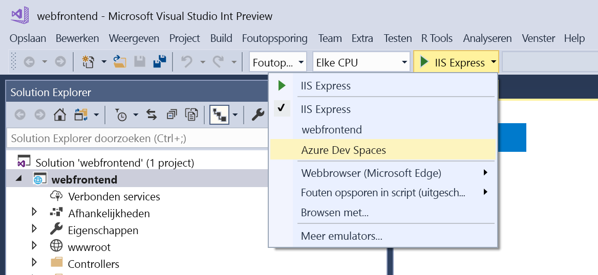

# Azure Dev spaties delen

Met Azure Dev spaties, kunt u de adresruimte van uw dev met anderen in uw team delen. Elke ontwikkelaar kan werken in hun eigen ruimte zonder angst van anderen te analyseren. Ook kunt werken samen in één ruimte kunt u code end-to-end testen zonder te hoeven maken van mocks of afhankelijkheden simuleren. Zie de [meer informatie over teamontwikkeling](../team-development-nodejs.md) guide voor meer informatie.

## Instellen van een dev-ruimte voor meerdere ontwikkelaars

1. Maak een spatie ontwikkelen in Azure. Kies [.NET Core- en VS Code](../get-started-netcore.md), [.NET Core en Visual Studio](../get-started-netcore-visualstudio.md), of [Node.js en VS Code](../get-started-nodejs.md). U moet eigenaar of bijdrager toegang hebben tot de geselecteerde Azure-abonnement.
1. Configureren van de Azure Dev-ruimte **resourcegroep** naar [medewerker toegang verlenen](/azure/active-directory/role-based-access-control-configure) voor elk teamlid. Met deze opdracht kunt u de resourcegroep een dev-ruimte controleren: `azds list`
1. Vragen teamleden **selecteert u de ruimte dev** om te ontwikkelen in het.
     * **Vanaf de opdrachtregel of in VS Code**: om te zien van bestaande Azure Dev spaties die u hebt toegang tot: `azds space list`. Om te selecteren van een dev-ruimte: `azds space select`.
     * **Visual Studio IDE**: Open een project in Visual Studio, selecteer **Azure Dev spaties** in de starten instellingen vervolgkeuzelijst. In het dialoogvenster dat wordt geopend, selecteert u een bestaand cluster.

    

## Volgende stappen

Zie [meer informatie over teamontwikkeling](../team-development-nodejs.md) voor meer informatie.