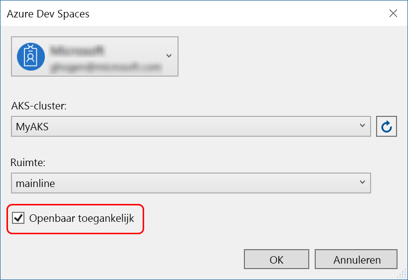
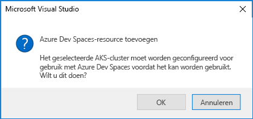
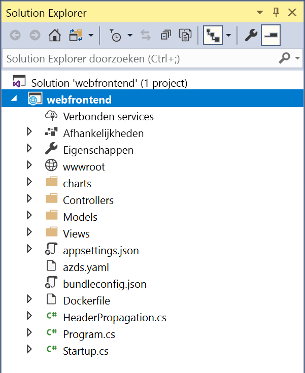

# Quickstart: Kubernetes-ontwikkelomgeving maken met Azure Dev Spaces (.NET Core en Visual Studio)

In deze handleiding leert u het volgende:

- Azure Dev Spaces instellen met een beheerd Kubernetes-cluster in Azure.
- Iteratief code ontwikkelen in containers met Visual Studio.
- Fouten opsporen in code die in uw cluster wordt uitgevoerd.

> [!Note]
> **Als u op enig moment niet verder kunt**, kunt u de [probleemoplossingssectie](troubleshooting.md) raadplegen of een opmerking op deze pagina plaatsen. U kunt ook de meer gedetailleerde [zelfstudie](get-started-netcore-visualstudio.md) proberen.

## Vereisten

- Een Kubernetes-cluster met Kubernetes 1.9.6 of hoger in de regio VS-Oost, VS-Oost2, VS-Centraal, VS-West2, Europa-West, Azië-Centraal, Canada-Centraal of Canada-Oost.

- Visual Studio 2017 waarbij de workload Webontwikkeling is geïnstalleerd. Als u deze niet hebt geïnstalleerd, downloadt u deze [hier](https://aka.ms/vsdownload?utm_source=mscom&utm_campaign=msdocs).

## Azure Dev Spaces instellen

Installeer [Visual Studio Tools voor Kubernetes](https://aka.ms/get-vsk8stools).

## Verbinding maken met een cluster

Vervolgens maakt en configureert u een project voor Azure Dev Spaces.

### Een ASP.NET-web-app maken

Maak een nieuw project in Visual Studio 2017. Op dit moment moet het project een **ASP.NET Core-webtoepassing** zijn. Geef het project de naam **webfrontend**.

Selecteer de sjabloon **Web Application (Model-View-Controller)** en zorg dat **.NET Core** en **ASP.NET Core 2.0** zijn geselecteerd.

### Dev Spaces inschakelen voor een AKS-cluster

Met het project dat u zojuist hebt gemaakt, selecteert u **Azure Dev Spaces** in de vervolgkeuzelijst met opstartinstellingen, zoals hieronder wordt weergegeven.

Controleer in het dialoogvenster dat vervolgens wordt weergegeven of u bent aangemeld bij het juiste account en selecteer vervolgens een bestaand cluster.

Laat de waarde in de vervolgkeuzelijst **Space** voorlopig op `default` staan. Schakel het selectievakje **Publicly Accessible** in zodat de web-app toegankelijk is via een openbaar eindpunt.

Klik op **OK** om het cluster te selecteren of een cluster te maken.

Als u een cluster kiest dat niet is geconfigureerd om te werken met Azure Dev Spaces, ziet u een bericht waarin wordt gevraagd of u dit wilt configureren.

Kies **OK**. 

### Bestanden bekijken die zijn toegevoegd aan het project
Terwijl u wacht totdat de ontwikkelomgeving is gemaakt, kunt u bekijken welke bestanden aan het project zijn toegevoegd toen u ervoor koos om een Azure Dev Spaces te gebruiken.

- Een map met de naam `charts` is toegevoegd, en in deze map is een [Helm-grafiek](https://docs.helm.sh) voor de toepassing klaargezet. Deze bestanden worden gebruikt om de toepassing in de ontwikkelomgeving te implementeren.
- `Dockerfile` bevat gegevens die nodig zijn om van de toepassing een pakket te maken met de standaard-Docker-indeling.
- `azds.yaml` bevat configuratie over de ontwikkeltijd die de ontwikkelomgeving nodig heeft.

## Fouten opsporen in een Kubernetes-container
Zodra de ontwikkelomgeving is gemaakt, kunt u fouten oplossen voor de toepassing. Stel een onderbrekingspunt in de code in, bijvoorbeeld op regel 20 in het bestand `HomeController.cs`, waarbij de variabele `Message` wordt ingesteld. Druk op **F5** om de foutopsporing te starten. 

Visual Studio communiceert met de ontwikkelomgeving om de toepassing te compileren en te implementeren. Vervolgens wordt een browser geopend met de web-app. Het lijkt misschien alsof de container lokaal wordt uitgevoerd, maar dat is niet zo. De container wordt uitgevoerd in de ontwikkelomgeving in Azure. De reden voor het localhost-adres is dat Azure Dev Spaces een tijdelijke SSH-tunnel maakt naar de container die wordt uitgevoerd in AKS.

Klik boven aan de pagina op de koppeling **About** om het onderbrekingspunt te activeren. U hebt volledige toegang tot foutopsporingsgegevens (net als wanneer de code lokaal wordt uitgevoerd), zoals als de aanroep-stack, lokale variabelen, informatie over uitzonderingen, enzovoort.

## Code iteratief ontwikkelen

Azure Dev Spaces draait niet alleen om het ophalen van code die wordt uitgevoerd in Kubernetes. Het gaat er om dat u de codewijzigingen snel en iteratief toegepast kunt zien in een Kubernetes-omgeving in de cloud.

### Een inhoudsbestand bijwerken
1. Zoek het bestand `./Views/Home/Index.cshtml` en bewerk de HTML-code. Wijzig bijvoorbeeld regel 70 waar `<h2>Application uses</h2>` staat in iets als: `<h2>Hello k8s in Azure!</h2>`
1. Sla het bestand op.
1. Ga naar de browser en vernieuw de pagina. De bijgewerkte HTML-code wordt op de webpagina weergegeven.

Wat is er gebeurd? Voor bewerkingen van inhoudsbestanden, zoals HTML en CSS, hoeft een .NET Core-web-app niet opnieuw te worden gecompileerd. Tijdens een actieve F5-sessie worden alle gewijzigde inhoudsbestanden dus automatisch gesynchroniseerd in de actieve container in AKS, zodat u de bewerkingen van de inhoud direct kunt zien.

### Een codebestand bijwerken
Het bijwerken van codebestanden vereist iets meer werk, omdat een .NET Core-app bijgewerkte binaire toepassingsbestanden moet bouwen en produceren.

1. Stop de foutopsporing in Visual Studio.
1. Open het codebestand met de naam `Controllers/HomeController.cs` en bewerk het bericht dat op de pagina Info wordt weergegeven: `ViewData["Message"] = "Your application description page.";`
1. Sla het bestand op.
1. Druk op **F5** als u de foutopsporing weer wilt starten. 

In plaats van telkens als codewijzigingen zijn aangebracht een nieuwe containerinstallatiekopie opnieuw te bouwen en opnieuw te implementeren, wat vaak behoorlijk wat tijd kost, hercompileert Azure Dev Spaces incrementeel code binnen de bestaande container voor een snellere bewerkings-/foutopsporingslus.

Vernieuw de web-app in de browser en ga naar de pagina Info. U ziet dat uw aangepaste bericht wordt weergegeven in de gebruikersinterface.

## Volgende stappen

> [!div class="nextstepaction"]
> [Werken met meerdere containers en teamontwikkeling](multi-service-netcore-visualstudio.md)
