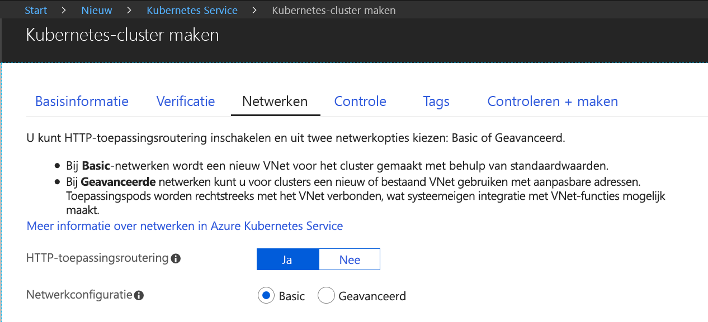
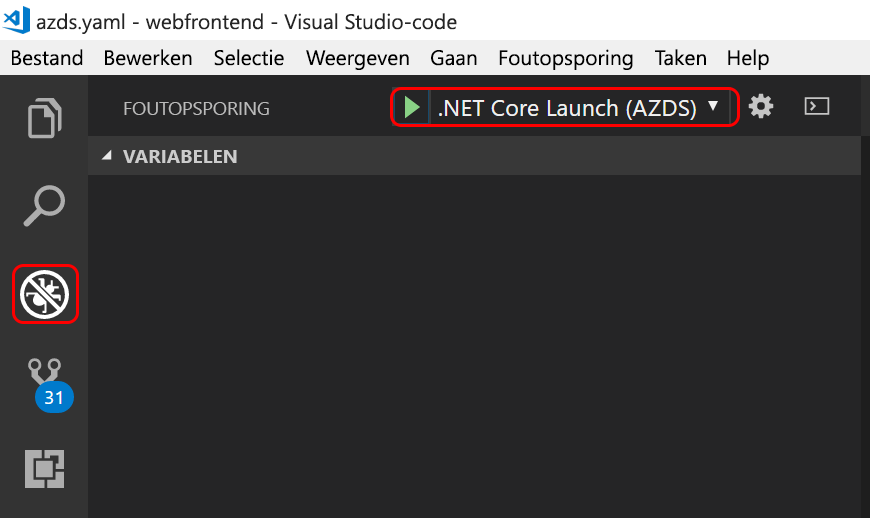

# <a name="quickstart-create-a-kubernetes-dev-space-with-azure-dev-spaces-net-core-and-vs-code"></a>Snelstartgids: Kubernetes-ontwikkelomgeving maken met Azure Dev Spaces (.NET Core en VS Code)

In deze handleiding leert u het volgende:

- Azure Dev Spaces instellen met een beheerd Kubernetes-cluster in Azure.
- Iteratief code ontwikkelt in containers met behulp van VS Code en de opdrachtregel.
- Vanuit VS Code fouten opsporen in de code in uw ontwikkelomgeving

> [!Note]
> **Als u op enig moment niet verder kunt**, kunt u de [probleemoplossingssectie](troubleshooting.md) raadplegen of een opmerking op deze pagina plaatsen. U kunt ook de meer gedetailleerde [zelfstudie](get-started-netcore.md) proberen.

## <a name="prerequisites"></a>Vereisten

- Een Azure-abonnement. Als u nog geen account hebt, kunt u [een gratis account aanmaken](https://azure.microsoft.com/free).
- Een [Kubernetes-cluster](https://ms.portal.azure.com/#create/microsoft.aks) met Kubernetes 1.9.6, in de regio EastUS, WestEurope of CanadaEast met **Routering van HTTP-toepassing** ingeschakeld.

  

- [Visual Studio Code](https://code.visualstudio.com/download).

## <a name="set-up-azure-dev-spaces"></a>Azure Dev Spaces instellen

1. Installeer [Azure CLI](/cli/azure/install-azure-cli?view=azure-cli-latest) (versie 2.0.38 of hoger).
1. Dev Spaces instellen op uw AKS-cluster: `az aks use-dev-spaces -g MyResourceGroup -n MyAKS`
1. Download de extensie [Azure Dev Spaces ](https://aka.ms/get-azds-code) voor VS Code.
1. De extensie installeren: `code --install-extension path-to-downloaded-extension/azds-0.1.1.vsix`

## <a name="build-and-run-code-in-kubernetes"></a>Code schrijven en uitvoeren in Kubernetes

1. Voorbeeldcode van GitHub downloaden: [https://github.com/Azure/dev-spaces](https://github.com/Azure/dev-spaces) 
1. De map in de map webfrontend wijzigen: `cd dev-spaces/samples/dotnetcore/getting-started/webfrontend`
1. Activa voor Docker- en Helm-grafieken genereren: `azds prep --public`
1. Compileer de code in AKS en voer deze uit. Voer in het terminalvenster de volgende opdracht uit vanuit de **map webfrontend**: `azds up`
1. Scan de console-uitvoer voor informatie over de URL die door de opdracht `up` is gemaakt. Het zal in deze vorm te zien zijn: 

   `Service 'webfrontend' port 'http' is available at <url>` 

   Open deze URL in een browservenster. Dan ziet u dat de web-app wordt geladen. 
   
   > [!Note]
   > Bij de eerste uitvoering kan het enkele minuten duren voordat de openbare DNS gereed is. Als de openbare URL niet wordt omgezet, kunt u de alternatieve URL http://localhost:<portnumber> gebruiken die wordt weergegeven in de console-uitvoer. Als u de localhost-URL gebruikt, lijkt het misschien alsof de container lokaal wordt uitgevoerd, maar wordt deze feitelijk uitgevoerd in AKS. Voor uw gemak en om interactie met de service mogelijk te maken vanaf de lokale computer, wordt in Azure Dev Spaces een tijdelijke SSH-tunnel gemaakt naar de container die wordt uitgevoerd in Azure. U kunt later terugkomen en de openbare URL proberen wanneer de DNS-record gereed is.

### <a name="update-a-content-file"></a>Een inhoudsbestand bijwerken

1. Zoek een bestand, bijvoorbeeld `./Views/Home/Index.cshtml`, en bewerk de HTML-code. Wijzig bijvoorbeeld regel 70 waar `<h2>Application uses</h2>` staat in iets als: `<h2>Hello k8s in Azure!</h2>`
1. Sla het bestand op. Enkele ogenblikken later ziet u in het terminalvenster een bericht met de melding dat een bestand in de actieve container is bijgewerkt.
1. Ga naar de browser en vernieuw de pagina. De bijgewerkte HTML-code wordt op de webpagina weergegeven.

Wat is er gebeurd? Bewerkingen van inhoudsbestanden, zoals HTML en CSS, vereisen geen hercompilatie in een .NET Core-web-app, dus worden gewijzigde inhoudsbestanden in de actieve container in Azure door een actieve `azds up`-opdracht automatisch gesynchroniseerd, zodat u uw inhoudsbewerkingen meteen kunt zien.

### <a name="update-a-code-file"></a>Een codebestand bijwerken
Het bijwerken van codebestanden vereist iets meer werk, omdat een .NET Core-app bijgewerkte binaire toepassingsbestanden moet bouwen en produceren.

1. Druk in het terminalvenster op `Ctrl+C` (om `azds up` te stoppen).
1. Open het codebestand met de naam `Controllers/HomeController.cs` en bewerk het bericht dat op de pagina Info wordt weergegeven: `ViewData["Message"] = "Your application description page.";`
1. Sla het bestand op.
1. Voer `azds up` uit in het terminalvenster. 

Met deze opdracht wordt de installatiekopie van de container opnieuw gebouwd en het Helm-diagram opnieuw geïmplementeerd. Ga naar het menu Info in de web-app om te zien of uw codewijzigingen zijn doorgevoerd in de actieve toepassing.

Er bestaat echter een nog *snellere methode* voor het ontwikkelen van code. Deze methode gaat u in de volgende sectie verkennen. 

## <a name="debug-a-container-in-kubernetes"></a>Fouten opsporen in een Kubernetes-container

In deze sectie gaat u VS Code gebruiken om direct fouten op te sporen in de container die in Azure wordt uitgevoerd. U leert ook hoe u een cyclus voor bewerken-uitvoeren-testen sneller kunt uitvoeren.


### <a name="initialize-debug-assets-with-the-vs-code-extension"></a>Foutopsporingsassets initialiseren met de VS Code-extensie
U moet eerst uw codeproject configureren, zodat VS Code met de ontwikkelomgeving in Azure gaat communiceren. De VS Code-extensie voor Azure Dev Spaces bevat een helpopdracht om de foutopsporingsconfiguratie in te stellen. 

Open het **Opdrachtenpalet** (via het menu **Beeld | Opdrachtenpalet**), en gebruik automatisch aanvullen om te typen en deze opdracht te selecteren: `Azure Dev Spaces: Create configuration files for connected development`. 

Hiermee wordt de foutopsporingsconfiguratie voor Azure Dev Spaces toegevoegd onder de map `.vscode`.


### <a name="select-the-azds-debug-configuration"></a>Selecteer de AZDS-foutopsporingsconfiguratie
1. Om de foutopsporingsweergave te openen, klikt u op het pictogram Foutopsporing in de **activiteitenbalk** van VS Code.
1. Selecteer **.NET Core starten (AZDS)** als de actieve foutopsporingsconfiguratie.



> [!Note]
> Als u geen Azure Dev Spaces-opdrachten ziet in het Opdrachtenpalet, controleert u of u de VS Code-extensie hebt geïnstalleerd voor Azure Dev Spaces. Zorg ervoor dat de werkruimte die u hebt geopend in VS Code de map is die azds.yaml bevat.


### <a name="debug-the-container-in-kubernetes"></a>Fouten opsporen in de container in Kubernetes
Druk op **F5** om fouten in uw code op te sporen in Kubernetes.

Net als bij de opdracht `up` wordt code gesynchroniseerd met de ontwikkelomgeving en wordt een container gemaakt en geïmplementeerd in Kubernetes. Op dit moment is het foutopsporingsprogramma uiteraard gekoppeld aan de externe container.

> [!Tip]
> Op de VS Code-statusbalk wordt een klikbare URL weergegeven.

Stel een onderbrekingspunt in een codebestand aan serverzijde, bijvoorbeeld binnen de functie `Index()` in het bronbestand `Controllers/HomeController.cs`. Als de browserpagina wordt vernieuwd, wordt het onderbrekingspunt bereikt.

U hebt volledige toegang tot foutopsporingsgegevens, net alsof de code lokaal wordt uitgevoerd. Denk hierbij aan de aanroep-stack, lokale variabelen en informatie over uitzonderingen, enzovoort.

### <a name="edit-code-and-refresh"></a>Code bewerken en vernieuwen
Maak een codewijziging terwijl het foutopsporingsprogramma actief is. Wijzig bijvoorbeeld het bericht op de pagina Info in `Controllers/HomeController.cs`. 

```csharp
public IActionResult About()
{
    ViewData["Message"] = "My custom message in the About page.";
    return View();
}
```

Sla het bestand op en klik in het deelvenster **Debug actions** op de knop **Refresh**. 


In plaats van telkens als codewijzigingen zijn aangebracht een nieuwe containerinstallatiekopie opnieuw te bouwen en opnieuw te implementeren, wat vaak behoorlijk wat tijd kost, hercompileert Azure Dev Spaces incrementeel code binnen de bestaande container voor een snellere bewerkings-/foutopsporingslus.

Vernieuw de web-app in de browser en ga naar de pagina Info. U ziet dat uw aangepaste bericht wordt weergegeven in de gebruikersinterface.

**U beschikt nu over een methode om code snel te ontwikkelen en foutopsporing rechtstreeks uit te voeren in Kubernetes.**

## <a name="next-steps"></a>Volgende stappen

Meer informatie over hoe Azure Dev Spaces u kan helpen om complexere apps te ontwikkelen binnen meerdere containers en hoe u ontwikkeling in samenwerkingsverband vereenvoudigt door in verschillende ruimten met verschillende versies of vertakkingen van uw code te werken. 

> [!div class="nextstepaction"]
> [Werken met meerdere containers en teamontwikkeling](get-started-netcore.md#call-a-service-running-in-a-separate-container)