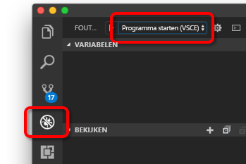

# <a name="quickstart-create-a-kubernetes-development-environment-with-azure-dev-spaces-nodejs"></a>Quickstart: Kubernetes-ontwikkelomgeving maken met Azure Dev Spaces (Node.js)


[!INCLUDE[](includes/learning-objectives.md)]

[!INCLUDE[](includes/see-troubleshooting.md)]

U kunt nu een op Kubernetes gebaseerde ontwikkelomgeving maken in Azure.

[!INCLUDE[](includes/portal-aks-cluster.md)]

## <a name="install-the-azure-cli"></a>Azure-CLI installeren
Azure Dev Spaces vereist minimale instellingen voor de lokale computer. Het meeste van de configuratie van uw ontwikkelomgeving wordt opgeslagen in de cloud en kan worden gedeeld met andere gebruikers. Begin met het downloaden en uitvoeren van de [Azure CLI](/cli/azure/install-azure-cli?view=azure-cli-latest). 

> [!IMPORTANT]
> Als u de Azure CLI al hebt geïnstalleerd, controleert u of u versie 2.0.32 of hoger gebruikt.

[!INCLUDE[](includes/sign-into-azure.md)]

[!INCLUDE[](includes/use-dev-spaces.md)]

[!INCLUDE[](includes/install-vscode-extension.md)]

Terwijl u wacht totdat de omgeving wordt gemaakt, kunt u beginnen met het schrijven van code.

## <a name="create-a-nodejs-container-in-kubernetes"></a>Een Node.js-container maken in Kubernetes

In deze sectie maakt u een Node.js-web-app maken en voert u deze uit in een container in Kubernetes.

### <a name="create-a-nodejs-web-app"></a>Een Node.js-web-app maken
Download code vanuit GitHub door te navigeren naar https://github.com/Azure/dev-spaces en selecteer **Clone or Download** om de GitHub-opslagplaats naar uw lokale omgeving te downloaden. De code voor deze handleiding bevindt zich in `samples/nodejs/getting-started/webfrontend`.

[!INCLUDE[](includes/azds-prep.md)]

[!INCLUDE[](includes/build-run-k8s-cli.md)]

### <a name="update-a-content-file"></a>Een inhoudsbestand bijwerken
Azure Dev Spaces draait niet alleen om het ophalen van code die wordt uitgevoerd in Kubernetes, het gaat er om dat u snel en iteratief uw codewijzigingen toegepast kunt zien in een Kubernetes omgeving in de cloud.

1. Zoek het bestand `./public/index.html` op en bewerk de HTML-code. Wijzig bijvoorbeeld de achtergrondkleur van de pagina in een blauwtint:

    ```html
    <body style="background-color: #95B9C7; margin-left:10px; margin-right:10px;">
    ```

2. Sla het bestand op. Enkele minuten later ziet u in het terminalvenster u een bericht met de melding dat een bestand in de actieve container is bijgewerkt.
1. Ga naar de browser en vernieuw de pagina. U ziet nu de bijgewerkte kleur.

Wat is er gebeurd? Bewerkingen van inhoudsbestanden, zoals HTML en CSS, vereisen niet dat het Node.js-proces opnieuw wordt opgestart, dus door een actieve `azds up`-opdracht worden gewijzigde inhoudsbestanden rechtstreeks in de actieve container in Azure automatisch gesynchroniseerd. Zo kunt u bewerkingen van uw inhoud snel zien.

### <a name="test-from-a-mobile-device"></a>Testen via een mobiel apparaat
Als u de web-app op een mobiel apparaat opent, ziet u dat de gebruikersinterface niet correct wordt weergegeven op een klein apparaat.

Om dit te verhelpen, voegt u een `viewport`-metatag toe:
1. Open het bestand `./public/index.html`
1. Voeg een `viewport`-metatag toe aan het bestaande `head`-element:

    ```html
    <head>
        <!-- Add this line -->
        <meta name="viewport" content="width=device-width, initial-scale=1">
    </head>
    ```

1. Sla het bestand op.
1. Vernieuw de browser van uw apparaat. U ziet nu de web-app correct weergegeven. 

Dit is een voorbeeld van hoe enkele problemen pas worden gevonden als u test op de apparaten waarop de app bedoeld is voor gebruik. Met VS Azure Dev Spaces kunt u code snel opnieuw uitvoeren en eventuele wijzigingen op doelapparaten valideren.

### <a name="update-a-code-file"></a>Een codebestand bijwerken
Het bijwerken van codebestanden aan serverzijde vereist iets meer werk, omdat een Node.js-app opnieuw moet worden opgestart.

1. Druk in het terminalvenster op `Ctrl+C` (om `azds up` te stoppen).
1. Open het codebestand met de naam `server.js`, en bewerk het hallo-bericht van de service: 

    ```javascript
    res.send('Hello from webfrontend running in Azure!');
    ```

3. Sla het bestand op.
1. Voer `azds up` in het terminalvenster uit. 

Hiermee wordt de installatiekopie van de container opnieuw gebouwd en het Helm-diagram opnieuw geïmplementeerd. Laad de browserpagina om uw codewijzigingen door te voeren.

Maar er is zelfs nog een *snellere methode* voor het ontwikkelen van code, die u in de volgende sectie gaat verkennen. 

## <a name="debug-a-container-in-kubernetes"></a>Fouten opsporen in een Kubernetes-container

[!INCLUDE[](includes/debug-intro.md)]

[!INCLUDE[](includes/init-debug-assets-vscode.md)]

### <a name="select-the-azds-debug-configuration"></a>Selecteer de AZDS-foutopsporingsconfiguratie
1. Om de foutopsporingsweergave te openen, klikt u op het pictogram Foutopsporing in de **activiteitenbalk** aan de kant van VS Code.
1. Selecteer **Programma starten (AZDS)** als de actieve foutopsporingsconfiguratie.



> [!Note]
> Als u geen Azure Dev Spaces-opdrachten ziet in het Opdrachtenpalet, controleert u of u de VS Code-extensie hebt geïnstalleerd voor Azure Dev Spaces.

### <a name="debug-the-container-in-kubernetes"></a>Fouten opsporen in de container in Kubernetes
Druk op **F5** om fouten in uw code op te sporen in Kubernetes.

Net als bij de opdracht `up` wordt code gesynchroniseerd met de ontwikkelomgeving wanneer u foutopsporing start en wordt een container gemaakt en geïmplementeerd in Kubernetes. Op dit moment is het foutopsporingsprogramma gekoppeld aan de externe container.

[!INCLUDE[](includes/tip-vscode-status-bar-url.md)]

Stel een onderbrekingspunt in een codebestand aan serverzijde, bijvoorbeeld binnen de `app.get('/api'...` in `server.js`. Vernieuw de browserpagina of druk op de knop 'Say It Again'. U moet dan op het onderbrekingspunt terecht komen en de code kunnen doorlopen.

U hebt volledige toegang tot foutopsporingsgegevens, net alsof de code lokaal wordt uitgevoerd. Denk hierbij aan de aanroep-stack, lokale variabelen en informatie over uitzonderingen, enz.

### <a name="edit-code-and-refresh-the-debug-session"></a>Code bewerken en de foutopsporingssessie vernieuwen
Breng met het actieve foutopsporingsprogramma een codewijziging aan. Wijzig bijvoorbeeld het hallo-bericht opnieuw:

```javascript
app.get('/api', function (req, res) {
    res.send('**** Hello from webfrontend running in Azure! ****');
});
```

Sla het bestand op en klik in het deelvenster **Foutopsporingsacties** op de knop **Vernieuwen**. 


In plaats van telkens als codewijzigingen zijn aangebracht een nieuwe containerinstallatiekopie opnieuw te bouwen en opnieuw te implementeren, wat vaak behoorlijk wat tijd kost, start Azure Dev Spaces het Node.js-proces tussen foutopsporingssessies voor een snellere bewerkings-/foutopsporingslus.

Vernieuw de web-app in de browser of druk op de knop *Say It Again*. U ziet dat uw aangepaste bericht wordt weergegeven in de gebruikersinterface.

### <a name="use-nodemon-to-develop-even-faster"></a>NodeMon gebruiken om nog sneller te ontwikkelen
*Nodemon* is een populair hulpprogramma dat Node.js-ontwikkelaars gebruiken voor snelle ontwikkeling. In plaats van het Node-proces telkens als er een wijziging aan serverzijde is doorgevoerd handmatig opnieuw te starten, configureren ontwikkelaars vaak hun Node-project om bestandswijzigingen te laten volgen door en het serverproces automatisch opnieuw te starten door *nodemon*. Op deze manier van werken, vernieuwt de ontwikkelaar alleen de browser nadat een codewijziging is aangebracht.

Met Azure Dev Spaces kunt u veel van dezelfde ontwikkelingswerkstromen gebruiken die u gebruikt wanneer u lokaal ontwikkelt. Om dit te illustreren is het voorbeeldproject `webfrontend` geconfigureerd om gebruik te maken van *nodemon* (het is geconfigureerd als een apparaatafhankelijkheid in `package.json`).

Voer de volgende stappen uit:
1. Stop de VS Code-foutopsporing.
1. Klik op het pictogram Foutopsporing in de **activiteitenbalk** aan de kant van VS Code. 
1. Selecteer **Attach (AZDS)** als de actieve foutopsporingsconfiguratie.
1. Druk op F5.

In deze configuratie is de container geconfigureerd voor het starten van *nodemon*. Als er servercodewijzigingen worden doorgevoerd, start *nodemon* het Node-proces automatisch opnieuw op, net zoals wanneer u het lokaal ontwikkelt. 
1. Bewerk het hallo-bericht opnieuw in `server.js` en sla het bestand op.
1. Vernieuw de browser of klik op de knop *Say It Again* om uw wijzigingen door te voeren en weer te geven.

**U hebt nu een methode voor het snel doorvoeren van code en foutopsporing rechtstreeks in Kubernetes.**

## <a name="next-steps"></a>Volgende stappen

> [!div class="nextstepaction"]
> [Werken met meerdere containers en teamontwikkeling](get-started-nodejs.md#call-a-service-running-in-a-separate-container)