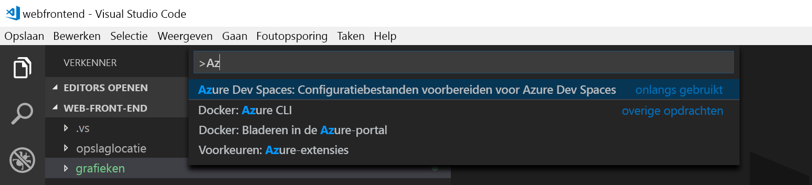
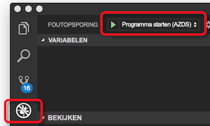
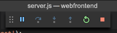

# <a name="quickstart-create-a-kubernetes-dev-space-with-azure-dev-spaces-nodejs"></a>Snelstart: Kubernetes-dev-ruimte maken met Azure Dev Spaces (Node.js)

In deze handleiding leert u het volgende:

- Azure Dev Spaces instellen met een beheerd Kubernetes-cluster in Azure.
- Iteratief code ontwikkelt in containers met behulp van VS Code en de opdrachtregel.
- Fouten opsporen in code die in uw cluster wordt uitgevoerd.

> [!Note]
> **Als u op enig moment niet verder kunt**, kunt u de [probleemoplossingssectie](troubleshooting.md) raadplegen of een opmerking op deze pagina plaatsen. U kunt ook de meer gedetailleerde [zelfstudie](get-started-nodejs.md) proberen.

## <a name="prerequisites"></a>Vereisten

- Een Azure-abonnement. Als u geen Azure-abonnement hebt, kunt u een [gratis account](https://azure.microsoft.com/free) maken.
- [Visual Studio Code](https://code.visualstudio.com/download).
- [Azure CLI](/cli/azure/install-azure-cli?view=azure-cli-latest) versie 2.0.43 of hoger.
- Een Kubernetes-cluster met Kubernetes 1.9.6 of hoger in de regio EastUS, EastUS2, CentralUS, WestUS2, WestEurope, SoutheastAsia, CanadaCentral, of CanadaEast.

    ```cmd
    az group create --name MyResourceGroup --location <region>
    az aks create -g MyResourceGroup -n myAKS --location <region> --kubernetes-version 1.10.9 --generate-ssh-keys
    ```

## <a name="set-up-azure-dev-spaces"></a>Azure Dev Spaces instellen

De Azure CLI en de Azure Dev Spaces-extensie kunnen op Windows- en Linux-computers en op de Mac worden uitgevoerd. Voor Linux worden de volgende distributies ondersteund: Ubuntu (18.04, 16.04 en 14.04), Debian 8 en 9, RHEL 7, Fedora 26+, CentOS 7, openSUSE 42.2 en SLES 12.

Volg deze stappen om Azure Dev Spaces in te stellen:

1. Dev Spaces instellen op uw AKS-cluster: `az aks use-dev-spaces -g MyResourceGroup -n MyAKS`
1. Download de extensie [Azure Dev Spaces ](https://marketplace.visualstudio.com/items?itemName=azuredevspaces.azds) voor VS Code. Klik eenmaal op Installeren op de Microsoft Azure Marketplace-pagina van de extensie en nog eens in VS Code.

## <a name="build-and-run-code-in-kubernetes"></a>Code schrijven en uitvoeren in Kubernetes

1. Voorbeeldcode van GitHub downloaden: [https://github.com/Azure/dev-spaces](https://github.com/Azure/dev-spaces) 
1. De map in de map webfrontend wijzigen: `cd dev-spaces/samples/nodejs/getting-started/webfrontend`
1. Activa voor Docker- en Helm-grafieken genereren: `azds prep --public`
1. Compileer de code in AKS en voer deze uit. Voer in het terminalvenster de volgende opdracht uit vanuit de **map webfrontend**: `azds up`
1. Scan de console-uitvoer voor informatie over de URL die door de opdracht `up` is gemaakt. Het zal in deze vorm te zien zijn: 

   ```output
   (pending registration) Service 'webfrontend' port 'http' will be available at <url>
   Service 'webfrontend' port 80 (TCP) is available at http://localhost:<port>
   ```

   Open deze URL in een browservenster. Dan ziet u dat de web-app wordt geladen. Terwijl de container wordt uitgevoerd, wordt `stdout`- en `stderr`-uitvoer naar het terminalvenster gestreamd.
   
   > [!Note]
   > Bij de eerste uitvoering kan het enkele minuten duren voordat de openbare DNS gereed is. Als de openbare URL niet wordt omgezet, kunt u de alternatieve URL http://localhost:<portnumber> gebruiken die wordt weergegeven in de console-uitvoer. Als u de localhost-URL gebruikt, lijkt het misschien alsof de container lokaal wordt uitgevoerd, maar wordt deze feitelijk uitgevoerd in AKS. Voor uw gemak en om interactie met de service mogelijk te maken vanaf de lokale computer, wordt in Azure Dev Spaces een tijdelijke SSH-tunnel gemaakt naar de container die wordt uitgevoerd in Azure. U kunt later terugkomen en de openbare URL proberen wanneer de DNS-record gereed is.

### <a name="update-a-content-file"></a>Een inhoudsbestand bijwerken
Azure Dev Spaces draait niet alleen om het ophalen van code die wordt uitgevoerd in Kubernetes. Het gaat er om dat u de codewijzigingen snel en iteratief toegepast kunt zien in een Kubernetes-omgeving in de cloud.

1. Zoek het bestand `./public/index.html` en bewerk de HTML-code. Wijzig bijvoorbeeld de achtergrondkleur van de pagina in een blauwtint:

    ```html
    <body style="background-color: #95B9C7; margin-left:10px; margin-right:10px;">
    ```

1. Sla het bestand op. Enkele ogenblikken later ziet u in het terminalvenster een bericht met de melding dat een bestand in de actieve container is bijgewerkt.
1. Ga naar de browser en vernieuw de pagina. U ziet nu de bijgewerkte kleur.

Wat is er gebeurd? Voor bewerkingen van inhoudsbestanden, zoals HTML en CSS, is niet vereist dat het Node.js-proces opnieuw wordt opgestart. Door een actieve `azds up`-opdracht worden gewijzigde inhoudsbestanden rechtstreeks automatisch gesynchroniseerd in de actieve container in Azure. Zo kunt u de bewerkingen van uw inhoud snel zien.

### <a name="test-from-a-mobile-device"></a>Testen via een mobiel apparaat
Open de web-app op een mobiel apparaat die de openbare URL als webfrontend gebruikt. Mogelijk wilt u de URL kopiëren en vanaf het bureaublad naar uw apparaat verzenden zodat u het lange adres niet hoeft in te voeren. Wanneer de web-app op een mobiel apparaat wordt geladen, ziet u dat de gebruikersinterface niet correct wordt weergegeven op een klein apparaat.

Om dit te verhelpen voegt u een `viewport`-metatag toe:
1. Open het bestand `./public/index.html`
1. Voeg een `viewport`-metatag toe aan het bestaande `head`-element:

    ```html
    <head>
        <!-- Add this line -->
        <meta name="viewport" content="width=device-width, initial-scale=1">
    </head>
    ```

1. Sla het bestand op.
1. Vernieuw de browser op het apparaat. U ziet nu dat de web-app correct wordt weergegeven. 

Dit is een voorbeeld van hoe bepaalde problemen pas worden gevonden als u test op de apparaten waarop de app moet worden gebruikt. Met Azure Dev Spaces kunt u code snel opnieuw uitvoeren en eventuele wijzigingen op doelapparaten valideren.

### <a name="update-a-code-file"></a>Een codebestand bijwerken
Het bijwerken van codebestanden aan de serverzijde vereist iets meer werk, omdat een Node.js-app opnieuw moet worden opgestart.

1. Druk in het terminalvenster op `Ctrl+C` (om `azds up` te stoppen).
1. Open het codebestand met de naam `server.js` en bewerk het hallo-bericht van de service: 

    ```javascript
    res.send('Hello from webfrontend running in Azure!');
    ```

3. Sla het bestand op.
1. Voer `azds up` uit in het terminalvenster. 

Hiermee wordt de installatiekopie van de container opnieuw gebouwd en het Helm-diagram opnieuw geïmplementeerd. Laad de browserpagina om de codewijzigingen door te voeren.

Er bestaat echter een nog *snellere methode* voor het ontwikkelen van code. Deze methode gaat u in de volgende sectie verkennen. 

## <a name="debug-a-container-in-kubernetes"></a>Fouten opsporen in een Kubernetes-container

In deze sectie gaat u VS Code gebruiken om direct fouten op te sporen in de container die in Azure wordt uitgevoerd. U leert ook hoe u een cyclus voor bewerken-uitvoeren-testen sneller kunt uitvoeren.


### <a name="initialize-debug-assets-with-the-vs-code-extension"></a>Foutopsporingsassets initialiseren met de VS Code-extensie
U moet eerst uw codeproject configureren, zodat de VS Code met onze dev-ruimte in Azure gaat communiceren. De VS Code-extensie voor Azure Dev Spaces bevat een helpopdracht om de foutopsporingsconfiguratie in te stellen. 

Open het **Opdrachtenpalet** (via het menu **Beeld | Opdrachtenpalet**), en gebruik automatisch aanvullen om te typen en deze opdracht te selecteren: `Azure Dev Spaces: Prepare configuration files for Azure Dev Spaces`.

Hiermee wordt de foutopsporingsconfiguratie voor Azure Dev Spaces toegevoegd onder de map `.vscode`. Deze opdracht moet niet worden verward met de opdracht `azds prep`, waarmee u het project configureert voor implementatie.



### <a name="select-the-azds-debug-configuration"></a>Selecteer de AZDS-foutopsporingsconfiguratie
1. Om de foutopsporingsweergave te openen, klikt u op het pictogram Foutopsporing in de **activiteitenbalk** van VS Code.
1. Selecteer **Programma starten (AZDS)** als de actieve foutopsporingsconfiguratie.



> [!Note]
> Als u geen Azure Dev Spaces-opdrachten ziet in het Opdrachtenpalet, controleert u of u de VS Code-extensie hebt geïnstalleerd voor Azure Dev Spaces.

### <a name="debug-the-container-in-kubernetes"></a>Fouten opsporen in de container in Kubernetes
Druk op **F5** om fouten in uw code in Kubernetes op te sporen.

Net als bij de opdracht `up` wordt de code gesynchroniseerd met de dev-ruimte wanneer u foutopsporing start, en wordt een container gemaakt en geïmplementeerd in Kubernetes. Op dit moment is het foutopsporingsprogramma gekoppeld aan de externe container.

> [!Tip]
> Op de VS Code-statusbalk wordt een klikbare URL weergegeven.

Stel een onderbrekingspunt in een codebestand aan de serverzijde in, bijvoorbeeld binnen de `app.get('/api'...` in `server.js`. Vernieuw de browserpagina of druk op de knop Say It Again. U komt dan op het onderbrekingspunt terecht en kunt de code doorlopen.

U hebt volledige toegang tot foutopsporingsgegevens, net alsof de code lokaal wordt uitgevoerd. Denk hierbij aan de aanroep-stack, lokale variabelen en informatie over uitzonderingen, enzovoort.

### <a name="edit-code-and-refresh-the-debug-session"></a>Code bewerken en de foutopsporingssessie vernieuwen
Breng met het actieve foutopsporingsprogramma een codewijziging aan. Wijzig bijvoorbeeld het hallo-bericht opnieuw:

```javascript
app.get('/api', function (req, res) {
    res.send('**** Hello from webfrontend running in Azure! ****');
});
```

Sla het bestand op en klik in het deelvenster **Debug actions** op de knop **Refresh**. 



In plaats van telkens wanneer codewijzigingen zijn aangebracht een nieuwe containerinstallatiekopie te bouwen en opnieuw te implementeren, wat meestal veel tijd kost, wordt het Node.js-proces tussen foutopsporingssessies opnieuw opgestart in Azure Dev Spaces voor een snellere bewerkings-/foutopsporingslus.

Vernieuw de web-app in de browser of druk op de knop *Say It Again*. U ziet dat uw aangepaste bericht wordt weergegeven in de gebruikersinterface.

### <a name="use-nodemon-to-develop-even-faster"></a>NodeMon gebruiken om nog sneller te ontwikkelen

Het voorbeeldproject `webfrontend` is geconfigureerd voor gebruik van [nodemon](https://nodemon.io/), een populair hulpprogramma om sneller te kunnen ontwikkelen met Node.js. Dit hulpprogramma is volledig compatibel met Azure Dev Spaces.

Voer de volgende stappen uit:
1. Stop het VS Code-foutopsporingsprogramma.
1. Klik op het pictogram Foutopsporing in de **activiteitenbalk** van VS Code. 
1. Selecteer **Attach (AZDS)** als de actieve foutopsporingsconfiguratie.
1. Druk op F5.

In deze configuratie is de container geconfigureerd voor het starten van *nodemon*. Wanneer servercodewijzigingen worden doorgevoerd, wordt met *nodemon* het Node-proces automatisch opnieuw opgestart, net zoals wanneer u het lokaal ontwikkelt. 
1. Bewerk het hallo-bericht opnieuw in `server.js` en sla het bestand op.
1. Vernieuw de browser of klik op de knop *Say It Again* om de wijzigingen door te voeren.

**U beschikt nu over een methode om code snel te ontwikkelen en foutopsporing rechtstreeks uit te voeren in Kubernetes.**

## <a name="next-steps"></a>Volgende stappen

> [!div class="nextstepaction"]
> [Werken met meerdere containers en teamontwikkeling](multi-service-nodejs.md)
