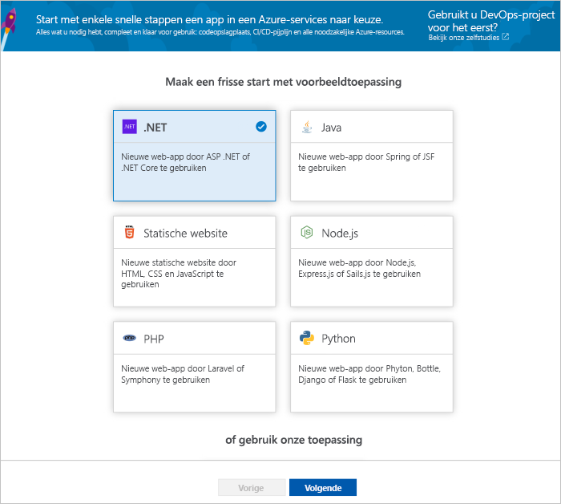
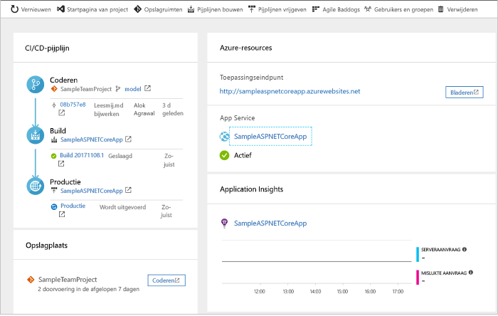
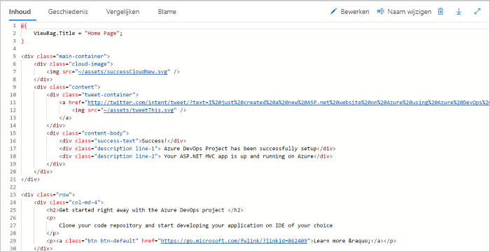
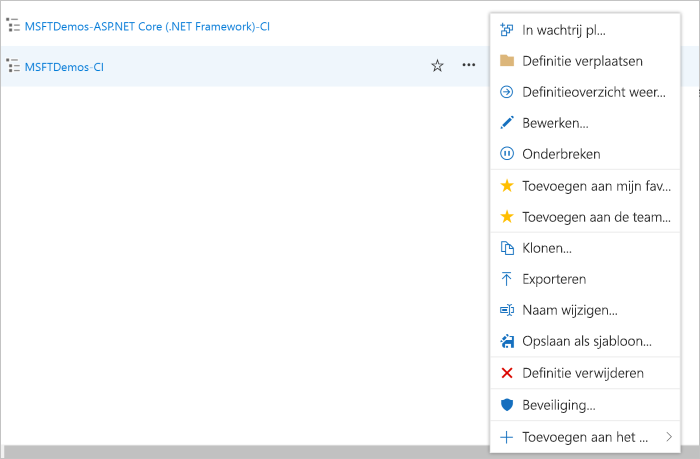

# Een CI/CD-pijplijn voor .NET maken met het Azure DevOps-project

Configureer continue integratie (CI) en continue levering (CD) voor uw .NET Core- of ASP.NET-toepassing met het **Azure DevOps-project**.  Het Azure DevOps-project vereenvoudigt de eerste configuratie van een Azure DevOps Services-build en -release-pipeline.

Als u geen Azure-abonnement hebt, kunt u er gratis een krijgen via [Visual Studio Dev Essentials](https://visualstudio.microsoft.com/dev-essentials/).

## Aanmelden bij Azure Portal

Het Azure DevOps-project maakt een CI-/CD-pijplijn in Azure DevOps Services.  U kunt een **nieuwe Azure DevOps Services**-organisatie maken of een **bestaande organisatie** gebruiken.  Het Azure DevOps-project maakt ook **Azure-resources** in het **Azure-abonnement** van uw keuze.

1. Meld u aan bij [Microsoft Azure Portal](https://portal.azure.com).

1. Kies het pictogram **Een resource maken** in de linkernavigatiebalk en zoek naar **DevOps-project**.  Kies **Maken**.

    

## Een voorbeeldtoepassing en Azure-service selecteren

1. Selecteer de **.NET**-voorbeeldtoepassing.  Bij de .NET-voorbeelden kunt u kiezen uit het open source-framework ASP.NET of het platformoverschrijdende .NET Core-framework.

    

1. Selecteer het **.NET Core**-toepassingsframework.  Dit voorbeeld gebruikt een ASP.NET Core MVC-toepassing. Als u klaar bent, kiest u **Volgende**.

1. **Web App on Windows** is het standaardimplementatiedoel.  Desgewenst kunt u ook kiezen voor Web App on Linux of Web App for Containers.  Het toepassingsframework dat u in de vorige stappen hebt gekozen bepaalt welk type implementatiedoel hier beschikbaar is voor de Azure-service.  Laat de standaardservice ongewijzigd en kies **Volgende**.

## Azure DevOps Services en een Azure-abonnement configureren 

1. Maak een **nieuwe** gratis Azure DevOps Services-organisatie of kies een **bestaande** organisatie.  Kies een **naam** voor uw Azure DevOps-project.  Selecteer uw **Azure-abonnement** en **locatie** en kies een **naam** voor uw toepassing.  Als u klaar bent, kiest u **Gereed**.

1. In slechts enkele minuten wordt het **DevOps-projectdashboard** in de Azure Portal geladen.  Er wordt een voorbeeldtoepassing in een opslagplaats in uw Azure DevOps Services-organisatie ingesteld, er wordt een build uitgevoerd en uw toepassing wordt geïmplementeerd in Azure.  Dit dashboard biedt inzicht in uw **codeopslagplaats**, **Azure DevOps Services CI/CD-pijplijn** en uw **toepassing in Azure**.  Aan de rechterkant van het dashboard selecteert u **Bladeren** om de lopende toepassing weer te geven.

     

## Codewijzigingen doorvoeren en CI/CD uitvoeren

Het Azure DevOps-project heeft een Git-opslagplaats gemaakt in uw Azure DevOps Services-organisatie of GitHub-account.  Volg de onderstaande stappen om de opslagplaats weer te geven en codewijzigingen in uw toepassing aan te brengen.

1. Selecteer aan de linkerkant van het DevOps-projectdashboard de koppeling voor uw **master** branch.  Met deze koppeling opent u een weergave in de zojuist gemaakte Git-opslagplaats.

1. Als u de kloon-URL van de opslagplaats wilt weergeven, selecteert u **Klonen** in de rechterbovenhoek van de browser. U kunt uw Git-opslagplaats klonen in uw favoriete IDE.  In de volgende stappen kunt u de webbrowser gebruiken om codewijzigingen rechtstreeks aan te brengen en door te voeren in de master branch.

1. Aan de linkerkant van de browser navigeert u naar het bestand **Views/Home/index.cshtml**.

1. Selecteer **Bewerken** en breng een wijziging aan in de h2-kop.  Typ bijvoorbeeld **Meteen aan de slag met het Azure DevOps-project** of maak een andere wijziging.

    

1. Kies **Doorvoeren** en sla uw wijzigingen op.

1. Navigeer in uw browser naar het **Azure DevOps-projectdashboard**.  Als het goed is, ziet u nu dat er een build wordt gemaakt.  De aangebrachte wijzigingen worden automatisch in een build verwerkt en geïmplementeerd via een Azure DevOps Services-CI/CD-pijplijn.

## De Azure DevOps Services CI/CD-pijplijn onderzoeken

Het Azure DevOps-project heeft automatisch een volledige Azure DevOps Services-CI/CD-pijplijn geconfigureerd in uw Azure DevOps Services-organisatie.  U kunt de pijplijn verkennen en zo nodig aanpassen.  Volg de onderstaande stappen om vertrouwd te raken met de Azure DevOps Services-build- en -release-pipelines.

1. Selecteer **Build-pipelines** **bovenin** het Azure DevOps-projectdashboard.  Met deze koppeling opent u een tabblad in de browser met de Azure DevOps Services-build-pipeline voor het nieuwe project.

1. Selecteer het **weglatingsteken**.  Met deze actie wordt een menu geopend waarin u diverse acties kunt starten, zoals een nieuwe build in de wachtrij plaatsen, een build onderbreken en de build-pipeline bewerken.

1. Selecteer **Bewerken**.

    

1. In deze weergave **onderzoekt u de verschillende taken** voor uw build-pipeline.  De build voert verschillende taken uit, zoals het ophalen van bronnen uit de Git-opslagplaats van Azure Repos, het herstellen van afhankelijkheden en het publiceren van uitvoer die wordt gebruikt voor implementaties.

1. Selecteer bovenaan de build-pipeline de **naam van de build-pipeline**.

1. Wijzig de **naam** van de build-pipeline in een gebruiksvriendelijkere naam.  Selecteer **Opslaan en wachtrij** en selecteer vervolgens **Opslaan**.

1. Selecteer onder de naam van de build-pipeline de optie **Geschiedenis**.  U ziet een audittrail van recente wijzigingen voor de build.  Azure DevOps Services houdt alle wijzigingen in de build-pipeline bij en biedt de mogelijkheid om versies te vergelijken.

1. Selecteer **Triggers**.  Het Azure DevOps-project heeft automatisch een CI-trigger gemaakt en met elke doorvoering naar de opslagplaats wordt er een nieuwe build gemaakt.  U kunt desgewenst kiezen of u vertakkingen van het CI-proces wilt opnemen of uitsluiten.

1. Selecteer **Retentie**.  Op basis van uw scenario kunt u beleidsregels opgeven om een bepaald aantal builds te behouden of te verwijderen.

1. Selecteer **Build en release** en kies **Releases**.  Het Azure DevOps-project heeft een Azure DevOps Services-release-pipeline gemaakt om implementaties naar Azure te beheren.

1. Selecteer links van de browser het **beletselteken** naast uw release-pipeline en kies **Bewerken**.

1. De release-pipeline bevat een **pijplijn** die het releaseproces definieert.  Onder **Artefacten** selecteert u **Neerzetten**.  De build-pipeline die u in de vorige stappen hebt onderzocht, produceert de uitvoer die wordt gebruikt voor het artefact. 

1. Selecteer rechts van het pictogram **Neerzetten** het pictogram **Continue implementatietrigger**.  Deze release-pipeline heeft een ingeschakelde CD-trigger die een implementatie uitvoert telkens wanneer er een nieuw build-artefact beschikbaar is.  U kunt de trigger desgewenst uitschakelen, zodat uw implementaties handmatig moeten worden uitgevoerd. 

1. Selecteer aan de linkerkant van de browser de optie **Taken**.  De taken zijn de acties die in het implementatieproces worden uitgevoerd.  In dit voorbeeld is een taak gemaakt om te implementeren naar **Azure App Service**.

1. Selecteer aan de rechterkant van de browser de optie **Releases weergeven**.  In deze weergave wordt een versiesgeschiedenis weergegeven.

1. Selecteer het **weglatingsteken** naast een van uw versies en kies **Openen**.  Er zijn verschillende menu's die u in deze weergave kunt verkennen, zoals een versieoverzicht, gekoppelde werkitems en tests.

1. Selecteer **Doorvoeringen**.  In deze weergave worden de codedoorvoeringen getoond die zijn gekoppeld aan de specifieke implementatie. 

1. Selecteer **Logboeken**.  De logboeken bevatten nuttige informatie over het implementatieproces.  Ze kunnen worden weergegeven tijdens en na de implementaties.

## Resources opschonen

Wanneer u de Azure App Service en relevante resources die in deze snelstart zijn gemaakt niet meer nodig hebt, kunt u ze verwijderen met de functie **Verwijderen** in het Azure DevOps-projectdashboard.

## Volgende stappen

Zie deze zelfstudie voor meer informatie over het wijzigen van de build- en release-pipelines in overeenstemming met de behoeften van uw team:

> [!div class="nextstepaction"]
> [CD-proces aanpassen](https://docs.microsoft.com/azure/devops/pipelines/release/define-multistage-release-process?view=vsts)

## Video's

> [!VIDEO https://www.youtube.com/embed/itwqMf9aR0w]
