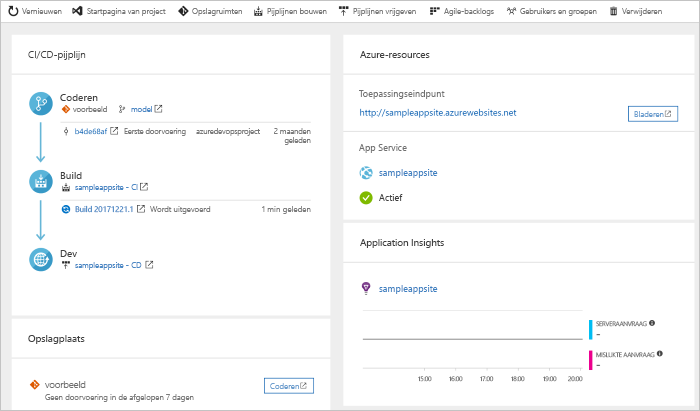

# Een CI/CD-pijplijn voor Go maken met Azure DevOps Projects

Configureer CI (Continue Integratie) en CD (Continue levering) voor uw Go-app met het behulp van Azure DevOps Projects. DevOps Projects vereenvoudigt de eerste configuratie van een build- en release-pijplijn van Azure DevOps.

Als u geen Azure-abonnement hebt, kunt u er gratis een krijgen via [Visual Studio Dev Essentials](https://visualstudio.microsoft.com/dev-essentials/).

## Aanmelden bij Azure Portal

In DevOps Projects wordt een CI/CD-pijplijn gemaakt in Azure Pipelines. U kunt een nieuwe Azure DevOps-organisatie maken of een bestaande organisatie gebruiken. Met DevOps Projects worden ook Azure-resources gemaakt in het Azure-abonnement van uw keuze.

1. Meld u aan bij [Azure Portal](https://portal.azure.com).

1. Selecteer **Een resource maken** in het linkerdeelvenster.

1. Typ **DevOps-project** in het zoekvak en selecteer vervolgens **Maken**.

    

## Selecteer een voorbeeld-app en Azure-service

1. Selecteer de **Go**-voorbeeld-app en selecteer vervolgens **Volgende**.  
    
1. **Eenvoudige Go-app** is het standaardframework. Selecteer **Volgende**.  
    Het app-framework dat u eerder hebt gekozen, bepaalt welk type implementatiedoelen voor de Azure-service hier beschikbaar is voor implementeren. 
    
1. Verlaat de Azure-standaardservice en selecteer **Volgende**.

## Azure DevOps en een Azure-abonnement configureren 

1. Maak gratis een nieuwe Azure DevOps-organisatie of kies een bestaande organisatie. 

1. Voer een naam in voor het Azure DevOps-project. 

1. Selecteer uw Azure-abonnement en locatie, voer een naam in voor de app en selecteer **Gereed**.  
    Na enkele minuten wordt het DevOps Projects-dashboard weergegeven in de Azure-portal. Er wordt een voorbeeld-app ingesteld in een opslagplaats in uw Azure DevOps-organisatie, er wordt een build uitgevoerd en de app wordt geïmplementeerd in Azure. 
    
    Het dashboard biedt meer inzicht in uw codeopslagplaats, CI/CD-pijplijn en app in Azure. Selecteer aan de rechterkant **Bladeren** om de actieve app weer te geven.

     

## De codewijzigingen doorvoeren en de CI/CD uitvoeren

Met DevOps Projects wordt een Git-opslagplaats gemaakt in Azure Repos of in GitHub. Ga als volgt te werk om de opslagplaats weer te geven en codewijzigingen aan de brengen in de app:

1. Selecteer aan de linkerkant in DevOps Projects de koppeling voor de master branch.  
    Met deze koppeling opent u een weergave in de zojuist gemaakte Git-opslagplaats.

1. Als u de kloon-URL van de opslagplaats wilt weergeven, selecteert u **Klonen** in de rechterbovenhoek.  
    U kunt de Git-opslagplaats klonen in uw favoriete IDE. In de volgende stappen kunt u de webbrowser gebruiken om codewijzigingen rechtstreeks aan te brengen en door te voeren in de master branch.

1. Ga aan de linkerkant naar het bestand *views/index.html* en selecteer vervolgens **Bewerken**.

1. Breng een wijziging aan in het bestand. Wijzig bijvoorbeeld wat tekst binnen een van de div-tags.

1. Selecteer **Doorvoeren** en sla vervolgens de wijzigingen op.

1. Ga in de browser naar het DevOps Projects-dashboard.  
    Er wordt nu een build uitgevoerd. De aangebrachte wijzigingen worden automatisch gebouwd en geïmplementeerd via een CI/CD-pijplijn.

## De CI/CD-pijplijn onderzoeken

In DevOps Projects wordt automatisch een volledige CI/CD-pipeline geconfigureerd in Azure Repos. U kunt de pijplijn verkennen en zo nodig aanpassen. Ga als volgt te werk om vertrouwd te raken met de build- en release-pijplijnen van Azure DevOps:

1. Ga naar het DevOps Projects-dashboard.

1. Selecteer **Build-pijplijnen** bovenaan.  
    Op een browsertabblad wordt de build-pijplijn voor het nieuwe project weergegeven.

1. Wijs het veld **Status** aan en selecteer het beletselteken (...).  
    Er wordt een menu met verschillende opties weergegeven, bijvoorbeeld om een nieuwe build in de wachtrij te plaatsen, een build te onderbreken of de build-pijplijn te bewerken.

1. Selecteer **Bewerken**.

1. In dit deelvenster kunt u de verschillende taken voor de build-pijplijn onderzoeken.  
    In de build worden verschillende taken uitgevoerd, zoals het ophalen van bronnen uit de Git-opslagplaats, het herstellen van afhankelijkheden, en het publiceren van uitvoergegevens die worden gebruikt voor implementaties.

1. Selecteer boven aan de build-pijplijn de naam van de build-pijplijn.

1. Wijzig de naam van de build-pijplijn in een meer beschrijvende naam. Selecteer **Opslaan en wachtrij** en selecteer vervolgens **Opslaan**.

1. Selecteer onder de naam van de build-pijplijn de optie **Geschiedenis**.  
    In dit deelvenster ziet u een audittrail van recente wijzigingen voor de build. In Azure DevOps worden alle wijzigingen in de build-pijplijn bijgehouden en krijgt u de mogelijkheid om versies te vergelijken.

1. Selecteer **Triggers**.  
    In DevOps Projects wordt automatisch een CI-trigger gemaakt en met elke doorvoering naar de opslagplaats wordt een nieuwe build gestart. U kunt eventueel kiezen of u branches van het CI-proces wilt opnemen of uitsluiten.

1. Selecteer **Retentie**.  
    Afhankelijk van het scenario kunt u beleidsregels opgeven om een bepaald aantal builds te behouden of te verwijderen.

1. Selecteer **Build en release** en selecteer vervolgens **Releases**.  
    In DevOps Projects wordt een release-pijplijn gemaakt om implementaties in Azure te beheren.

1. Selecteer het beletselteken (...) naast de release-pijplijn en selecteer **Bewerken**.  
    De release-pijplijn bevat een *pijplijn* die het releaseproces definieert.

1. Onder **Artefacten** selecteert u **Neerzetten**.  
    Met de build-pijplijn die u in de vorige stappen hebt onderzocht, wordt de uitvoer geproduceerd die wordt gebruikt voor het artefact. 

1. Selecteer **Continue implementatietrigger** rechts van het pictogram **Neerzetten**.  
    Deze release-pijplijn heeft een ingeschakelde CD-trigger op basis waarvan een implementatie wordt uitgevoerd telkens wanneer een nieuw build-artefact beschikbaar is. U kunt de trigger eventueel uitschakelen zodat de implementaties handmatig moeten worden uitgevoerd. 

1. Selecteer aan de linkerkant **Taken**.  
    Taken zijn de acties die tijdens het implementatieproces worden uitgevoerd. In dit voorbeeld is een taak gemaakt om te implementeren in Azure App Service.

1. Selecteer aan de rechterkant **Releases weergeven** om een releasegeschiedenis weer te geven.

1. Selecteer het beletselteken (...) naast een versie en selecteer **Openen**.  
    U kunt verschillende menu's verkennen, zoals een releaseoverzicht, gekoppelde werkitems en tests.

1. Selecteer **Doorvoeringen**.  
    In deze weergave worden de codedoorvoeringen weergegeven die zijn gekoppeld aan deze implementatie. 

1. Selecteer **Logboeken**.  
    De logboeken bevatten nuttige informatie over het implementatieproces. U kunt ze zowel tijdens als na de implementaties weergeven.

## Resources opschonen

U kunt het Azure App Service-exemplaar en de gerelateerde resources die u in deze quickstart hebt gemaakt, verwijderen wanneer u ze niet meer nodig hebt. Gebruik hiervoor de functionaliteit **Verwijderen** op het DevOps Projects-dashboard.

## Volgende stappen

Voor meer informatie over het wijzigen van de build- en release-pipelines in overeenstemming met de behoeften van uw team, raadpleegt u:

> [!div class="nextstepaction"]
> [Een CD-pijplijn (continue implementatie) met meerdere fasen definiëren](https://docs.microsoft.com/azure/devops/pipelines/release/define-multistage-release-process?view=vsts)
